# Статический временной анализ. Constraints.

### Введение

Сложность написания данной лекции заключается в том, что STA (Static Timing Analysis) является частью большого маршрута проектирования ASIC и полностью раскрывается именно на нем (хотя и в FPGA данный маршрут и присутствует, но в сильно урезанном виде). Именно поэтому автор не будет претендовать на абсолютную истину и другие "красивые" вещи и постарается рассказать "отдельно" про STA и Constraints более-менее простыми словами, хотя они и не являются истиной в последней инстанции.

Современная верификация дизайна старается балансировать между точностью верификации и временем, что было на данную верификацию затрачено. Ниже представлены виды верификации ASIC маршрута и времена, затрачиваемые на них:


1) **Функциональная верификация RTL**. Данный вид верификации является самым быстрым, хотя и самым ненадежным как минимум из-за того, что RTL сам по себе является языком поведенческого описания аппаратуры (то есть, никто не знает как решит начудить синтезатор), и работающий RTL является лишь необходимым требованием на то, чтобы нетлист (схема) после синтеза хотя бы как-то работал.
2) **Функциональная верификация netlist-а**. Данный вид верификации является тем видом верификации, с которым взаимодействуют ASIC верификаторы до получения данных (SDF, Synopsis Delay Format) от цифровых топологов. Обычно, данная верификация сводится к тому, что заданные при синтезе скановые цепи "ломают" логику работы схемы, или синтезатор мог что-то начудить в процессе синтеза и верификаторы вместе с RTL-щиками занимаются большим дебагом нетлиста. Данный вид симуляции в 20 раз медленнее, чем симуляция RTL.
3) **Функциональная верификация netlist-а (схемы) с SDF**. Данный вид верификации в разы быстрее SPICE, потому как он по сути, работает с "0" и "1", которые приходят с некоторой задержкой (то есть, обычные временные диаграммы, но с учетом влияния клокового дерева, дорожек и т.д.). Собственно говоря, перед отправлением чипа на завод данный вид симуляции обязателен. Хотя данный вид симуляции в разы быстрее SPICE/SPECTRE, но примерно раз в 6 медленнее чем обычная симуляция схемы с временными диаграммами.
4) **SPICE/SPECTRE моделирование**. Данный вид верификации является самым времязатратным, хотя и считается эталоном точности в микроэлектронике. Разумеется и сами модели транзисторов в SPICE/SPECTRE представлении имеют разные уровни и времена симуляции, но мы будем считать "среднюю модель" (например, SPICE модель 3 уровня). Время симуляции 1 секунды работы относительно небольшого цифрового чипа (условно, простое ядро RISC-V с PLL и ADC/DAC) составило порядка 1 месяца при полной загрузке сервера на 96 ядер.

Как читатель видит, задержки в симуляции возникают только на 3 этапе (симуляция с sdf), а до этого работоспособность блока на заданной частоте является под вопросом (вы спокойно можете переключать в функциональной симуляции сигналы каждые 5 пс и симулятор вам не выдаст ошибок, хотя задержка реального инвертора при нагрузке на минимальную емкость и с типичным входным фронтом составляет порядка 80 пс).

<div class="page"/>

Именно из данного запроса какой-то грубой проверки, которая скажет нам, что скорее всего, может быть, если повезет, то чип будет работать и рождается статический временной анализ (STA). По сути, современная идеология построения чипов в микроэлектронике заключается в том, что проектировщики подгоняют чип под STA, верификаторы — под функциональную симуляцию и молятся на то, чтобы итоговый чип после примерного анализа по критическим путям и абстрактной функциональности был работоспособен, а далее уже начинается фикс отдельных путей, которые, разумеется, прекрасно работают и в функциональном моделировании, и в STA, но "ложатся" в моделировании с sdf.

Именно про вид анализа путей (успеет сигнал с входа на выход пройти за время clk или нет), которым по сути и является статический временной анализ и будет первая часть данной лекции. Во второй же части мы рассмотрим построение простых constraints (ограничений), которые задают тестовый стенд для STA.

### Static Timing Analysis

STA (**S**tatic **T**iming **A**nalysis) по своей сути говорит нам: давайте не будем оценивать соблюдение функциональности блока при заданной частоте, а будем рассматривать возможность сигнала перейти от одного регистра к другому. То есть, по сути весь STA концептуально сводится к схеме, представленной ниже:

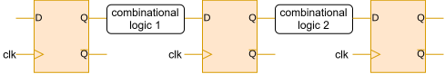

**Пример 1**. Считая DFF идеальными, оцените максимальную частоту работы схемы для STA, представленной ниже:

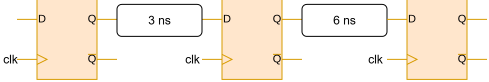

**Решение**

Схема будет работать в том случае (в приближении идеальных DFF), когда сигнал будет успевать преодолевать путь между двумя DFF. В нашем случае, максимальное время прохождение между DFF равно 6 нс, что эквивалентно частоте clk в 166 МГц.

<div class="page"/>

Однако, в реальности у нас DFF реализуются по master-slave принципу и их работа по фронту/срезу является математически удобной моделью, которая хорошо работает на малых частотах clk (для удобства читателя ниже приведена концептуальная master-slave схема DFF).

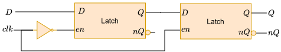

При увеличении частоты мы сталкиваемся с тем, что данные даже успев пройти комбинационную логику могут не успеть записаться в DFF (нарушение на setup) или же clk может не успеть "выключить" master latch в DFF, что повлечет "прозрачность" триггера в течение некоторого времени, или может повредить хранящиеся в нем данные (нарушение по hold).

Именно поэтому существует 2 концептуально разных вида анализа в STA: по setup и по hold. Также, инструмент проектирования (например Cadence Genus или Cadence Innovus) не определяет нам максимальную частоту работы схемы, а выдает нам такие параметры, как:

**WNS** (**W**orst **N**egative **S**lack) = min($T_{clk} - T_{comb} - T_{DFF}$) - самый проблемный путь по результатам STA анализа, позволяет определить пик проблемы

**TNS** (**T**otal **N**egative **S**lack) = $\sum(T_{clk} - T_{comb} - T_{DFF})$ - сумма всех проблемных путей по результатам STA анализа, позволяет определить масштаб проблемы.

**Пример 2**. Считая DFF  с $T_{SETUP} = 2 ns$, $T_{HOLD} = 0.5 ns$, $T_{CQ} = 1 ns$ оцените TNS и WNS для STA по **setup** на частоте 125 МГц ($T_{clk}$ = 8 ns), схемы, представленной ниже:


**Решение**

По сути своей, $T_{CQ}$ является "встроенной задержкой" в DFF (по определению это время, за которое после event данные с входа DFF попадают на его выход), поэтому мы прибавим его к "эффективной комбинационной задержке". Setup time DFF также является внутренней комбинационной задержкой для setup анализа (время, за которое данные "пройдут" через master latch DFF), поэтому данное время мы также прибавим к эффективной комбинационной задержке.

<div class="page"/>

 В итоге, "превратив" схему на реальных DFF в схему на идеальных DFF получим:

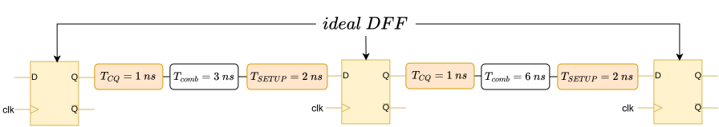

В данной задаче у нас имеется два пути, посчитаем NS (**N**egative **S**lack) по setup для каждого из них:

$NS_{1} = T_{CLK} - T_{COMB-EFF} = 8ns \ - \ (1ns + 3ns + 2ns) = 2 ns$. При учете вклада в TNS мы считаем $NS_{1} = 0 ns$, потому как если NS > 0, то он нас при анализе не интересует, и мы его зануляем, а при учете в WNS мы его учитываем как 2 ns.

$NS_{2} = T_{CLK} - T_{COMB-EFF} = 8ns \ - \ (1ns + 6ns + 2ns) = -1 ns$

По определению WNS:

**WNS** = min ($NS_1$, $NS_2$) = min (2ns, -1ns) = -1ns

По определению TNS:

**TNS** = $NS_1$ + $NS_2$ = 0ns + (-1ns) = -1ns

Именно данные величины обычно дает временной анализатор в процессе проектирования цифрового блока/чипа. Нарушения по setup являются самыми "проблемными" в процессе проектирования чипа, потому как их можно исправлять или заменой ячеек (например, взять DFF с меньшими $T_{SETUP}$, $T_{CQ}$, а также можно заменить комбинационные ячейки на более "быстрые") или ассиметрией клокового дерева (если на следующий DFF будет clk приходить несколько позднее, чем на предыдущий, то это увеличивает период эффективного clk), хотя это и "перекладывает" проблемы с setup на hold. 

Однако, данные решение убирают "мелкие" и "ситуативные" нарушения по setup, поэтому в остальных случаях стоит или переработать RTL блока, или уменьшать частоту работы, или "ослаблять" ограничения (constraints) стенда для STA (если они были "жесткими"), то есть, реально это требует большого собрания команды разработки чипа и долгого, вдумчивого анализа проблемы.

Ниже приведен пример решения проблемы STA по setup путем постановки буфера, что увеличивает для "правого" триггера эффективный период clk на 1 нс, потому как пока у нас после posedge clk данные с выхода предыдущего DFF идут уже через эффективную комбинационку на вход правого DFF, clk правого DFF еще идет через элемент задержки (обычно буфер) еще 1 нс.

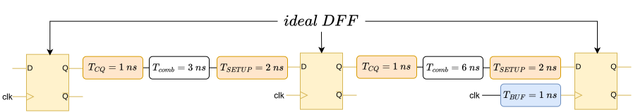

<div class="page"/>

**Пример 3**. В качестве примера того, что необходимо использовать "ассиметрию" клокового дерева в меру рассмотрим схему, представленную ниже (параметры DFF $T_{SETUP} = 2 ns$, $T_{HOLD} = 0.5 ns$, $T_{CQ} = 1 ns$). В данной схеме для исправления setup была применена чрезмерная буферизация клокового дерева, найдите WNS и TNS по **hold** на частоте 125 МГц ($T_{clk}$ = 8 ns). Какими способами можно их исправить?

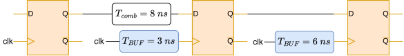

**Решение**

Сделаем эквивалентную схему, перейдя от "реальных" DFF к "идеальным". По сути своей, $T_{CQ}$ является "встроенной задержкой" в DFF (по определению это время, за которое после event данные с входа DFF попадают на его выход), поэтому мы прибавим его к "эффективной комбинационной задержке". Setup time во время анализа по hold мы не будем учитывать в виде их разной природы (требования на hold определяют время "выключения" master latch, им не важно время записи в master latch).

Таким образом, мы получим эквивалентную схему на DFF:

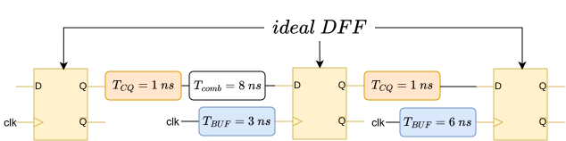

Для удобства расчетов и совпадения с международной терминологией введем величину $skew = T_{CLK-RECIEVER} - T_{CLK-TRANSMITTER}$, где

 $T_{CLK-RECIEVER}$ - время прихода clk на вход clock принимающего данные DFF

  $T_{CLK-TRANSMITTER}$ - время прихода clk на вход clock отправляющего данные DFF


В данной задаче у нас имеется два пути, посчитаем NS (**N**egative **S**lack) по hold для каждого из них:

$NS_{1} = T_{COMB-EFF} - T_{SKEW} -T_{HOLD} = (1ns + 8ns) - (3ns - 0ns) - 0.5ns  = 5.5 ns$ При учете вклада в TNS мы считаем $NS_{1} = 0 ns$, потому как если NS > 0, то он нас при анализе не интересует, и мы его зануляем, а при учете в WNS мы его учитываем как 5.5 ns.

$NS_{2} = T_{COMB-EFF} - T_{SKEW} -T_{HOLD} = 1ns - (6ns - 3ns) - 0.5ns = -2.5 ns$

<div class="page"/>

По определению WNS:

**WNS** = min ($NS_1$, $NS_2$) = min (5.5ns, -2.5ns) = -2.5ns

По определению TNS:

**TNS** = $NS_1$ + $NS_2$ = 0ns + (-2.5ns) = -2.5ns


То есть мы явно видим нарушение по hold на пути между средним и правым DFF. Однако, фиксятся данные нарушения просто добавлением элементов задержки (например, буферов) между средним и крайним DFF (тогда после clk с задержкой в 3ns данные на входе правого DFF будут стабильны 2.5 нс благодаря элементу задержки). Пример фикса нарушения по hold приведен ниже:

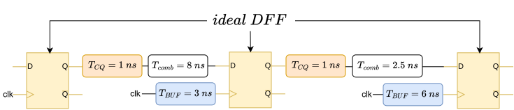

Однако, добавление комбинационной задержки в виде буфера не является единственным (хотя и самым "безопасным" относительно влияние на другие пути) решением проблемы, можно, также уменьшить skew между средним и правым DFF, поменяв задержку по clk у правого DFF с 6ns на 3ns.

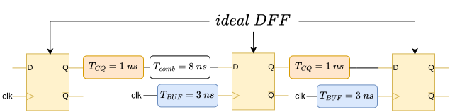

Разумеется, существуют и другие методы борьбы с hold, но автор привел самые распространенные, которые САПР почти всегда использует при placement (добавляет буферы для фикса hold) и синтезе клокового дерева (варьирует skew у DFF для уменьшения WNS и TNS по setup/hold).

<div class="page"/>


### Constraints

Выше мы разобрались в концепции STA и разобрали простые примеры, однако ничего не сказали про то, как задать САПРу тестовый стенд для STA (задать clock, входные/выходные задержки и тд). Именно эту роль и берут на себя constraints.

Рассмотрим теперь подробнее, что есть входные и выходные задержки и зачем они нужны. STA обычно проводят для блока, который встроен в чип и на его входы идут данные с предыдущего блока, а с его выходов данные идут на следующий блок. Так уж выходит, что у этих блоков может быть комбинационная логика может быть как на выходах предыдущего блока, так и на входах следующего блока, что приведено на картинке ниже:

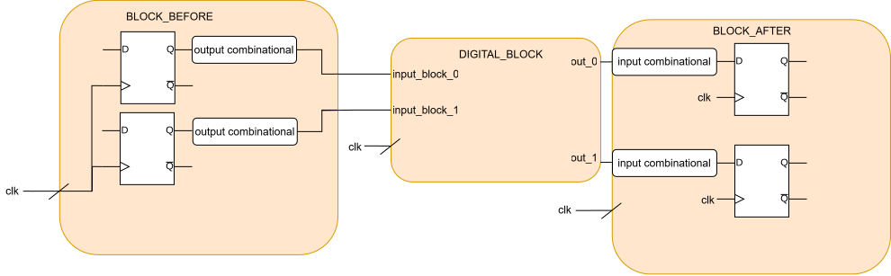

Для того, чтобы в STA учесть влияние предыдущего и следующего блоков мы вводим в тестовый стенд input/output delays. Таким образом получается, что в простейшем случае тестовый стенд для временного анализа выглядит как:

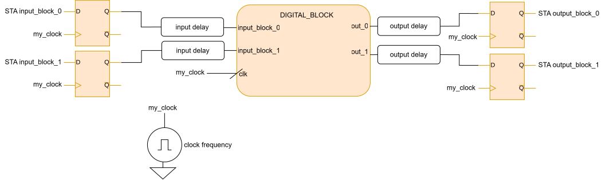

Входные (левые) и выходные (правые) DFF являются "идеальными", их ставит сам САПР и нужны они для того, чтобы провести STA (потому как данные вид анализа проводится для путей между двумя DFF).

<div class="page"/>

**Пример 4**. Опишите с помощью constraints стенда для STA, представленный ниже:

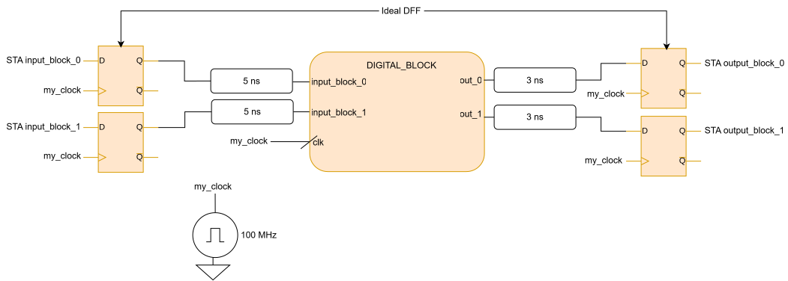

```tcl
# Делаем источник клока с именем my_clk и подключаем ко всем портам с именем clk
create_clock -name my_clk -period 10.0 [get_ports clk]
# Input delay на все входы блока кроме clk
set_input_delay -clock my_clk 5 [remove_from_collection [all_inputs] [get_ports clk]]
#Output Delay
set_output_delay -clock my_clk 3 [all_outputs]
```

Также весьма часто бывают случаи, когда в дизайне некоторая доля DFF работает от "поделенного" clock, назовем его **my_clk_dev**. Тогда, в sdc мы можем данный clock объявить как generated (то есть, созданный из my_clk путем деления/умножения). В constraints данный "внутренний" clock объявляется как:

```tcl
#Объявление my_clk_dev = my_clk/3, подключенного к портам цифрового блока с именем clk_dev
create_generated_clock -name my_clk_dev -source CLKM -divide_by 3 [get_ports clk_dev]
```

<div class="page"/>


### ASIC constraints

Собственно, обычно для того же FPGA проектирования простого цифрового блока с одним clk люди останавливаются на ```set_input_delay```, ```set_output_delay```, ```create_clock``` и используют в основном только эти команды для простого дизайна.

В ASIC проектировании добавляются более "физические" constraints на нагрузочную емкость блока и добавление пинам "реалистичности" путем добавления источникам на входах блока сопротивления (таким образом мы ограничиваем ток для входных пинов, приближая ограничения к реальным).

Ниже приведен пример тестового стенда для STA с нагрузочной емкостью:

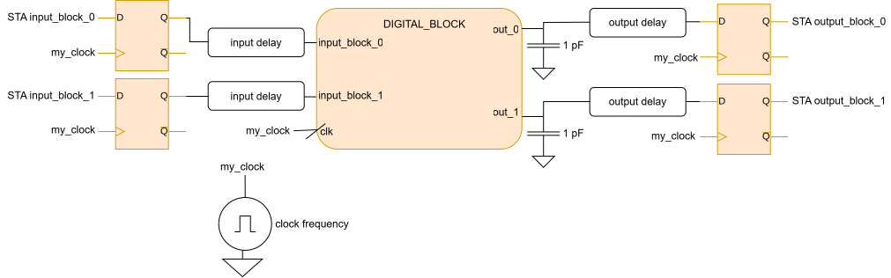


Ниже приведено описание тестового стенда для STA с нагрузочной емкостью с помощью constraints:

```tcl
create_clock -name my_clk -period 10.0 [get_ports clk]
# Input delay на все входы блока кроме clk
set_input_delay -clock my_clk 5 [remove_from_collection [all_inputs] [get_ports clk]]
#Output Delay
set_output_delay -clock my_clk 3 [all_outputs]
# Создание нагрузочной емкости в 1 пФ на всех выходах цифрового блока
set_load 1 [all_outputs]
```

Для того, чтобы ограничивать ток на входных пинах существует 2 метода:

<div class="page"/>

**Метод 1**. Постановка резисторов на входы блока для ограничения тока

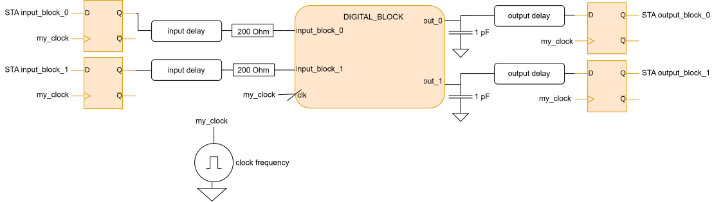


Ниже приведено описание тестового стенда для STA с нагрузочной емкостью и с резистором на входе с помощью constraints:

```tcl
create_clock -name my_clk -period 10.0 [get_ports clk]
# Input delay на все входы блока кроме clk
set_input_delay -clock my_clk 5 [remove_from_collection [all_inputs] [get_ports clk]]
#Output Delay
set_output_delay -clock my_clk 3 [all_outputs]
# Создание нагрузочной емкости в 1 пФ на всех выходах цифрового блока
set_load 1 [all_outputs]
# Постановка резистора 200 Ом перед всеми входными пинами блока:
set_drive 200 [all_inputs]
```

**Метод 2**. Явное задание выходной ячейки прошлого блока, которая идет на вход данного блока

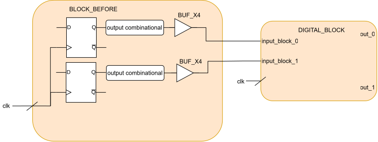

<div class="page"/>

Обычно во время проектирования дизайна люди договариваются, что на все входы и выходы блоков мы ставим определенные буферы из библиотеки элементарных ячеек (например BUF_X4). Тогда, мы можем явно задать выходную ячейку предыдущего блока, идущую на вход нашего блока, и Genus/Innovus/Tempus сами будут брать выходное сопротивление заданной ячейки в каждый момент времени.

Ниже приведено описание тестового стенда для STA с нагрузочной емкостью и с явно заданной выходной ячейкой предыдущего блока на входе с помощью constraints:

```tcl
create_clock -name my_clk -period 10.0 [get_ports clk]
# Input delay на все входы блока кроме clk
set_input_delay -clock my_clk 5 [remove_from_collection [all_inputs] [get_ports clk]]
#Output Delay
set_output_delay -clock my_clk 3 [all_outputs]
# Создание нагрузочной емкости в 1 пФ на всех выходах цифрового блока
set_load 1 [all_outputs]
# Явное задание выходной ячейки прошлого блока на все входы нашего блока (BUF_X4 с библиотеки MY_LIBA)
set_driving_cell -lib_cell BUF_X4 -library MY_LIBA [all_inputs]
```

Также, для ASIC constraints довольно критичны становятся вариации параметров ячеек на кристалле (то есть, закинув тому же Tempus 3 .lib файла (fast, typ, slow) мы рассмотрели отдельно случай всего кристалла быстрого, всего кристалла медленного и всего кристалла "типичного".

В реальности же у нас какая-то часть кристалла является "fast", а другая часть кристалла является "slow" (то есть, у нас вариации внутри чипа, **OCV** (**O**n **C**hip **V**ariation).

<div class="page"/>

С помощью sdc мы можем напрямую задать вариацию параметров ячеек и дорожек (обычно если это и используют, то уже на уровне цифровых топологов):

```tcl
#Комбинационная задержка  может быть на 10% ниже
set_timing_derate -cell_delay -early 0.9
# Комбинационная задержка может быть на 20% выше
set_timing_derate -cell_delay -late 1.2
# Задержка на дорожках может быть на 0% ниже
set_timing_derate -net_delay -early 1.0
# Задержка на дорожках может быть на 10% выше
set_timing_derate -net_delay -late 1.1
# Setup и hold времена у DFF могут быть на 20 процентов ниже
set_timing_derate -early 0.8 -cell_check
# Setup и hold времена у DFF могут быть на 10 процентов выше
set_timing_derate -late 1.1 -cell_check
```

Также, мы можем задать вариацию по таймингам и на clock и data (обычно, если это и применяют, то на уровне синтеза из RTL в netlist):

```tcl
# На все клоковые порты могут клоки придти на 5 процентов быстрее
set_timing_derate -early 0.95 -clock
# На все клоковые порты могут клоки придти на 5 процентов медленнее
set_timing_derate -late 1.05 -clock
# На все data порты могут данные придти на 15 процентов медленнее
set_timing_derate -early 0.85 -data
# На все data порты могут данные придти на 15 процентов быстрее
set_timing_derate -late 1.15 -data
```


