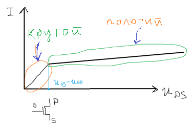
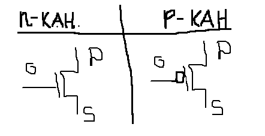
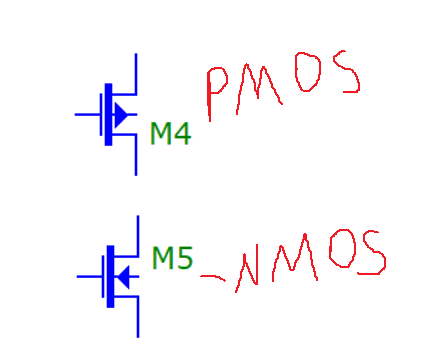
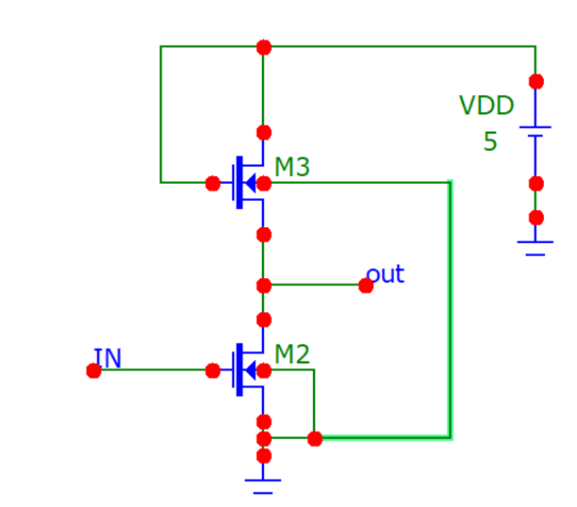
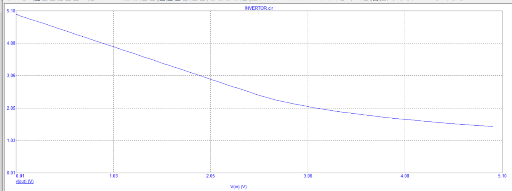
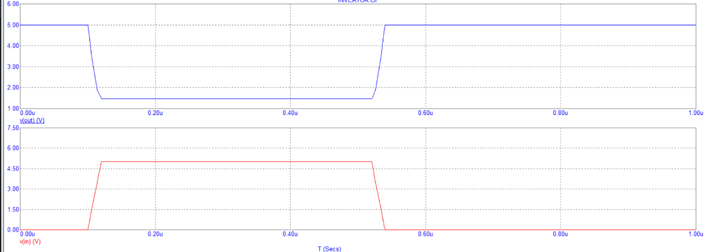
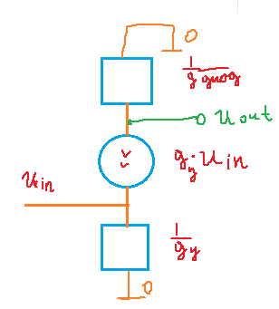
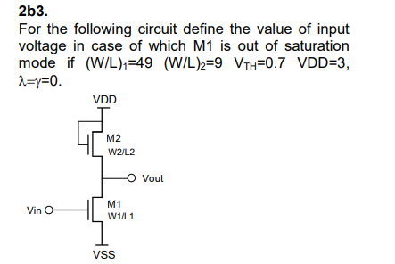

# Лекция 1. Честный расчет схемы на полевике.

**В данной статье будут постулированы:**

ВАХ транзистора (MOSFET)



Формулы для транзистора

$I = 0,\ U_{GS} < U_{G0}$ — аналог контактной разности у биполярника.

$I = \mu_{n} \cdot C_{ox} \cdot \frac{W}{L} \left( (U_{GS} - U_{G0}) \cdot U_{DS} - \frac{U_{DS}^2}{2} \right)$

$I = \mu_{n} \cdot C_{ox} \cdot \frac{W}{2L} \left( U_{GS} - U_{G0} \right)^2$  

Весьма часто происходит замена

$k = \mu_{n} \cdot C_{ox} \cdot \frac{w}{l}$ - исключительно ради удобства

$I =k \cdot \left( (U_{GS} - U_{G0}) \cdot U_{DS} - \frac{U_{DS}^2}{2} \right)$ - когда транзистор в крутом режиме

$I = \frac{k}{2} \cdot \left( U_{GS} - U_{G0} \right)^{2}$ - когда транзистор в пологом режиме

Обозначение транзисторов (данные обозначения считаются цифровыми):



Аналоговые обозначения:



На подложку внимания сейчас на обращаем.

Итак, у нас имеется схема и экспериментальные (ну ладно, с САПРа)
данные:



Зависимость выходного напряжения от входного:



Диаграмма, показывающая, что эта схема может быть инвертором( ```1``` в ```0```
и наоборот):



Итак, получим аналитическое выражение зависимости напряжения на выходе
от напряжения на входе.


Для начала скажем, что напряжение на входе у нас больше порогового
(которое порядка 0,5 В)

Предположим, что у нас нижний транзистор находится в пологом режиме.
Тогда:

$I = k_{1} \cdot \frac{\left( U_{in} - U_{G0} \right)^{2}}{2} =  k_{2} \cdot \frac{\left( Vdd - U_{out} - U_{G0} \right)^{2}}{2}$

$U_{out} = Vdd - \sqrt{\frac{k_{1}}{k_{2}}} \cdot U_{in} + U_{G0} \cdot \left( \sqrt{\frac{k_{1}}{k_{2}}} - 1 \right)$

Заметим, что данная схема работает как очень хороший (линейный)
усилитель, ТК на данном диапазоне

$$K = \frac{dU_{out}}{{dU}_{in}} = \  - \sqrt{\frac{k_{1}}{k_{2}}} = \  - \sqrt{\frac{k_{упр}}{k_{диод}}} = const$$

**Пример:**

На схеме выше ширина диодного транзистора порядка 100 мкм, длина его 1
мкм, в управляющем транзисторе ширина и длина равны 1мкм. Найти
коэффициент усиления данной схемы, если в качестве входного напряжения
через переходной конденсатор передавать переменный сигнал. Технология у
транзисторов одинаковая.

$$K = \frac{dU_{out}}{{dU}_{in}} = - \sqrt{\frac{k_{упр}}{k_{диод}}} = \ \  - \sqrt{\frac{\frac{w_{упр}}{L_{упр}}}{\frac{w_{диод}}{L_{диод}}}} = - \sqrt{\frac{100}{1}} = \  - 10$$

Также, можно найти максимальное входное напряжение, при котором
транзистор находится в линейном режиме.

$$U_{out} = Vdd - \sqrt{\frac{k_{1}}{k_{2}}}*U_{in\_ max} + \ \ U_{G0}*\left( \sqrt{\frac{k_{1}}{k_{2}}} - 1 \right) = \ U_{in\_ max} - U_{G0}$$

$$U_{in\_ max} = \frac{Vdd}{\sqrt{\frac{k_{1}}{k_{2}}} + 1} + \frac{\sqrt{\frac{k_{1}}{k_{2}}}}{\sqrt{\frac{k_{1}}{k_{2}}} + 1}*\ U_{G0} = \frac{5}{11} + \frac{10}{11}*0.5 = 0.9\ В$$

ТЕ при большом коэффициенте усиления и идеальной линейности получаем
весьма малый динамический диапазон.

Давайте свяжем максимальное входное линейное напряжение и коэффициент
усиления:

$$U_{in\_ max} = \frac{Vdd}{\sqrt{\frac{k_{1}}{k_{2}}} + 1} + \frac{\sqrt{\frac{k_{1}}{k_{2}}}}{\sqrt{\frac{k_{1}}{k_{2}}} + 1}*U_{G0} = \frac{Vdd}{K + 1} + \frac{1}{1 + \frac{1}{K}}*U_{G0}$$

При довольно большом K (раз так в 5 больше 1)

$$U_{in\_ max}\  \approx \ \frac{Vdd}{K} + U_{G0}$$

Таким образом получаем типичное для реальности соотношение между
коэффициентом усиления и максимальной амплитудой сигнала = A:

$U_{in\_ max} - U_{G0} = 2A = \frac{Vdd}{K}$

$A*K = \frac{Vdd}{2}$

ТЕ при питании усилителя в 10 вольт и коэффициенте усиления в 100
амплитуда входного сигнала будет не более:\
$A = \frac{10}{2} \cdot \frac{1}{100}$ В = 50 мВ

Казалось бы, идеально, весьма хороший КУ и очень большая линейность, что
же может быть не так?

А за счет чего мы получаем усиление? Из-за того, что у нас сопротивление
(обратная крутизна) нижнего транзистора становится гораздо меньше
сопротивления верхнего транзистора, а ток по ним идет один и тот же. В
итоге, управляя током с помощью слабых колебаний на малом сопротивлении
мы получаем большие колебания напряжения на большом сопротивлении
(напоминаю, ток -- общий у них). Да, по факту я описал такую
малосигналку:



Из этого выходит неприятный факт, что для хорошего усиления через
систему должны протекать большие токи. Оценим их величину:

$k_{n} = 2\frac{мА}{В^{2}}$

Пусть на вход подаем мы наши 50 мВ (+ пороговое, разумеется)

Тогда, ток будет равен:

$I = k \cdot \frac{\left( U_{in} - U_{G0} \right)^{2}}{2} = \ k_{n} \cdot \frac{w}{L} \cdot \frac{(50 мВ)^{2}}{2}$

Если для верхнего транзистора ширина будет равна длине, то тогда:

$\frac{w}{L} = K^{2} = 100^{2} = 10^{4}$

$=I = 2 \cdot 10^{4} \cdot 2500 \cdot 10^{- 6} \cdot \frac{1}{2}\ мА = 25\ мА$ - довольно большой ток для транзистора на кристалле

Разумеется, можно технологически уменьшить крутизну (так делают для
силовых полевиков) и тогда такой усилитель станет чем-то реальным, но
вот делать его на "быстрых" полевиках (большая крутизна) смысла особо не
имеет

Также, можно рассмотреть и второй режим, но там в итоге будет что-то
около нуля на выходе, вот и все (в конкретной задаче числами решить
можно, а в общем случае будет крокодил)

Ну что, теорию поговорили, давайте теперь рассмотрим пример из
олимпиады:



Ну что, из анализа выше была получена формула (читатель может ее сам
вывести, если приспичит):

$$U_{in\_ max} = \frac{Vdd}{\sqrt{\frac{k_{1}}{k_{2}}} + 1} + \frac{\sqrt{\frac{k_{1}}{k_{2}}}}{\sqrt{\frac{k_{1}}{k_{2}}} + 1}*\ U_{G0} = \frac{3}{1 + \frac{7}{3}} + \frac{\frac{7}{3}}{1 + \frac{7}{3}}*0.7 = 1.73\ В$$

