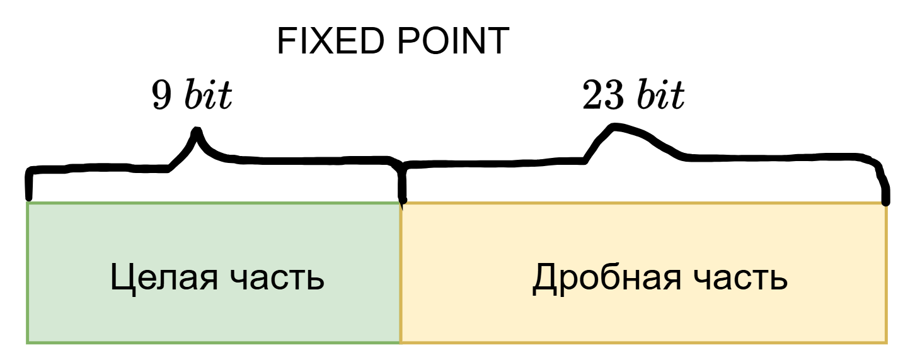
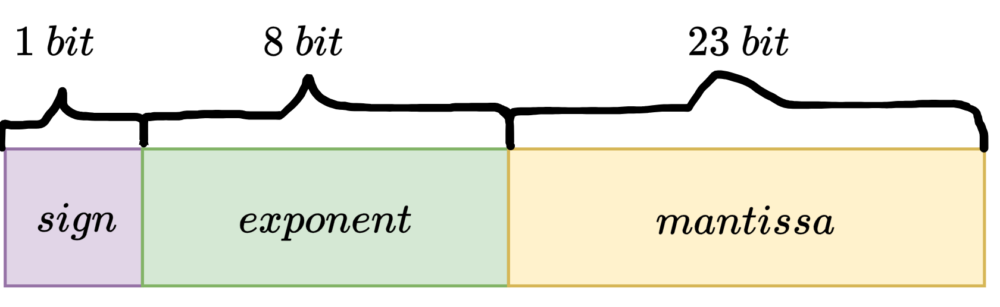
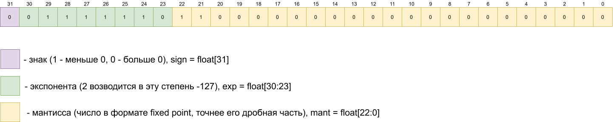
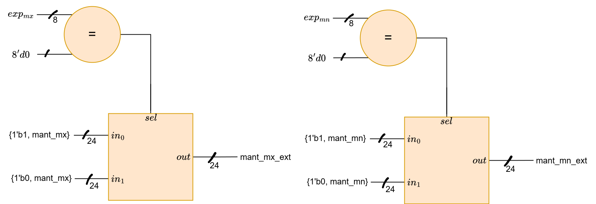
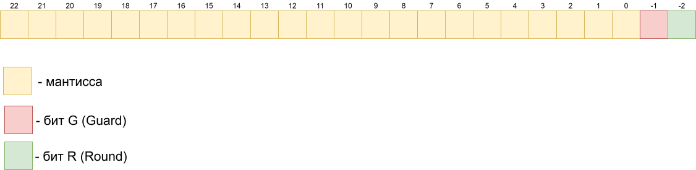
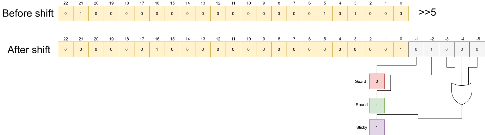
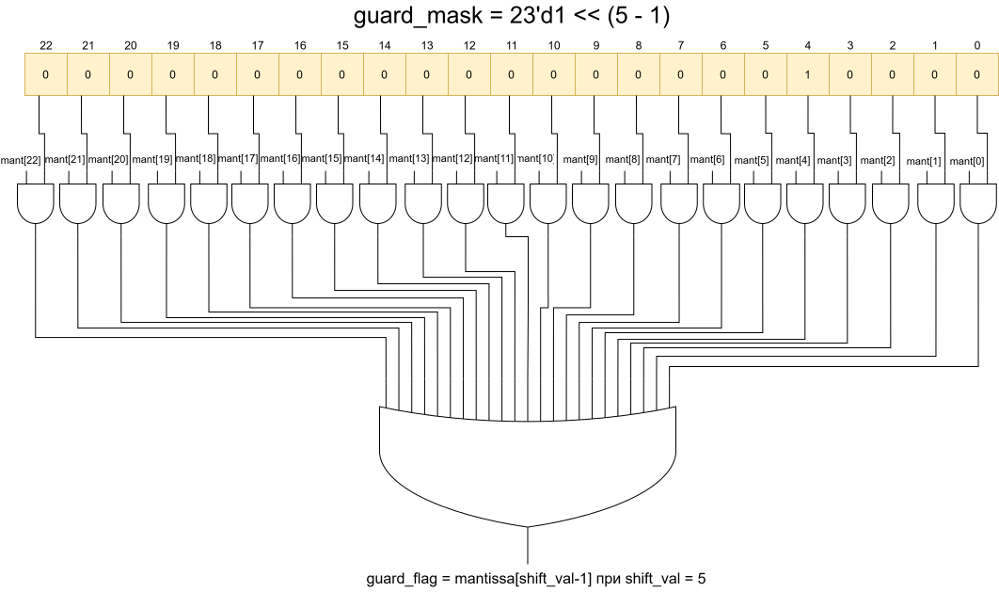

# Floating point. Часть 1. Построение простого Float сумматора.

### Введение

Автор решил рассмотреть данную тему как минимум потому, что в очень
большом числе источников повествование ведется как "умные люди в IEEE
сидели, надумали крутую штуку, а ты просто ее заучи", что является с
точки зрения автора является методически неверным подходом. Именно
поэтому я и решил рассмотреть упрощенную логику построения самого
стандарта, чтобы показать, например, очевидность ввода
денормализованного формата (который на самом деле является костылем для
введения нулей) через довольно простые математические рассуждения.


Также, что в какой-то степени более важно, я напишу простейший floating
point сумматор на System Verilog (потому как одно дело стандарт, а
другое дело неприятные проблемы, которые при математическом рассмотрении
обычно не учитываются).

В качестве дополнительного дисклеймера скажу, что тот float, который мы
получим в конце еще будет не полным (не будет бесконечностей и других
исключений), которые уже будут рассмотрены во второй части данной
статьи, где будет собирать умножитель/делитель для floating point через
FSM.

### Что такое Fixed point и чем он плох и хорош.

До floating point существовал (и существует) формат чисел с
фиксированной точкой, где какое-то фиксированное число битов было
выделено на целую часть, и оставшиеся на дробную. Хорош этот формат был
как минимум простотой, потому как для его суммирования, умножения и
деления не надо было ничего нового выдумывать, просто обычные сумматоры
с умножителями с небольшими модификациями.




<div class="page"/>

Однако, минусом данного формата является то, что мы не можем менять
"масштаб" числа (то есть, если у нас есть число 1.1234567, то дробная
часть его вполне себе обоснована, но вот сказать тоже самое про
999999999999.0000001 уже нельзя).

Для работы как с большими числами,
так и с малыми мы всегда ищем баланс дробная часть/максимальное целое,
что весьма неудобно, потому как бывают задачи, где идет работа только с
очень мелкими числами и только с очень большими, и именно на них
стандарт fixed point показывает свою "ущербность" относительно
универсальности задачи (то есть, для стандарта с фиксированной точкой
необходимо точно задать диапазон работы с числами и точность вычисления
на них и только на таком диапазоне он будет работать в разы эффективнее рассматриваемого далее floating point, а вот при работе с широким диапазоном значений уже тип float в разы эффективнее)


### Что такое floating point

Для того, чтобы реализовывать универсальные требования (то, в чем fixed
point плох) люди придумали формат чисел с плавающей точкой, который
более "физичен" чем fixed point, потому как основывается на том, что у
нас в представлении числа после точки имеется некое фиксированное число
значащих цифр (для 32-битного floating point это 23 бита, называемые
мантиссой), что буквально отсылает нас к физике и метрологии потому как
в физике мы всегда говорим про число значащих цифр в масштабе задачи (например, для масштаба задачи $10^{-5}$ число $1.23 \cdot 10^{- 5}$ имеет 2 значащие цифры после запятой). Floating point - это просто компьютерная реализация той же идеи.


Для того же, чтобы увеличить диапазон чисел применяется опять-таки
классическое решение: умножить дробное число на 2 в некоторой степени,
что позволяет нам работать в довольно большом диапазоне чисел, а на
остаток еще добавить бит знака, чтобы работать с знаковыми числами.




$$float = (1.x) \cdot 2^{n} \cdot ( - 1)^{sign} - по\ определению\ кодировки\ (кроме\ исключений)$$

<div class="page"/>

В первую очередь возникает вопрос о то, что поставить в качестве n в
степени двойки (потому как 1.x мы просто реализуем с помощью мантиссы в
формате fixed point).

Не сильно задумываясь, люди реши просто поделить диапазон степени двоек
примерно пополам (половина отвечает за большие числа, а половина за
мелкие), что для 8-битного диапазона дает примерно 127 значений, поэтому
в форме записи через экспоненту floting point выглядит как:

$$float = (1.x) \cdot 2^{exp - 127} \cdot ( - 1)^{sign}$$


Разберемся теперь с мантиссой, как я писал ранее, мантисса имеет смысл
дробной части формата fixed point, то есть:

$$1.x = 1 + x = 1 + \frac{x\lbrack 0\rbrack}{2} + \frac{x\lbrack 1\rbrack}{4} + \frac{x\lbrack 2\rbrack}{8} + \ldots + \frac{x\lbrack 23\rbrack}{2^{24}}$$

Где мантиссой мы как раз и назвали заданное число в формате fixed point:

$$mant = \ \frac{x\lbrack 0\rbrack}{2} + \frac{x\lbrack 1\rbrack}{4} + \frac{x\lbrack 2\rbrack}{8} + \ldots + \frac{x\lbrack 23\rbrack}{2^{24}}$$

В итоге мы приходим к представлению floating point чисел, называемому
нормализованным представлением (проще говоря, это представление большей
части чисел такого формата без учета костылей).

$$float = (1 + mant) \cdot 2^{exp - 127} \cdot ( - 1)^{sign}$$

**Пример 1.** Найдите floating point представления дроби 7/8

$$\frac{7}{8} = \frac{2^{2} + 2^{1} + 2^{0}}{2^{3}} = 2^{- 1} + 2^{- 2} + 2^{- 3} = {0.1}_{2} + {0.01}_{2} + {0.001}_{2} = {0.111}_{2} = 111 \cdot 2^{- 3}$$

То есть, мы пришли к выражению вида:

$$num = 111 \cdot 2^{- 3} = 1.11 \cdot 2^{- 1} = 1.11 \cdot ( - 1)^{0} \cdot 2^{- 1} = ( - 1)^{sign} \cdot (1 + mant) \cdot 2^{exp - 127}$$

Из данного выражения видно, что:

$$sign = 0$$

$$mant = \ {1.11}_{2} - 1_{2} = {0.11}_{2} = 11000000000000000000000_{2 - fixed - point}$$

$$exp = 127_{10} - 1_{10} = 126_{10} = 01111110_{2}$$

<div class="page"/>

То есть, в floating point записи 7/8 запишется как:

$$\frac{7}{8} = {00111111011000000000000000000000}_{floating - point}$$



Выше приведено floating point представление для7/8.

**Пример 2.** Найдите floating point представления дроби ${2.5}_{10}$

$$2.5 = 2 + \frac{1}{2} = 2^{1} + 2^{- 1} = 10_{2} + {0.1}_{2} = {10.1}_{2} = 1.01 \cdot 2^{1}$$

$$num = 1.01 \cdot 2^{1} = 1.01 \cdot ( - 1)^{0} \cdot 2^{1} = ( - 1)^{sign} \cdot (1 + mant) \cdot 2^{exp - 127}$$

Из данного выражения видно, что:

$$sign = 0$$

$$mant = \ {1.01}_{2} - 1_{2} = {0.01}_{2} = 01000000000000000000000_{2 - fixed - point}$$

$$exp = 127_{10} + 1_{10} = 128_{10} = 10000000_{2}$$

То есть, в floating point записи 2.5 запишется как:

$$2.5 = {01000000001000000000000000000000}_{floating - point}$$


Выше приведено floating point представление для 2.5

По-хорошему, на этом моменте следует рассмотреть исключение и их способ
записи, но автор предпочел рассмотреть простейшие арифметические
операции для чисел с плавающей запятой. Сама по себе теория/алгоритм для
1 раза являются довольно неприятными, так что рассмотрим данную операцию
на примере сложения 7/8 и 1.5

<div class="page"/>

**Пример 3.** Найдите floating point представления чисел 7/8 +
${2.5}_{10}$ (их значения в десятичной системе счисления даны в качестве
референса).

Пускай у нас имеется 2 числа с floating point (для конкретики 7/8 и
2.5). Выше мы получили их численное значение в данной кодировке:

$$num_{1} = \frac{7}{8} = {00111111011000000000000000000000}_{floating - point}$$

$$num_{2} = \ 2.5 = {01000000001000000000000000000000}_{floating - point}$$

В какой-то степени очевидно, что для одинаковых экспонент верны
рассуждения:

Мы поменяли интерпретацию бинарного кода, но мы оставили там те же самые
операции (сумма, возведение в степень и тд), поэтому получим
предварительное выражение для суммы floating point чисел с одинаковой
экспонентой:

$$sum = num_{1} + num_{2} = \left( 1 + mant_{1} \right) \cdot 2^{exp\ } \cdot ( - 1)^{sign_{1}} + \left( 1 + mant_{2} \right) \cdot 2^{exp\ } \cdot ( - 1)^{sign_{2}}$$

$$sum = \left( \left( 1 + mant_{1} \right) \cdot ( - 1)^{sign_{1}} + \left( 1 + mant_{2} \right) \cdot ( - 1)^{sign_{2}} \right) \cdot 2^{exp\ }$$

$$sum = \left( 1 + mant_{sum} \right) \cdot 2^{exp\ } \cdot ( - 1)^{sign_{sum}}$$

Следствием данных рассуждений является то, что для одинаковых экспонент
верны формулы для знака суммы и мантиссы суммы:

$$sign_{sum} = \left( \left( \left( 1 + mant_{1} \right) \cdot ( - 1)^{sign_{1}} + \left( 1 + mant_{2} \right) \cdot ( - 1)^{sign_{2}} \right) < 0 \right)\ $$

$$mant_{sum} = \left| \left( 1 + mant_{1} \right) \cdot ( - 1)^{sign_{1}} + \left( 1 + mant_{2} \right) \cdot ( - 1)^{sign_{2}} \right| - 1$$

В нашем же случае экспоненты не равны, так давайте их приравняем,
немного поменяв меньшее слагаемое!

Во-первых, из-за того, что мантисса всегда по модулю меньше 1 (от 0
до 1) из-за ее представления в fixed-point, то в качестве экспоненты
суммы 2 чисел берем максимальную экспоненту, то есть:

$$exp_{sum} = \max\left( exp_{1},\ exp_{2} \right) = \exp_{2} = 128_{10} = 10000000_{2}$$

Тогда, раз уж мы подводим число под общую экспоненту, то выражение для
$num_{1}$ мы можем записать как:

$$num_{1} = \left( 1 + mant_{1} \right) \cdot 2^{exp_{1}\ } \cdot ( - 1)^{sign_{1}} = \left( 1 + mant_{1} \right) \cdot 2^{exp_{2}\ } \cdot 2^{exp_{1} - exp_{2}} \cdot ( - 1)^{sign_{1}}$$

И, внеся $2^{exp_{1} - exp_{2}}$ в слагаемое $1 + mant_{1}$ получим:

$$1 + mant_{1 - eff} = \left( 1 + mant_{1} \right) \cdot 2^{exp_{1} - exp_{2}}$$

$$mant_{1 - eff} = \ \left( 1 + mant_{1} \right) \cdot 2^{exp_{1} - exp_{2}} - 1 = \ \left( 1 + mant_{1} \right) \gg \left( exp_{2} - exp_{1} \right) - 1$$

<div class="page"/>

Тогда все формулы и рассуждения, верные для одинаковых экспонент
становятся верными, и в итоге мы получаем формулу для общего случая:

$$mant_{sum} = \left| \left( 1 + mant_{1} \right) \gg \left( exp_{2} - exp_{1} \right) \cdot ( - 1)^{sign_{1}} + \left( 1 + mant_{2} \right) \cdot ( - 1)^{sign_{2}} \right| - 1$$

$$\exp_{sum} = \max\left( e{xp}_{1},\ exp_{2} \right) = \ exp_{2}$$

$$sign_{sum} = \left( \left( \left( 1 + mant_{1} \right) \gg \left( exp_{2} - exp_{1} \right) \cdot ( - 1)^{sign_{1}} + \left( 1 + mant_{2} \right) \cdot ( - 1)^{sign_{2}} \right) < 0 \right)$$

Рассмотрим теперь данные преобразования для наших чисел

$$exp_{2} - exp_{1} = 128 - 126 = 2$$

$$mant_{sum} = \left( \left( 1 + {0.11}_{2} \right) \gg 2 + \left( 1 + {0.01}_{2} \right) \right) - 1 = {0.0111}_{2} + {0.01}_{2} = {0.1011}_{2}$$

$$exp_{sum} = \max\left( exp_{1},\ exp_{2} \right) = \exp_{2} = 128_{10} = 10000000_{2}$$

$$sign_{sum} = 0$$

$$sum = {01000000010110000000000000000000}_{floating - point}$$

Переведя в десятичную более привычную нам систему исчисления, получим:

$$sum = 2^{\exp_{sum}} \cdot \left( 1 + mant_{sum} \right) \cdot ( - 1)^{sign_{sum}}$$

$$sum = 2^{128 - 127} \cdot \left( 1 + \frac{1}{2} + \frac{1}{8} + \frac{1}{16} \right) = 3 + \frac{1}{4} + \frac{1}{8} = 3 + \frac{3}{8} = {3.375}_{10} = 2.5 + \frac{7}{8}$$

### Реализация суммирования нормализованных floating point чисел на System Verilog

У нашего модуля будет 2 входа: 32-битные ```num_1``` и ```num_2``` и один 32-битный выход: ```sum_float```

```verilog

module floating_point_summator_only_norm (
	input  [31:0] num_1,
	input  [31:0] num_2,
	output [31:0] sum_float
);
```

<div class="page"/>

Вначале разобьем входные числа по floating point формату и найдем максимальное из них по модулю:

```verilog
wire sign_1 = num_1[31];
wire [7:0] exp_1 = num_1[30:23];
wire [22:0] mant_1 = num_1[22:0];

wire sign_2 = num_2[31];
wire [7:0] exp_2 = num_2[30:23];
wire [22:0] mant_2 = num_2[22:0];

logic sign_mx, sign_mn;
logic [7:0] exp_mx, exp_mn;
logic [22:0] mant_mx, mant_mn;


always_comb begin
	if (exp_1 > exp_2) begin
		{sign_mx, exp_mx, mant_mx} = {sign_1, exp_1, mant_1};
		{sign_mn, exp_mn, mant_mn} = {sign_2, exp_2, mant_2};
	end else if (exp_1 < exp_2) begin
		{sign_mx, exp_mx, mant_mx} = {sign_2, exp_2, mant_2};
		{sign_mn, exp_mn, mant_mn} = {sign_1, exp_1, mant_1};
	end else begin // exp_1 == exp_2
		if (mant_1 >= mant_2) begin
			{sign_mx, exp_mx, mant_mx} = {sign_1, exp_1, mant_1};
			{sign_mn, exp_mn, mant_mn} = {sign_2, exp_2, mant_2};
		end else begin
			{sign_mx, exp_mx, mant_mx} = {sign_2, exp_2, mant_2};
			{sign_mn, exp_mn, mant_mn} = {sign_1, exp_1, mant_1};
		end
	end
end
```

Затем вспомним, что для нормализованных чисел добавляется "скрытая единица" (потому как мантисса является дробной части числа вида 1.xxx)

```verilog
wire [23:0] mant_mx_ext = {1'b1, mant_mx};
wire [23:0] mant_mn_ext = {1'b1, mant_mn};
```

<div class="page"/>

Далее применим алгоритм сложения floating point чисел, полученный выше:

```verilog
wire [7:0] exp_diff = exp_mx - exp_mn;
wire [23:0] mant_mn_shifted = (exp_diff > 8'd24) ? 24'd0 : (mant_mn_ext >> exp_diff);
wire op_sub = sign_1 ^ sign_2;
logic [24:0] mant_res;

always_comb begin
	if (op_sub) begin
		mant_res = {1'b0, mant_mx_ext} - {1'b0, mant_mn_shifted};
	end else begin
		mant_res = {1'b0, mant_mx_ext} + {1'b0, mant_mn_shifted};
	end
end
```

Однако, мы не учли того, что при вычитании возможна ситуация, что у нас появляются ведущие нули в результате вычитания (то есть сложения с отрицательным floating point числом)

Например, при вычитании их 1/2 числа 1/4 мы получим:

```0.1 + (-0.01) = 0.01```

Или же, в представлении степеней:

```math
1 \cdot 2^{-1} - 1 \cdot 2^{-2} = 0.1 \cdot 2^{-1} = 1\cdot 2^{-2}
```


То есть, нам необходимо реализовать "сдвиг налево" результата для того, чтобы он соответствовал формату для нормализованных чисел. Размер сдвига мы определим через число нулей перед единицей.

```verilog
wire overflow_right = mant_res[24];

logic [4:0] leading_zeros;
always_comb begin
	casez (mant_res[23:0])
		24'b1??????????????????????? : leading_zeros = 5'd0;
		24'b01?????????????????????? : leading_zeros = 5'd1;
		24'b001????????????????????? : leading_zeros = 5'd2;
		24'b0001???????????????????? : leading_zeros = 5'd3;
		24'b00001??????????????????? : leading_zeros = 5'd4;
		24'b000001?????????????????? : leading_zeros = 5'd5;
		24'b0000001????????????????? : leading_zeros = 5'd6;
		24'b00000001???????????????? : leading_zeros = 5'd7;
		24'b000000001??????????????? : leading_zeros = 5'd8;
		24'b0000000001?????????????? : leading_zeros = 5'd9;
		24'b00000000001????????????? : leading_zeros = 5'd10;
		24'b000000000001???????????? : leading_zeros = 5'd11;
		24'b0000000000001??????????? : leading_zeros = 5'd12;
		24'b00000000000001?????????? : leading_zeros = 5'd13;
		24'b000000000000001????????? : leading_zeros = 5'd14;
		24'b0000000000000001???????? : leading_zeros = 5'd15;
		24'b00000000000000001??????? : leading_zeros = 5'd16;
		24'b000000000000000001?????? : leading_zeros = 5'd17;
		24'b0000000000000000001????? : leading_zeros = 5'd18;
		24'b00000000000000000001???? : leading_zeros = 5'd19;
		24'b000000000000000000001??? : leading_zeros = 5'd20;
		24'b0000000000000000000001?? : leading_zeros = 5'd21;
		24'b00000000000000000000001? : leading_zeros = 5'd22;
		24'b000000000000000000000001 : leading_zeros = 5'd23;
		default                      : leading_zeros = 5'd24;
	endcase
end
```

Далее же мы производим необходимый сдвиг при наличии переполнения левого (когда после суммы результат меньше 1) и правого (когда после суммы результат больше 2):

```verilog
logic [7:0]  exp_sum;
logic [22:0] mant_sum;


logic [23:0] kostyl_for_mant_sum;
assign kostyl_for_mant_sum = mant_res[23:0] << leading_zeros;
always_comb begin
	exp_sum        = exp_mx;
	mant_sum       = mant_res[22:0];

if (overflow_right) begin
		exp_sum  = exp_mx + 1;
		mant_sum = mant_res[23:1];
	end 
	else begin
			exp_sum  = exp_mx - leading_zeros;
			mant_sum = kostyl_for_mant_sum[22:0];
	end
	
end

wire final_sign =  sign_mx;

assign sum_float = {final_sign, exp_sum, mant_sum};


endmodule

```
<div class="page"/>


### Что такое 0. Первые исключения.

Введем теперь положительный 0, а также отрицательный 0. Два нуля в формате float вводятся из-за симметрии формата (что если мы выберем ноль как число положительное, то чем отрицательный 0 хуже, если они отличаются только битом знака ?). Именно потому, что мы не можем внятно закинуть ноль ни в положительные, ни в отрицательные числа, то закинем в формат сразу два нуля! 

Нам известно, что:

$$\exp_{sum} = \max\left( e{xp}_{1},\ exp_{2} \right) = \ exp_{2}$$

Раз 0 не меняет число, то он его экспонента должна быть меньше любой
экспоненты (то есть равна 0)

$$\exp_{zero +} = \ \exp_{zero -} = 8'd0$$

Также, при суммировании с 0 мантисса не должна меняться

$$mant_{num} = \left| \left( 1 + mant_{0} \right) \gg exp_{num} \cdot ( - 1)^{sign_{0}} + \left( 1 + mant_{num} \right) \cdot ( - 1)^{sign_{num}} \right| - 1$$

Получим условие на мантиссу 0:

$$mant_{num} = \left( 1 + mant_{0} \right) \gg exp_{num} + mant_{num}$$

$$23'd0 = \ \left( 1 + mant_{0} \right) \gg exp_{num}$$

$$mant_{0} = \  - 1 - доказано\ для\ 0_{+},\ но\ для\ 0_{-}\ аналогичные\ рассуждения$$


То есть, мы получили, что мантисса, задаваемая в нашей кодировке как
дробное число от 0 до 1 стала отрицательной. Тут или менять представление числа, или
добавлять исключения, разработчики float выбрали второе. Давайте считать, что для чисел с экспонентой равной 0, называемых денормализованными числами в floating point, теперь стандарт выглядит как:

$${float_{искл} = \ 2}^{- 126} \cdot mant \cdot ( - 1)^{sign}$$

Такое представление было сделано, во-первых, для избавления от лишней
единицы для того, чтобы реализовать нули, потому как единица нам совсем
мешалась (хотя это и выкололо нам две точки, но соседние близко, так
что все равно на них)

Проанализируем мы стыковку данного представления с "обычным", пока что
же скажем, что тогда 0 вводится совсем легко:

$$0_{+} = 2^{- 126} \cdot mant_{0} \cdot ( - 1)^{0} = 00000000000000000000000000000000$$

$$0_{-} = 2^{- 126} \cdot mant_{0} \cdot ( - 1)^{1} = 10000000000000000000000000000000$$

Строго говоря, мы еще не совсем строго доказали то, что данный 0 при
умножении на себя дает 0 (пока что читатель пусть поверит в это, чтобы с
темы на тему не прыгать автору)

<div class="page"/>

### Анализ добавленного исключения

Вначале давайте проанализируем, поломало ли новое правило старые:

$$float(exp = 1) = \left| (1 + mant) \cdot 2^{- 126} \cdot ( - 1)^{sign} \right| > 2^{- 126}$$

$$float_{искл}(exp = 0) = \left| (mant) \cdot 2^{- 126} \cdot ( - 1)^{sign} \right| < 2^{- 126}$$

Представление при экспоненте равной 0 (новые правила) и экспоненте
равной 1 (старые правила) являются непересекающимися, потому как новые
правила отвечают за значение меньшие $\ 2^{- 126}$, а старые правила
отвечают за значение больше $2^{- 126}$.

Да, мы "выкинули" из списка чисел $( - 1)^{sign}$ $2^{- 126}$, но это
относительно небольшая цена за введение нуля.

Также, из-за добавления данного правила нам придется модифицировать наш
алгоритм float-суммирования. То есть, если экспонента каждого из
слагаемых не равна 0, то действуем по алгоритму, описанному ранее,
иначе:

$$mant_{sum} = \left| \left( mant_{1 - искл} \right) \gg \left( exp_{2} \right) \cdot ( - 1)^{sign_{1}} + \left( 1 + mant_{2} \right) \cdot ( - 1)^{sign_{2}} \right| - 1$$

В примере выше предполагалось 1 слагаемое в "классическом" виде и одно в
формате исключения

### Реализация суммирования ненормализованных floating point чисел на System Verilog

Концептуально, денормализованные числа при наличии готового floating point сумматора реализуются мультиплексорами, при переходе от мантисс к числу (в реализации выше это были провода ```mant_mx_ext``` и ```mant_mn_ext```).



В коде floating point сумматора эти мультиплексоры описываются как:

```verilog
wire denorm_mx = (exp_mx == 8'd0);
wire denorm_mn = (exp_mn == 8'd0);

wire [23:0] mant_mx_ext = (denorm_mx) ? {1'b0, mant_mx} : {1'b1, mant_mx};
wire [23:0] mant_mn_ext = (denorm_mn) ? {1'b0, mant_mn} : {1'b1, mant_mn};
```
<div class="page"/>
Учтем то, что у денормализованных чисел эффективная экспонента больше на 1, что и учитывает case, описанные ниже:

```verilog
logic [7:0] exp_diff;
always_comb begin
	exp_diff = exp_mx - exp_mn;
	case ({denorm_mx, denorm_mn})
	2'd00 : exp_diff = exp_mx - exp_mn;
	2'd11 : exp_diff = 8'd0;
	2'd01 : exp_diff = exp_mx - 1;
	endcase
end
```

Также, в стандарте floating point при суммировании двух чисел с противоположными знаками, но одинаковых по модулю результат должен быть положительным нулем (данное утверждение выполняется в большинстве случаев, когда явно не указан режим округления, что как раз и подходит под наш простой сумматор), что также реализуется с помощью мультиплексора.

Кроме этого необходимо модифицировать левый и правый сдвиги с учетом денормализованных чисел:

```verilog
wire [7:0] exp_mx_real = (denorm_mx) ? 8'd1 : exp_mx;
always_comb begin
	exp_sum        = exp_mx;
	mant_sum       = mant_res[22:0];
	final_sign     = sign_mx;

	if (mant_res == 25'd0) begin
		exp_sum  = 8'd0;
		mant_sum = 23'd0;
		final_sign = 1'b0;
	end

	else if (overflow_right) begin
		exp_sum  = exp_mx_real + 1;
		mant_sum = mant_res[23:1];
	end

	else begin
			if (exp_mx_real > leading_zeros) begin
				exp_sum  = exp_mx_real - leading_zeros;
				mant_sum = kostyl_for_mant_sum[22:0];
			end
			
			else begin
				exp_sum  = 8'd0;
				mant_sum = (mant_res[23:0] << (exp_mx_real - 8'd1));
			end
	end	
end
```

### Правильное округление 

Если текущий System Verilog прогнать через тестбенч, то мы увидим фейлы на некоторых тестах, часть из которых относится к тому, что мы не обрабатываем бесконечность и NaN, но также можно увидеть и такой ```FAILED```

```
Test 44: 12345.678 + 87654.322
#   num_1 = 4640e6b6 (1.234568e+04)
#   num_2 = 47ab2652 (8.762864e+04)
#   Expected: 47c34329 (9.997432e+04)
#   Got:      47c34328 (9.997431e+04)
#   -> FAILED !!!
```

То есть, видно, что проблема у нас имеется в округлении (про которое выше автор ничего не говорил). Рассмотрим, как именно округлять рекоммендуют составители стандарта Float.

Самым простым (дефолтным в формате float) способом округления при правом сдвиге (который нам как раз точность и "ломает" является добавление трех битов: ```G (Guard)```, ```R (Round)```, ```S (Sticky)```.




Биты G и R играют роль mantissa[-1] и mantissa[-2] (то есть дополнительные 2 бита, которые дают информацию о ближайших битах после сдвига), а вот бит Sticky равен 1 тогда, когда хотя бы один сдвинутый бит мантиссы начиная с mantissa[-3] равен 1 (то есть, он смотрит на наличие мелкой поправки к Guard и Round).

Рассмотрим пример определения данных битов при сдвиге мантиссы направо на 5 бит



<div class="page"/>

По правилу, описанному выше получаем:
```
flag_guard  = G = mantissa[-1] = 0
flag_round  = R = mantissa[-2] = 1
flag_sticky = S = mantissa[-3] | mantissa[-4] | mantissa[-5] = 1
```

Таким образом, мы получаем "дробную часть мантиссы" (околожаргонное выражение) в виде:

```verilog
wire [2:0] num = {flag_guard, flag_round, flag_sticky};
```

Округление мы будем производить примерно классическим способом (если дробная часть больше 0.5, то вверх, если меньше 0.5, то вниз, а если равна 0.5, то в зависимости от младшего бита мантиссы). Данное правило описано в case, представленном ниже:

```verilog
logic plus_to_min;
wire [23:0] mask_for_half_sol = 24'b1 << exp_diff;
wire HALF_SOL = | (mant_mn & mask_for_half_sol);

always_comb begin
	case (num)
		3'd0 : plus_to_min = 1'd0;
		3'd1 : plus_to_min = 1'd0;
		3'd2 : plus_to_min = 1'd0;
		3'd3 : plus_to_min = 1'd0;
		3'd4 : plus_to_min = HALF_SOL;
		3'd5 : plus_to_min = 1'd1;
		3'd6 : plus_to_min = 1'd1;
		3'd7 : plus_to_min = 1'd1;
	endcase
end
```

Биты Guard, Round, Sticky мы будем искать с помощью битовых масок (данный прием является общим костылем в System Verilog из-за невозможности давать типу logic динамические индексы, например нельзя делать num_1[num_2], именно поэтому и возникает этот околокостыльный метод)

<div class="page"/>

```verilog
wire [7:0] shift_val = (exp_diff > 8'd26) ? 8'd26 : exp_diff;

wire [23:0] guard_mask = (shift_val > 8'd0) ? (24'b1 << (shift_val - 8'd1)) : 24'd0;
wire flag_guard        = |(mant_mn_ext & guard_mask);

wire [23:0] round_mask = (shift_val > 8'd1) ? (24'b1 << (shift_val - 8'd2)) : 24'd0;
wire flag_round        = |(mant_mn_ext & round_mask); 

wire [23:0] sticky_mask = (shift_val > 8'd2) ? ((24'b1 << (shift_val - 8'd2)) - 24'd1) : 24'd0;
wire flag_sticky        = (shift_val > 8'd26) ? |mant_mn_ext : |(mant_mn_ext & sticky_mask);
```

Разберем логику построения битовой маски для guard



По сути, мы кидаем единицу на интересующий нас бит и далее используем элементы И как ключи (тк на всех остальных входах нули, то выходы элементов И равны 0, а для единственного элемента И с одним из входов равным 1 выходное значение как раз равно тому, что надо нам).

Таким образом мы находим биты G, R, S и добавляем единицу по необходимости для сдвигаемой мантиссы в сумме.

<div class="page"/>

Второе же округление мы будем проводить для итоговой мантиссы суммы (тк там возможен сдвиг на 1 вправо), и ради этого мы вводим бит G

```verilog
wire flag_guard_final        = overflow_right & mant_res[1] & mant_res[0];
wire  [23:0] MANT_SUM = {1'b0, mant_sum} + {23'd0, flag_guard_final};
wire [7:0]  EXP_SUM = exp_sum + {7'b0, MANT_SUM[23]};
assign sum_float = {final_sign, EXP_SUM, MANT_SUM[22:0]};
```
В данном случае сдвиг вправо был на единицу, поэтому битовые маски (как и биты R и S) заводить не имело смысла.

В итоге, мы получаем более-менее работающий сумматор floating point чисел, который не умеет обрабатывать бесконечность и минус бесконечность, а также NaN.

Однако, "очевидно" ввести бесконечность и NaN из суммирования не так легко, как из умножения и деления (да и эта статья оказалась несколько перегруженной), поэтому автор рассмотрит данные добавки во второй части про умножение/деление на floating point.

Итоговый код сумматора floating point (который проходит 90/100 тестов, 10 из которых связаны и бесконечностью и NaN) представлен ниже:

```verilog
module floating_point_summator (
	input  [31:0] num_1,
	input  [31:0] num_2,
	output [31:0] sum_float
);

wire sign_1 = num_1[31];
wire [7:0] exp_1 = num_1[30:23];
wire [22:0] mant_1 = num_1[22:0];
wire sign_2 = num_2[31];
wire [7:0] exp_2 = num_2[30:23];
wire [22:0] mant_2 = num_2[22:0];
logic sign_mx, sign_mn;
logic [7:0] exp_mx, exp_mn;
logic [22:0] mant_mx, mant_mn;
always_comb begin
	if (exp_1 > exp_2) begin
		{sign_mx, exp_mx, mant_mx} = {sign_1, exp_1, mant_1};
		{sign_mn, exp_mn, mant_mn} = {sign_2, exp_2, mant_2};
	end else if (exp_1 < exp_2) begin
		{sign_mx, exp_mx, mant_mx} = {sign_2, exp_2, mant_2};
		{sign_mn, exp_mn, mant_mn} = {sign_1, exp_1, mant_1};
	end else begin // exp_1 == exp_2
		if (mant_1 >= mant_2) begin
			{sign_mx, exp_mx, mant_mx} = {sign_1, exp_1, mant_1};
			{sign_mn, exp_mn, mant_mn} = {sign_2, exp_2, mant_2};
		end else begin
			{sign_mx, exp_mx, mant_mx} = {sign_2, exp_2, mant_2};
			{sign_mn, exp_mn, mant_mn} = {sign_1, exp_1, mant_1};
		end
	end
end

wire denorm_mx = (exp_mx == 8'd0);
wire denorm_mn = (exp_mn == 8'd0);
wire [23:0] mant_mx_ext = (denorm_mx) ? {1'b0, mant_mx} : {1'b1, mant_mx};
wire [23:0] mant_mn_ext = (denorm_mn) ? {1'b0, mant_mn} : {1'b1, mant_mn};
logic [7:0] exp_diff;

always_comb begin
	exp_diff = exp_mx - exp_mn;
	case ({denorm_mx, denorm_mn})
	2'd00 : exp_diff = exp_mx - exp_mn;
	2'd11 : exp_diff = 8'd0;
	2'd01 : exp_diff = exp_mx - 1;
	endcase
end
wire [7:0] shift_val = (exp_diff > 8'd26) ? 8'd26 : exp_diff;
wire [23:0] guard_mask = (shift_val > 8'd0) ? (24'b1 << (shift_val - 8'd1)) : 24'd0;
wire flag_guard        = |(mant_mn_ext & guard_mask);
wire [23:0] round_mask = (shift_val > 8'd1) ? (24'b1 << (shift_val - 8'd2)) : 24'd0;
wire flag_round        = |(mant_mn_ext & round_mask); 
wire [23:0] sticky_mask = (shift_val > 8'd2) ? ((24'b1 << (shift_val - 8'd2)) - 24'd1) : 24'd0;
wire flag_sticky        = (shift_val > 8'd26) ? |mant_mn_ext : |(mant_mn_ext & sticky_mask);
wire [2:0] num = {flag_guard, flag_round, flag_sticky};
logic plus_to_min;
wire [23:0] mask_for_half_sol = 24'b1 << exp_diff;
wire HALF_SOL = | (mant_mn & mask_for_half_sol);


always_comb begin
	case (num)
		3'd0 : plus_to_min = 1'd0;
		3'd1 : plus_to_min = 1'd0;
		3'd2 : plus_to_min = 1'd0;
		3'd3 : plus_to_min = 1'd0;
		3'd4 : plus_to_min = HALF_SOL;
		3'd5 : plus_to_min = 1'd1;
		3'd6 : plus_to_min = 1'd1;
		3'd7 : plus_to_min = 1'd1;
	endcase
end


wire [23:0] mant_mn_shifted = (exp_diff > 8'd24) ? 24'd0 : ((mant_mn_ext >> exp_diff) + {23'd0, plus_to_min});
wire op_sub = sign_1 ^ sign_2;
logic [24:0] mant_res;

always_comb begin
	if (op_sub) begin
		mant_res = {1'b0, mant_mx_ext} - {1'b0, mant_mn_shifted};
	end else begin
		mant_res = {1'b0, mant_mx_ext} + {1'b0, mant_mn_shifted};
	end
end
wire overflow_right = mant_res[24];
logic [4:0] leading_zeros;
always_comb begin
	casez (mant_res[23:0])
		24'b1??????????????????????? : leading_zeros = 5'd0;
		24'b01?????????????????????? : leading_zeros = 5'd1;
		24'b001????????????????????? : leading_zeros = 5'd2;
		24'b0001???????????????????? : leading_zeros = 5'd3;
		24'b00001??????????????????? : leading_zeros = 5'd4;
		24'b000001?????????????????? : leading_zeros = 5'd5;
		24'b0000001????????????????? : leading_zeros = 5'd6;
		24'b00000001???????????????? : leading_zeros = 5'd7;
		24'b000000001??????????????? : leading_zeros = 5'd8;
		24'b0000000001?????????????? : leading_zeros = 5'd9;
		24'b00000000001????????????? : leading_zeros = 5'd10;
		24'b000000000001???????????? : leading_zeros = 5'd11;
		24'b0000000000001??????????? : leading_zeros = 5'd12;
		24'b00000000000001?????????? : leading_zeros = 5'd13;
		24'b000000000000001????????? : leading_zeros = 5'd14;
		24'b0000000000000001???????? : leading_zeros = 5'd15;
		24'b00000000000000001??????? : leading_zeros = 5'd16;
		24'b000000000000000001?????? : leading_zeros = 5'd17;
		24'b0000000000000000001????? : leading_zeros = 5'd18;
		24'b00000000000000000001???? : leading_zeros = 5'd19;
		24'b000000000000000000001??? : leading_zeros = 5'd20;
		24'b0000000000000000000001?? : leading_zeros = 5'd21;
		24'b00000000000000000000001? : leading_zeros = 5'd22;
		24'b000000000000000000000001 : leading_zeros = 5'd23;
		default                      : leading_zeros = 5'd24;
	endcase
end

logic [7:0]  exp_sum;
logic [22:0] mant_sum;
logic        final_sign;
logic [23:0] kostyl_for_mant_sum;
assign kostyl_for_mant_sum = mant_res[23:0] << leading_zeros;
wire [7:0] exp_mx_real = (denorm_mx) ? 8'd1 : exp_mx;
wire minus_zero = sign_mx & sign_mn;
always_comb begin
	exp_sum        = exp_mx;
	mant_sum       = mant_res[22:0];
	final_sign     = sign_mx;

	if (mant_res == 25'd0) begin
		exp_sum  = 8'd0;
		mant_sum = 23'd0;
		final_sign = minus_zero;
	end 
	else if (overflow_right) begin
		exp_sum  = exp_mx_real + 1;
		mant_sum = mant_res[23:1];
	end 
	else begin
			if (exp_mx_real > leading_zeros) begin
				exp_sum  = exp_mx_real - leading_zeros;
				mant_sum = kostyl_for_mant_sum[22:0];
			end
			
			else begin
				exp_sum  = 8'd0;
				mant_sum = (mant_res[23:0] << (exp_mx_real - 8'd1));
			end
	end
	
end

wire flag_guard_final        = overflow_right & mant_res[1] & mant_res[0];
wire  [23:0] MANT_SUM = {1'b0, mant_sum} + {23'd0, flag_guard_final};
wire [7:0]  EXP_SUM = exp_sum + {7'b0, MANT_SUM[23]};
assign sum_float = {final_sign, EXP_SUM, MANT_SUM[22:0]};
endmodule

```


