# SPI. Управление экраном на ST7735

`SPI` - Serial Peripheral interface - простой последовательный интерфейс, часто используемый в простых случаях для передачи 
графической информации. Провода 4, дешёвый, быстрый (десятки и сотни МГц), ненадёжный (нет никаких проверок на наличие 
приёмника, правильность передачи данных). Нет единого стандарта, существуют различные реализации. 

Обычно временная диаграмма выглядит так:

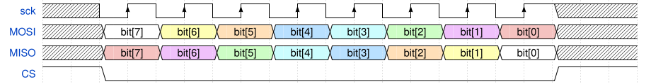

Здесь введены стандартные сигналы:

* `MOSI` - данные от мастера к слейву (master out, slave in)
* `MISO` - данные от слейва к мастеру (master in, slave out)
* `CS`   - Chip Select, определяет когда slave должен слушать SCK и MOSI и выставлять на выход MISO (обычно по низкому уровню)
* `SCK`  - Serial Clock, тактовый сигнал, задаётся master, обычно информация записывается в slave по положительному фронту, но 
  микроконтроллерах аппаратный spi имеет регистр с настройками, в том числе настраивается и это

В случае дисплея добавляется ещё один сигнальный провод - `A0`. Это тоже часть реализуемого SPI. Другие его обозначения - `dc`, 
`D/CX` (как в даташите), но задача у него одна - определять тип данных, передаваемых в пакете. При логическом нуле 
контроллер будет ждать команду (что делать), при 1 - данные (с чем делать). Выставлять его следует перед отправкой байта.

Разберём подробнее работу интерфейса по временной диаграмме. 

> Шаг 1. CS опускается из 1 в 0. Slave начинает ждать команды от master. 
>
>Шаг 2. Master подаёт тактовый сигнал SCK (можно и до ухода CS в 0, он будет игнорироваться).  
>
>Шаг 3. Master и slave выставляют данные для передачи. 
>
>Шаг 4. Через полпериода SCK после выставления битов происходит их запись 
>(получение). Устройства должны запомнить полученные биты. Сдвиг на >полпериода SCK обеспечивает стабильность данных при получении. 
>
>Шаг 5. Через полпериода SCK после получения бита устройства выставляют 
>следующие два бита. 
>
>Шаг 6. Аналогичным образом передаются остальные биты.
>
>Шаг 7. После передачи последнего бита CS можно поднять в 1 или оставить 
>для продолжения передачи. Полученный байт можно считать из интерфейса и 
>положить в память контроллера.

Пример 1. Передача 123.

В двоичной системе счисления

$123_{10} = 0111 \space 1011_2$

Передача MSB  first:

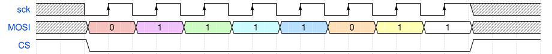

Пример 2. Передача 228.

$228_{10} = 1110 \space 0100_2$

Временная диаграмма:

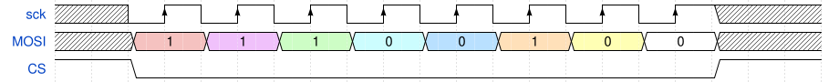

Обычно у SPI есть 4 режима синхронизации. На временной диаграмме SCK начинается с нуля, запись в master и slave происходит по фронту SCK. Менять здесь можно два параметра - clock polarity (CPOL) и clock phase (CPHA).

`CPOL` - это услосвие синхронизации. 

> CPOL=0 - запись происходит по фронту, смена бита - по срезу (как на временной диаграмме выше).
> 
> CPOL=1 - запись происходит по срезу, смена бита - по фронту.

`CPHA` - это начальное условие, задющее фазу SCK. 

> CPHA=0 - SCK при старте передачи находится в состоянии 0.
> 
> CPHA=1 - SCK начинается с 1.

В микроконтроллерах обычно реализованы все 4 режима, для выбора 
режима нужно записать настройки в специальный регистр. Наш экран 
работает в стандартном режиме с нулевым начальным значением SCK 
и записью по фронту SCK, поэтому мы реализуем этот вариант.

Данные можно передавать старшим или младшим битом вперёд. Обычно реализуется MSB first.

Отметим ещё одну деталь. Байты передаются одновременно в обе стороны. Если данные нужно запрашивать, то сначала нужно 
полностью отправить команду, и только в следующем пакете можно будет (вместе с отправкой следующей команды) получить 
информацию из slave. В нашем случае у экрана даже MISO нет.

Эффективно реализовать spi можно с использованием сдвигового регистра. Действительно, за такт sck передаётся по одному биту 
в каждую сторону, и после передачи их помнить не нужно, так как проверок нет. Значит, можно каждый такт заменять отправленный 
бит принятым.


Реализация напрямую через сдвиговый регистр имеет один простой недостаток. Вдвигать в него значение нужно на середине такта 
SCK, а забыть старший бит можно только в конце того же такта. Решается это введением буфера, но в нашем случае MISO зафиксирован в 0, 
поэтому его можно не реализовывать.

## Описание SPI master на systemverilog

Начнём с того, что выделим у интерфейса состояния. Можно сказать, что их два - передача данных и ожидание команды.

<details>
<summary>Состояния SPI</summary>

```systemverilog
enum logic
  {
    READY_FSM         = 1'b0,
    TRANSMIT_DATA_FSM = 1'b1
  }
state, next_state;
```
</details>

В модуле явно просматриваются несколько блоков - делитель частоты для тактового сигнала, чтобы реализовать SCK, счётчик 
отправленных байтов, чтобы различать байты, и сдвиговый регистр для хранения данных. 


<details>
<summary>Делитель частоты</summary>

```systemverilog
always_ff @(posedge clk) begin
  if (rst)
    clk_to_sck_cntr <= rst_clk_cntr_val;
  else
    if (clk_to_sck_cntr == end_clk_cntr_val || state == READY_FSM)
      clk_to_sck_cntr <= rst_clk_cntr_val;
    else
      clk_to_sck_cntr <= clk_to_sck_cntr + 1;
end
```

</details>

Это обычный счётчик, который по фронту clk увеличивается на 1. SCK подключён к старшему биту. Когда данные не загружены в модуль, счётчик заполнен нулями (state воспринимает как сигнал сброса).

<details>
<summary>Счётчик битов</summary>

```systemverilog
always_ff @(posedge clk)
  if (rst)
    bit_cntr <= 4'b0;
  else
    if ((clk_to_sck_cntr == end_clk_cntr_val) || (state == READY_FSM))
      bit_cntr <= bit_cntr_next;
```

</details>

Это счётчик, который срабатывает по фронту CLK, но одновременно со срезом SCK. При передаче увеличивается от 0 до 7, затем сбрасывается. В состоянии ожидания не считает.

<details>
<summary>Сдвиговый регистр</summary>


```systemverilog
always_ff @(posedge clk)
    if (rst)
        shreg <= '0;
    else
    if ((clk_to_sck_cntr == end_clk_cntr_val) || (state == READY_FSM))
        shreg <= shreg_next;
```
</details>

Сдвиговый регистр, сдвигающийся по срезу SCK. Записываемые данные формирует управляющая логика, поскольку при загрузке отправляемых данных нужно обновить всё содержимое регистра, а при получении - только вдвинуть miso как в обычный сдвиговый регистр. 


<details>
<summary>Управляющая логика</summary>

```systemverilog
always_comb
begin
  next_state  = state;

  case(state)
    READY_FSM:
    begin
      busy          = 0;
      cs            = 1;
      bit_cntr_next = 4'b0;
      shreg_next    = shreg;
      if (load_data)
      begin
        busy = 1;
        shreg_next = data;
        next_state = TRANSMIT_DATA_FSM;
      end
    end
    TRANSMIT_DATA_FSM:
      begin
        cs            = 0;
        busy          = 1;
        bit_cntr_next = bit_cntr + 4'b1;
        shreg_next    = {shreg[6:0], miso};
        if ((bit_cntr == 4'b0111) && (clk_to_sck_cntr == end_clk_cntr_val))
        begin
          next_state = READY_FSM;
          bit_cntr_next = '0;
        end
      end
  endcase
end

always_ff @(posedge clk)
    if (rst)
        state <= READY_FSM;
    else
        state <= next_state;
```
</details>


Здесь зашит порядок работы модуля.

Состояние `READY`: модуль не передаёт данные. Chip Select поднят в 1 (slave не слушает), Содержимое сдвигового регистра сохраняется. При получении сигнала load_data данные записываются в регистр, busy поднимается в 1 и начинается передача. 

Состояние `TRANSMIT_DATA`: модуль передаёт данные. CS опускаем в 0, busy держим в 1. Счётчик битов работает. Регистр работает как сдвиговый, принимая на вход MISO. Передача завершается, когда счётчик битов фиксирует последний бит, а делитель частоты доходит до среза (последний такт sck пакета завершается). 

Добавим параметризацию, определения и логику выходных сигналов. Получим частный случай, соответствующий временной диаграмме.

<details>
<summary>Итоговый код</summary>

```systemverilog
module spi_norm
#(parameter DIV_FREQ_BY = 8) // CLK over SCK 
                                //(for values less than 2 unsafe behavior expected)
(
input logic clk,
input logic rst,

input logic [7:0]  data,
input logic        load_data, //and start sending

input logic        miso,
output logic       mosi,
output logic       cs,
output logic       sck,

output logic       busy,
output logic [7:0] received_data
);

localparam DIV_FREQ_WIDTH = $clog2(DIV_FREQ_BY); //width of frequency divider

enum logic
  {
    READY_FSM         = 1'b0,
    TRANSMIT_DATA_FSM = 1'b1
  }
state, next_state;

logic [7:0] shreg; //shift register for data
logic [7:0] shreg_next;

logic [3:0] bit_cntr;
logic [3:0] bit_cntr_next;

logic [DIV_FREQ_WIDTH-1:0] clk_to_sck_cntr;

logic sck_next;

wire  [DIV_FREQ_WIDTH-1:0] rst_clk_cntr_val = '0;

wire  [DIV_FREQ_WIDTH-1:0] end_clk_cntr_val = '1;

//frequency divider
always_ff @(posedge clk) begin
  if (rst)
    clk_to_sck_cntr <= rst_clk_cntr_val;
  else
    if (clk_to_sck_cntr == end_clk_cntr_val || state == READY_FSM)
      clk_to_sck_cntr <= rst_clk_cntr_val;
    else
      clk_to_sck_cntr <= clk_to_sck_cntr + 1;
end

assign sck           = clk_to_sck_cntr[DIV_FREQ_WIDTH-1];
assign mosi          = shreg[7];

always_comb
begin
  next_state  = state;

  case(state)
    READY_FSM:
    begin
      busy          = 0;
      cs            = 1;
      bit_cntr_next = 4'b0;
      shreg_next    = shreg;
      if (load_data)
      begin
        busy = 1;
        shreg_next = data;
        next_state = TRANSMIT_DATA_FSM;
      end
    end
    TRANSMIT_DATA_FSM:
      begin
        cs            = 0;
        busy          = 1;
        bit_cntr_next = bit_cntr + 4'b1;
        shreg_next    = {shreg[6:0], miso};
        if (bit_cntr == 4'b0111 && (clk_to_sck_cntr == end_clk_cntr_val))
        begin
          next_state = READY_FSM;
          bit_cntr_next = '0;
        end
      end
  endcase
end
    
always_ff @(posedge clk)
    if (rst)
        state <= READY_FSM;
    else
        state <= next_state;

always_ff @(posedge clk)
    if (rst)
        shreg <= '0;
    else
    if ((clk_to_sck_cntr == end_clk_cntr_val) || (state == READY_FSM))
        shreg <= shreg_next;

always_ff @(posedge clk)
  if (rst)
    bit_cntr <= 4'b0;
  else
    if ((clk_to_sck_cntr == end_clk_cntr_val) || (state == READY_FSM))
      bit_cntr <= bit_cntr_next;


assign received_data = shreg;

endmodule
```

</details>

Схема модуля SPI в Quartus:

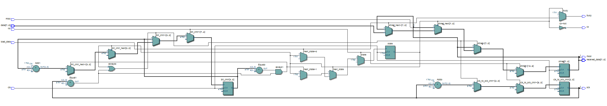

## Описание драйвера на systemverilog

Далее, нужно написать штуку, которая будет что-то в этот spi закладывать и просить отправить. 
Глобально, можно реализовать эту штуку как память, из которой последовательно читать байты. 
Новый байт нужно загружать в spi каждый раз, когда он заканчивает передачу. Для совместимости с дисплеем 
введём отдельный счётчик, чтобы ждать после каждой передачи некоторое время, прежде чем начинать новую. 

При неполном заполнении памяти содержимым текстового файла следует предусмотреть ограничение. Для этого будем 
кнопкой записывать в триггер go_upper 1, а при достижении адресом в памяти параметра NUM_BYTES - писать в go_upper 0 
(то есть, останавливать увеличение адреса).

<details>
<summary>Код драйвера</summary>

```systemverilog
module spi_driver(
input CLK,
input RESET,

input  logic [3:0] KEY,
output logic [3:0] LED,

output logic dc, //A0
output logic mosi,
output logic cs,
output logic sck,
output logic reset_display


);

//waiter to debug

logic [2:0] waiter;
logic wait_en;

//parameters for spi module

localparam DIV_FREQ_BY  = 4;
localparam NUM_BYTES    = 22;

//general definitions

logic rst;
assign rst = ~RESET;

wire [7:0] data;
wire [7:0] received_data;
wire busy;

reg load_data;

reg [7:0] ROM [0:128]; // | 1bit | 2bit | 3bit | 4bit | 5bit | 6bit | 7bit | 8bit |
reg    DC_ROM [0:128]; // |  dc  |
reg [7:0] num_byte;

initial begin
  $readmemh("bytes.txt", ROM);
  $readmemb("dc.txt", DC_ROM);
end

logic go_upper;
logic end_count;

//go upper enable logic

always_ff @(posedge CLK) begin
  if (rst)
    go_upper <= 0;
  else begin
    if ( ~KEY[0] & ~go_upper & ~end_count)
      go_upper <= 1;
    else if (end_count)
      go_upper <= 0;
  end
end

//byte counter and load data logic

always_ff @(posedge CLK) begin
  if (rst) begin
    num_byte <= 0;
    load_data <= 0;
  end
  else begin
    if (~wait_en & ~busy) begin
      load_data <= 1;
      if (go_upper)
        num_byte <= num_byte + 1;
    end
    else
      load_data <= 0;
  end
end

//end count logic

assign end_count = (num_byte == NUM_BYTES);

//----------------------------------------------------
//to show if cntr works

assign LED[0] = ~(busy);
assign LED[1] = ~(load_data);
assign LED[2] = ~(sck);
assign LED[3] = ~(go_upper);

//output signals logic

assign reset_display = RESET;
assign data =    ROM[num_byte];
assign dc   = DC_ROM[num_byte];

//spi module

wire miso = 0; //not used

spi_norm
#(.DIV_FREQ_BY(DIV_FREQ_BY)) // CLK over SCK 
spi_ent (
.clk(CLK),
.rst(rst),

.data(data),
.load_data(load_data), //and start sending

.miso(miso),
.mosi(mosi),
.cs(cs),
.sck(sck),

.busy(busy),
.received_data(received_data)
);

//wait counter

always_ff @(posedge CLK) begin
  if (rst) begin
    waiter <= '0;
    wait_en <= 0;
  end
  else begin
    if (busy) begin
      wait_en <= 1;
    end else begin
      if (wait_en) begin
        waiter <= waiter + 1;
      end
      if (waiter == '1) begin
        wait_en <= 0;
      end 
    end
  end
end

endmodule
```
</details>

Схема в Quartus:

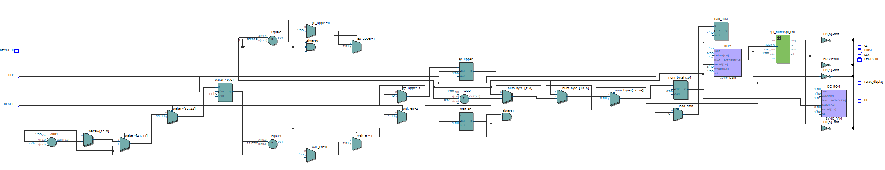

## Тестирование SPI в симуляции

Пишем простейший тестбенч. 

<details>
<summary>testbench на System Verilog</summary>

```systemverilog
`timescale 1 ps/1 ps
module spi_driver_simple_vlg_vec_tst();

reg CLK;
reg RESET;
reg miso;

wire [3:0] LED;
reg  [3:0] KEY;
wire cs;
wire dc;
wire mosi;
wire reset_display;
wire sck;

// module
spi_driver i1 (
  .CLK(CLK),
  .LED(LED),
  .RESET(RESET),
  .cs(cs),
  .dc(dc),
  .mosi(mosi),
  .reset_display(reset_display),
  .sck(sck),
  .KEY(KEY)
);
initial 
begin 
$dumpfile("dump.vcd");
$dumpvars;
#150000 $stop;
end 

// CLK
always
begin
#50	CLK = ~CLK;
end 

// RESET
initial
begin
  CLK = 0;
  RESET = 1'b0;
  KEY = '1;
  RESET = #75 1'b1;
  KEY = '0;
  #100 KEY = '1;
end

endmodule
```

</details>

Передача одного байта:

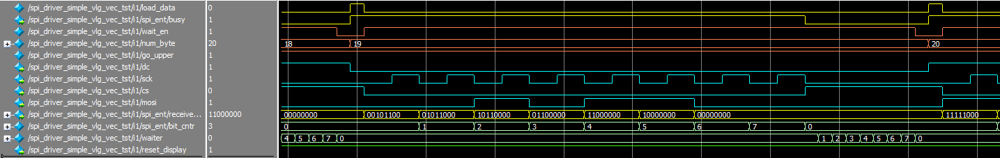

Общая картина:

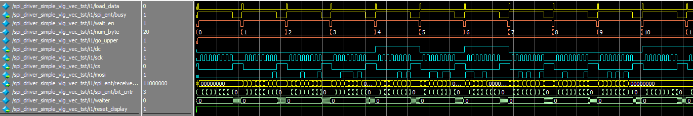

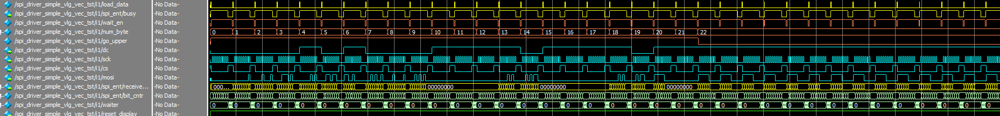

## Программирование дисплея по SPI

На симуляции выше использовалась уже готовая прошивка модуля. Теперь познакомимся с дисплеем и посмотрим, 
как заставить его работать. Вся информация, как правильно отмечают люди в интернете, есть в даташите на 
микроконтроллер ST7735 (или ST7789 для некоторых других дисплеев). Тем не менее, документ достаточно 
объёмный, поэтому я выделю здесь основные детали. 

Прежде всего, нужно понять, с чем мы имеем дело. Внутри модуля установлен контроллер ST7735. Ему нужны команды, чтобы 
правильно передавать данные. Есть память, в которую записываются данные о цветах пикселей. Есть штука, которая бегает по 
памяти, читает её и обновляет содержимое экрана.

Получим от модуля подтверждение, что он нас слышит. Изначально при подаче питания 
его контроллер находится в спящем режиме, экран равномерно окрашен в белый.  

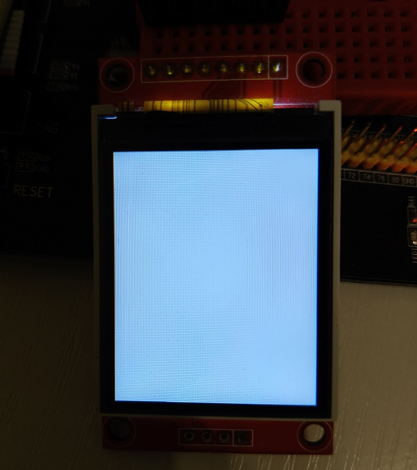

Чтобы вывести его из спящего режима, нужно дать команду sleep out. Смотрим в даташит, находим в таблице 
`SLPOUT (11h, DC=0)`. Эта команда запускает контроллер. Теперь нужно включить вывод из памяти на дисплей. 
Делается это командой `DISPON (29h, DC=0)`.

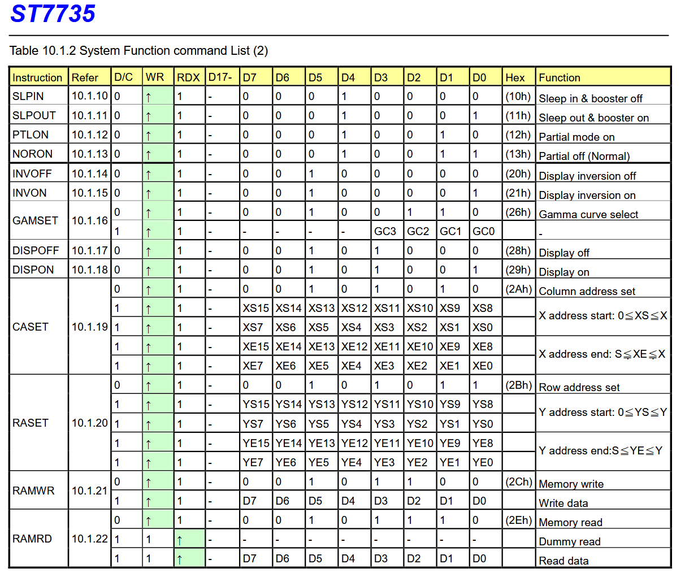

Собирать команды лучше в таблице, поскольку память dc и bytes разделены.

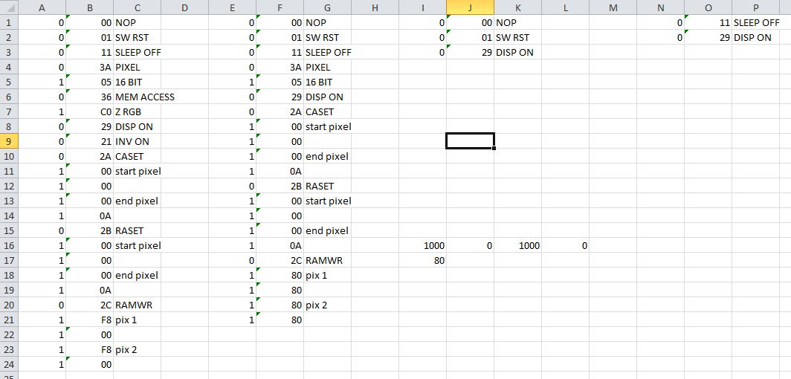

Собираем команды в файлы:

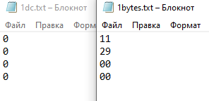

Результат:

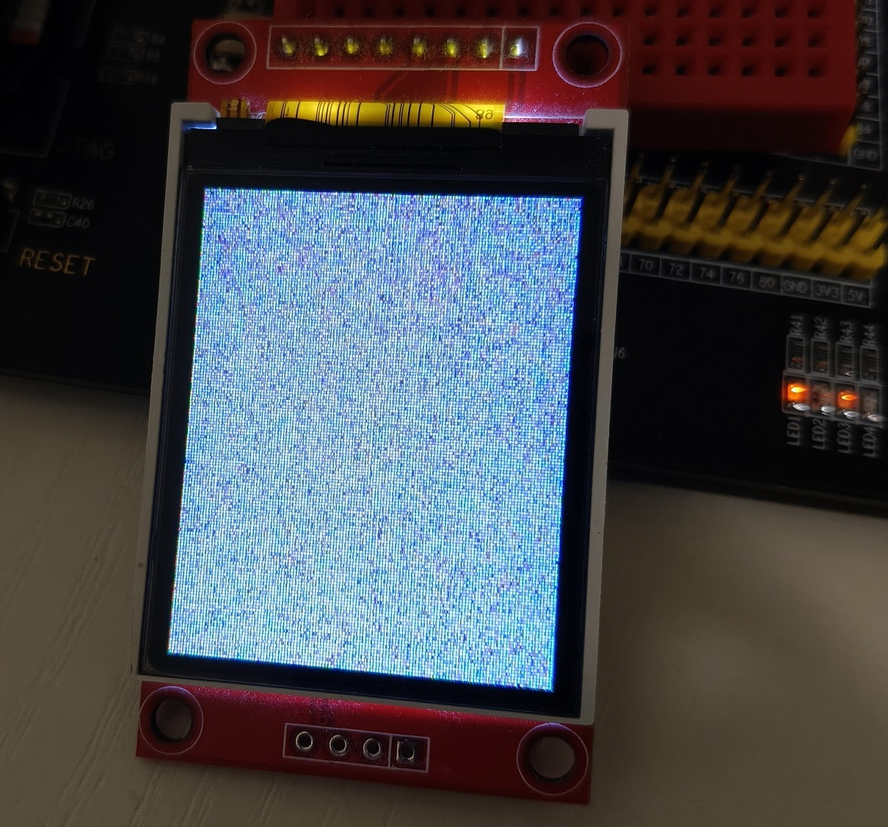

Содержимое памяти, ождаемо, хаотичное. Теперь можно пробовать что-то выводить. 
Для этого нужно задать область, в которой мы хотим работать. Это делается командами 
`CASET` и `RASET` (тоже есть на картинке выше). Формат их следующий: сначала даём команду (2Ah или 2Bh, DC=0), 
затем передаём координату начального пикселя (2 байта, сначала старший, затем младший, DC=0), потом - координату 
конца (тоже 2 байта). CASET задаёт ограничение по одной оси (X), RASET - по другой (Y). Оси ничем не отличаются, 
поскольку у контроллера есть команда настройки доступа к памяти, которой можно менять порядок её чтения, записи 
и вывода на экран. Об этом пишется в подробном описании команды.

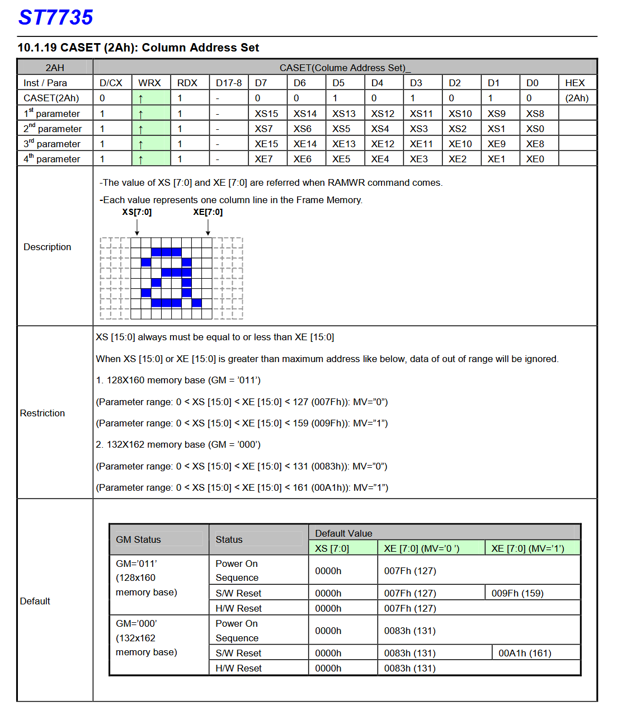

Далее, нужно начать запись в память. Для отрисовки достаточно больших площадей описанный выше драйвер не предназначен, 
но последний байт он передаёт неограниченное число раз. Это можно использовать. Пишем команду `RAMWR (2Ch, DC=0)`. После 
этого можно передавать данные. Для этого нужно знать, в каком формате дисплей их ждёт. Во-первых, один пиксель нашем 
случае кодируется двумя байтами, как на картинке ниже. Поскольку мы будем передавать один и тот же байт 2 раза для каждого 
пикселя, цветовая палитра будет ограничена.

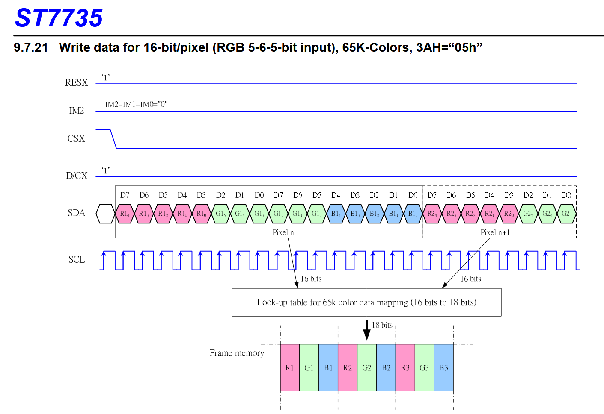

Далее, посмотрим, как происходит запись в память и вывод на экран. Ответ простой - построчно. То есть, передаются два байта 
первого пикселя, затем - второго, третьего и т.д.

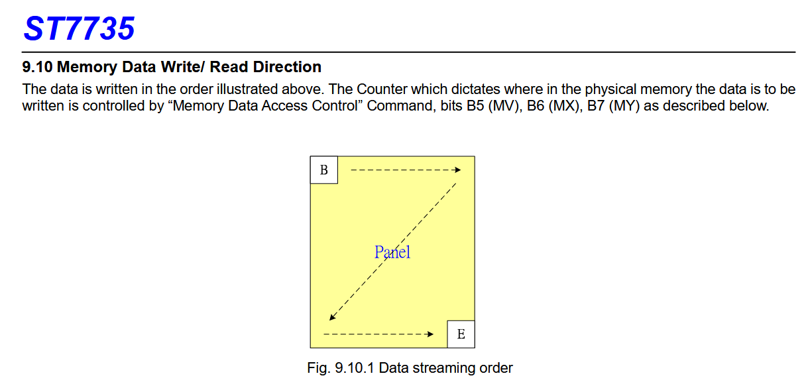

Пусть мы подаём байт $80_{16}$. Цвет будет закодирован как два последовательных байта 

$80_{16}=1000\space 0000\space 1000\space 0000=(10000)(000100)(00000)$. 

Отличны от нуля 5-й (старший) бит красного и 3-й бит зелёного из 6. Ожидаем увидеть что-то вроде красного.

Прошивка:

|DC|BYTE |DESCRIPTION |
|---|---|---|
|0|00|NOP|
0	|01|	SW RST
0	|11|	SLEEP OFF
0	|3A|	PIXEL
1	|05|	16 BIT
0	|29|	DISP ON
0	|2A|	CASET
1	|00|	start pixel
1	|00|	-
1	|00|	end pixel
1	|0A|	-
0	|2B|	RASET
1	|00|	start pixel
1	|00|	-
1	|00|	end pixel
1	|0A|	-
0	|2C|	RAMWR
1	|80|	pix 1
1	|80|	-
1	|80|	pix 2
1	|80|	-

Результат:

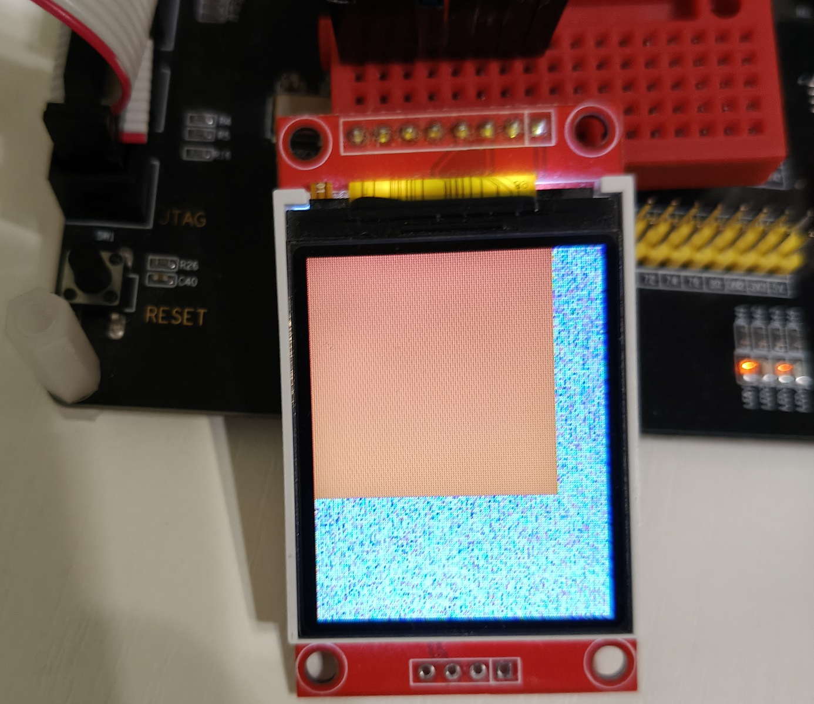

Попробуем передать синий. Для этого можно просто поменять порядок передачи цветов с RGB на BGR. 
Это можно сделать командой `MADCTL (36h)`.

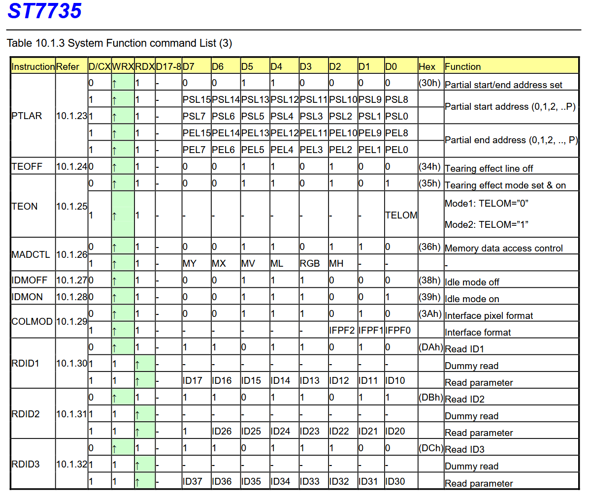

Прошивка:

|DC|BYTE |DESCRIPTION |
|---|---|---|
0   |00|    NOP
0	|01|	SW RST
0	|11|	SLEEP OFF
0	|3A|	PIXEL
1	|05|	16 BIT
0	|36|    MEM ACCESS
1	|C8|	Z RGB
0	|29|	DISP ON
0	|2A|	CASET
1	|00|	start pixel
1	|00|	-
1	|00|	end pixel
1	|0A|	-
0	|2B|	RASET
1	|00|	start pixel
1	|00|	-
1	|00|	end pixel
1	|0A|	-
0	|2C|	RAMWR
1	|80|	pix 1
1	|80|	-
1	|80|	pix 2
1	|80|	-

Результат:

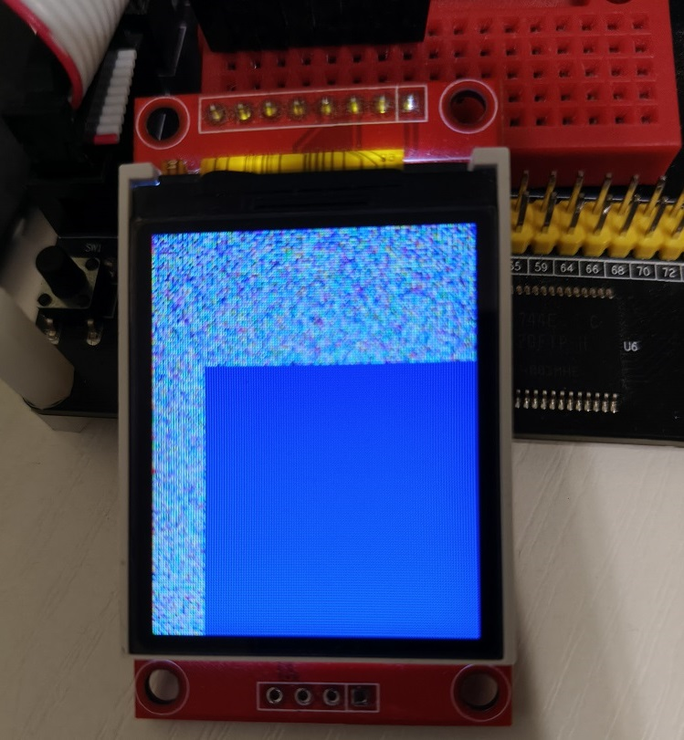

Этой командой также можно поменять порядок вывода на экран, из-за чего квадратик теперь рисуется с другой стороны.


