### Вступление

Читателю скорее всего уже известны минимум 2 интерфейса: ```UART``` и ```SPI```,
казалось бы, зачем нужен еще и ```I2C```? Для этого рассмотрим сначала плюсы и
минусы каждого из названных интерфейсов:

**```SPI```**.

Из плюсов: Хорош для передачи данных большому числу slave, очень быстрый
(характерная скорость передачи данных порядка 10 Мбит/с) и простой (по
сравнению с I2C уж точно.

Из минусов: отсутствие каких-либо проверок наличия соединения
master-slave, проверки передачи данных master-slave и тому подобного).

**```UART```**.

Из плюсов: имеется 1-2 характерных бита проверки передачи данных,
довольно быстрый (но помедленнее ```SPI```, скорость передачи порядка 1
Мбит/с), простой в построении (сложность примерно ```SPI```). Может
одновременно передавать и получать данные

Из минусов: только для связи 2 устройств между собой (и при построении
больших систем будет очень громоздким). Также, именно что проверки
наличия slave (в простейший реализациях уж точно) нету.

**```I2C``` (собственно, про него данная статья).**

Из плюсов: может быть много slave (до 128), при передаче данных
постоянно проверяется наличие slave и подтверждение от него, например,
получения данных. Также, именно использование данного интерфейса очень
простое (2 провода и clk + подтягивающий резистор).

Из минусов: скорость передачи куда ниже, чем в SPI и UART (порядка 0.1
Мбит/с), довольно неприятно делать и отлаживать (хотя бы из-за того, что
sda - ```inout```). Также, из-за использования z-state весьма сильно
чувствителен к помехам (несколько нивелируется на практике подтягивающим
резистором, но не полностью)

Используется I2C в прикладной электронике для связывания между собой
чего-то не сильно высокоскоростного (опять-таки, свою роль играет плюс в
виде большого числа slave на 1 шине и проверок соединения) такого как
датчики (например, в автомобиле), сенсоры, соединение между собой
микроконтроллеров и тд.

### Про алгоритм передачи данных в I2C.

Для начала передачи/приема данных существует условие ```START```

Для конца передачи/приема данных существует условие ```STOP```

**Условия ```START``` и ```STOP```**

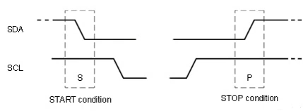

Если у нас ```SDA``` из 1 в 0, когда ```SCL = 1```, то это называется
условием ```START```

После условия ```START``` мы передаем адрес slave по ```SDA``` (например, у
нас на 1 шине обмениваются данными 6 микроконтроллеров с некими
адресами, которые определили их разработчики). Если адрес совпадает с
адресом slave, то взаимодействие продолжается дальше, иначе slave
переходит в состояние ожидания и выход держит в z-state.

Если у нас ```SDA``` из 0 в 1, когда ```SCL = 1```, то это называется
условием ```STOP``` (шина свободна для взаимодействия (все устройства
держат ее в z-state)).

**Запись данных в SLAVE**

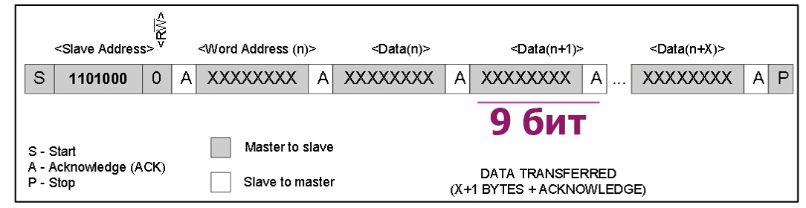

**Получение данных от SLAVE**

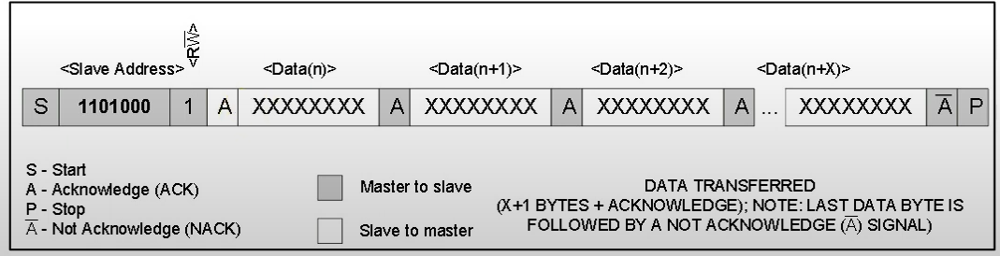

**Пример передачи данных от Master к Slave.**

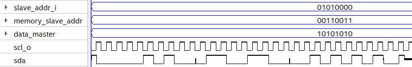

**Передача 11111111 для явного обнаружения битов подтверждения.**

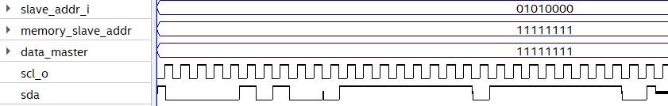

Далее идет, собственно, отличие передачи данных от из получения:

1)  Если запись в slave, то мастер после адреса отправляет 0
2)  Если получение данных от slave, то мастер после адреса отправляет 1.

Возможны случаи, когда этого бита нет, но конкретно в нашей реализации
он будет.

Затем этого master ждет подтверждение приема данных от slave ("0" -
данные принял, иначе ставит "1").

Что же будет подтягивать I2C линию в "1", если, вдруг, slave отключился
или же все устройства шину держат в z-state? Эту роль обычно выполняют
довольно большие pull-up резисторы (порядка кОма), именно поэтому,
собственно, активным уровнем подтверждающих сигналов является "0".

Далее же идет сама передача данных

**От master к slave.**

Master отправляет 8 бит данных и ждет подтверждающего "0", если он есть,
то продолжает данный процесс, если же подтверждения нет (на линии "1"),
то процесс прекращается (все устройства в z-state и pull-up ставит "1")

**От slave к master**

Slave отправляет 8 бит данных и ждет подтверждающего "0" от Master, если
он есть, то продолжает передачу данных, иначе переходит в z-state (на
линии pull-up выставляет "1")

**Условие ```START``` (конкретно на нашей симуляции)**

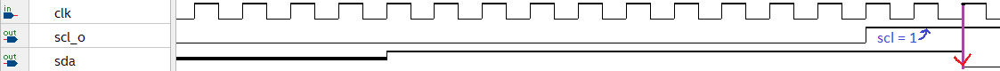

**Условие ```STOP/END``` (конкретно на нашей симуляции)**

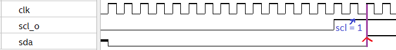

**Про различные управляющие провода в I2C-Master**

В данном небольшом разделе я поясню функционал разных проводов в моем
I2C-Master.

```Start```  - начало передачи/приема данных Master. Данный провод для
интерфейса существует не только в моей реализации (или его аналоги).

Активный сигнал ```Start = 1```

**Пример использования**: компьютер подготовил данные для датчика,
отправил ```start```, а что происходит во внутренностях интерфейса его не
волнует.

```Select_rezim``` - правильнее было бы назвать его ```select_mode```,
играет роль выбора режима Master (прием или передача данных).
Применяется также как внешний провод волшебной коробочки I2C (компьютер
получает данные от датчика или передает).

```Select_rezim = 1``` - Receive data

```Select_rezim = 0``` - Transmit data

```End_otpravka``` - интерфейс мной спроектирован так, что гарантированно
отправляет 1 пакет данных (если slave/master все подтвердил). Однако,
обычно конкретный обмен Master-Slave многопакетный, и ```End_otpravka```
отвечает за конец обмена данными.

```End_otpravka = 1``` - конец отправки данных

```End_otpravka = 0``` - продолжаем передачу/прием данных

Опять-таки, данный провод и его аналоги имеются не только в моем
интерфейсе, но и в более-менее общем I2C (или аналог этого провода).

**Пример использования** - компьютер и микрофон соединены между собой
по I2C, инициализация его 1 раз нужна, а данные передавать он будет
долго. С другой стороны, датчик освещенности, который просто 1 пакет
данных закинет и все.

```A_slave``` - в процессе тестирования I2C-Master я вынес подтверждение
от Slave в данный провод (в итоговой версии его нет). Сделал же я это
из-за неудобства тестирования и отладки порта типа ```inout``` (которым, в
итоге будет ```sda```).

```Slave_addr_i``` -  8-битный адрес slave, задает внешний источник
(условно, компьютер)

```Memory_slave_addr``` - 8-битный номер ячейки памяти в slave (также
задается внешним источником)

```Data_master``` - 8-битный пакет data, которую надо передать от Master
к Slave (задается внешним источником)

На самом деле, именно что для практического использования этот I2C еще
надо обернуть модулем, который вовремя будет подавать, например, ту же
data (но мы реализуем именно интерфейс передачи, подразумевая то, что у
нас data и все остальные внешние сигналы подаются как надо).

### Реализация I2C Master, передача данных к Slave (концептуально)

По сказанному выше можно составить конечный автомат передачи данных от
Master к Slave в I2C

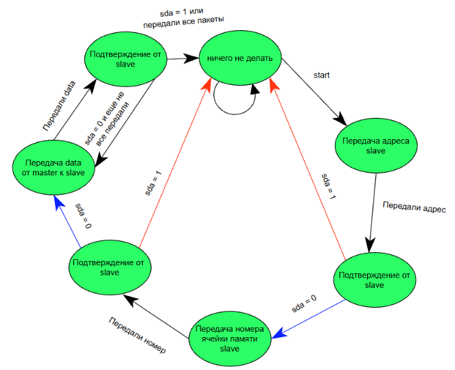

Или же, в виде временных диаграмм (пока что тест отдельно Master без
Slave) :

**Пример передачи данных от Master к Slave (1 пакет данных)**

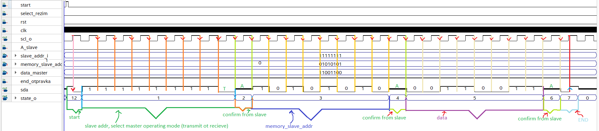

**Передача нескольких пакетов данных (масштаб в 2 раза уменьшен)**

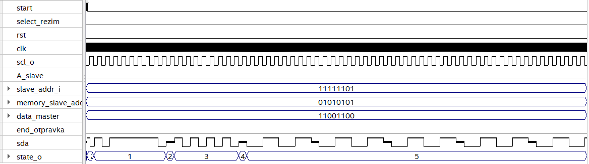

**Реализация I2C Master, получение данных от Slave**

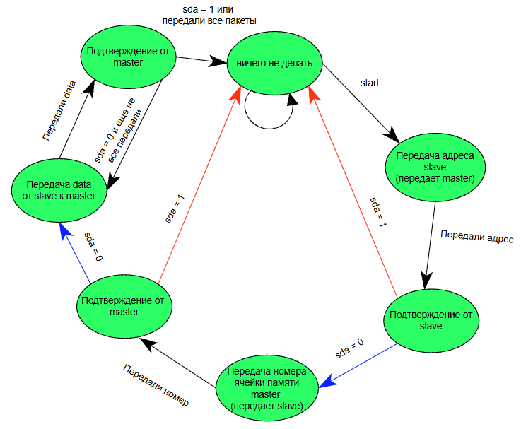

Однако, как и для примера передачи данных Master to Slave для Slave to
Master имеет смысл привести пример работы данной вещицы.

**Пример получения данных от SLAVE к MASTER (1 пакет)**

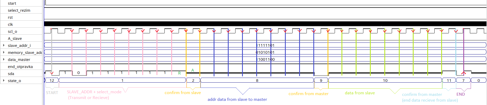

**Пример получения данных от SLAVE к MASTER (много пакетов)**

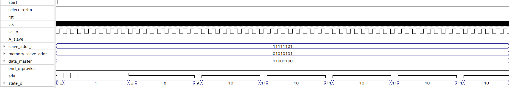

Состояния те же самые, просто вместо перехода к ```END``` Master возвращается
к состоянию приема данных от SLAVE.

<details>
<summary>Описание Master-I2C на System Verilog</summary>

```systemverilog
module my_i2c_tr(	
	input  [7:0]  data_master,
	input  [7:0]  slave_addr_i,
	input  [7:0]  memory_slave_addr,
	
	input         start,
	input         select_rezim,
	input         clk,
	input         rst,
	input         end_otpravka, // Если 1, то конец, иначе продолжать обмен данными
	
	inout         sda,
	output        scl_o,
	//input         A_slave,
	
	output [31:0] state_o, //state_fsm для отладки
	
	output [7:0]  addr_from_slave,
	output [7:0]  data_from_slave,
	
	output        vld_addr_data,
	output        vld_data,
	output [7:0]  count_data_to_slave_o
);

logic A_slave;
assign A_slave = sda;
assign state_o = state;

assign count_data_to_slave_o = count_data_to_slave;

logic [7:0] num_data_pack;
logic scl;
logic end_wait;


assign scl_o = scl;


logic [8:0] slave_addr;
assign slave_addr = {select_rezim, slave_addr_i};


localparam
	START_STATE_FSM = 4'd12,
	INITIAL_STATE_FSM = 4'd0,
	SLAVE_ADDR_FSM = 4'd1,
	WAIT_SLAVE_ADDR_FSM = 4'd2,
	ADDR_MEM_FSM = 4'd3,
	WAIT_ADDR_MEM_FSM = 4'd4,
	TR_DATA_FSM = 4'd5,
	WAIT_END_STATE_FSM = 4'd6,
	END_STATE_FSM = 4'd7,
	
	INPUT_ADDR_DATA_FSM = 4'd8,
	WAIT_ADDR_DATA_FSM = 4'd9,
	INPUT_DATA_FSM = 4'd10,
	WAIT_END_DATA_IN_FSM = 4'd11;
	
logic [3:0] state;
logic [3:0] next_state;


always @(*) begin
	next_state = state;
	case(state)
		INITIAL_STATE_FSM : begin
			if (start) next_state = START_STATE_FSM;
		end
		
		START_STATE_FSM : begin
			if (end_start) next_state = SLAVE_ADDR_FSM;
		end
		
		SLAVE_ADDR_FSM : begin
			if (end_slave_count) next_state = WAIT_SLAVE_ADDR_FSM;
		end
		
		WAIT_SLAVE_ADDR_FSM : begin
			if (~A_slave && end_wait) begin
				next_state = (~select_rezim) ? ADDR_MEM_FSM : INPUT_ADDR_DATA_FSM;
			end
		end
		
		
		INPUT_ADDR_DATA_FSM : if (end_addr_mem_slave) next_state = WAIT_ADDR_DATA_FSM;
		
		WAIT_ADDR_DATA_FSM : if (end_wait) next_state = INPUT_DATA_FSM;
		
		INPUT_DATA_FSM : next_state = (end_data_to_slave) ? WAIT_END_DATA_IN_FSM : INPUT_DATA_FSM;
		
		WAIT_END_DATA_IN_FSM : begin
			if(end_wait) begin
				if(~A_slave && ~end_otpravka) next_state = INPUT_DATA_FSM;
				else next_state = END_STATE_FSM;
			end
		end
		
		
		ADDR_MEM_FSM : begin
			if (end_addr_mem_slave) next_state = WAIT_ADDR_MEM_FSM;
		end
		
		WAIT_ADDR_MEM_FSM : begin
			if (end_wait) begin
				if  (~A_slave) next_state = TR_DATA_FSM;
				else next_state = INITIAL_STATE_FSM;
			end
		
		end
		
		TR_DATA_FSM : begin
			if (end_data_to_slave && end_otpravka) next_state = WAIT_END_STATE_FSM;
		end
		
		WAIT_END_STATE_FSM : begin
			if(end_wait) begin
				if(~A_slave && ~end_otpravka) next_state = TR_DATA_FSM;
				else next_state = END_STATE_FSM;
			end
		end
		
		
		END_STATE_FSM : begin
			if(end_start) next_state = INITIAL_STATE_FSM;
		end
	endcase
end

logic [3:0] num_slave_addr;
logic [3:0] num_slave_mem_addr;
logic sda_neg_clk;

logic vivod;
logic end_start;

always @(posedge clk) begin
	sda<=1'dz;
	case (state)
	
		INITIAL_STATE_FSM : begin
			sda <= 1'dz;
		end
		
		START_STATE_FSM : begin
		if (detect_pos_scl) sda <= 1'd0;
		else sda <= 1'd1;
		
			
	   end
	  
		SLAVE_ADDR_FSM : begin
			if (count_slave_addr < 9) begin
				sda <= slave_addr[count_slave_addr];
			end
		end
	

		ADDR_MEM_FSM : begin
			if (count_memory_slave_addr < 8) begin
				sda <= memory_slave_addr[count_memory_slave_addr];
			end
			
			else sda <= 1'dz;
		end
	

		TR_DATA_FSM : begin
			if (count_data_to_slave < 8) begin
				sda <= data_master[count_data_to_slave];
			end 

			else sda <= 1'dz;
		end

	
		END_STATE_FSM : begin
			if (num_end < 2) begin
				if (detect_pos_scl) sda <= 1'd1;
				else sda <= 1'd0;
			end
				
		end
	
		INPUT_ADDR_DATA_FSM : sda <= 1'dz;
		
		WAIT_ADDR_DATA_FSM : sda <= 1'd0;
		
		INPUT_DATA_FSM : sda <= 1'dz;
		
		WAIT_END_DATA_IN_FSM : sda <= end_otpravka;
	
	endcase
	
	
end


always @(posedge clk) begin
	if (rst) state = INITIAL_STATE_FSM;
	else state <= next_state;
end


logic end_slave_count;
logic end_addr_mem_slave;
logic end_data_to_slave;
logic end_count_exit;

logic [4:0] count_memory_slave_addr;
logic [4:0] count_slave_addr;
logic [4:0] count_data_to_slave;
logic [4:0] num_end;

counter slave_addr_counter(
	.rst(rst),
	.enable((state == SLAVE_ADDR_FSM)),
	.end_count(5'd9),
	.clk(scl),
	.out_cnt(end_slave_count),
	.num (count_slave_addr)
);

counter WAIT_counter(
	.rst(rst),
	.enable(((state == WAIT_ADDR_DATA_FSM) || (state == WAIT_END_STATE_FSM) || 
	        (state == WAIT_SLAVE_ADDR_FSM) || (state == WAIT_ADDR_MEM_FSM)) ||
			  (state == WAIT_END_DATA_IN_FSM)),
	.end_count(5'd1),
	.clk(scl),
	.out_cnt(end_wait),
	.num ()
);

counter memory_addr_counter(
	.rst(rst),
	.enable(((state == ADDR_MEM_FSM) || (state == INPUT_ADDR_DATA_FSM))),
	.end_count(5'd8),
	.clk(scl),
	.out_cnt(end_addr_mem_slave),
	.num (count_memory_slave_addr)
);

counter data_counter(
	.rst(rst),
	.enable(((state == TR_DATA_FSM) || (state == INPUT_DATA_FSM))),
	.end_count(5'd8),
	.clk(scl),
	.out_cnt(end_data_to_slave),
	.num(count_data_to_slave)
);

counter end_counter(
	.rst(rst),
	.enable( (state == END_STATE_FSM)),
	.end_count(5'd2),
	.clk(scl),
	.out_cnt(end_count_exit),
	.num(num_end)
);

from_1_to_8 data_addr_mem (
	.data_i(sda),
	.clk(scl),
	.enable((state == INPUT_ADDR_DATA_FSM)),
	.rst(rst),
	.vld(vld_addr_data),
	.data_o(addr_from_slave)
);

from_1_to_8 data (
	.data_i(sda),
	.clk(scl),
	.enable((state == INPUT_DATA_FSM)),
	.rst(rst),
	.vld(vld_data),
	.data_o(data_from_slave)
);

devider_CLK generate_SCL (
	.clk(clk),
	.SCL(scl)
);

start_end_sda nachalo_conec (
	.clk(clk),
   .scl(scl),
	.enable((state == END_STATE_FSM) || (state == START_STATE_FSM)),
	.sda(),
	.vivod(vivod),
	.end_clk(end_start)
	
);

logic detect_pos_scl;
logic detect_neg_scl;

detect_pos_neg_scl for_start_end(
	.clk(clk),
	.scl(scl),
	.enable((state == END_STATE_FSM || state == START_STATE_FSM || state == WAIT_SLAVE_ADDR_FSM) ),
	.rst(rst),
	.detect_pos_scl (detect_pos_scl),
	.detect_neg_scl (detect_neg_scl)
);
endmodule
```

</details>


**RTL Viewer I2C-Master**

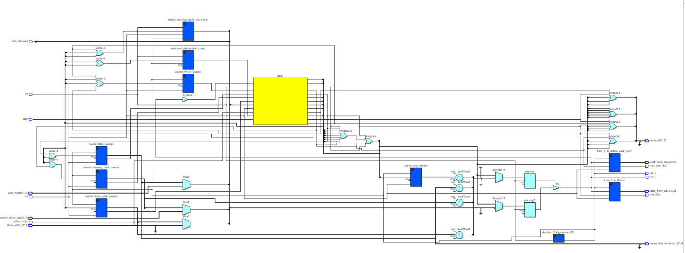

**Граф переходов I2C-Master**

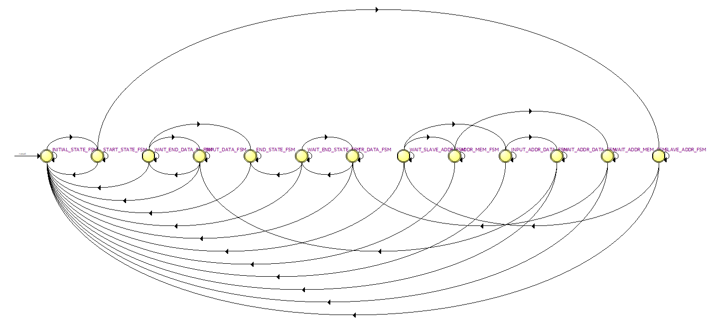

### Немного про модули (синие коробочки) I2C-Master.

**Модуль 1. ```from 1_to_8```**

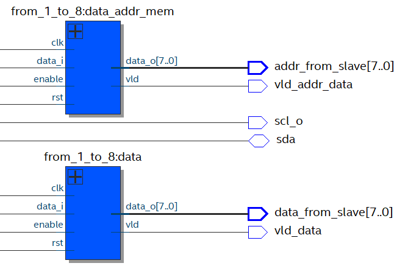

Реализован мною он был для того, чтобы данные с ```SDA``` переводить в
8-битную шину и после передачи данных ставить сигнал ```vld```.
Использован же он несколько избыточно как в Master, так и в Slave,
так-как можно обойтись одним таким модулем, если чуток потанцевать с
бубном.

<details>
<summary>Описание на System Verilog</summary>

```systemverilog
module from_1_to_8
#(parameter NUM = 8) (
	input data_i,
	input clk,
	input enable,
	input rst,
	output vld,
	output [NUM - 1:0] data_o
);

localparam count_razr = $clog2(NUM);

logic [NUM - 1 :0] data = '0;
assign data_o = data ;
logic vld_mem;

always_ff @(posedge clk) begin
	vld <= vld_mem;
	if (rst || ~enable) data <= '0;
	else begin 
		data <= {data [NUM - 2 :0], data_i};
	end
end

counter counter_for_num(
	.rst(rst),
	.enable(enable),
	.end_count(NUM-1),
	.clk(clk),
	.out_cnt(vld_mem),
	.num()
);


endmodule
```

</details>

**Модуль 2. ```counter```.**

Сделан был мной ради того, чтобы считать до 8 (передача адреса данных и
передача данных), до 9 (передача адреса slave + 1 бит выбора режима), до
1 (когда ждем ответ от slave) и до 2 (когда ставим END).

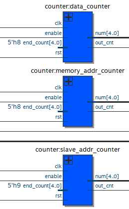

На схеме их всего 5 штук (можно обойтись одним, потанцевав с бубном),
если не считать счетчиков внутри ```from_1_to_8```. Также, в самом
описании счетчика желательно разделить rst и enable (а то автоматическая
оптимизация может нормально не оптимизировать) и, по желанию,
параметризовать его.

<details>
<summary>Описание на System Verilog</summary>

```systemverilog
module counter (
	input rst,
	input enable,
	input [4:0] end_count,
	input clk,
	output out_cnt,
	output [4:0] num
);

logic [4:0] counter;

always @(negedge clk) begin
	if (rst || ~enable) counter <= '0;
	
	else begin
		if (counter == end_count) counter <= '0;
		else counter <= counter + 1;
	end


end

assign out_cnt = (counter == end_count);
assign num = counter;
endmodule
	
```

</details>


**Модуль 3. Devider_CLK.**

Сделан для генерации ```SCL``` через деление ```clk``` простейшим способом через
счетчик. Из потенциальных улучшений - параметризация и деление не
только на степень двойки.

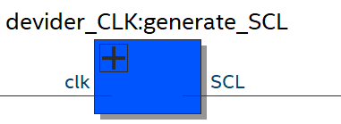

**Описание на System Verilog.**

<details>
<summary>Описание на System Verilog</summary>

```systemverilog
module devider_CLK (
	input clk,
	output SCL
);

reg [8:0] num;

always_ff @(posedge clk) begin
	if (num[8]) num <= '0;
	else num <= num + 1;
end

assign SCL = num[4];
endmodule
```

</details>

**Модуль 4. ```Start_end_SDA```.**

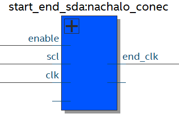

Данный модуль является частично костылем, который можно поменять (потому
как он частично повторяет функционал модуля 5), изначально создавался
для выравнивания ```SDA``` и ```SCL``` между передачей данных и ```START/END```.

<details>
<summary> Описание на System Verilog </summary>

```systemverilog
module start_end_sda (
	input clk,
	input scl,
	input enable,
	output sda,
	input vivod,
	output end_clk
	
);

logic start_nya;
logic end_nya;
logic end_start;

assign end_clk = end_start;

always @(posedge clk) begin 
	if(enable) begin 
			if (~scl) begin
					start_nya <= 1'd1;
					if (end_nya) begin 
						end_start <= 1'd1;
					end
			end
			
			if (end_nya) begin 
					sda <= vivod;
			end
			
			else sda <= 1'dz;
			
			if (scl) begin
					if(start_nya) begin
						start_nya <= 1'd0;
						end_nya <= 1'd1;
					end			
			end
	end
	
	else begin
			start_nya <= 1'd0;
			end_nya <= 1'd0;
			end_start <= 1'd0;
	
	end
end
endmodule
```

</details>

**Модуль 5. ```detect_pos_neg_scl```.**

Данный модуль использовался мной для перехода от передачи данных при
```SCL = 0``` к начальному/конечному состояниям, когда ```SDA``` меняется
при ```SCL = 1``` (частично повторяет функционал модуля 4).

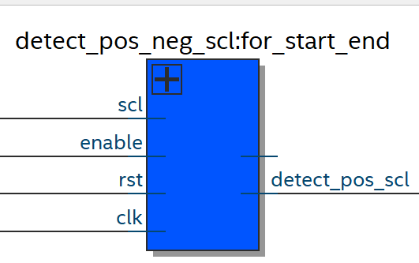

В качестве потенциального улучшение может быть описывание данной схемы
как FSM и разделения ```enable``` и ```rst```.


<details>
<summary>Описание на System Verilog</summary>

```systemverilog
module detect_pos_neg_scl (
	input clk,
	input scl,
	input enable,
	input rst,
	output detect_pos_scl,
	output detect_neg_scl
);

logic detect_0_scl;

logic detect_1_scl;

always @(posedge clk) begin
	if (rst || ~enable ) begin
		detect_0_scl <= 1'd0;
		detect_1_scl <= 1'd0;
		
		detect_pos_scl <= 1'd0;
		detect_neg_scl <= 1'd0;
	end
	
	else begin
		if (~scl) detect_0_scl <= 1'd1;
		if (scl && detect_0_scl) detect_pos_scl <= 1'd1;
		
		if (scl) detect_1_scl <= 1'd1;
		if (~scl && detect_1_scl) detect_neg_scl <= 1'd1;
		
		
	end
end

endmodule
```

</details>

### Концептуальная схема I2C Slave, получение данных от Master

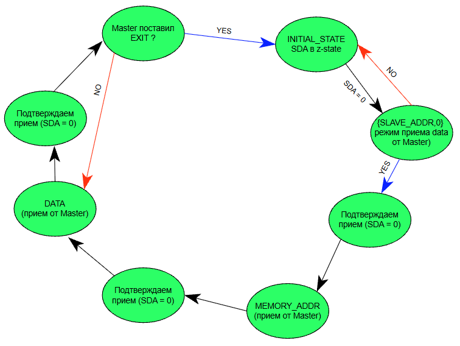

I2C-slave написан у нас будет только для режима получения данных от
Master как быстрая проверка, режим передачи данных от Slave к Master
пока что не реализован.

**RTL-viewer I2C-slave.**

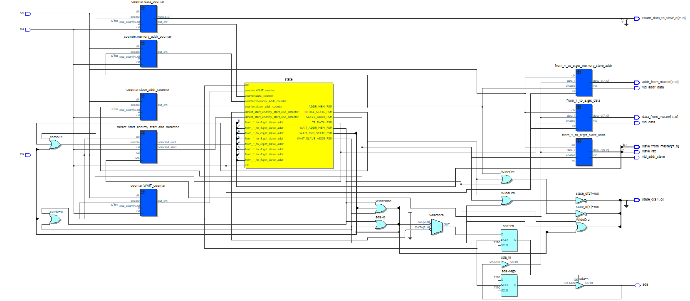

**Граф переходов I2C-Slave.**

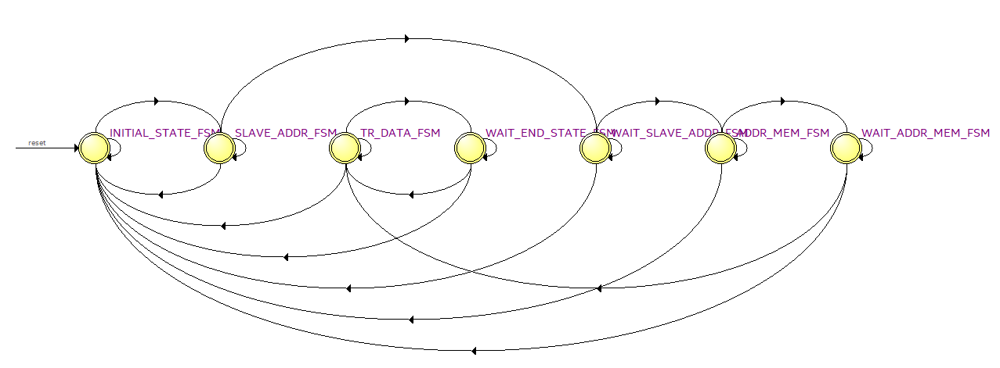

### Немного про модули (синие коробочки) I2C-Slave.

**Дополнительный модуль 1. Детектор Start-End**

Данный детектор введен для удобства работы с I2C-Slave, на него подаются
```SDA```, ```SCL```, ```clk```, а он ищет ```START/END``` условия.

**Пример работы детектора**

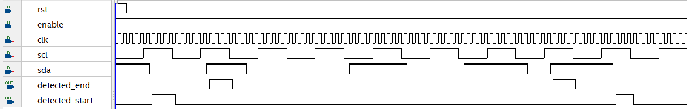

**Описание детектора ```Start/End``` на System Verilog**

<details>
<summary>Описание на System Verilog</summary>

```systemverilog
module detect_start_end (
	input  rst,
	input  sda,
	input  clk,
	input  scl,
	
	input  enable,
	
	output detected_start,
	output detected_end
	
);

logic detect_pos_sda;
logic detect_neg_sda;


always_ff @(posedge clk) begin
	if (rst) begin 
		detected_start <= 1'd0;
		detected_end   <= 1'd0;
	end
	
	else begin
		if (enable) begin
			if (detected_end && scl)   detected_end   <= detected_end;
			else                       detected_end   <= detect_pos_sda && scl;
			
			if (detected_start && scl) detected_start <= detected_start;	
			else                       detected_start <= detect_neg_sda && scl;
			
		end
		
		else begin 
			detected_start <= 1'd0;
			detected_end   <= 1'd0;
		end
	end
end


detect_pos_neg_signal detector_sda (
	.clk(clk),
	.signal(sda),
	.enable(enable),
	.rst(rst),
	.detected_pos(detect_pos_sda),
	.detected_neg(detect_neg_sda)
);


endmodule

```
</details>

**Детектор ```START/END``` на схеме**

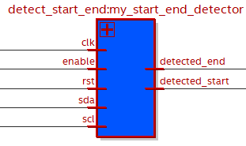

**Дополнительный модуль 2. ```detect_pos_neg_signal```.**

Введен был данный модуль для удобства описания детектора ```START/END```,
можно было бы обойтись без него, описав его внутри дополнительного
модуля 1.

**Детектор ```posedge/negedge``` внутри START/END**

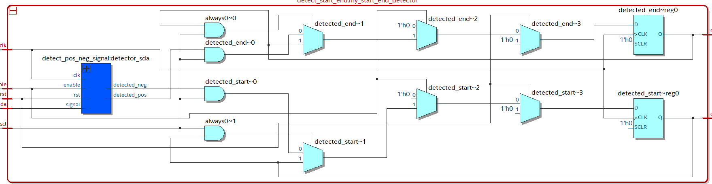


<details>
<summary>Описание на System Verilog</summary>

```systemverilog
module detect_pos_neg_signal(
	input signal,
	input clk,
	input rst,
	input enable,
	output detected_pos,
	output detected_neg
);

localparam DETECTED_0_STATE = 1'd0,
			  DETECTED_1_STATE = 1'd1;
			  
logic state;
logic next_state;

always_comb begin
	next_state = state;
	case(state)
		DETECTED_0_STATE : if (signal) next_state  = DETECTED_1_STATE;
		DETECTED_1_STATE : if (~signal) next_state = DETECTED_0_STATE;
	endcase
end

assign detected_pos = ((state == DETECTED_0_STATE) && (next_state == DETECTED_1_STATE));
assign detected_neg = ((state == DETECTED_1_STATE) && (next_state == DETECTED_0_STATE));


always_ff @(posedge clk) begin
	state <= next_state;
end

endmodule
```
</details>

**Тестирование Master-Slave I2C.**

В первичном тестировании используется 2 провода, так-как на 1 проводе
```inout``` сложно понять, кто где не успевает и что делать (именно поэтому
это несколько похоже на проверку ```UART```)

```Sda_o``` - то, что на sda подает **Master**

```Sda_i``` - то, что на sda подает **Slave**

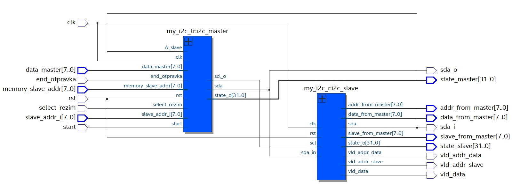

**Проверка синхронизации Master-Slave**

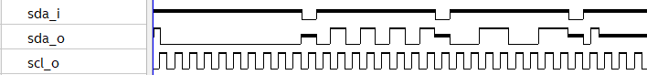

**Примеры передачи данных Master-Slave (пока что sda еще по 2
проводам)**

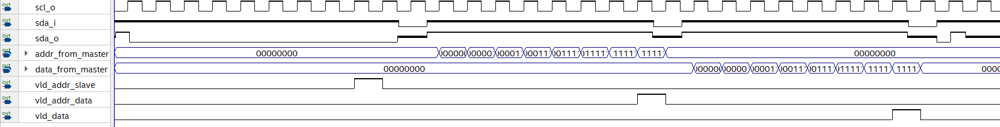

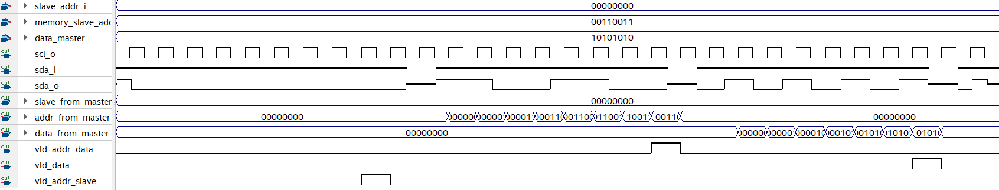
**Передача номера ячейки памяти**

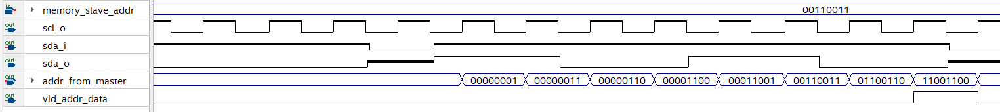

**Передача data**

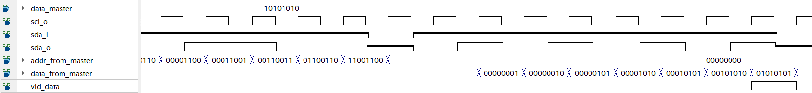

**Объединение 2 sda в 1.**

Как мы видим, sda уже синхронизированы друг с другом, а значит можно
заменить ```sda_in``` и ```sda_out``` на один ```sda_inout```.

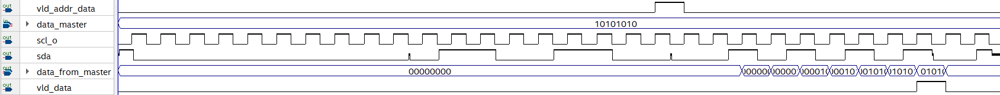

**Передача data по ```sda```**

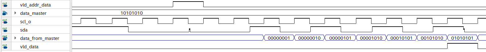

**Передача нескольких пакетов данных.**

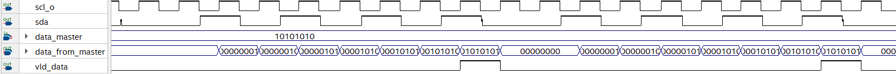

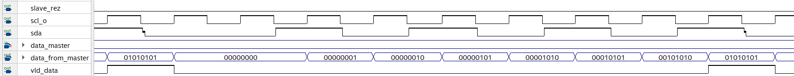

**1 Master и 2 Slave. Проверка передачи данных.**

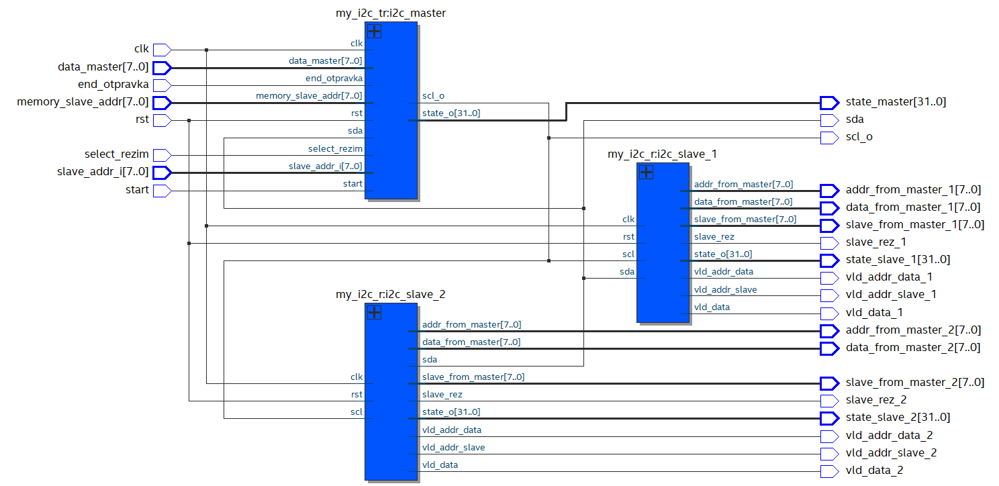

**Slave_1 назначен адрес 0**

**Slave_2 назначен адрес 10**

**Передача данных работает верно (активировался slave с ```addr = 0```)**


**Передача данных работает верно (активировался slave с ```addr = 10```)**

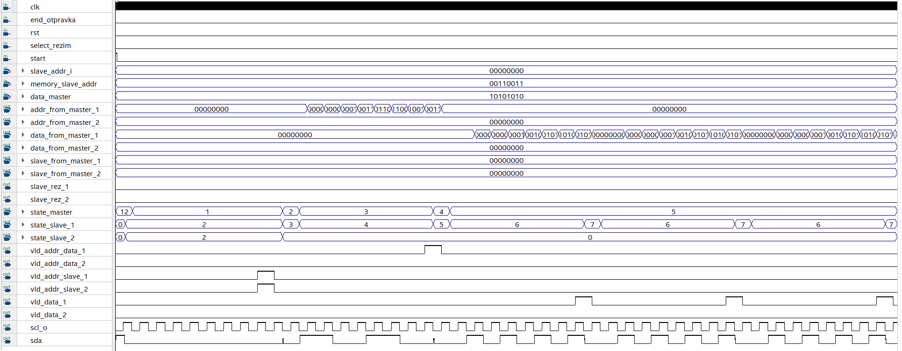

Также, одной из важных особенностей получения данных Slavе является их
"перевернутость" (по-хорошему надо просто на выход поставить еще
модули-буферы).
