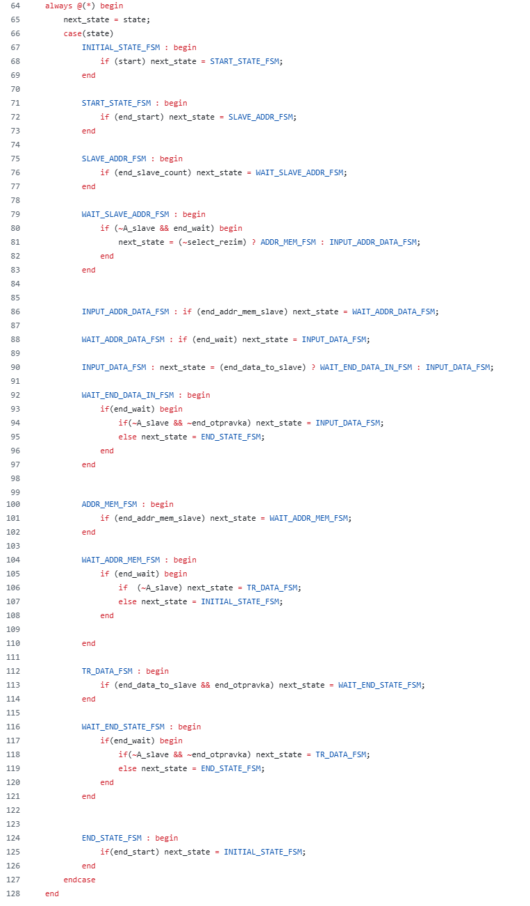
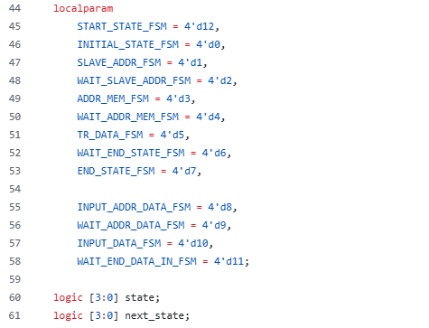

### Вступление

Читателю скорее всего уже известны минимум 2 интерфейса: ```UART``` и ```SPI```,
казалось бы, зачем нужен еще и ```I2C```? Для этого рассмотрим сначала плюсы и
минусы каждого из названных интерфейсов:

1)  **```SPI```**.

Из плюсов: Хорош для передачи данных большому числу slave, очень быстрый
(характерная скорость передачи данных порядка 10 Мбит/с) и простой (по
сравнению с I2C уж точно.

Из минусов: отсутствие каких-либо проверок наличия соединения
master-slave, проверки передачи данных master-slave и тому подобного).

2)  **```UART```**.

Из плюсов: имеется 1-2 характерных бита проверки передачи данных,
довольно быстрый (но помедленнее SPI, скорость передачи порядка 1
Мбит/с), простой в построении (сложность примерно SPI). Может
одновременно передавать и получать данные

Из минусов: только для связи 2 устройств между собой (и при построении
больших систем будет очень громоздким). Также, именно что проверки
наличия slave (в простейший реализациях уж точно) нету.

3)  **```I2C``` (собственно, про него данная статья).**

Из плюсов: может быть много slave (до 128), при передаче данных
постоянно проверяется наличие slave и подтверждение от него, например,
получения данных. Также, именно использование данного интерфейса очень
простое (2 провода и clk + подтягивающий резистор).

Из минусов: скорость передачи куда ниже, чем в SPI и UART (порядка 0.1
Мбит/с), довольно неприятно делать и отлаживать (хотя бы из-за того, что
sda -- inout). Также, из-за использования z-state весьма сильно
чувствителен к помехам (несколько нивелируется на практике подтягивающим
резистором, но не полностью)

Используется I2C в прикладной электронике для связывания между собой
чего-то не сильно высокоскоростного (опять-таки, свою роль играет плюс в
виде большого числа slave на 1 шине и проверок соединения) такого как
датчики (например, в автомобиле), сенсоры, соединение между собой
микроконтроллеров и тд.

### Про алгоритм передачи данных в I2C.

Для начала передачи/приема данных существует условие START

Для конца передачи/приема данных существует условие STOP

**Условия START и STOP**


Если у нас ```SDA``` из 1 в 0, когда ```SCL = 1```, то это называется
условием ```START```

После условия ```START``` мы передаем адрес slave по ```SDA``` (например, у
нас на 1 шине обмениваются данными 6 микроконтроллеров с некими
адресами, которые определили их разработчики). Если адрес совпадает с
адресом slave, то взаимодействие продолжается дальше, иначе slave
переходит в состояние ожидания и выход держит в z-state.

Если у нас ```SDA``` из 0 в 1, когда ```SCL = 1```, то это называется
условием ```STOP``` (шина свободна для взаимодействия (все устройства
держат ее в z-state)).

**Запись данных в SLAVE**


**Получение данных от SLAVE**


**Пример передачи данных от Master к Slave.**


**Передача 11111111 для явного обнаружения битов подтверждения.**


Далее идет, собственно, отличие передачи данных от из получения:

1)  Если запись в slave, то мастер после адреса отправляет 0
2)  Если получение данных от slave, то мастер после адреса отправляет 1.

Возможны случаи, когда этого бита нет, но конкретно в нашей реализации
он будет.

Затем этого master ждет подтверждение приема данных от slave ("0" --
данные принял, иначе ставит "1").

Что же будет подтягивать I2C линию в "1", если, вдруг, slave отключился
или же все устройства шину держат в z-state? Эту роль обычно выполняют
довольно большие pull-up резисторы (порядка кОма), именно поэтому,
собственно, активным уровнем подтверждающих сигналов является "0".

Далее же идет сама передача данных

1)  От master к slave.

Master отправляет 8 бит данных и ждет подтверждающего "0", если он есть,
то продолжает данный процесс, если же подтверждения нет (на линии "1"),
то процесс прекращается (все устройства в z-state и pull-up ставит "1")

2)  От slave к master

Slave отправляет 8 бит данных и ждет подтверждающего "0" от Master, если
он есть, то продолжает передачу данных, иначе переходит в z-state (на
линии pull-up выставляет "1")

**Условие START (конкретно на нашей симуляции)**


**Условие STOP/END (конкретно на нашей симуляции)**


**Про различные управляющие провода в I2C-Master**

В данном небольшом разделе я поясню функционал разных проводов в моем
I2C-Master.

```Start```  - начало передачи/приема данных Master. Данный провод для
интерфейса существует не только в моей реализации (или его аналоги).

Активный сигнал ```Start = 1```

**Пример использования**: компьютер подготовил данные для датчика,
отправил ```start```, а что происходит во внутренностях интерфейса его не
волнует.

```Select_rezim``` - правильнее было бы назвать его ```select_mode```,
играет роль выбора режима Master (прием или передача данных).
Применяется также как внешний провод волшебной коробочки I2C (компьютер
получает данные от датчика или передает).

```Select_rezim = 1``` - Receive data

```Select_rezim = 0``` - Transmit data

```End_otpravka``` - интерфейс мной спроектирован так, что гарантированно
отправляет 1 пакет данных (если slave/master все подтвердил). Однако,
обычно конкретный обмен Master-Slave многопакетный, и ```End_otpravka```
отвечает за конец обмена данными.

```End_otpravka = 1``` - конец отправки данных

```End_otpravka = 0``` - продолжаем передачу/прием данных

Опять-таки, данный провод и его аналоги имеются не только в моем
интерфейсе, но и в более-менее общем I2C (или аналог этого провода).

**Пример использования** - компьютер и микрофон соединены между собой
по I2C, инициализация его 1 раз нужна, а данные передавать он будет
долго. С другой стороны, датчик освещенности, который просто 1 пакет
данных закинет и все.

```A_slave``` - в процессе тестирования I2C-Master я вынес подтверждение
от Slave в данный провод (в итоговой версии его нет). Сделал же я это
из-за неудобства тестирования и отладки порта типа inout (которым, в
итоге будет sda).

```Slave_addr_i``` -  8-битный адрес slave, задает внешний источник
(условно, компьютер)

```Memory_slave_addr``` - 8-битный номер ячейки памяти в slave (также
задается внешним источником)

```Data_master``` - 8-битный пакет data, которую надо передать от Master
к Slave (задается внешним источником)

На самом деле, именно что для практического использования этот I2C еще
надо обернуть модулем, который вовремя будет подавать, например, ту же
data (но мы реализуем именно интерфейс передачи, подразумевая то, что у
нас data и все остальные внешние сигналы подаются как надо).

**Реализация I2C Master, передача данных к Slave (концептуально)**

По сказанному выше можно составить конечный автомат передачи данных от
Master к Slave в I2C


Или же, в виде временных диаграмм (пока что тест отдельно Master без
Slave) :

**Пример передачи данных от Master к Slave (1 пакет данных)**


**Передача нескольких пакетов данных (масштаб в 2 раза уменьшен)**


**Реализация I2C Master, получение данных от Slave**


Однако, как и для примера передачи данных Master to Slave для Slave to
Master имеет смысл привести пример работы данной вещицы.

**Пример получения данных от SLAVE к MASTER (1 пакет)**


**Пример получения данных от SLAVE к MASTER (много пакетов)**


Состояния те же самые, просто вместо перехода к END Master возвращается
к состоянию приема данных от SLAVE.

Также, так-как код Master у автора занимает порядка 300 (а с учетом
модулей и 400+) строчек кода, то продемонстрирую я только описание на
System Verilog FSM мастера.

**Описание на System Verilog FSM-master.**



**Нумерация состояний (через ```localparam```, так-как через ```enum``` коробочки
желтой не было)**



**RTL Viewer I2C-Master**


**Граф переходов I2C-Master**


**Немного про модули (синие коробочки) I2C-Master.**

**Модуль 1. From 1_to_8**


Реализован мною он был для того, чтобы данные с **SDA** переводить в
8-битную шину и после передачи данных ставить сигнал **vld**.
Использован же он несколько избыточно как в Master, так и в Slave,
так-как можно обойтись одним таким модулем, если чуток потанцевать с
бубном.

**Описание на System Verilog.**

{width="4.653846237970254in"
height="5.339178696412948in"}

**Модуль 2. Counter.**

Сделан был мной ради того, чтобы считать до 8 (передача адреса данных и
передача данных), до 9 (передача адреса slave + 1 бит выбора режима), до
1 (когда ждем ответ от slave) и до 2 (когда ставим END).

{width="1.7843919510061241in"
height="2.886363735783027in"}

На схеме их всего 5 штук (можно обойтись одним, потанцевав с бубном),
если не считать счетчиков внутри **from_1_to_8.** Также, в самом
описании счетчика желательно разделить rst и enable (а то автоматическая
оптимизация может нормально не оптимизировать) и, по желанию,
параметризовать его.

{width="5.841666666666667in"
height="4.44375in"}**Описание на System Verilog.**

**Модуль 3. Devider_CLK.**

Сделан для генерации SCL через деление clk простейшим способом через
счетчик. Из потенциальных улучшений -- параметризация и деление не
только на степень двойки.

{width="2.951852580927384in"
height="1.0769225721784776in"}

**Описание на System Verilog.**

{width="2.5in"
height="2.8030260279965002in"}

**Модуль 4. Start_end_SDA.**

{width="2.6552832458442697in"
height="1.7166666666666666in"}

Данный модуль является частично костылем, который можно поменять (потому
как он частично повторяет функционал модуля 5), изначально создавался
для выравнивания **SDA** и **SCL** между передачей данных и START/END.

**\**

**Модуль 5. Detect_pos_neg_scl.**

Данный модуль использовался мной для перехода от передачи данных при
**SCL = 0** к начальному/конечному состояниям, когда **SDA** меняется
при **SCL = 1** (частично повторяет функционал модуля 4)**.**

{width="2.6232327209098862in"
height="1.6333333333333333in"}

В качестве потенциального улучшение может быть описывание данной схемы
как FSM и разделения enable и rst.

{width="4.495274496937883in"
height="6.333333333333333in"}

**Концептуальная схема I2C Slave, получение данных от Master**

{width="3.5892858705161856in"
height="2.698889982502187in"}

I2C-slave написан у нас будет только для режима получения данных от
Master как быстрая проверка, режим передачи данных от Slave к Master
пока что не реализован.

**RTL-viewer I2C-slave.**

{width="6.496527777777778in"
height="2.8319444444444444in"}

**Граф переходов I2C-Slave.**

{width="6.49375in"
height="2.3930555555555557in"}

**Немного про модули (синие коробочки) I2C-Slave.**

**Дополнительный модуль 1. Детектор Start-End**

Данный детектор введен для удобства работы с I2C-Slave, на него подаются
**SDA**, **SCL**, **clk**, а он ищет **START/END** условия.

**Пример работы детектора**

{width="6.491666666666666in"
height="1.0416666666666667in"}

**Описание детектора Start/End на System Verilog**

{width="3.8555555555555556in"
height="6.940858486439195in"}

**Детектор START/END на схеме**

{width="2.5902777777777777in"
height="1.5416666666666667in"}

**Дополнительный модуль 2. Детектор posedge/negedge сигнала.**

Введен был данный модуль для удобства описания детектора **START/END,**
можно было бы обойтись без него, описав его внутри дополнительного
модуля 1.

**Детектор posedge/negedge внутри START/END**

{width="6.904761592300963in"
height="1.7944991251093614in"}

**Описание posedge/negedge detector of signal на System Verilog**

{width="5.257183945756781in"
height="4.520833333333333in"}

**Тестирование Master-Slave I2C.**

В первичном тестировании используется 2 провода, так-как на 1 проводе
inout сложно понять, кто где не успевает и что делать (именно поэтому
это несколько похоже на проверку UART)

**Sda_o** -- то, что на sda подает **Master**

**Sda_i** -- то, что на sda подает **Slave**

{width="4.794444444444444in"
height="1.80496719160105in"}

**Проверка синхронизации Master-Slave**

{width="6.79167104111986in"
height="0.7857141294838145in"}

**Примеры передачи данных Master-Slave (пока что sda еще по 2
проводам)**

{width="6.809434601924759in"
height="0.8653838582677166in"}

{width="6.728069772528434in"
height="1.2828062117235346in"}

**Передача номера ячейки памяти**

{width="6.736556211723535in"
height="0.7555555555555555in"}

**Передача data**

{width="6.729218066491689in"
height="0.7777777777777778in"}

**Объединение 2 sda в 1.**

Как мы видим, sda уже синхронизированы друг с другом, а значит можно
заменить sda_in и sda_out на один sda_inout.

{width="6.924444444444444in"
height="0.6666666666666666in"}

**Передача data по sda**

{width="6.943447069116361in"
height="0.7444444444444445in"}

**Передача нескольких пакетов данных.**

{width="6.877073490813649in"
height="0.5705129046369204in"}

{width="6.888397856517935in"
height="0.6666666666666666in"}

**1 Master и 2 Slave. Проверка передачи данных.**

{width="6.605504155730534in"
height="3.211538713910761in"}

**Slave_1 назначен адрес 0**

**Slave_2 назначен адрес 10**

**\**

**Передача данных работает верно (активировался slave с addr = 0)**

{width="6.4875in"
height="2.5319444444444446in"}

**Передача данных работает верно (активировался slave с addr = 10)**

{width="6.4875in"
height="2.5319444444444446in"}

Также, одной из важных особенностей получения данных Slavе является их
"перевернутость" (по-хорошему надо просто на выход поставить еще
модули-буферы).
