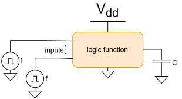
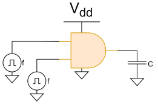
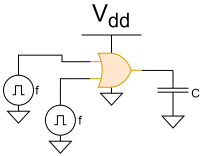
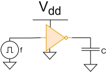
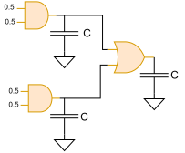
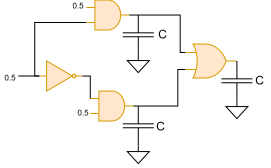
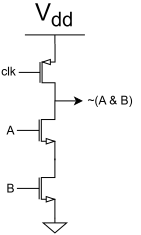
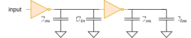
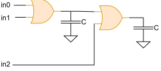

# Power activity

### Введение

Просматривая задачи прошлых с международной олимпиады по
микроэлектронике я с удивлением обнаружил, что не могу сходу решить один
класс задач, который относится к "задачам на активность" (если мы задали
вероятность переключения входов, найти вероятность переключения всех
ячеек).

Данную задачу решает, например, Cadence Voltus в статическом анализе по
мощности, когда мы задаем ему активность входов (в его случае это число
переключений за такт clk) и он рассчитывает активность переключения
каждой ячейки.

В нашем случае мы будем рассматривать комбинационные схемы, поэтому
активностью назовем вероятность переключения выхода из 0 в 1 (что с
точностью до константы примерно тоже самое, что и делает Voltus).

### Как считается switching power

Вначале вспомним формулу для мощности, выделяемой при зарядке/разрядке
конденсатора за период clk в предположении, что выход переключается из 0
в 1 все время:

$$Power_{ideal - switch} = \frac{d}{dt}(Vdd \cdot Q) = \frac{d}{dt}\left( C \cdot Vdd^{2} \right) \approx \frac{C \cdot Vdd^{2}}{T_{clk}} = C \cdot U^{2} \cdot f_{clk}$$

Если же у нас выход схемы переключаются из 0 в 1 с вероятностью
$\alpha_{out}$, то мы просто домножаем полученную формулу на вероятность
переключения из 0 в 1:

$$Power_{real - switch} = \alpha_{out} \cdot Power_{ideal - switch} = P_{0 \rightarrow 1} \cdot C \cdot U^{2} \cdot f$$

То есть, мы свели задачу к нахождению switching power к задаче
нахождения активности элемента (вероятности его переключения из 0 в 1).

### Активность элементарных ячеек.

Найдем активность элементарных ячеек в предположении, что каждый из их
входов с вероятностью 0.5 может быть как 0, так и 1 (так называемое предположение белого шума на входах).

Концептуально, в предположении независимости входов друг от друга мы
будем находить вероятность того, что выход равен 1 ($P_{1}$), затем
вероятность того, что выход равен 0 ($P_{0}$).

Вероятность 0 на выходе мы найдем с помощью таблицы для "белого шума" на входах истинности как:

$$P_0 = \frac{N_0}{N_0+N_1}$$

Вероятность 1 на выходе мы найдем с помощью таблицы истинности для "белого шума" на входах как:

$$P_1 = \frac{N_1}{N_0+N_1}$$

Где $N_0$ - число нулей в таблице истинности, $N_1$ - число единиц в таблице истинности.

Считая, что выход схемы на следующем переключении не зависит от текущего
выхода схемы (что сразу нас ограничивает комбинационными схемами)
применим формулу для вероятности независимых событий:

$$P_{0 \rightarrow 1 - GATE} = P_{0 - GATE} \cdot P_{1 - GATE}$$

Рассмотрим теперь применение данного концептуального подхода на
практике:

**AND (2-И)**

Найдем вероятности $P_0$ и $P_1$ для элемента AND в предположении равновероятных 0 и 1 на входах с помощью таблицы истинности:

| A | B | out = A & B |
|:---:|:---:|:---:|
| 0 | 0 | 0 |
| 0 | 1 | 0 |
| 1 | 0 | 0 |
| 1 | 1 | 1 |

Применив формулу для нахождения $P_0$ при белом шуме на входах (равновероятные 0 и 1) на входах получим:

$$P_0 = \frac{N_0}{N_0+N_1} = \frac{3}{3+1} = \frac{3}{4}$$

Применив формулу для нахождения $P_1$ при белом шуме на входах (равновероятные 0 и 1) на входах получим:

$$P_1 = \frac{N_1}{N_0+N_1} = \frac{1}{3+1} = \frac{1}{4}$$

Однако, рассмотрим также и общий подход, который верен всегда. Выход элемента AND равен 1 тогда, когда его оба входа равны 1, то есть:

$$P_{1 - AND} = P_{A = 1} \cdot P_{B = 1} = \frac{1}{2} \cdot \frac{1}{2} = \frac{1}{4}$$

В остальных же случаях выход AND равен 0, то есть:

$$P_{0 - AND} = 1 - P_{1-AND} = 1 - \frac{1}{4} = \frac{3}{4}$$

Как читатель видит, числа получились одинаковыми. Вероятность переключения равна вероятности того, что вход был равен 0, а затем стал равен 1, то есть:

$$P_{0 \rightarrow 1 - AND} = P_{0 - AND} \cdot P_{1 - AND} = \frac{1}{4} \cdot \frac{3}{4} = \frac{3}{16}$$

Таким образом, мощность, затраченная от источника питания на зарядку емкости равна:

$$Power= \frac{3}{16} \cdot C \cdot Vdd^{2} \cdot f_{clk}$$

**OR (2-ИЛИ)**

Найдем вероятности $P_0$ и $P_1$ для элемента OR в предположении равновероятных 0 и 1 на входах с помощью таблицы истинности:

| A | B | out = A \| B |
|:---:|:---:|:---:|
| 0 | 0 | 0 |
| 0 | 1 | 1 |
| 1 | 0 | 1 |
| 1 | 1 | 1 |

Применив формулу для нахождения $P_1$ при белом шуме на входах (равновероятные 0 и 1) на входах получим:

$$P_1 = \frac{N_1}{N_0+N_1} = \frac{3}{3+1} = \frac{3}{4}$$

Применив формулу для нахождения $P_0$ при белом шуме на входах (равновероятные 0 и 1) на входах получим:

$$P_0 = \frac{N_0}{N_0+N_1} = \frac{1}{3+1} = \frac{1}{4}$$

Однако, рассмотрим также и общий подход, который верен всегда. Выход элемента OR равен 0 тогда, когда его оба входа равны 0, то есть:

$$P_{0 - OR} = P_{A = 0} \cdot P_{B = 0} = \frac{1}{2} \cdot \frac{1}{2} = \frac{1}{4}$$

В остальных же случаях выход OR равен 1, то есть:

$$P_{1 - OR} = 1 - P_{0 - OR} = 1 - \frac{1}{4} = \frac{3}{4}$$

Вероятность переключения равна вероятности того, что вход был равен 0, а
затем стал равен 1, то есть:

$$P_{0 \rightarrow 1 - OR} = P_{0 - OR} \cdot P_{1 - OR} = \frac{1}{4} \cdot \frac{3}{4} = \frac{3}{16}$$

Таким образом, мощность, затраченная от источника питания на зарядку емкости равна:

$$Power= \frac{3}{16} \cdot C \cdot Vdd^{2} \cdot f_{clk}$$

**INV**

| A | out = ~A |
|:---:|:---:|
| 0 | 1 | 
| 1 | 0 | 

Для инвертора довольно очевидно, что его выход равен 0 с той же
вероятностью, с которой его вход равен 1:

$$P_{0 - INV} = P_{A = 1} = \frac{1}{2}$$

Аналогично можно сказать и про вероятность того, что его выход равен 1:

$$P_{1 - INV} = P_{A = 0} = \frac{1}{2}$$

Тогда, вероятность переключения инвертора из 0 в 1 равна:

$$P_{0 \rightarrow 1 - INV} = P_{0 - INV} \cdot P_{1 - INV} = \frac{1}{2} \cdot \frac{1}{2} = \frac{1}{4}$$

После того, как мы рассмотрели активность ячеек (в качестве самого
простого примера того, как данная активность получается) рассмотрим
задачи на нахождение switching power, заодно поняв границы применимости
тех чисел, которые мы получили ранее.

### Задачи с олимпиады по микроэлектронике

**Задача 1.**

**(ENG, 1b92)**  For a cell, described by Z = A&B + C&D function, calculate the switching probability, consuming energy in the output node if the input signals are independent and identically distributed (**ORIGINAL**). Also find a total switching power (**KEK**).

**(RU, 1b92)** Для ячейки, описываемой функцией Z = A&B + C&D, рассчитайте вероятность переключения и потребляемую энергию на выходном узле, если входные сигналы независимы и одинаково распределены (**ORIGINAL**). Также, найдите полную мощность переключений (**KEK**).

Коэффициент 0.5 на рисунке обозначает то, что с данной вероятностью вход может быть как равен 0, так и 1.

**Решение**

Для равновероятных входов мы легко можем найти активности элементов И:

$$P_{0 \rightarrow 1-AB}=P_{0 \rightarrow 1-CD}=P_{AND=1} \cdot P_{AND=0}=\frac{1}{4} \cdot \frac{3}{4} = \frac{3}{16} = 0.1875$$

Найдем теперь вероятность переключения элемента ИЛИ (готовое число с примера мы брать не можем, тк там другие вероятности на входах были).

Для этого мы можем легко вычислить вероятность того, что выход элемента ИЛИ равен 0:

$$P_{OR=0} = P_{AND_{AB}=0} \cdot  P_{AND_{CD}=0} = \frac{3}{4} \cdot \frac{3}{4} = \frac{9}{16}$$

Далее мы просто вычитаем из 1 эту вероятность и получаем вероятность того, что выход равен 1;

$$P_{OR=1} = 1 - P_{OR=0} = 1 - \frac{9}{16} = \frac{7}{16}$$

Тогда, активность переключения элемента ИЛИ мы найдем как:

$$P_{0 \rightarrow 1-OR} = P_{OR=0} \cdot P_{OR=1} = \frac{9}{16} \cdot \frac{7}{16} = \frac{63}{256} \approx 0.246$$

На выходном узле потребляемая мощность равна:

$$Power_{out}=C \cdot Vdd^{2} \cdot f_{clk} \cdot P_{0 \rightarrow 1-OR} = 0.246 \cdot C \cdot Vdd^{2} \cdot f_{clk}$$

Суммарную switching power мы найдем как:

$$Power_{switch-total} =  C \cdot Vdd^{2} \cdot f_{clk} \cdot (P_{0 \rightarrow 1-AB}+P_{0 \rightarrow 1-CD}+P_{0 \rightarrow 1-OR})$$

Подставив значения активностей, получим:

$$Power_{switch-total} =  C \cdot Vdd^{2} \cdot f_{clk} \cdot (0.1875+0.1875+0.246) =0.621 \cdot  C \cdot Vdd^{2} \cdot f_{clk}$$

**Задача 2**

**(ENG, 1b93)** Compute the power consumption of the presented multiplexor, considering that C = 0.3 pF, VDD = 2.5 V, F = 100 MHz, inputs are independent and identically distributed. Compute (a) for static CMOS implementation and (b) dynamic CMOS implementation.

**(RU, 1b93)** Рассчитайте потребляемую мощность представленного мультиплексора, учитывая, что C = 0,3 пФ, VDD = 2,5 В, F = 100 МГц, входные сигналы независимы и одинаково распределены. Выполните расчёт (a) для статической КМОП-реализации и (b) для динамической КМОП-реализации.

Коэффициент 0.5 на рисунке обозначает то, что с данной вероятностью вход может быть как равен 0, так и 1.

**Решение**

Найдем активность каждого элемента. Для начала скажем, что после инвертора у нас вероятность того, что его выход равен 1 или вероятность того, что его выход равен 0 не меняется (и раз он не нагружен на емкость, то его можно эффективно "выкинуть".

Таким образом, мы получили эквивалентную схему для анализа по мощности, как в задаче 1b92.

В  задаче 1b92 мы получили, что для статического анализа по мощности (static CMOS) у нас формула для switching power данной схемы равна:

$$Power_{switch-total} =  0.621 \cdot  C \cdot Vdd^{2} \cdot f_{clk} = 0.621 \cdot 300 \cdot 10^{-15} \cdot 2.5 \cdot 2.5 \cdot 10^8 \approx 116 мкВт $$

Рассмотрим теперь, что авторы задачи скрыли от нас под названием dynamic CMOS. Данное название анализа применяется для так называемой domino logic (логики, .которая выполняет предзаряд всех выходов до 1 во время precharge, а в фазе оценки (evaluation) выход может разрядиться до 0 в соответствии с логической функцией).

Ниже, для большего понимания, представления концептуальная схема элемента NAND идеологии domino logic для posedge clk. При clk = 0 идет precharge (выход равен 1), при clk=1 необходимые выходы опустятся в 0.

Данная логика, из-за уменьшения числа транзисторов является довольно скоростной и применяется в критических блоках современных CPU/GPU того же Intel, хотя, как мы увидим, ее мощностные характеристики в разы хуже, чем у обычного CMOS.

Из-за того, что у нас по другому происходит работа (зарядка емкостей до VDD до clk и разрядка после clk), то у нас в роли активности станет выступать вероятность того, что у нас выход функции равен 0, потому как именно этот 0 и придется перезаряжать с помощью precharge.

Вероятность того, что выходы двух элемента AND (слева) равны нулю составляет 0.75 (только при входной комбинации 11 выход AND равен 1). Вероятность того, что выход элемента OR равен 0 мы найдем с помощью того, что выход данного элемента равен 0, когда оба его входа равны 0, то есть:

$$P_{OR=0}=0.75 \cdot 0.75 = 0.5625$$

Тогда, суммарная dynamic CMOS switching power равна:

$$Power_{switch-total-dynamic} =  (0.75 + 0.75 + 0.5625) \cdot  C \cdot Vdd^{2} \cdot f_{clk} \approx 2.06 \cdot  C \cdot Vdd^{2} \cdot f_{clk} = 2.06\cdot 300 \cdot 10^{-15} \cdot 2.5 \cdot 2.5 \cdot 10^8 \approx 386 мкВт $$

То есть, хотя domino logic и хорошо оптимизирует нам площадь, но вот большее потребление, чем в обычном CMOS 3,3 раза и является той самой причиной, по которой данный тип комбинационных ячеек применяют только в критических по скорости местах.

**Задача 3**

**(ENG, 1b60)** Determine the power dissipation in the circuit, if VDD = 1 V, the input frequency is 800 MHz, input and output capacitances of inverters are $C_{in}$ = 15 fF, $C_{out}$ = 10 fF, the load capacitance is $C_{load}$ = 100 fF.

**(RU, 1b60)**  Определите рассеиваемую мощность в цепи, если VDD = 1 В, частота входного сигнала равна 800 МГц, входная и выходная ёмкости инверторов равны $C_{in}$ = 15 фФ, $C_{out}$ = 10 фФ, нагрузочная ёмкость равна C_{load} = 100 фФ.

**Решение**

Для инвертора довольно очевидно, что его выход равен 0 с той же
вероятностью, с которой его вход равен 1:

$$P_{0 - INV} = P_{A = 1} = \frac{1}{2}$$

Аналогично можно сказать и про вероятность того, что его выход равен 1:

$$P_{1 - INV} = P_{A = 0} = \frac{1}{2}$$

Тогда, вероятность переключения инвертора из 0 в 1 равна:

$$P_{0 \rightarrow 1 - INV} = P_{0 - INV} \cdot P_{1 - INV} = \frac{1}{2} \cdot \frac{1}{2} = \frac{1}{4}$$

Из-за того, что у нас инвертора не меняет активность сигнала, то активность второго инвертора равна активности первого инвертора и также составляет 0,25.

$$Power = ((C_{out} + C_{in}) + (C_{out} + C_{load})) \cdot 0.25 \cdot Vdd^{2} \cdot f = 8 \cdot 10^8 \cdot 0.25 \cdot 1 \cdot 135 \cdot 10^{-15} = 27 мкВт$$

**Задача 4**
 
 **(ENG, 1b58)** Derive the truth table, state transition graph, and output transition probabilities for a three-input XOR gate with independent,  
a) Identically distributed, uniform white-noise inputs.  
b) $P(A=1)=0.2, \ P(B=1)=0.4, \ P(C=1)=0.6$

 **(RU, 1b58)** Выведите таблицу истинности, граф переходов состояний и вероятности переходов на выходе для трёхвходового элемента XOR с независимыми входами:  
a) одинаково распределёнными, равномерными белыми шумами;  
b) $P(A=1) = 0.2, \ P(B=1) = 0.4, \ P(C=1) = 0.6$

**Решение**

Для нахождения вероятности того, когда трехвходовой XOR равен 1 построим таблицу истинности:

| A | B | C | A ⊕ B ⊕ C |
|:---:|:---:|:---:|:---:|
| 0 | 0 | 0 | 0 |
| 0 | 0 | 1 | 1 |
| 0 | 1 | 0 | 1 |
| 0 | 1 | 1 | 0 |
| 1 | 0 | 0 | 1 |
| 1 | 0 | 1 | 0 |
| 1 | 1 | 0 | 0 |
| 1 | 1 | 1 | 1 |

Если входы A, B, C  - независимые, то:

$$P(XOR=1) =P(A=0) \cdot P(B=0) \cdot P(C=1) + P(A=0) \cdot P(B=1) \cdot P(C=0) + P(A=1) \cdot P(B=0) \cdot P(C=0) + P(A=1) \cdot P(B=1) \cdot P(C=1)$$

В случае, когда у нас "белый шум" на входах (то есть, все вероятности равны 0.5) мы получаем:

$$P(XOR=1)=4 \cdot P_{white}^3 = 4 \cdot 0.5^3 = 0.5$$

Тогда, вероятность перехода из 0 в 1 будет равна:

$$P_{0 \rightarrow 1 - XOR} = P(XOR=1) \cdot P(XOR=0) = 0.5 \cdot 0.5 = 0.25$$

В случае (б), когда у нас  $P(A=1) = 0.2 \, P(B=1) = 0.4, \ P(C=1) = 0.6$ получим:

$$P(XOR=1) =0.8 \cdot 0.6 \cdot 0.6 + 0.8 \cdot 0.4 \cdot 0.4 + 0.2 \cdot 0.6 \cdot 0.4 + 0.2 \cdot 0.4 \cdot 0.6 = 0.512$$

Тогда, вероятность перехода из 0 в 1 будет равна:

$$P_{0 \rightarrow 1 - XOR} = P(XOR=1) \cdot P(XOR=0) = 0.512 \cdot 0.488 = 0.249856 \approx 0.25$$

**Задача 5**

 **(ENG, 1b57)** Consider the implementation of a 3-input OR gate shown in the figure below. Assume there are 3 inputs A, B, and C where  
$P(A=1) = 0.5, \ P(B=1) = 0.2,  \ P(C=1) = 0.1$. For a static CMOS implementation of this circuit:

a) What is the best order to place these inputs to minimize power consumption?  
b) What is the worst order?  
c) What is the activity factor at the internal node (X) in these cases?

 **(RU, 1b57)** Рассмотрите реализацию трёхвходового элемента ИЛИ, показанную на рисунке ниже. Предположим, что есть 3 входа A, B и C, где  
$P(A=1) = 0.5, \ P(B=1) = 0.2, \ P(C=1) = 0.1$. Для статической КМОП-реализации этой схемы:

a) Какой порядок подачи входов является наилучшим для минимизации потребляемой мощности?  
b) Какой порядок является наихудшим?  
c) Чему равен коэффициент активности во внутреннем узле (X) в этих случаях?

**Решение**

Заметим, что переставляя между собой входы мы никак не меняем активность выхода "правого" OR. То есть, по сути нам надо оптимизировать мощность "левого" OR. Хотя мы можем посчитать мощность переключений "втупую" и найти максимум и минимум, рассмотрим более "умный" способ нахождения.

Если у нас $P_0$ - вероятность того, что у нас выход "левого" OR равен 0, то вероятность переключения равна:

$$P_{0 \rightarrow 1} = P_0 \cdot (1-P_0)$$

То есть, по сути вероятность переключения представляет собой параболу с максимальной активностью переключений в $P_0=0.5$, и чем дальше у нас расстояние от $P_0$ до 0.5, тем меньше у нас switching power.

Найдем тогда вероятности $P_0$ при различных входах:

Если in0=A, in1=B

$$P_{0-AB}=P_{0-A} \cdot P_{0-B} = 0.5 \cdot 0.8 = 0.4$$

Если in0=C, in1=B

$$P_{0-CB}=P_{0-C} \cdot P_{0-B} = 0.9 \cdot 0.8 = 0.72$$

Если in0=A, in1=C

$$P_{0-AC}=P_{0-A} \cdot P_{0-C} = 0.5 \cdot 0.9 = 0.45$$

Как читатель видит, "дальше всех" от 0.5 (то есть, имеет наименьшую switching power) мы будем, если на входы in0 и in1 подадим B и C.

Активность переключений в этом случая равна:

$$P_{0 \rightarrow 1 - MIN} = P_{0-CB} \cdot (1-P_{0-CB}) = 0.72 \cdot 0.28 \approx 0.202$$

Также, как читатель видит, "ближе всех" от 0.5 (то есть, имеет наибольшую switching power) мы будем, если на входы in0 и in1 подадим A и C.

Активность переключений в этом случая равна:

$$P_{0 \rightarrow 1 - MAX} = P_{0-AC} \cdot (1-P_{0-AC}) = 0.45 \cdot 0.55 \approx 0.248$$

### Заключение

С помощью описанного выше алгоритма (только в несколько более усложненной форме) инструмент для анализа по мощности (например, Cadence Voltus) проводит как "распространение активности" в статическом анализе по мощности (задаем активности на входах блока и выходах DFF, получаем активности у каждой ячейки), так и расчет мощности, затрачиваемой на перезарядку емкостей по формуле, рассмотренной выше.

На основе карты активностей и моделей токов потребления ячеек инструмент также выполняет расчёт IR-drop (падения напряжения на линиях питания/земли) в статическом анализе мощности

Разумеется, существует и более приближенный к "реальным результатам" способ, когда верификаторы передают временную диаграмму работы блока (VCD-файл), из которой обычно выделяют один или несколько репрезентативных интервалов (например, с наибольшей средней активностью или пиковым потреблением). Затем инструмент вычисляет вероятности переключения из 0 в 1 непосредственно по данным этой диаграммы, минуя этап распространения активности через комбинационную логику.

Однако, динамический анализ обычно получается сделать практически в конце сроков сдачи проектов из-за длительной отладки чипа, поэтому первое время при построении сетки питания обходиться придется только статическим анализом по мощности.

