# Издеваемся над компилятором для RISC-V

В статье по прощивке нашего risc-v команды писались побитово, чтобы
видеть, что происходит на уровне микроархитектуры. В реальных системах,
будь это компьютеры или микроконтроллеры, так никто не делает, пишут на
языках высокого уровня или хотя бы ассемблере. За перевод в бинарный
формат отвечает компилятор. Его работу в этой статье и рассмотрим.

Сначала нужно сообщить компилятору, что у нас за система. В качестве
примера возьмём сначала пример из \[гитхабМПСУ\]. Процессор из
лабораторных работ отличается от нашего наличием регистров контроля
статуса и обработчика прерываний. Название такого набора команд --
rv32i_zicsr. I -- это обязательные команды; zicsr -- как раз расширение,
добавляющее работу с упомянутым железом. В нашем случае набор инструкций
будет просто rv32i. А уже после игр с готовыми файлами мы, конечно,
напишем свои.

Компиляторы для risc-v в большинстве работают на базе linux, однако
часть доступна на windows. Использовать будем компилятор, рекомендуемый
в лабораторной из того же курса АПС. Ссылка для установки (около 0,5
ГБ):

<https://github.com/xpack-dev-tools/riscv-none-elf-gcc-xpack/releases/download/v13.2.0-1/xpack-riscv-none-elf-gcc-13.2.0-1-win32-x64.zip>

**Учимся компилировать на ассемблер**

Графического интерфейса нет, запускаем командную строку. Пусть мы хотим
перемножать -3 и 15. Программа:

```cpp

int main() {
  int a = -15;
  int b = 3;
  int c = a*b;
  return 0;
}
```

Команда:

```bash

anthon@logik MINGW64 /c/riscv_compilation/TEST

\$ /c/riscv_cc/bin/riscv-none-elf-g++ -march=rv32i_zicsr -mabi=ilp32 main.cpp -o main.s
```

Результат -- нечитаемая бяка, visual studio вовсе отказывается открывать
файл.

Команда:

```bash

\$ /c/riscv_cc/bin/riscv-none-elf-g++ -S -march=rv32i_zicsr -mabi=ilp32 main.cpp -o main.s
```

Обратите внимание: добавилась опция "-S". Результат вполне читаем:

```asm
	.file	"main.cpp"
	.option nopic
	.attribute arch, "rv32i2p1_zicsr2p0"
	.attribute unaligned_access, 0
	.attribute stack_align, 16
	.text
	.globl	__mulsi3
	.align	2
	.globl	main
	.type	main, @function
main:
.LFB0:
	.cfi_startproc
	addi	sp,sp,-32
	.cfi_def_cfa_offset 32
	sw	ra,28(sp)
	sw	s0,24(sp)
	.cfi_offset 1, -4
	.cfi_offset 8, -8
	addi	s0,sp,32
	.cfi_def_cfa 8, 0
	li	a5,-15
	sw	a5,-20(s0)
	li	a5,3
	sw	a5,-24(s0)
	lw	a1,-24(s0)
	lw	a0,-20(s0)
	call	__mulsi3
	mv	a5,a0
	sw	a5,-28(s0)
	li	a5,0
	mv	a0,a5
	lw	ra,28(sp)
	.cfi_restore 1
	lw	s0,24(sp)
	.cfi_restore 8
	.cfi_def_cfa 2, 32
	addi	sp,sp,32
	.cfi_def_cfa_offset 0
	jr	ra
	.cfi_endproc
.LFE0:
	.size	main, .-main
	.ident	"GCC: (xPack GNU RISC-V Embedded GCC x86_64) 13.2.0"
```


Сделаем вывод о том, что S говорит компилятору сделать ассемблер для
чтения. С тем, что было создано раньше, разберёмся позже.

**Оптимизация**

Для оптимизации в компиляторе есть специальные настройки. Можно
передавать следующие флаги: -O0, -O1, -O2, -O3, -Os (по размеру), -Og
(для отладки).

Команда без оптимизации:

```bash

\$ /c/riscv_cc/bin/riscv-none-elf-g++ -S -O0 -march=rv32i_zicsr -mabi=ilp32 main.cpp -o main.s
```

Результат:
```asm
	.file	"main.cpp"
	.option nopic
	.attribute arch, "rv32i2p1_zicsr2p0"
	.attribute unaligned_access, 0
	.attribute stack_align, 16
	.text
	.globl	__mulsi3
	.align	2
	.globl	main
	.type	main, @function
main:
.LFB0:
	.cfi_startproc
	addi	sp,sp,-32
	.cfi_def_cfa_offset 32
	sw	ra,28(sp)
	sw	s0,24(sp)
	.cfi_offset 1, -4
	.cfi_offset 8, -8
	addi	s0,sp,32
	.cfi_def_cfa 8, 0
	li	a5,-15
	sw	a5,-20(s0)
	li	a5,3
	sw	a5,-24(s0)
	lw	a1,-24(s0)
	lw	a0,-20(s0)
	call	__mulsi3
	mv	a5,a0
	sw	a5,-28(s0)
	li	a5,0
	mv	a0,a5
	lw	ra,28(sp)
	.cfi_restore 1
	lw	s0,24(sp)
	.cfi_restore 8
	.cfi_def_cfa 2, 32
	addi	sp,sp,32
	.cfi_def_cfa_offset 0
	jr	ra
	.cfi_endproc
.LFE0:
	.size	main, .-main
	.ident	"GCC: (xPack GNU RISC-V Embedded GCC x86_64) 13.2.0"
```


Команда с оптимизацией уровня 1:
```bash
\$ /c/riscv_cc/bin/riscv-none-elf-g++ -S -O1 -march=rv32i_zicsr -mabi=ilp32 main.cpp -o main.s
```

Результат:
```asm
	.file	"main.cpp"
	.option nopic
	.attribute arch, "rv32i2p1_zicsr2p0"
	.attribute unaligned_access, 0
	.attribute stack_align, 16
	.text
	.align	2
	.globl	main
	.type	main, @function
main:
.LFB0:
	.cfi_startproc
	li	a0,0
	ret
	.cfi_endproc
.LFE0:
	.size	main, .-main
	.ident	"GCC: (xPack GNU RISC-V Embedded GCC x86_64) 13.2.0"
```

Команда для оптимизации уровня 2:
```bash
\$ /c/riscv_cc/bin/riscv-none-elf-g++ -S -O2 -march=rv32i_zicsr -mabi=ilp32 main.cpp -o main.s
```

Результат:
```asm
Результат:
	.file	"main.cpp"
	.option nopic
	.attribute arch, "rv32i2p1_zicsr2p0"
	.attribute unaligned_access, 0
	.attribute stack_align, 16
	.text
	.section	.text.startup,"ax",@progbits
	.align	2
	.globl	main
	.type	main, @function
main:
.LFB0:
	.cfi_startproc
	li	a0,0
	ret
	.cfi_endproc
.LFE0:
	.size	main, .-main
	.ident	"GCC: (xPack GNU RISC-V Embedded GCC x86_64) 13.2.0"
```

Как видим, оптимизация неиспользуемый результат умножения устраняет
сразу же, т.к. функция возвращает 0. Однако, без оптимизации внешняя
функция умножения всё же вызывается.

Засунем результат в вывод функции.

```cpp
int main() {
	int a = -15;
	int b = 3;
	return a*b;
}
```


Команда та же, что раньше, без оптимизаций. Результат:
```asm
		.file	"main.cpp"
	.option nopic
	.attribute arch, "rv32i2p1_zicsr2p0"
	.attribute unaligned_access, 0
	.attribute stack_align, 16
	.text
	.globl	__mulsi3
	.align	2
	.globl	main
	.type	main, @function
main:
.LFB0:
	.cfi_startproc
	addi	sp,sp,-32
	.cfi_def_cfa_offset 32
	sw	ra,28(sp)
	sw	s0,24(sp)
	.cfi_offset 1, -4
	.cfi_offset 8, -8
	addi	s0,sp,32
	.cfi_def_cfa 8, 0
	li	a5,-15
	sw	a5,-20(s0)
	li	a5,3
	sw	a5,-24(s0)
	lw	a1,-24(s0)
	lw	a0,-20(s0)
	call	__mulsi3
	mv	a5,a0
	mv	a0,a5
	lw	ra,28(sp)
	.cfi_restore 1
	lw	s0,24(sp)
	.cfi_restore 8
	.cfi_def_cfa 2, 32
	addi	sp,sp,32
	.cfi_def_cfa_offset 0
	jr	ra
	.cfi_endproc
.LFE0:
	.size	main, .-main
	.ident	"GCC: (xPack GNU RISC-V Embedded GCC x86_64) 13.2.0"
```

В целом, то же самое. Вводим оптимизацию (1):
```asm
	.file	"main.cpp"
	.option nopic
	.attribute arch, "rv32i2p1_zicsr2p0"
	.attribute unaligned_access, 0
	.attribute stack_align, 16
	.text
	.align	2
	.globl	main
	.type	main, @function
main:
.LFB0:
	.cfi_startproc
	li	a0,-45
	ret
	.cfi_endproc
.LFE0:
	.size	main, .-main
	.ident	"GCC: (xPack GNU RISC-V Embedded GCC x86_64) 13.2.0"
 ```

Считает a*b не совсем функция, а скорее компилятор. Ну что ж, мы просили для конкретных чисел, попробуем для входных значений a и b.

```cpp
int mul(int a, int b) {
  return a * b;
}

int main() {
	int a = -15;
	int b = 3;
	mul(a, b);
}


Результат:

.file \"main.cpp\"

.option nopic

.attribute arch, \"rv32i2p1_zicsr2p0\"

.attribute unaligned_access, 0

.attribute stack_align, 16

.text

.globl \_\_mulsi3

.align 2

.globl \_Z3mulii

.type \_Z3mulii, \@function

\_Z3mulii:

.LFB0:

.cfi_startproc

addi sp,sp,-32

.cfi_def_cfa_offset 32

sw ra,28(sp)

sw s0,24(sp)

.cfi_offset 1, -4

.cfi_offset 8, -8

addi s0,sp,32

.cfi_def_cfa 8, 0

sw a0,-20(s0)

sw a1,-24(s0)

lw a1,-24(s0)

lw a0,-20(s0)

call \_\_mulsi3

mv a5,a0

mv a0,a5

lw ra,28(sp)

.cfi_restore 1

lw s0,24(sp)

.cfi_restore 8

.cfi_def_cfa 2, 32

addi sp,sp,32

.cfi_def_cfa_offset 0

jr ra

.cfi_endproc

.LFE0:

.size \_Z3mulii, .-\_Z3mulii

.align 2

.globl main

.type main, \@function

main:

.LFB1:

.cfi_startproc

addi sp,sp,-32

.cfi_def_cfa_offset 32

sw ra,28(sp)

sw s0,24(sp)

.cfi_offset 1, -4

.cfi_offset 8, -8

addi s0,sp,32

.cfi_def_cfa 8, 0

li a5,-15

sw a5,-20(s0)

li a5,3

sw a5,-24(s0)

lw a1,-24(s0)

lw a0,-20(s0)

call \_Z3mulii

li a5,0

mv a0,a5

lw ra,28(sp)

.cfi_restore 1

lw s0,24(sp)

.cfi_restore 8

.cfi_def_cfa 2, 32

addi sp,sp,32

.cfi_def_cfa_offset 0

jr ra

.cfi_endproc

.LFE1:

.size main, .-main

.ident \"GCC: (xPack GNU RISC-V Embedded GCC x86_64) 13.2.0\"

Оптимизация --O1:

.file \"main.cpp\"

.option nopic

.attribute arch, \"rv32i2p1_zicsr2p0\"

.attribute unaligned_access, 0

.attribute stack_align, 16

.text

.globl \_\_mulsi3

.align 2

.globl \_Z3mulii

.type \_Z3mulii, \@function

\_Z3mulii:

.LFB0:

.cfi_startproc

addi sp,sp,-16

.cfi_def_cfa_offset 16

sw ra,12(sp)

.cfi_offset 1, -4

call \_\_mulsi3

lw ra,12(sp)

.cfi_restore 1

addi sp,sp,16

.cfi_def_cfa_offset 0

jr ra

.cfi_endproc

.LFE0:

.size \_Z3mulii, .-\_Z3mulii

.align 2

.globl main

.type main, \@function

main:

.LFB1:

.cfi_startproc

li a0,0

ret

.cfi_endproc

.LFE1:

.size main, .-main

.ident \"GCC: (xPack GNU RISC-V Embedded GCC x86_64) 13.2.0\"

Большой бесполезный мусор. Обе функции скомпилированы, но умножение не
вызывается, т.к. main никуда данные не передаёт. Для лучшей читаемости
оставим лишь функцию умножения (скомпилируем отдельно, так можно и в
реальном проекте) без main:

\`\`\`cpp

int mul(int a, int b) {

return a \* b;

}

/\*

int main() {

int a = -15;

int b = 3;

mul(a, b);

}\*/

\`\`\`

Результат:

.file \"main.cpp\"

.option nopic

.attribute arch, \"rv32i2p1_zicsr2p0\"

.attribute unaligned_access, 0

.attribute stack_align, 16

.text

.globl \_\_mulsi3

.align 2

.globl \_Z3mulii

.type \_Z3mulii, \@function

\_Z3mulii:

.LFB0:

.cfi_startproc

addi sp,sp,-32

.cfi_def_cfa_offset 32

sw ra,28(sp)

sw s0,24(sp)

.cfi_offset 1, -4

.cfi_offset 8, -8

addi s0,sp,32

.cfi_def_cfa 8, 0

sw a0,-20(s0)

sw a1,-24(s0)

lw a1,-24(s0)

lw a0,-20(s0)

call \_\_mulsi3

mv a5,a0

mv a0,a5

lw ra,28(sp)

.cfi_restore 1

lw s0,24(sp)

.cfi_restore 8

.cfi_def_cfa 2, 32

addi sp,sp,32

.cfi_def_cfa_offset 0

jr ra

.cfi_endproc

.LFE0:

.size \_Z3mulii, .-\_Z3mulii

.ident \"GCC: (xPack GNU RISC-V Embedded GCC x86_64) 13.2.0\"

Оптимизация --O1:

.file \"main.cpp\"

.option nopic

.attribute arch, \"rv32i2p1_zicsr2p0\"

.attribute unaligned_access, 0

.attribute stack_align, 16

.text

.globl \_\_mulsi3

.align 2

.globl \_Z3mulii

.type \_Z3mulii, \@function

\_Z3mulii:

.LFB0:

.cfi_startproc

addi sp,sp,-16

.cfi_def_cfa_offset 16

sw ra,12(sp)

.cfi_offset 1, -4

call \_\_mulsi3

lw ra,12(sp)

.cfi_restore 1

addi sp,sp,16

.cfi_def_cfa_offset 0

jr ra

.cfi_endproc

.LFE0:

.size \_Z3mulii, .-\_Z3mulii

.ident \"GCC: (xPack GNU RISC-V Embedded GCC x86_64) 13.2.0\"

Пробуем --O2, результат тот же.

**Компиляция для прошивки**

Чтобы запустить что-то на процессоре, нужно перенести это в бинарный
формат.

Сначала нужно создать ЭЛЬФА. Файлы с расширением .elf -- это тоже
бинарные файлы, но напрямую их не открыть, команды видны не будут. Смысл
его становится яснее, если узнать расшифровку -- "executable and
linkable file". Executable -- значит исполняемый, его можно запустить на
компьютере или микроконтроллере. Linkable -- значит то, что в ближайшее
время нам придётся познакомиться с линкерами, и только потом взяться за
прошивку. Эльфа при желании можно конвертировать в bin или hex.

Команда:

\$ /c/riscv_cc/bin/riscv-none-elf-g++ -march=rv32i_zicsr -mabi=ilp32
main.cpp -o main.elf

Результат:

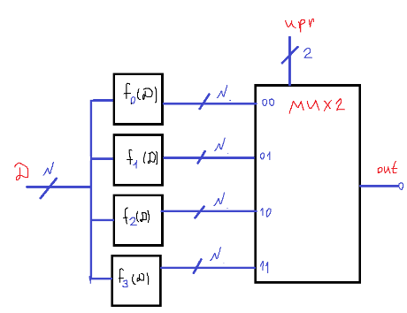{width="6.496527777777778in"
height="5.777746062992126in"}

Полученный результат бесполезен с точки зрения чтения. Чуть лучше
результат в HEX-редакторе (можно анализировать байты):

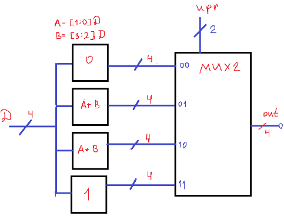{width="3.689607392825897in"
height="5.525709755030621in"}

Однако, в компиляторе есть специальная утилита readelf, которая
позволяет смотреть, что в нём написано (за исключением ассемблера).

Опции (подсказки, на мой взгляд, достаточно информативны, чтобы их
содержимое не переписывать):

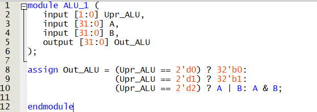{width="3.22663823272091in"
height="5.403383639545057in"}

Команда:

\`\`\`bash

\$ /c/riscv_cc/bin/riscv-none-elf-readelf -S main.elf

\`\`\`

Результат:

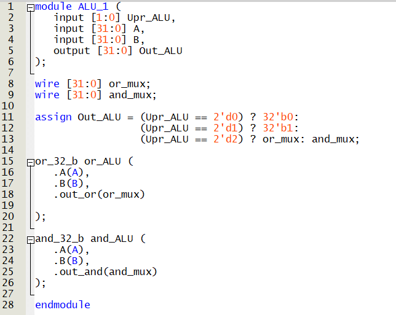{width="6.496527777777778in"
height="6.161945538057743in"}

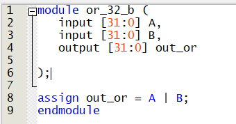{width="3.008552055993001in"
height="3.2656342957130358in"}{width="3.008552055993001in"
height="2.903260061242345in"}

Это общая информация о файле. Ассемблер в нём тоже есть, в этом можно
убедиться использованием objdump.

Справка:

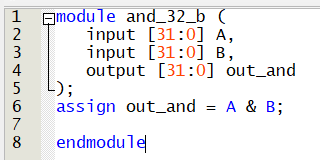{width="3.0012685914260717in"
height="3.1112062554680664in"}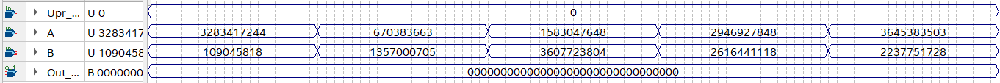{width="3.4630030621172354in"
height="4.584354768153981in"}

Пример команды (лучше перенаправить вывод в файл, т.к. много букв):

\`\`\`bash

\$ /c/riscv_cc/bin/riscv-none-elf-objdump -d main.elf \> main_disasm.s

\`\`\`

Вырезка результата с, содержащая main и функцию умножения:

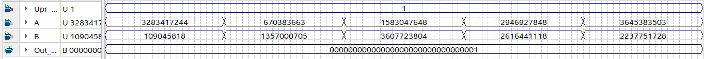{width="4.443112423447069in"
height="3.357435476815398in"}

Можно заметить, что здесь автоматически есть всё, что нужно для работы
программы. Однако, вместо эльфа можно сделать О. О -- объектный файл.
Команда:

\`\`\`bash

\$ /c/riscv_cc/bin/riscv-none-elf-g++ -march=\"rv32i_zicsr\" -c main.cpp
-o objtest.o

\`\`\`

Даже в блокноте результат значительно компактнее, хотя всё равно не
читается. Сделаем, как раньше, дизассемблирование. Команда:

\`\`\`bash

\$ /c/riscv_cc/bin/riscv-none-elf-objdump -d objtest.o \> disobjtest.s

\`\`\`

Результат:

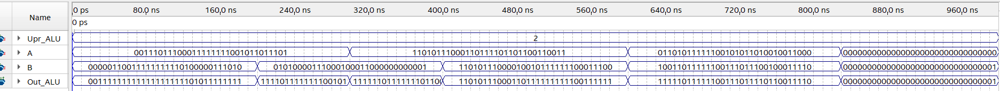{width="3.829267279090114in"
height="3.605893482064742in"}

Видим ассемблер, но какой-то сырой, ссылка на умножение заменена
командой auipc. Также по умолчанию дизассемблируется только секция text,
содержащая только функцию main. Пробуем смотреть существующие секции.
Для этого поднимем флаг --s.

Команда:

\`\`\`bash

\$ /c/riscv_cc/bin/riscv-none-elf-objdump -s objtest.o \> disobjtestp.s

\`\`\`

Результат:

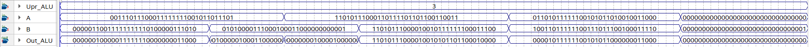{width="4.238932633420823in"
height="2.9813812335958003in"}

Здесь видно общее устройство объектного файла. Это не полноценный
исполняемый файл, но заготовка для него. По сути, в прошлый раз мы
сделали сразу линковку по умолчанию, что некорректно в случае нашего
risc-v процессора, зато довольно занимательно. Обратим внимание, для
создания объектного файла нужно было указать --c. Это работает
аналогично --S для ассемблера, только выполняется простая компиляция,
без линковки.

Эльфа можно переделать в любой нужный формат. Делается это утилитой
objcopy. Она также позволяет редактировать бинарник: двигать секции,
удалять ненужное.

Команда:

\$ /c/riscv_cc/bin/riscv-none-elf-objcopy -O verilog main.elf init.mem

Результат:

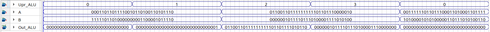{width="4.604166666666667in"
height="4.645833333333333in"}

Здесь -O Verilog говорит о том, что результат будет удобоваримым для
readmem, однако по умолчанию данные записаны побайтово. Исправляется это
той же командой с дополнительной опцией:

\`\`\`bash

\$ /c/riscv_cc/bin/riscv-none-elf-objcopy -O verilog
\--verilog-data-width=4 main.elf meme.AHAHAHAHAH

\`\`\`

Результат представлен в виде байтов, сгруппированных по 4. Но ещё
произошёл разворот всех полученных строк! Дело в том, что в Verilog
принято последний байт считать младшим. По умолчанию архитектура
little-endian, поэтому младший байт идёт в конец строки. Результат
правильный.

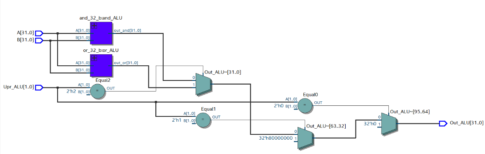{width="3.6458333333333335in" height="5.09375in"}

**Компиляция под конкретный контроллер**

Дело в том, что мало написать конкретный файл на плюсах, чтобы просто
так его скомпилировать. Процессоров с набором команд rv32i много, и у
каждого свой набор памяти, своя организация памяти, а компилятору
приходится работать со всеми. Информация обо всём этом содержится в
отдельном файле, который для своего процессора приходится писать
самостоятельно.

Итак, два файла -- стартер и линкер. Писать стартер, учитывая наличие
компилятора, можно на чём угодно. А вот линкер, как отмечалось,
управляет компоновкой, поэтому пишется на языке высокого уровня.
Компоновка -- перевод объектных файлов в исполняемый. Раньше мы делали
её сразу вместе с компиляцией, но никак не настраивали.

Итак, у нас есть несколько файлов с кодом (return_ab.c и starter.S). Они
написаны на разных языках -- один на си, второй на ассемблере. Цель --
один бинарный файл.

Сначала мы переводим файлы в бинарный формат «в лоб». Это компиляция,
или сборка. На выходе получаются объектные файлы -- те же программы,
только в бинарном формате. Ссылки на функции в них нерабочие, так как
функции ещё не размещены в памяти.

Далее, мы берём объектные файлы (все), берём линкер, и выполняем
линковку -- размещение функций в нужном порядке и установление связей
между ними. На выходе получается исполняемый файл, готовый к запуску.

Сначала **напишем линкер.** Структура его такая:

\`\`\`cpp

OUTPUT_FORMAT(\"elf32-littleriscv\")

ENTRY(\_start) //тут пишем штуку, после которой будет первая исполняемая
команда

MEMORY

{

//тут рассказываем про физическое устройство памяти

}

SECTIONS

{

//тут про расположение секций кода в памяти (по адресам)

}

\`\`\`

Стандартное расширение -- ".ld". Ссылка на документацию (не официальный
сайт, но текст тот же самый, а навигация может быть удобнее):

https://home.cs.colorado.edu/\~main/cs1300/doc/gnu/ld_3.html#IDX338

В начале указан формат little-endian (младший бит в конце). Начало
исполнения программы можно не указывать, т.к. далее мы напишем секцию
стартера первой и по нулевому адресу. Но пока оставим, чтобы не ждать
лишних проблем.

Команда MEMORY описывает расположение и размер блоков памяти. Можно
описывать, какие блоки памяти линкером будут использоваться, а какие --
избегаться. Можно писать только одну команду MEMORY. Формат описания
памяти:

\`\`\`

имя (необязательные сведения о доступе) : ORIGIN = адрес начала, LENGTH
= длина в битах

\`\`\`

Памяти у нас две, их описание будет выглядеть примерно так:

command_meme (rx) : ORIGIN = 0x00000000, LENGTH = 128

data_meme (!rx) : ORIGIN = 0x00000000, LENGTH = 256

X -- значит исполняемая секция, то есть, команды. R -- read only. Память
данных этими свойствами не обладает, поэтому можно написать отрицание
"!".

Теперь заполним раздел SECTIONS. В процессоре память адресуется разными
способами. В компоновщике мы последовательно, с увеличением адреса
заполняем память секциями, причём размер секций на данный момент
неизвестен. Это значит, что сейчас мы можем указать только порядок их
следования. Также для исполнения программ нужны глобальный указатель и
указатель на стек.

Суть синтаксиса SECTIONS такая: компилятор по правилам, записанным в
линкере, преобразует несколько объектных файлов в один исполняемый
(компонует, собирает). Поэтому мы должны перечислить выходные секции:

SECTIONS

{

.starter

.text

.data

.bss

}

Секцию starter мы создадим сами, когда будем писать стартер.
Общепринятое название -- стартап-файл; отдельной строчкой в линкере
можно передать название файла командой STARTUP(имя файла). Секцию text
мы уже встречали. Она содержит код программы. С данными вопросов не
возникает, а bss может быть незнакома. Там содержатся
неинициализированные переменные. Это позволяет хранить лишь информацию
об их параметрах и не хранить стандартные значения. Так можно уменьшить
размер программы.

Далее, нужно в каждую секцию что-то положить. Мы будем выбирать секции
из объектных файлов и просто записывать их в фигурных скобках. Искать их
будем, задавая шаблон. Как обычно, "\*" - любая последовательность, "?"
-- один символ.

SECTIONS

{

.starter : {

\*(.starter)

}

.text : {

\*(.text)

}

.data : {

\*(.\*data\*)

}

.bss : {

\*(.sbss\*)

\*(.bss\*)

}

}

Запись \*(шаблон) означает, что будут размещены все секции, названия
которых подходят по шаблону.

Продолжаем уточнять скрипт. Нужно сказать, что в какой памяти лежит.
Делается очень просто -- одна виртуально сдвигается относительно другой,
чтобы убрать перекрытие адресов, затем каждую секцию как-бы
перенаправляем в свою память. Поскольку раньше в разделе MEMORY мы
указали, что в железе обе памяти адресуются с нуля, фактически смещение
адресов не будет проявляться никак. Оно нужно только компоновщику, чтобы
он работал. Добавим определение глобального указателя для доступа к
данным и указателя на стек. Они есть в ассемблере. Тут мы лишь введём
символы, которым присвоим некие адреса в памяти. Символы используются
для компоновки программы, поэтому начинаются с нижней черты. По скрипту
мы передвигаемся сверху вниз, при этом растёт текущий адрес на
неизвестную величину пройдённой секции. Текущий адрес хранится в особой
переменной -- точке. Точку можно двигать, присваивая ей новые значения,
а ещё полезно выравнивать командой ALIGN(число бит). Команда сдвинет
адрес в большую сторону с округлением до целого числа отрезков памяти
указанного размера. bss надо выровнять по 4 битам, стек -- по 16. Стек
находится в конце памяти и растёт вниз, поэтому перемещаем точку и на
всякий случай выравниваем. Если при этом адрес выйдет за границу памяти,
просим выдать ошибку командой

ASSERT(контролируемое условие, "сообщение при невыполнении")

Итоговый скрипт:

\`\`\`ld

OUTPUT_FORMAT(\"elf32-littleriscv\")

ENTRY(\_POYEHALI) //тут пишем штуку, после которой будет первая
исполняемая команда

MEMORY

{

command_meme (rx) : ORIGIN = 0x00000000, LENGTH = 128

data_meme (!rx) : ORIGIN = 0x00000000, LENGTH = 256

}

SECTIONS

{

.starter : {

\*(.starter)

} \> command_meme

.text : {

\*(.text)

} \> command_meme

.data : AT (0x000FEFAF) {

\_globl_ptr = . + 128;

\*(.\*data\*)

} \> data_meme

. = ALIGN(4);

\_bss_start = .;

.bss : {

\*(.\*bss\*)

} \> data_meme

\_bss_end = .;

. = LENGTH(data_meme);

\_stack_ptr = ALIGN(16);

ASSERT(\_stack_ptr \<= LENGTH(data_meme));

}

\`\`\`

Для более полного ознакомления с возможностями ld линкеров,
используемыми в более сложных системах, чем наша, рекомендуется
посмотреть линкер, предлагаемый в лабораторной работе №14 курса АПС, а
также с документацией к ld.

**Напишем стартер.** Первым делом объявляем секцию ".starter", которую
ввели в линкере. Дальше пишем poyehaliy, задаём указатели на стек и
данные, зануляем bss. Вызываем main, ей нужно 2 аргумента, которые
оставим нулями. После main добавим бесконечный цикл.

Итоговый стартап-файл:

.section .starter

.global \_poyehaliy

\_poyehaliy:

la gp, \_globl_ptr

la sp, \_stack_ptr

la t0, \_bss_start

la t1, \_bss_end

\_bss_init_loop:

blt t1, t0,

sw zero, 0(t0)

addi t0, t0, 4

j \_bss_init_loop

\_main_call:

li a0, 0

li a1, 0

call main

\_endless_loop:

j \_endless_loop

Далее мы будем писать много команд, и хотелось бы, чтобы их синтаксис не
вызывал лишних вопросов.

Типовая команда для сборки:

\$ /c/riscv_cc/bin/riscv-none-elf-gcc -march=rv32i -mabi=ilp32 -c
файл.расширение -o файл.o

Вызываем в нужной папке компилятор, -march указывает архитектуру rv32i,
mabi устанавливает размер переменных (int, long, pointer по 32 бита), -c
говорит о том, что мы не проводим линковку, только компилируем. --o
задаёт название объектного файла. Расширение рекомендуется писать .o,
т.к. иначе оно не будет отражать реальное содержимое файла, и можно
запутаться.

Линкер собирать не нужно, это скрипт для компилятора. Линковка делается
командой:

\$ /c/riscv_cc/bin/riscv-none-elf-gcc -march=rv32i -mabi=ilp32
-nostartfiles -T linker.ld файл1.o файл2.o -o эльф.elf

Здесь есть несколько полезных опций. nostartfiles говорит не
использовать стандартный стартап-файл (у нас он не поместится в память).
Можно также указать --nostdlib, чтобы стандартная библиотека не
использовалась, но тогда придётся писать свои функции на замену
(заметьте, умножение тоже к ним относится). --T говорит о том, что далее
будет передан скрипт линкера. -Wl,\--gc-sections позволяет удалить
неиспользуемые секции, но нам сейчас это не нужно, поскольку это делает
objcopy.

На скриншоте представлен результат линковки программы скриптом. Для
тестирования введены несколько ASSERT. Скрипт у меня потерялся, поэтому
объясняю: после того, как мы закинули инструкции, точка обнуляется и
остаётся равной нулю после размещения data и bss. Можно сделать вывод о
том, что внутри блока data, расположенного по FEFAF, точка имеет
начальный адрес 0. Для нашей программы длина секций bss и data равна
нулю. Проверить правильность размещения секций данных и bss не
получится.

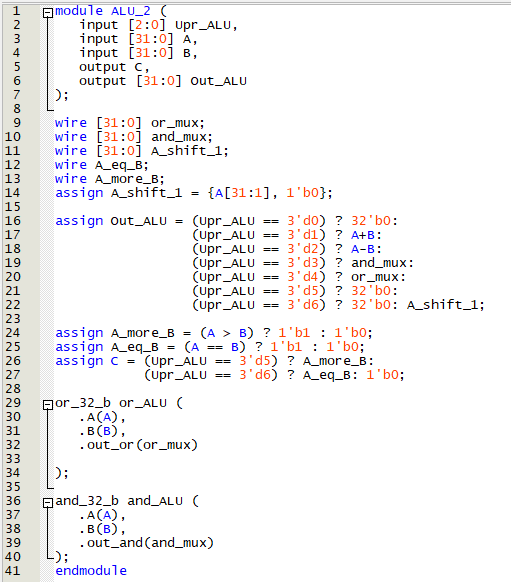{width="6.49375in" height="0.8048611111111111in"}

Смотрим дизасм:

00000000 \<\_bss_end\>:

0: 08000193 li gp,128

4: 00019117 auipc sp,0x19

8: ffc10113 add sp,sp,-4 \# 19000 \<\_stack_ptr\>

c: 00000293 li t0,0

10: 00000313 li t1,0

00000014 \<\_bss_init_loop\>:

14: 00534863 blt t1,t0,24 \<\_main_call\>

18: 0002a023 sw zero,0(t0)

1c: 00428293 add t0,t0,4

20: ff5ff06f j 14 \<\_bss_init_loop\>

00000024 \<\_main_call\>:

24: 00000513 li a0,0

28: 00000593 li a1,0

2c: 008000ef jal 34 \<main\>

00000030 \<\_endless_loop\>:

30: 0000006f j 30 \<\_endless_loop\>

00000034 \<main\>:

34: fe010113 add sp,sp,-32

38: 00112e23 sw ra,28(sp)

3c: 00812c23 sw s0,24(sp)

40: 02010413 add s0,sp,32

44: ff100793 li a5,-15

48: fef42623 sw a5,-20(s0)

4c: 00300793 li a5,3

50: fef42423 sw a5,-24(s0)

54: fe842583 lw a1,-24(s0)

58: fec42503 lw a0,-20(s0)

5c: 01c000ef jal 78 \<\_\_mulsi3\>

60: 00050793 mv a5,a0

64: 00078513 mv a0,a5

68: 01c12083 lw ra,28(sp)

6c: 01812403 lw s0,24(sp)

70: 02010113 add sp,sp,32

74: 00008067 ret

00000078 \<\_\_mulsi3\>:

78: 00050613 mv a2,a0

7c: 00000513 li a0,0

00000080 \<\_globl_ptr\>:

80: 0015f693 and a3,a1,1

84: 00068463 beqz a3,8c \<\_globl_ptr+0xc\>

88: 00c50533 add a0,a0,a2

8c: 0015d593 srl a1,a1,0x1

90: 00161613 sll a2,a2,0x1

94: fe0596e3 bnez a1,80 \<\_globl_ptr\>

98: 00008067 ret

Disassembly of section .comment:

Итак, мы пишем все переменные в стек. Похоже, переменные локальные и
инициализируются сразу, поэтому не попадают в data и bss. Создадим
глобальную переменную.

Программа:

int x;

int main ()

{

x = 15;

return x\*x;

}

Команда для сборки:

\$ /c/riscv_cc/bin/riscv-none-elf-gcc -march=rv32i -mabi=ilp32 -c test.c
-o test.o

Команда для дизассемблирования:

\$ /c/riscv_cc/bin/riscv-none-elf-objdump -D test.o \> t1.S

Результат:

Disassembly of section .text:

00000000 \<main\>:

0: ff010113 add sp,sp,-16

4: 00112623 sw ra,12(sp)

8: 00812423 sw s0,8(sp)

c: 01010413 add s0,sp,16

10: 000007b7 lui a5,0x0

14: 00f00713 li a4,15

18: 00e7a023 sw a4,0(a5) \# 0 \<main\>

1c: 000007b7 lui a5,0x0

20: 0007a703 lw a4,0(a5) \# 0 \<main\>

24: 000007b7 lui a5,0x0

28: 0007a783 lw a5,0(a5) \# 0 \<main\>

2c: 00078593 mv a1,a5

30: 00070513 mv a0,a4

34: 00000097 auipc ra,0x0

38: 000080e7 jalr ra \# 34 \<main+0x34\>

3c: 00050793 mv a5,a0

40: 00078513 mv a0,a5

44: 00c12083 lw ra,12(sp)

48: 00812403 lw s0,8(sp)

4c: 01010113 add sp,sp,16

50: 00008067 ret

Стартап-файл (указываю, потому что много раз его менял и сбился):

.section .starter

.global \_poyehaliy

\_poyehaliy:

la gp, \_globl_ptr

la sp, \_stack_ptr

la t0, \_bss_start

la t1, \_bss_end

\_bss_init_loop:

blt t1, t0, \_main_call

sw zero, 0(t0)

addi t0, t0, 4

j \_bss_init_loop

\_main_call:

li a0, 0

li a1, 0

call main

\_endless_loop:

j \_endless_loop

Сборка:

\$ /c/riscv_cc/bin/riscv-none-elf-gcc -march=rv32i -mabi=ilp32 -c
starter_simple.S -o starter_simple.o

Линкер:

OUTPUT_FORMAT(\"elf32-littleriscv\")

ENTRY(\_poyehaliy)

MEMORY

{

command_meme (rx) : ORIGIN = 0x00000000, LENGTH = 1k

data_meme (!rx) : ORIGIN = 0x00000000, LENGTH = 1k

}

SECTIONS

{

.text : {

\*(.starter)

\*(.text\*)

} \> command_meme

.data : AT (0x000FEFAF) {

\_globl_ptr = . + 128;

\*(.\*data\*)

} \> data_meme

. = ALIGN(4);

.bss : {

\_bss_start = .;

\*(.\*bss\*)

\_bss_end = .;

} \> data_meme

. = LENGTH(data_meme);

\_stack_ptr = ALIGN(32)-32;

ASSERT(\_stack_ptr \<= LENGTH(data_meme), \"Check_stack\")

}

Команда для линковки:

\$ /c/riscv_cc/bin/riscv-none-elf-gcc -march=rv32i -mabi=ilp32
-nostartfiles -T linker.ld starter_simple.o test.o -o t1.elf

Дизассемблируем командой

\$ /c/riscv_cc/bin/riscv-none-elf-objdump -D t1.elf \> t1.S

Результат:

Disassembly of section .text:

00000000 \<\_poyehaliy\>:

0: 08000193 li gp,128

4: 3e000113 li sp,992

8: 00000293 li t0,0

c: 00400313 li t1,4

00000010 \<\_bss_init_loop\>:

10: 00534863 blt t1,t0,20 \<main\>

14: 0002a023 sw zero,0(t0)

18: 00428293 add t0,t0,4

1c: ff5ff06f j 10 \<\_bss_init_loop\>

00000020 \<main\>:

20: ff010113 add sp,sp,-16

24: 00112623 sw ra,12(sp)

28: 00812423 sw s0,8(sp)

2c: 01010413 add s0,sp,16

30: 00f00713 li a4,15

34: 00e02023 sw a4,0(zero) \# 0 \<\_poyehaliy\>

38: 00002703 lw a4,0(zero) \# 0 \<\_poyehaliy\>

3c: 00002783 lw a5,0(zero) \# 0 \<\_poyehaliy\>

40: 00078593 mv a1,a5

44: 00070513 mv a0,a4

48: 01c000ef jal 64 \<\_\_mulsi3\>

4c: 00050793 mv a5,a0

50: 00078513 mv a0,a5

54: 00c12083 lw ra,12(sp)

58: 00812403 lw s0,8(sp)

5c: 01010113 add sp,sp,16

60: 00008067 ret

00000064 \<\_\_mulsi3\>:

64: 00050613 mv a2,a0

68: 00000513 li a0,0

6c: 0015f693 and a3,a1,1

70: 00068463 beqz a3,78 \<\_\_mulsi3+0x14\>

74: 00c50533 add a0,a0,a2

78: 0015d593 srl a1,a1,0x1

7c: 00161613 sll a2,a2,0x1

00000080 \<\_globl_ptr\>:

80: fe0596e3 bnez a1,6c \<\_\_mulsi3+0x8\>

84: 00008067 ret

Поскольку адреса памяти перекрываются, компилятор пишет данные на место
инструкций и не волнуется (если не написать AT в линкере, может выдать
ошибку, я не пробовал). Данные теперь пишутся не в стек, а в начало
памяти данных, потому что загружаются в глобальную переменную. В начале
в t1 теперь загружается 4, а не 0, что говорит о том, что bss теперь
начинается с 0 и имеет длину в 32 бита.

Добавим объявленную переменную. Читателю предлагается убедиться, что в
программе ниже секция данных уже не будет пустой.

int x;

int y = -3;

int main ()

{

x = 15;

return x\*y;

}

Предполагается, что вы найдёте следующее:

Disassembly of section .data:

00000000 \<y\>:

0: fffd .insn 2, 0xfffd

2: ffff .insn 2, 0xffff

bss при этом сдвинется, как и должно быть

8: 00400293 li t0,4

c: 00800313 li t1,8

Здесь говорится, что y=-3 (FFFFFFFD). Однако, ассемблерного кода тут нет
вовсе. В прошивке для нашего процессора придётся избегать таких
объявлений, так как с помощью readmem мы прошиваем только память
инструкций. Нужно либо объединять память физически в нашем дизайне, либо
прошивать обе отдельными файлами. Второе затруднено тем, что линкер
считает, что память одна.

В завершение этого длинного документа прошьём наш процессор умножением
-3 на 15.

Программа:

int main() {

int a = -15;

int b = 3;

return a \* b;

}

Стартап и линкер не меняем. Ассемблер (неправильный, но гонять пока
будем его):

t2.elf: file format elf32-littleriscv

Disassembly of section .text:

00000000 \<\_bss_end\>:

0: 08000193 li gp,128

4: 3e000113 li sp,992

8: 00000293 li t0,0

c: 00000313 li t1,0

00000010 \<\_bss_init_loop\>:

10: 00534863 blt t1,t0,20 \<main\>

14: 0002a023 sw zero,0(t0)

18: 00428293 add t0,t0,4

1c: ff5ff06f j 10 \<\_bss_init_loop\>

00000020 \<main\>:

20: fe010113 add sp,sp,-32

24: 00112e23 sw ra,28(sp)

28: 00812c23 sw s0,24(sp)

2c: 02010413 add s0,sp,32

30: ff100793 li a5,-15

34: fef42623 sw a5,-20(s0)

38: 00300793 li a5,3

3c: fef42423 sw a5,-24(s0)

40: fe842583 lw a1,-24(s0)

44: fec42503 lw a0,-20(s0)

48: 01c000ef jal 64 \<\_\_mulsi3\>

4c: 00050793 mv a5,a0

50: 00078513 mv a0,a5

54: 01c12083 lw ra,28(sp)

58: 01812403 lw s0,24(sp)

5c: 02010113 add sp,sp,32

60: 00008067 ret

00000064 \<\_\_mulsi3\>:

64: 00050613 mv a2,a0

68: 00000513 li a0,0

6c: 0015f693 and a3,a1,1

70: 00068463 beqz a3,78 \<\_\_mulsi3+0x14\>

74: 00c50533 add a0,a0,a2

78: 0015d593 srl a1,a1,0x1

7c: 00161613 sll a2,a2,0x1

00000080 \<\_globl_ptr\>:

80: fe0596e3 bnez a1,6c \<\_\_mulsi3+0x8\>

84: 00008067 ret

Команды:

\$ /c/riscv_cc/bin/riscv-none-elf-gcc -march=rv32i -mabi=ilp32 -c
return_ab.c -o return_ab.o

\$ /c/riscv_cc/bin/riscv-none-elf-gcc -march=rv32i -mabi=ilp32
-nostartfiles -T linker.ld starter_simple.o return_ab.o -o t2.elf

\$ /c/riscv_cc/bin/riscv-none-elf-objdump -D t2.elf \> t2.S

\$ /c/riscv_cc/bin/riscv-none-elf-objcopy -O verilog
\--verilog-data-width=4 t2.elf t2.meme

Заходим в моделсим, грузим в проект файлы проца, грузим в папку проца и
в проект прошивку, запускаем симуляцию.

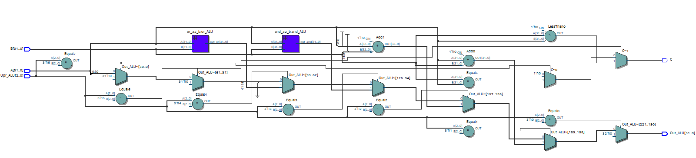{width="6.496527777777778in"
height="5.306380139982502in"}

Через некоторое количество попыток видим наши -45 в регистре a5. Победа!
Остаётся узнать, почему процессор уходит в x-состояние, хотя мы написали
в стартап-файле бесконечный цикл после main. Смотрим на счётчик команд:

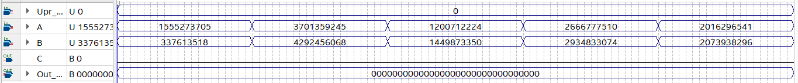{width="6.177152230971129in"
height="0.718507217847769in"}

Смотрим на дизассемблер:

60: 00008067 ret

Расшифруем команду. Простой способ, применимый для одной команды:
скопировать hex-представление из дизассемблера, вставить в калькулятор,
перевести в бинарный вид.

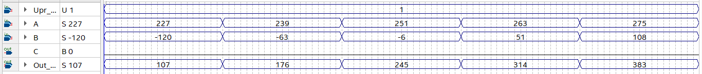{width="6.496527777777778in"
height="2.922732939632546in"}

Далее в любом доступном редакторе бьём инструкцию:

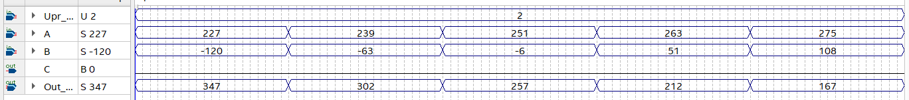{width="4.110787401574803in"
height="2.18463801399825in"}

Узнаём, что ret является на самом деле инструкцией jalr ra, 0(0). Ищем
ra в дизассемблере:

24: 00112e23 sw ra,28(sp)

54: 01c12083 lw ra,28(sp)

Выясняем причину ухода в x-состояние: в дизайне использован регистровый
файл без сигнала сброса, поэтому начальное состояние регистра ra в
симуляции неопределённое. Функция main по какой-то причине вызывается не
с помощью перехода с сохранением адреса, а простым pc+4. Поэтому в ra
ничего не записывается. Далее, функция main сохраняет ra в память по
pc=24, а по pc=54 значение выгружается обратно, но остаётся
неопределённым. Вернуться из main оказывается невозможно. Для решения
проблемы нужно вернуться к стартап-файлу и проверить, вызвана ли функция
main. Когда-то я убирал часть с вызовом и, видимо, использовал
неисправный стартап-файл.

Программа:

t3.elf: file format elf32-littleriscv

Disassembly of section .text:

00000000 \<\_bss_end\>:

0: 08000193 li gp,128

4: 3e000113 li sp,992

8: 00000293 li t0,0

c: 00000313 li t1,0

00000010 \<\_bss_init_loop\>:

10: 00534863 blt t1,t0,20 \<\_main_call\>

14: 0002a023 sw zero,0(t0)

18: 00428293 add t0,t0,4

1c: ff5ff06f j 10 \<\_bss_init_loop\>

00000020 \<\_main_call\>:

20: 00000513 li a0,0

24: 00000593 li a1,0

28: 008000ef jal 30 \<main\>

0000002c \<\_endless_loop\>:

2c: 0000006f j 2c \<\_endless_loop\>

00000030 \<main\>:

30: fe010113 add sp,sp,-32

34: 00112e23 sw ra,28(sp)

38: 00812c23 sw s0,24(sp)

3c: 02010413 add s0,sp,32

40: ff100793 li a5,-15

44: fef42623 sw a5,-20(s0)

48: 00300793 li a5,3

4c: fef42423 sw a5,-24(s0)

50: fe842583 lw a1,-24(s0)

54: fec42503 lw a0,-20(s0)

58: 01c000ef jal 74 \<\_\_mulsi3\>

5c: 00050793 mv a5,a0

60: 00078513 mv a0,a5

64: 01c12083 lw ra,28(sp)

68: 01812403 lw s0,24(sp)

6c: 02010113 add sp,sp,32

70: 00008067 ret

00000074 \<\_\_mulsi3\>:

74: 00050613 mv a2,a0

78: 00000513 li a0,0

7c: 0015f693 and a3,a1,1

00000080 \<\_globl_ptr\>:

80: 00068463 beqz a3,88 \<\_globl_ptr+0x8\>

84: 00c50533 add a0,a0,a2

88: 0015d593 srl a1,a1,0x1

8c: 00161613 sll a2,a2,0x1

90: fe0596e3 bnez a1,7c \<\_\_mulsi3+0x8\>

94: 00008067 ret

Результат:

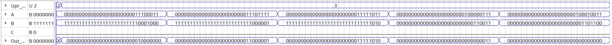{width="6.496527777777778in" height="5.30625in"}

**Тут говина, пока убирать не буду, хотя вряд ли понадобится**

Команды для компиляции и дизассемблирования

anthon@logik MINGW64 /c/riscv_compilation/aps

anthon@logik MINGW64 /c/riscv_compilation/aps

\$ /c/riscv_cc/bin/riscv-none-elf-gcc -march=rv32i_zicsr -mabi=ilp32
-Wl,\--gc-sections -nostartfiles -T linker_script.ld startup.o main.o -o
result.elf

C:/riscv_cc/bin/../lib/gcc/riscv-none-elf/13.2.0/../../../../riscv-none-elf/bin/ld.exe:
startup.o: in function \`.L0 \':

(.boot+0xb8): undefined reference to \`int_handler\'

collect2.exe: error: ld returned 1 exit status

anthon@logik MINGW64 /c/riscv_compilation/aps

\$ /c/riscv_cc/bin/riscv-none-elf-gcc -c -march=rv32i_zicsr -mabi=ilp32
startup.S -o startup.o

anthon@logik MINGW64 /c/riscv_compilation/aps

\$ /c/riscv_cc/bin/riscv-none-elf-gcc -march=rv32i_zicsr -mabi=ilp32
-Wl,\--gc-sections -nostartfiles -T linker_script.ld startup.o main.o -o
result.elf

anthon@logik MINGW64 /c/riscv_compilation/aps

\$ /c/riscv_cc/bin/riscv-none-elf-objcopy -O verilog result.elf init.mem

anthon@logik MINGW64 /c/riscv_compilation/aps

\$ /c/riscv_cc/bin/riscv-none-elf-objcopy -O verilog
\--verilog-data-width=4 result.elf init.mem

anthon@logik MINGW64 /c/riscv_compilation/aps

\$ /c/riscv_cc/bin/riscv-none-elf-objdump -D result.elf \>
disasmed_result.S

anthon@logik MINGW64 /c/riscv_compilation/aps

\$

(.text+0x0): undefined reference to \`\_\_global_pointer\$\'

C:/riscv_cc/bin/../lib/gcc/riscv-none-elf/13.2.0/../../../../riscv-none-elf/bin/ld.exe:
(.text+0x8): undefined reference to \`\_\_bss_start\'

C:/riscv_cc/bin/../lib/gcc/riscv-none-elf/13.2.0/../../../../riscv-none-elf/bin/ld.exe:
(.text+0x10): undefined reference to \`\_end\'

collect2.exe: error: ld returned 1 exit status

anthon@logik MINGW64 /c/riscv_compilation/return_ab

\$ /c/riscv_cc/bin/riscv-none-elf-gcc -T linker.ld starter.S return_ab.o
-o return_ab.elf

C:/riscv_cc/bin/../lib/gcc/riscv-none-elf/13.2.0/../../../../riscv-none-elf/bin/ld.exe:
C:/riscv_cc/bin/../lib/gcc/riscv-none-elf/13.2.0/../../../../riscv-none-elf/lib/crt0.o:
in function \`\_start\':

(.text+0x0): undefined reference to \`\_\_global_pointer\$\'

C:/riscv_cc/bin/../lib/gcc/riscv-none-elf/13.2.0/../../../../riscv-none-elf/bin/ld.exe:
(.text+0x8): undefined reference to \`\_\_bss_start\'

C:/riscv_cc/bin/../lib/gcc/riscv-none-elf/13.2.0/../../../../riscv-none-elf/bin/ld.exe:
(.text+0x10): undefined reference to \`\_end\'

collect2.exe: error: ld returned 1 exit status

anthon@logik MINGW64 /c/riscv_compilation/return_ab

\$ /c/riscv_cc/bin/riscv-none-elf-gcc -march=rv32i -mabi=ilp32 -c
starter.S -o starter.o

anthon@logik MINGW64 /c/riscv_compilation/return_ab

\$ /c/riscv_cc/bin/riscv-none-elf-gcc -T linker.ld starter.o return_ab.o
-o return_ab.elf

C:/riscv_cc/bin/../lib/gcc/riscv-none-elf/13.2.0/../../../../riscv-none-elf/bin/ld.exe:
C:/riscv_cc/bin/../lib/gcc/riscv-none-elf/13.2.0/../../../../riscv-none-elf/lib/crt0.o:
in function \`\_start\':

(.text+0x0): undefined reference to \`\_\_global_pointer\$\'

C:/riscv_cc/bin/../lib/gcc/riscv-none-elf/13.2.0/../../../../riscv-none-elf/bin/ld.exe:
(.text+0x8): undefined reference to \`\_\_bss_start\'

C:/riscv_cc/bin/../lib/gcc/riscv-none-elf/13.2.0/../../../../riscv-none-elf/bin/ld.exe:
(.text+0x10): undefined reference to \`\_end\'

collect2.exe: error: ld returned 1 exit status

anthon@logik MINGW64 /c/riscv_compilation/return_ab

\$

anthon@logik MINGW64 /c/riscv_compilation/return_ab

\$ /c/riscv_cc/bin/riscv-none-elf-gcc -march=rv32i -mabi=ilp32 -T
linker.ld starter.S return_ab.o -nostartfiles -o return_ab.elf

anthon@logik MINGW64 /c/riscv_compilation/return_ab

\$ /c/riscv_cc/bin/riscv-none-elf-objdump -D return_ab.elf \>
return_ab_disasm.S

anthon@logik MINGW64 /c/riscv_compilation/return_ab

\$ /c/riscv_cc/bin/riscv-none-elf-gcc -march=rv32i -mabi=ilp32 -
starter.S -o starter.o

riscv-none-elf-gcc.exe: error: -E or -x required when input is from
standard input

anthon@logik MINGW64 /c/riscv_compilation/return_ab

\$ /c/riscv_cc/bin/riscv-none-elf-gcc -march=rv32i -mabi=ilp32 -c
starter.S -o starter.o

anthon@logik MINGW64 /c/riscv_compilation/return_ab

\$ /c/riscv_cc/bin/riscv-none-elf-gcc -march=rv32i -mabi=ilp32 -T
linker.ld starter.o return_ab.o -nostartfiles -o return_ab.elf

anthon@logik MINGW64 /c/riscv_compilation/return_ab

\$ /c/riscv_cc/bin/riscv-none-elf-objdump -D return_ab.elf \>
return_ab_disasm.S

anthon@logik MINGW64 /c/riscv_compilation/return_ab

\$ /c/riscv_cc/bin/riscv-none-elf-gcc -march=rv32i -mabi=ilp32 -T
linker.ld starter.S return_ab.o -nostartfiles -o return_ab.elf

anthon@logik MINGW64 /c/riscv_compilation/return_ab

\$ /c/riscv_cc/bin/riscv-none-elf-objdump -D return_ab.elf \>
return_ab_disasm.S

anthon@logik MINGW64 /c/riscv_compilation/return_ab

\$ /c/riscv_cc/bin/riscv-none-elf-objdump -D return_ab.elf \>
return_ab_disasm.S

\$ /c/riscv_cc/bin/riscv-none-elf-gcc -march=rv32i -mabi=ilp32 -T
linker.ld starter.S return_ab.o -nostartfiles -o return_ab.elf

anthon@logik MINGW64 /c/riscv_compilation/return_ab

\$ /c/riscv_cc/bin/riscv-none-elf-objdump -D return_ab.elf \>
return_ab_disasm.S

anthon@logik MINGW64 /c/riscv_compilation/return_ab

\$ /c/riscv_cc/bin/riscv-none-elf-objdump -D return_ab.o \> objdisasm.S

anthon@logik MINGW64 /c/riscv_compilation/return_ab

\$ /c/riscv_cc/bin/riscv-none-elf-gcc -march=rv32i -mabi=ilp32 -c
starter.S return_ab.o -nostartfiles -o return_ab_test.elf

riscv-none-elf-gcc.exe: warning: return_ab.o: linker input file unused
because linking not done

anthon@logik MINGW64 /c/riscv_compilation/return_ab

\$ /c/riscv_cc/bin/riscv-none-elf-objdump -D return_ab_test.elf \>
return_ab_test_disasm.S

anthon@logik MINGW64 /c/riscv_compilation/return_ab

\$ /c/riscv_cc/bin/riscv-none-elf-gcc -march=rv32i -mabi=ilp32 -c
starter.S -o starter.o

anthon@logik MINGW64 /c/riscv_compilation/return_ab

\$ /c/riscv_cc/bin/riscv-none-elf-gcc -march=rv32i -mabi=ilp32 -T
linker.ld starter.o return_ab.o -o return_ab_test.elf

C:/riscv_cc/bin/../lib/gcc/riscv-none-elf/13.2.0/../../../../riscv-none-elf/bin/ld.exe:
C:/riscv_cc/bin/../lib/gcc/riscv-none-elf/13.2.0/../../../../riscv-none-elf/lib/rv32i/ilp32/crt0.o:
in function \`\_start\':

(.text+0x0): undefined reference to \`\_\_global_pointer\$\'

C:/riscv_cc/bin/../lib/gcc/riscv-none-elf/13.2.0/../../../../riscv-none-elf/bin/ld.exe:
(.text+0x8): undefined reference to \`\_\_bss_start\'

C:/riscv_cc/bin/../lib/gcc/riscv-none-elf/13.2.0/../../../../riscv-none-elf/bin/ld.exe:
(.text+0x10): undefined reference to \`\_end\'

collect2.exe: error: ld returned 1 exit status

anthon@logik MINGW64 /c/riscv_compilation/return_ab

\$ /c/riscv_cc/bin/riscv-none-elf-gcc -march=rv32i -mabi=ilp32 -T
linker.ld starter.o return_ab.o -nostartfiles -o return_ab_test.elf

anthon@logik MINGW64 /c/riscv_compilation/return_ab

\$ /c/riscv_cc/bin/riscv-none-elf-objdump -D return_ab_test.elf \>
return_ab_test_disasm.S

anthon@logik MINGW64 /c/riscv_compilation/return_ab

\$ /c/riscv_cc/bin/riscv-none-elf-gcc -march=rv32i -mabi=ilp32
-nostartfiles -T linker.ld starter.o return_ab.o -o return_ab_test.elf

anthon@logik MINGW64 /c/riscv_compilation/return_ab

\$ /c/riscv_cc/bin/riscv-none-elf-objdump -D return_ab_test.elf \>
return_ab_test_disasm.S

anthon@logik MINGW64 /c/riscv_compilation/return_ab

\$ /c/riscv_cc/bin/riscv-none-elf-gcc -march=rv32i -mabi=ilp32
-nostartfiles -T linker.ld starter.o return_ab.o -o return_ab_test.elf

anthon@logik MINGW64 /c/riscv_compilation/return_ab

\$ /c/riscv_cc/bin/riscv-none-elf-objdump -D return_ab_test.elf \>
return_ab_test_disasm.S

anthon@logik MINGW64 /c/riscv_compilation/return_ab

\$ /c/riscv_cc/bin/riscv-none-elf-objdump -D return_ab.o \>
return_ab_o_disasm.S

anthon@logik MINGW64 /c/riscv_compilation/return_ab

\$ /c/riscv_cc/bin/riscv-none-elf-gcc -march=rv32i -mabi=ilp32 -c
return_ab.c -o return_ab.o

anthon@logik MINGW64 /c/riscv_compilation/return_ab

\$ /c/riscv_cc/bin/riscv-none-elf-objdump -D return_ab.o \>
return_ab_o_disasm.S

anthon@logik MINGW64 /c/riscv_compilation/return_ab

\$ /c/riscv_cc/bin/riscv-none-elf-gcc -march=rv32i -mabi=ilp32
-nostartfiles -T linker.ld starter.o return_ab.o -o return_ab_test.elf

anthon@logik MINGW64 /c/riscv_compilation/return_ab

\$ /c/riscv_cc/bin/riscv-none-elf-objdump -D return_ab_test.elf \>
return_ab_test_disasm.S

anthon@logik MINGW64 /c/riscv_compilation/return_ab

\$ /c/riscv_cc/bin/riscv-none-elf-gcc -march=rv32i -mabi=ilp32
-nostartfiles -Wl,\--gc-sections -T linker.ld starter.o return_ab.o -o
return_ab_delete_unused.elf

anthon@logik MINGW64 /c/riscv_compilation/return_ab

\$ /c/riscv_cc/bin/riscv-none-elf-objdump -D return_ab_d.elf \>
return_ab_test_disasm.S

return_ab_delete_unused.elf return_ab_disasm.S

anthon@logik MINGW64 /c/riscv_compilation/return_ab

\$ /c/riscv_cc/bin/riscv-none-elf-objdump -D return_ab_delete_unused.elf
\> return_ab_delete_unused_disasm.S

anthon@logik MINGW64 /c/riscv_compilation/return_ab

\$ /c/riscv_cc/bin/riscv-none-elf-gcc -march=rv32i -mabi=ilp32 -c -Os
return_ab.c -o return_ab_cmprs.o

anthon@logik MINGW64 /c/riscv_compilation/return_ab

\$ /c/riscv_cc/bin/riscv-none-elf-gcc -march=rv32i -mabi=ilp32 -c -Os
starter.S -o starter_cmprs.o

anthon@logik MINGW64 /c/riscv_compilation/return_ab

\$ /c/riscv_cc/bin/riscv-none-elf-gcc -march=rv32i -mabi=ilp32
-nostartfiles -Wl,\--gc-sections -T linker.ld starter_cmprs.o
return_ab_cmprs.o -o return_ab_cmprs.elf

anthon@logik MINGW64 /c/riscv_compilation/return_ab

\$ /c/riscv_cc/bin/riscv-none-elf-objdump -D return_ab_cmprs.elf \>
return_ab_cmprs_disasm.S

anthon@logik MINGW64 /c/riscv_compilation/return_ab

\$
