# RTL to GDS для проверки делимости на 5

**Описание на System Verilog**

```systemverilog
module delimost_na_5 (
	input a_i,
	input clk_i,
	input rst_i,
	output div_by_5_o
);

typedef enum {
      STATE_0_FSM,
		STATE_1_FSM,
		STATE_2_FSM,
		STATE_3_FSM,
		STATE_4_FSM
		} state_fsm;

state_fsm state;
state_fsm next_state;

always_comb begin
	case (state)
		STATE_0_FSM : next_state = (a_i) ? STATE_1_FSM : STATE_0_FSM;
		STATE_1_FSM : next_state = (a_i) ? STATE_3_FSM : STATE_2_FSM;
		STATE_2_FSM : next_state = (a_i) ? STATE_0_FSM : STATE_4_FSM;
		STATE_3_FSM : next_state = (a_i) ? STATE_2_FSM : STATE_1_FSM;
		STATE_4_FSM : next_state = (a_i) ? STATE_4_FSM : STATE_3_FSM;
	endcase
end


always_ff @(posedge clk_i) begin
	if (rst_i) state <= STATE_0_FSM;
	else state <= next_state;
end

assign div_by_5_o = (state == STATE_0_FSM);

endmodule
```
## ```Cadence Genus```

### Стадия 1. Синтез (```syn_generic```)

В данной стадии ```System Verilog``` превращается в "элементарный Verilog" (еще имеются конструкции, например, ```always```). Не имеет никакого отношения к технологической библиотеке.

**Общий план**

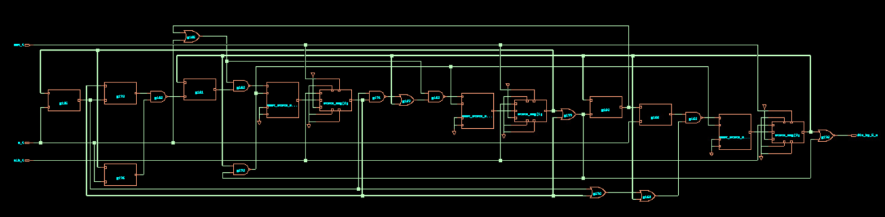

**Элементы**

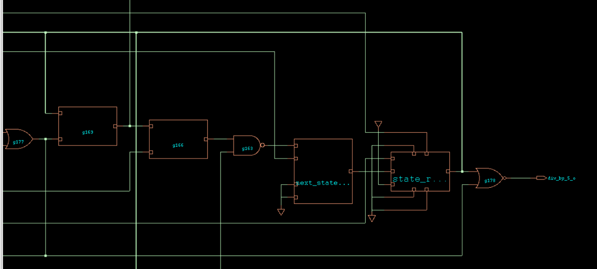


<details>
<summary> Netlist после синтеза </summary>

```verilog

// Generated by Cadence Genus(TM) Synthesis Solution 21.14-s082_1
// Generated on: Aug 15 2025 09:42:22 MSK (Aug 15 2025 06:42:22 UTC)

// Verification Directory fv/delimost_na_5 

module delimost_na_5(a_i, clk_i, rst_i, div_by_5_o);
  input a_i, clk_i, rst_i;
  output div_by_5_o;
  wire a_i, clk_i, rst_i;
  wire div_by_5_o;
  wire [31:0] state;
  wire [31:0] next_state;
  wire n_614, n_615, n_620, n_624, n_628, n_630, n_631, n_632;
  wire n_637, n_638, n_645, n_646, n_647, n_654, n_655, n_656;
  wire n_659;
  or g125 (n_630, wc, a_i);
  not gc (wc, state[1]);
  nand g160 (n_628, n_646, n_659);
  or g161 (n_659, wc0, state[2]);
  not gc0 (wc0, n_632);
  nand g162 (n_624, n_646, n_647);
  nand g163 (n_620, n_655, n_656);
  or g164 (n_656, n_654, state[2]);
  or g165 (n_646, n_615, a_i);
  or g166 (n_655, n_615, wc1);
  not gc1 (wc1, a_i);
  or g167 (n_647, n_645, state[2]);
  nand g168 (n_632, n_637, n_638);
  or g169 (n_615, n_631, wc2);
  not gc2 (wc2, state[2]);
  or g170 (n_654, n_630, state[0]);
  nand g171 (n_645, n_630, state[0]);
  or g172 (n_637, wc3, n_630);
  not gc3 (wc3, state[0]);
  nand g173 (n_614, state[2], n_631);
  or g176 (n_638, state[1], wc4);
  not gc4 (wc4, a_i);
  or g177 (n_631, state[1], state[0]);
  nor g178 (div_by_5_o, state[2], n_631);
  CDN_latch \next_state_reg[0] (.d (n_628), .ena (n_614), .aclr (1'b0),
       .apre (1'b0), .q (next_state[0]));
  CDN_latch \next_state_reg[1] (.d (n_624), .ena (n_614), .aclr (1'b0),
       .apre (1'b0), .q (next_state[1]));
  CDN_latch \next_state_reg[2] (.d (n_620), .ena (n_614), .aclr (1'b0),
       .apre (1'b0), .q (next_state[2]));
  CDN_flop \state_reg[0] (.clk (clk_i), .d (next_state[0]), .sena
       (1'b1), .aclr (1'b0), .apre (1'b0), .srl (rst_i), .srd (1'b0),
       .q (state[0]));
  CDN_flop \state_reg[1] (.clk (clk_i), .d (next_state[1]), .sena
       (1'b1), .aclr (1'b0), .apre (1'b0), .srl (rst_i), .srd (1'b0),
       .q (state[1]));
  CDN_flop \state_reg[2] (.clk (clk_i), .d (next_state[2]), .sena
       (1'b1), .aclr (1'b0), .apre (1'b0), .srl (rst_i), .srd (1'b0),
       .q (state[2]));
endmodule

`ifdef RC_CDN_GENERIC_GATE
`else
module CDN_latch(ena, d, aclr, apre, q);
  input ena, d, aclr, apre;
  output q;
  wire ena, d, aclr, apre;
  wire q;
  reg  qi;
  assign #1 q = qi;
  always 
    @(d or ena or apre or aclr) 
      if (aclr) 
        qi <= 0;
      else if (apre) 
          qi <= 1;
        else begin
          if (ena) 
            qi <= d;
        end
  initial 
    qi <= 1'b0;
endmodule
`endif
`ifdef RC_CDN_GENERIC_GATE
`else
module CDN_flop(clk, d, sena, aclr, apre, srl, srd, q);
  input clk, d, sena, aclr, apre, srl, srd;
  output q;
  wire clk, d, sena, aclr, apre, srl, srd;
  wire q;
  reg  qi;
  assign #1 q = qi;
  always 
    @(posedge clk or posedge apre or posedge aclr) 
      if (aclr) 
        qi <= 0;
      else if (apre) 
          qi <= 1;
        else if (srl) 
            qi <= srd;
          else begin
            if (sena) 
              qi <= d;
          end
  initial 
    qi <= 1'b0;
endmodule
`endif
```
</details>


### Стадия 2. Mapping (```syn_map```)

Mapping убирает конструкции "элементарного Verilog", заменяет цифровые элементы и конструкции ```always``` на cells из технической библиотеки.

**Общий план**

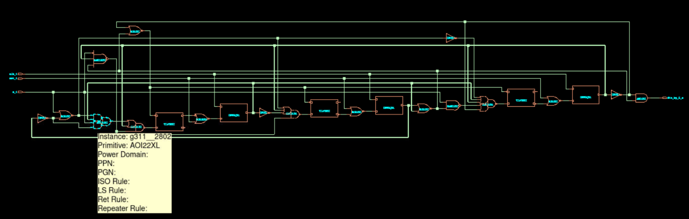

**Элементы**

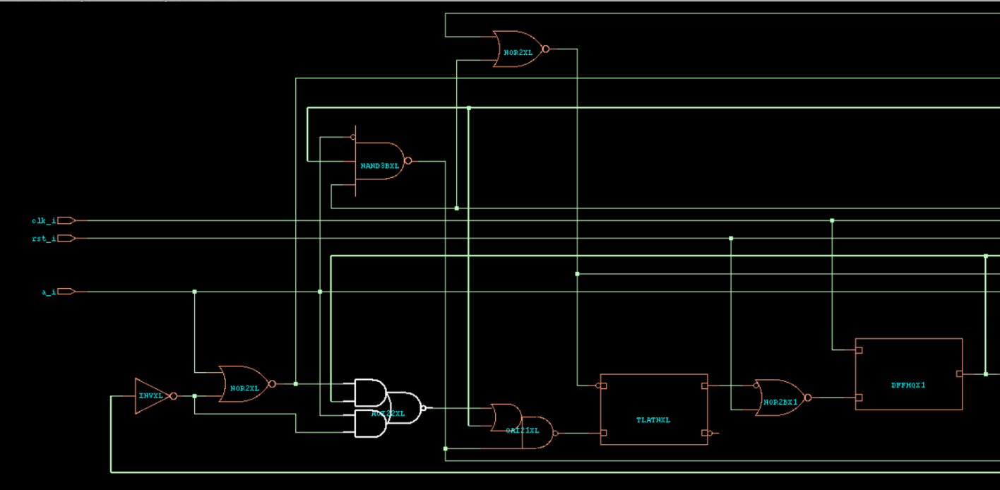

<details>
<summary> Netlist после Mapping </summary>

```verilog

// Generated by Cadence Genus(TM) Synthesis Solution 21.14-s082_1
// Generated on: Aug 15 2025 09:46:47 MSK (Aug 15 2025 06:46:47 UTC)

// Verification Directory fv/delimost_na_5 

module delimost_na_5(a_i, clk_i, rst_i, div_by_5_o);
  input a_i, clk_i, rst_i;
  output div_by_5_o;
  wire a_i, clk_i, rst_i;
  wire div_by_5_o;
  wire [31:0] state;
  wire [31:0] next_state;
  wire UNCONNECTED, UNCONNECTED0, UNCONNECTED1, n_0, n_1, n_2, n_3, n_4;
  wire n_5, n_6, n_7, n_8, n_10, n_11, n_12, n_13;
  wire n_14, n_15, n_16;
  DFFHQX1 \state_reg[1] (.CK (clk_i), .D (n_16), .Q (state[1]));
  DFFHQX1 \state_reg[2] (.CK (clk_i), .D (n_15), .Q (state[2]));
  NOR2XL g299__2398(.A (rst_i), .B (next_state[1]), .Y (n_16));
  NOR2XL g300__5107(.A (rst_i), .B (next_state[2]), .Y (n_15));
  TLATNXL \next_state_reg[2] (.GN (n_14), .D (n_13), .Q (UNCONNECTED),
       .QN (next_state[2]));
  TLATNXL \next_state_reg[1] (.GN (n_14), .D (n_11), .Q (UNCONNECTED0),
       .QN (next_state[1]));
  TLATNXL \next_state_reg[0] (.GN (n_14), .D (n_12), .Q
       (next_state[0]), .QN (UNCONNECTED1));
  OAI32X1 g306__6260(.A0 (n_2), .A1 (state[0]), .A2 (state[2]), .B0
       (n_6), .B1 (n_8), .Y (n_13));
  OAI21XL g304__4319(.A0 (n_5), .A1 (state[2]), .B0 (n_10), .Y (n_12));
  OAI31X1 g305__8428(.A0 (n_4), .A1 (state[2]), .A2 (n_3), .B0 (n_10),
       .Y (n_11));
  NAND3BXL g307__5526(.AN (a_i), .B (state[2]), .C (n_7), .Y (n_10));
  AND2XL g308__6783(.A (n_8), .B (n_7), .Y (div_by_5_o));
  NAND2XL g310__3680(.A (a_i), .B (n_7), .Y (n_6));
  NOR2XL g309__1617(.A (n_8), .B (n_7), .Y (n_14));
  AOI22XL g311__2802(.A0 (n_4), .A1 (state[0]), .B0 (a_i), .B1 (n_1),
       .Y (n_5));
  NOR2XL g312__1705(.A (state[1]), .B (state[0]), .Y (n_7));
  INVXL g313(.A (state[0]), .Y (n_3));
  INVXL g316(.A (n_4), .Y (n_2));
  DFFHQX1 \state_reg[0] (.CK (clk_i), .D (n_0), .Q (state[0]));
  NOR2XL g317__5122(.A (a_i), .B (n_1), .Y (n_4));
  NOR2BX1 g315__8246(.AN (next_state[0]), .B (rst_i), .Y (n_0));
  INVXL g318(.A (state[1]), .Y (n_1));
  INVXL g319(.A (state[2]), .Y (n_8));
endmodule
```

</details>

### Стадия 3. Оптимизация (```syn_opt```)

Оптимизирует схему (netlist), может убрать некоторые элементы/заменить их на другие

**Общий план.**

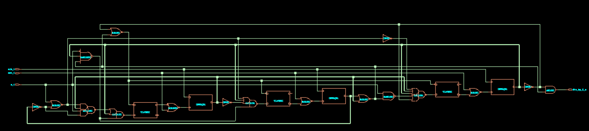

**Элементы**

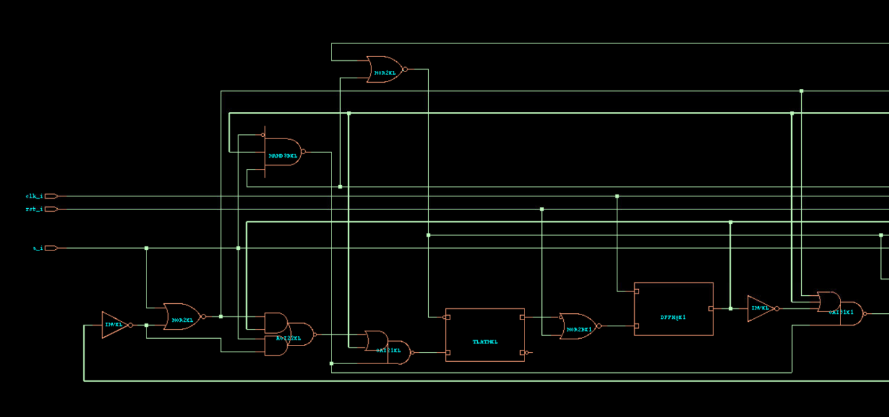

<details>
<summary> Netlist после оптимизации </summary>

```verilog

// Generated by Cadence Genus(TM) Synthesis Solution 21.14-s082_1
// Generated on: Aug 15 2025 09:50:07 MSK (Aug 15 2025 06:50:07 UTC)

// Verification Directory fv/delimost_na_5 

module delimost_na_5(a_i, clk_i, rst_i, div_by_5_o);
  input a_i, clk_i, rst_i;
  output div_by_5_o;
  wire a_i, clk_i, rst_i;
  wire div_by_5_o;
  wire [31:0] state;
  wire [31:0] next_state;
  wire UNCONNECTED, UNCONNECTED0, UNCONNECTED1, n_0, n_1, n_2, n_3, n_4;
  wire n_5, n_6, n_7, n_8, n_10, n_11, n_12, n_13;
  wire n_14, n_15, n_16;
  DFFHQX1 \state_reg[1] (.CK (clk_i), .D (n_16), .Q (state[1]));
  DFFHQX1 \state_reg[2] (.CK (clk_i), .D (n_15), .Q (state[2]));
  NOR2XL g299__2398(.A (rst_i), .B (next_state[1]), .Y (n_16));
  NOR2XL g300__5107(.A (rst_i), .B (next_state[2]), .Y (n_15));
  TLATNXL \next_state_reg[2] (.GN (n_14), .D (n_13), .Q (UNCONNECTED),
       .QN (next_state[2]));
  TLATNXL \next_state_reg[1] (.GN (n_14), .D (n_11), .Q (UNCONNECTED0),
       .QN (next_state[1]));
  TLATNXL \next_state_reg[0] (.GN (n_14), .D (n_12), .Q
       (next_state[0]), .QN (UNCONNECTED1));
  OAI32X1 g306__6260(.A0 (n_2), .A1 (state[0]), .A2 (state[2]), .B0
       (n_6), .B1 (n_8), .Y (n_13));
  OAI21XL g304__4319(.A0 (n_5), .A1 (state[2]), .B0 (n_10), .Y (n_12));
  OAI31X1 g305__8428(.A0 (n_4), .A1 (state[2]), .A2 (n_3), .B0 (n_10),
       .Y (n_11));
  NAND3BXL g307__5526(.AN (a_i), .B (state[2]), .C (n_7), .Y (n_10));
  AND2XL g308__6783(.A (n_8), .B (n_7), .Y (div_by_5_o));
  NAND2XL g310__3680(.A (a_i), .B (n_7), .Y (n_6));
  NOR2XL g309__1617(.A (n_8), .B (n_7), .Y (n_14));
  AOI22XL g311__2802(.A0 (n_4), .A1 (state[0]), .B0 (a_i), .B1 (n_1),
       .Y (n_5));
  NOR2XL g312__1705(.A (state[1]), .B (state[0]), .Y (n_7));
  INVXL g313(.A (state[0]), .Y (n_3));
  INVXL g316(.A (n_4), .Y (n_2));
  DFFHQX1 \state_reg[0] (.CK (clk_i), .D (n_0), .Q (state[0]));
  NOR2XL g317__5122(.A (a_i), .B (n_1), .Y (n_4));
  NOR2BX1 g315__8246(.AN (next_state[0]), .B (rst_i), .Y (n_0));
  INVXL g318(.A (state[1]), .Y (n_1));
  INVXL g319(.A (state[2]), .Y (n_8));
endmodule
```

</details>

### Стадия 4. Тестовый провод (опицонально).

Добавляет DFT (Design for Test). Данный пункт уже зависит от желания разработчика.

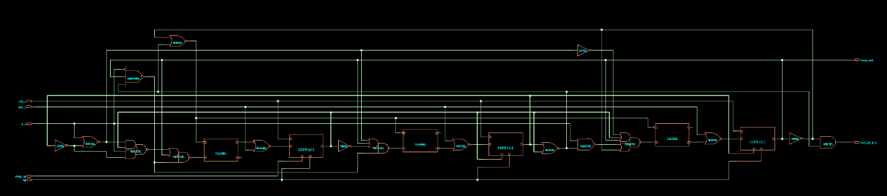

## ```Cadence Innovus```

### Часть 1. Подготовка топологии

**Кольца VDD/VSS**

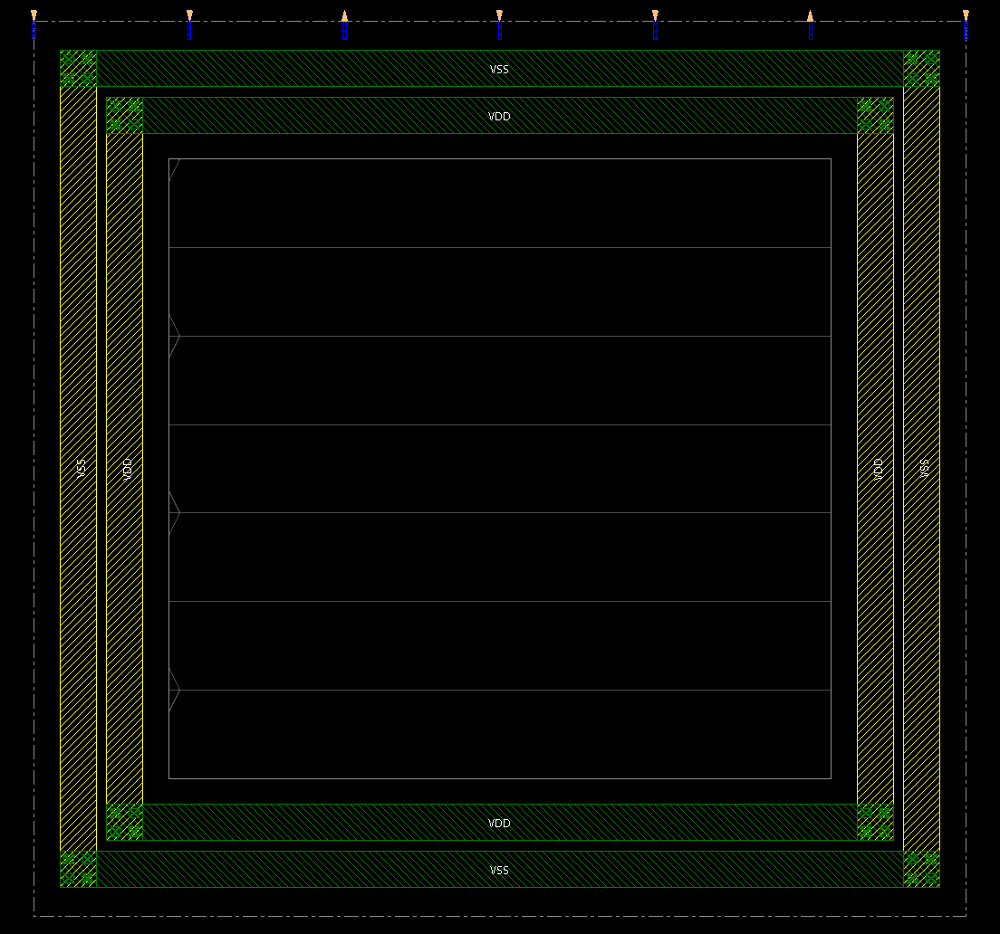


**Добавление ```Stripes``` для стабилизации VDD/VSS**

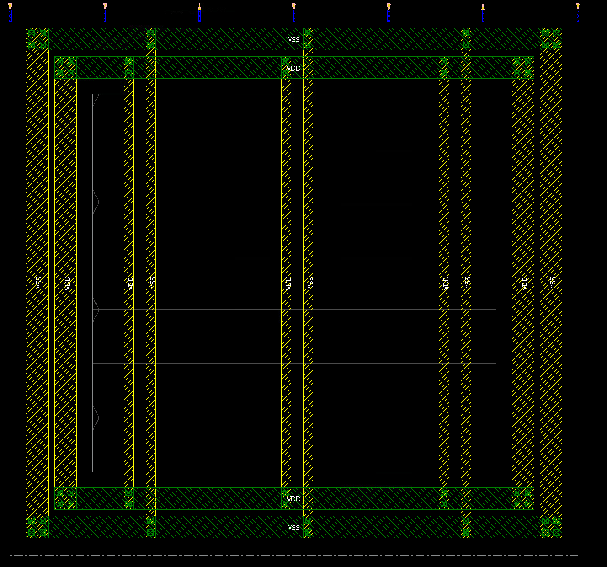


**Добавление линий питания и земли, к которым ячейки будут подключены**

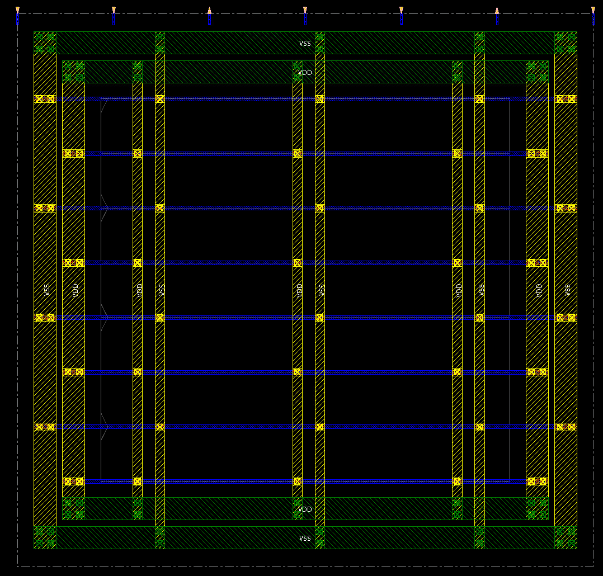


### Часть 2. Работа с топологией

**Размещаем топологию (```place_design```)**

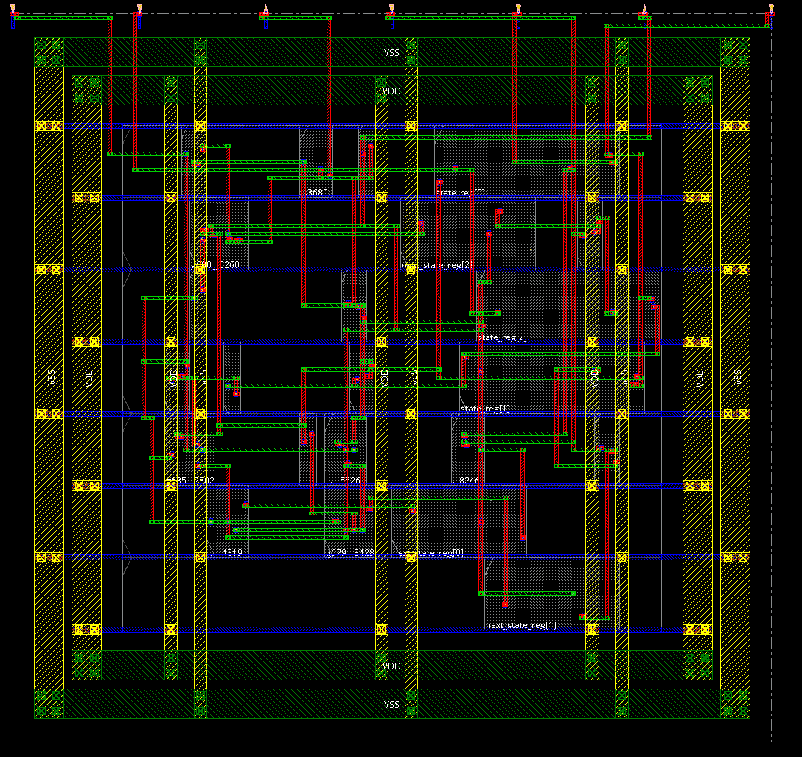


**Делаем оптимизацию дорожек (```route_design```)**

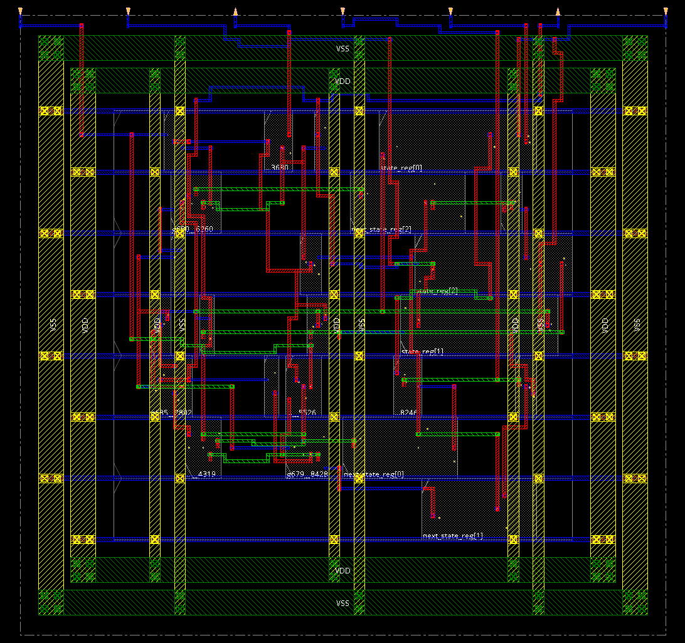


**Добавляем ```Filler-Cells```**

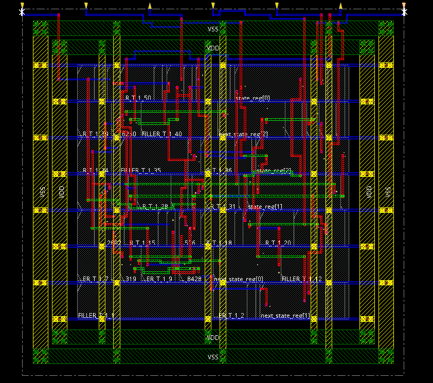

Затем данную топологию можно преобразовать в ```.GDS``` формат и далее отправить на производство (если имеются IP блоки, топологии которых у разработчика нет), или же, после определенной настройки ```Cadence Virtuoso``` (танцы с бубном вокруг него и техлибы), открыть ее в нем, и тогда уже топология элементарных ячеек будет видна (так-как в Cadence Innovus самым нижним слоем отображения является металл 1, n+/p+/n-well и другие появляются уже в Cadence Virtuoso.


# RTL to GDS для самописного FIFO

Проведем теперь те же шаги для FIFO

**Описание FIFO на System Verilog**

```systemverilog
module my_fifo
#(parameter width = 2, depth = 40)
(
    input                clk,
    input                rst,
    input                push,
    input                pop,
    input  [width - 1:0] write_data,
    output logic [width - 1:0] read_data,
    output               empty,
    output               full
);

localparam pointer_depth = $clog2 (depth);
localparam depth_minus_1 = depth - 1;


logic [pointer_depth +1 : 0] count_in_fifo;
logic [pointer_depth +1 : 0] count_out_fifo;

reg [pointer_depth : 0] chislo;
logic [width-1 : 0] fifo [depth -1 : 0];

wire uslovie_schitivanie = pop && (chislo > 0);

always @(posedge clk) begin
	if (rst) begin
		count_in_fifo <= '0;
		count_out_fifo <= '0;
		chislo <= '0;
	end
	else begin
		if (push && ~pop) begin 
			fifo [count_in_fifo] <= write_data;
			chislo <= chislo +1;
			
			if (count_in_fifo == (depth_minus_1)) count_in_fifo <= '0;
			else count_in_fifo <= count_in_fifo +1;
		end
	
		if (uslovie_schitivanie && ~(push&&pop)) begin 
			chislo <= chislo - 1;
            if (count_out_fifo == (depth_minus_1)) count_out_fifo <= '0;
            else count_out_fifo <= count_out_fifo +1;
		end
        
        if (push && pop) begin
            fifo [count_in_fifo] <= write_data;
            if (count_out_fifo == (depth_minus_1)) count_out_fifo <= '0;
            else count_out_fifo <= count_out_fifo +1;
            if (count_in_fifo == (depth_minus_1)) count_in_fifo <= '0;
			else count_in_fifo <= count_in_fifo +1;
        end
        
        
			
	end
end

assign read_data = fifo [count_out_fifo];
assign empty = (chislo == '0);
assign full = (chislo == (depth));
endmodule
```

## ```Cadence Genus```

Так-как картинки в генусе некрасивые для FIFO выходят, то автор ограничится 1 картинкой после оптимизации netlist и репортами (тоже после оптимизации).
За поснением отличий различных стадий синтеза отсылаю читателя к прошлому пункту про синтез детектора делимости на 5.

**Стадия оптимизации. Общий план**

<details>
<summary> Netlist после оптимизации </summary>

```verilog

// Generated by Cadence Genus(TM) Synthesis Solution 21.14-s082_1
// Generated on: Aug 15 2025 23:01:44 MSK (Aug 15 2025 20:01:44 UTC)

// Verification Directory fv/my_fifo 

module my_fifo(clk, rst, push, pop, write_data, read_data, empty, full);
  input clk, rst, push, pop;
  input [1:0] write_data;
  output [1:0] read_data;
  output empty, full;
  wire clk, rst, push, pop;
  wire [1:0] write_data;
  wire [1:0] read_data;
  wire empty, full;
  wire [6:0] chislo;
  wire [7:0] count_out_fifo;
  wire [7:0] count_in_fifo;
  wire [1:0] \fifo[39] ;
  wire [1:0] \fifo[31] ;
  wire [1:0] \fifo[26] ;
  wire [1:0] \fifo[27] ;
  wire [1:0] \fifo[24] ;
  wire [1:0] \fifo[25] ;
  wire [1:0] \fifo[29] ;
  wire [1:0] \fifo[22] ;
  wire [1:0] \fifo[6] ;
  wire [1:0] \fifo[7] ;
  wire [1:0] \fifo[9] ;
  wire [1:0] \fifo[28] ;
  wire [1:0] \fifo[23] ;
  wire [1:0] \fifo[11] ;
  wire [1:0] \fifo[15] ;
  wire [1:0] \fifo[5] ;
  wire [1:0] \fifo[12] ;
  wire [1:0] \fifo[8] ;
  wire [1:0] \fifo[10] ;
  wire [1:0] \fifo[13] ;
  wire [1:0] \fifo[14] ;
  wire [1:0] \fifo[21] ;
  wire [1:0] \fifo[30] ;
  wire [1:0] \fifo[4] ;
  wire [1:0] \fifo[20] ;
  wire [1:0] \fifo[0] ;
  wire [1:0] \fifo[35] ;
  wire [1:0] \fifo[2] ;
  wire [1:0] \fifo[1] ;
  wire [1:0] \fifo[17] ;
  wire [1:0] \fifo[33] ;
  wire [1:0] \fifo[18] ;
  wire [1:0] \fifo[37] ;
  wire [1:0] \fifo[3] ;
  wire [1:0] \fifo[16] ;
  wire [1:0] \fifo[19] ;
  wire [1:0] \fifo[32] ;
  wire [1:0] \fifo[38] ;
  wire [1:0] \fifo[34] ;
  wire [1:0] \fifo[36] ;
  wire n_0, n_2, n_4, n_5, n_6, n_8, n_9, n_10;
  wire n_11, n_13, n_14, n_15, n_16, n_17, n_18, n_19;
  wire n_20, n_21, n_22, n_23, n_24, n_25, n_27, n_28;
  wire n_29, n_30, n_31, n_32, n_33, n_34, n_35, n_36;
  wire n_37, n_38, n_39, n_40, n_41, n_42, n_43, n_44;
  wire n_45, n_46, n_47, n_48, n_49, n_50, n_51, n_52;
  wire n_53, n_54, n_55, n_56, n_58, n_59, n_60, n_61;
  wire n_62, n_63, n_64, n_65, n_66, n_67, n_68, n_69;
  wire n_70, n_71, n_72, n_73, n_74, n_75, n_76, n_77;
  wire n_78, n_79, n_80, n_81, n_82, n_84, n_85, n_86;
  wire n_87, n_88, n_89, n_90, n_91, n_92, n_93, n_94;
  wire n_95, n_96, n_97, n_98, n_99, n_100, n_102, n_103;
  wire n_104, n_105, n_106, n_107, n_108, n_109, n_110, n_111;
  wire n_112, n_113, n_114, n_115, n_116, n_118, n_119, n_120;
  wire n_121, n_122, n_123, n_124, n_125, n_126, n_127, n_128;
  wire n_129, n_130, n_132, n_133, n_134, n_135, n_136, n_137;
  wire n_138, n_140, n_141, n_142, n_143, n_144, n_145, n_146;
  wire n_147, n_148, n_149, n_150, n_151, n_152, n_153, n_154;
  wire n_155, n_157, n_158, n_159, n_160, n_161, n_162, n_163;
  wire n_164, n_165, n_166, n_167, n_168, n_169, n_170, n_172;
  wire n_173, n_174, n_175, n_176, n_177, n_178, n_179, n_180;
  wire n_181, n_182, n_183, n_184, n_185, n_186, n_187, n_188;
  wire n_189, n_190, n_191, n_192, n_193, n_194, n_195, n_196;
  wire n_197, n_198, n_199, n_200, n_201, n_202, n_203, n_204;
  wire n_207, n_208, n_209, n_210, n_211, n_212, n_213, n_214;
  wire n_215, n_216, n_217, n_218, n_219, n_220, n_221, n_222;
  wire n_223, n_224, n_225, n_226, n_227, n_228, n_229, n_230;
  wire n_231, n_232, n_233, n_234, n_235, n_236, n_237, n_239;
  wire n_240, n_241, n_242, n_243, n_244, n_245, n_246, n_247;
  wire n_248, n_249, n_250, n_251, n_252, n_255, n_256, n_257;
  wire n_258, n_259, n_260, n_261, n_262, n_263, n_264, n_265;
  wire n_266, n_267, n_268, n_269, n_270, n_271, n_272, n_273;
  wire n_274, n_275, n_276, n_278, n_279, n_280, n_286, n_287;
  wire n_288, n_289, n_290, n_291, n_292, n_293;
  DFFHQX1 \chislo_reg[6] (.CK (clk), .D (n_280), .Q (chislo[6]));
  DFFHQX1 \count_out_fifo_reg[7] (.CK (clk), .D (n_279), .Q
       (count_out_fifo[7]));
  DFFHQX1 \chislo_reg[5] (.CK (clk), .D (n_278), .Q (chislo[5]));
  DFFHQX1 \chislo_reg[4] (.CK (clk), .D (n_276), .Q (chislo[4]));
  OAI221X1 g9865__2398(.A0 (n_242), .A1 (n_96), .B0 (n_56), .B1
       (n_137), .C0 (n_275), .Y (read_data[1]));
  NOR2X1 g9867__5107(.A (rst), .B (n_274), .Y (n_280));
  NOR2X1 g9845__6260(.A (rst), .B (n_273), .Y (n_279));
  NOR2X1 g9880__4319(.A (rst), .B (n_271), .Y (n_278));
  OAI211X1 g9855__8428(.A0 (n_202), .A1 (n_93), .B0 (n_145), .C0
       (n_265), .Y (read_data[0]));
  DFFHQX1 \count_in_fifo_reg[7] (.CK (clk), .D (n_268), .Q
       (count_in_fifo[7]));
  DFFHQX1 \count_out_fifo_reg[6] (.CK (clk), .D (n_272), .Q
       (count_out_fifo[6]));
  NOR2X1 g9866__5526(.A (rst), .B (n_264), .Y (n_276));
  NOR4X1 g9885__6783(.A (n_132), .B (n_134), .C (n_173), .D (n_256), .Y
       (n_275));
  AOI22X1 g9886__3680(.A0 (n_258), .A1 (n_270), .B0 (chislo[6]), .B1
       (n_269), .Y (n_274));
  DFFHQX1 \count_out_fifo_reg[5] (.CK (clk), .D (n_263), .Q
       (count_out_fifo[5]));
  DFFHQX1 \count_out_fifo_reg[4] (.CK (clk), .D (n_266), .Q
       (count_out_fifo[4]));
  DFFHQX1 \count_out_fifo_reg[3] (.CK (clk), .D (n_267), .Q
       (count_out_fifo[3]));
  XNOR2X1 g9849__1617(.A (count_out_fifo[7]), .B (n_251), .Y (n_273));
  NOR2X1 g9857__2802(.A (rst), .B (n_257), .Y (n_272));
  AOI22X1 g9901__1705(.A0 (n_286), .A1 (n_270), .B0 (chislo[5]), .B1
       (n_269), .Y (n_271));
  NOR2X1 g9841__5122(.A (rst), .B (n_260), .Y (n_268));
  DFFHQX1 \count_in_fifo_reg[6] (.CK (clk), .D (n_261), .Q
       (count_in_fifo[6]));
  DFFHQX1 \chislo_reg[3] (.CK (clk), .D (n_259), .Q (chislo[3]));
  OAI32X1 g9881__8246(.A0 (count_out_fifo[3]), .A1 (n_27), .A2 (n_262),
       .B0 (rst), .B1 (n_247), .Y (n_267));
  NOR2X1 g9882__7098(.A (rst), .B (n_255), .Y (n_266));
  NOR4X1 g9884__6131(.A (n_125), .B (n_135), .C (n_151), .D (n_244), .Y
       (n_265));
  AOI22X1 g9888__1881(.A0 (n_235), .A1 (n_270), .B0 (chislo[4]), .B1
       (n_269), .Y (n_264));
  OAI22X1 g9869__5115(.A0 (rst), .A1 (n_239), .B0 (n_32), .B1 (n_262),
       .Y (n_263));
  NOR2X1 g9846__7482(.A (rst), .B (n_241), .Y (n_261));
  XNOR2X1 g9843__4733(.A (count_in_fifo[7]), .B (n_229), .Y (n_260));
  NOR2X1 g9897__6161(.A (rst), .B (n_236), .Y (n_259));
  OAI2BB1X1 g9934__9315(.A0N (chislo[6]), .A1N (n_226), .B0 (n_89), .Y
       (n_258));
  XNOR2X1 g9887__9945(.A (count_out_fifo[6]), .B (n_250), .Y (n_257));
  OAI221X1 g9935__2883(.A0 (n_150), .A1 (n_103), .B0 (n_243), .B1
       (n_31), .C0 (n_240), .Y (n_256));
  DFFHQX1 \count_in_fifo_reg[5] (.CK (clk), .D (n_234), .Q
       (count_in_fifo[5]));
  DFFHQX1 \chislo_reg[1] (.CK (clk), .D (n_233), .Q (chislo[1]));
  DFFHQX1 \chislo_reg[2] (.CK (clk), .D (n_232), .Q (chislo[2]));
  AOI221X1 g9899__2346(.A0 (n_293), .A1 (n_246), .B0
       (count_out_fifo[4]), .B1 (n_245), .C0 (n_53), .Y (n_255));
  SDFFQX1 \fifo_reg[39][0] (.CK (clk), .D (\fifo[39] [0]), .SI
       (write_data[0]), .SE (n_287), .Q (\fifo[39] [0]));
  SDFFQX1 \fifo_reg[39][1] (.CK (clk), .D (\fifo[39] [1]), .SI
       (write_data[1]), .SE (n_287), .Q (\fifo[39] [1]));
  SDFFQX1 \fifo_reg[31][1] (.CK (clk), .D (\fifo[31] [1]), .SI
       (write_data[1]), .SE (n_252), .Q (\fifo[31] [1]));
  SDFFQX1 \fifo_reg[31][0] (.CK (clk), .D (\fifo[31] [0]), .SI
       (write_data[0]), .SE (n_252), .Q (\fifo[31] [0]));
  AND2XL g9890__7410(.A (count_out_fifo[6]), .B (n_250), .Y (n_251));
  SDFFQX1 \fifo_reg[26][1] (.CK (clk), .D (\fifo[26] [1]), .SI
       (write_data[1]), .SE (n_249), .Q (\fifo[26] [1]));
  SDFFQX1 \fifo_reg[26][0] (.CK (clk), .D (\fifo[26] [0]), .SI
       (write_data[0]), .SE (n_249), .Q (\fifo[26] [0]));
  SDFFQX1 \fifo_reg[27][1] (.CK (clk), .D (\fifo[27] [1]), .SI
       (write_data[1]), .SE (n_248), .Q (\fifo[27] [1]));
  SDFFQX1 \fifo_reg[27][0] (.CK (clk), .D (\fifo[27] [0]), .SI
       (write_data[0]), .SE (n_248), .Q (\fifo[27] [0]));
  DFFHQX1 \chislo_reg[0] (.CK (clk), .D (n_225), .Q (chislo[0]));
  DFFHQX1 \count_out_fifo_reg[2] (.CK (clk), .D (n_227), .Q
       (count_out_fifo[2]));
  AOI22X1 g9929__6417(.A0 (n_237), .A1 (n_246), .B0
       (count_out_fifo[3]), .B1 (n_245), .Y (n_247));
  OAI221X1 g9900__5477(.A0 (n_243), .A1 (n_34), .B0 (n_242), .B1
       (n_104), .C0 (n_196), .Y (n_244));
  XNOR2X1 g9858__2398(.A (count_in_fifo[6]), .B (n_228), .Y (n_241));
  NOR4X1 g9985__5107(.A (n_116), .B (n_133), .C (n_124), .D (n_175), .Y
       (n_240));
  OAI31X1 g9898__6260(.A0 (n_293), .A1 (n_237), .A2 (n_245), .B0
       (count_out_fifo[5]), .Y (n_239));
  AOI22X1 g9930__4319(.A0 (n_176), .A1 (n_270), .B0 (chislo[3]), .B1
       (n_269), .Y (n_236));
  OAI31X1 g9936__8428(.A0 (chislo[2]), .A1 (n_292), .A2 (n_112), .B0
       (n_198), .Y (n_235));
  DFFHQX1 \count_in_fifo_reg[4] (.CK (clk), .D (n_195), .Q
       (count_in_fifo[4]));
  NOR2X1 g9856__5526(.A (rst), .B (n_190), .Y (n_234));
  NOR2X1 g9939__6783(.A (rst), .B (n_200), .Y (n_233));
  NOR2X1 g9938__3680(.A (rst), .B (n_201), .Y (n_232));
  SDFFQX1 \fifo_reg[24][1] (.CK (clk), .D (write_data[1]), .SI
       (\fifo[24] [1]), .SE (n_230), .Q (\fifo[24] [1]));
  SDFFQX1 \fifo_reg[25][1] (.CK (clk), .D (write_data[1]), .SI
       (\fifo[25] [1]), .SE (n_231), .Q (\fifo[25] [1]));
  SDFFQX1 \fifo_reg[25][0] (.CK (clk), .D (write_data[0]), .SI
       (\fifo[25] [0]), .SE (n_231), .Q (\fifo[25] [0]));
  SDFFQX1 \fifo_reg[24][0] (.CK (clk), .D (write_data[0]), .SI
       (\fifo[24] [0]), .SE (n_230), .Q (\fifo[24] [0]));
  DFFHQX1 \count_out_fifo_reg[1] (.CK (clk), .D (n_203), .Q
       (count_out_fifo[1]));
  DFFHQX1 \count_in_fifo_reg[3] (.CK (clk), .D (n_199), .Q
       (count_in_fifo[3]));
  AND2XL g9870__1617(.A (count_in_fifo[6]), .B (n_228), .Y (n_229));
  OAI32X1 g9932__2802(.A0 (rst), .A1 (n_29), .A2 (n_168), .B0
       (count_out_fifo[2]), .B1 (n_262), .Y (n_227));
  OAI221X1 g10010__1705(.A0 (chislo[5]), .A1 (n_197), .B0 (n_2), .B1
       (chislo[2]), .C0 (n_204), .Y (n_226));
  NOR2X1 g9937__5122(.A (rst), .B (n_177), .Y (n_225));
  SDFFQX1 \fifo_reg[29][1] (.CK (clk), .D (\fifo[29] [1]), .SI
       (write_data[1]), .SE (n_219), .Q (\fifo[29] [1]));
  SDFFQX1 \fifo_reg[22][1] (.CK (clk), .D (write_data[1]), .SI
       (\fifo[22] [1]), .SE (n_289), .Q (\fifo[22] [1]));
  SDFFQX1 \fifo_reg[6][1] (.CK (clk), .D (\fifo[6] [1]), .SI
       (write_data[1]), .SE (n_208), .Q (\fifo[6] [1]));
  SDFFQX1 \fifo_reg[7][0] (.CK (clk), .D (write_data[0]), .SI
       (\fifo[7] [0]), .SE (n_224), .Q (\fifo[7] [0]));
  SDFFQX1 \fifo_reg[9][1] (.CK (clk), .D (\fifo[9] [1]), .SI
       (write_data[1]), .SE (n_221), .Q (\fifo[9] [1]));
  SDFFQX1 \fifo_reg[28][1] (.CK (clk), .D (\fifo[28] [1]), .SI
       (write_data[1]), .SE (n_210), .Q (\fifo[28] [1]));
  SDFFQX1 \fifo_reg[23][1] (.CK (clk), .D (write_data[1]), .SI
       (\fifo[23] [1]), .SE (n_223), .Q (\fifo[23] [1]));
  SDFFQX1 \fifo_reg[11][1] (.CK (clk), .D (\fifo[11] [1]), .SI
       (write_data[1]), .SE (n_218), .Q (\fifo[11] [1]));
  SDFFQX1 \fifo_reg[7][1] (.CK (clk), .D (write_data[1]), .SI
       (\fifo[7] [1]), .SE (n_224), .Q (\fifo[7] [1]));
  SDFFQX1 \fifo_reg[15][0] (.CK (clk), .D (write_data[0]), .SI
       (\fifo[15] [0]), .SE (n_213), .Q (\fifo[15] [0]));
  SDFFQX1 \fifo_reg[23][0] (.CK (clk), .D (write_data[0]), .SI
       (\fifo[23] [0]), .SE (n_223), .Q (\fifo[23] [0]));
  SDFFQX1 \fifo_reg[5][0] (.CK (clk), .D (write_data[0]), .SI
       (\fifo[5] [0]), .SE (n_222), .Q (\fifo[5] [0]));
  SDFFQX1 \fifo_reg[12][1] (.CK (clk), .D (\fifo[12] [1]), .SI
       (write_data[1]), .SE (n_217), .Q (\fifo[12] [1]));
  SDFFQX1 \fifo_reg[5][1] (.CK (clk), .D (write_data[1]), .SI
       (\fifo[5] [1]), .SE (n_222), .Q (\fifo[5] [1]));
  SDFFQX1 \fifo_reg[9][0] (.CK (clk), .D (\fifo[9] [0]), .SI
       (write_data[0]), .SE (n_221), .Q (\fifo[9] [0]));
  SDFFQX1 \fifo_reg[8][0] (.CK (clk), .D (\fifo[8] [0]), .SI
       (write_data[0]), .SE (n_220), .Q (\fifo[8] [0]));
  SDFFQX1 \fifo_reg[8][1] (.CK (clk), .D (\fifo[8] [1]), .SI
       (write_data[1]), .SE (n_220), .Q (\fifo[8] [1]));
  DFFHQX1 \count_out_fifo_reg[0] (.CK (clk), .D (n_178), .Q
       (count_out_fifo[0]));
  SDFFQX1 \fifo_reg[29][0] (.CK (clk), .D (\fifo[29] [0]), .SI
       (write_data[0]), .SE (n_219), .Q (\fifo[29] [0]));
  SDFFQX1 \fifo_reg[10][1] (.CK (clk), .D (\fifo[10] [1]), .SI
       (write_data[1]), .SE (n_212), .Q (\fifo[10] [1]));
  SDFFQX1 \fifo_reg[11][0] (.CK (clk), .D (\fifo[11] [0]), .SI
       (write_data[0]), .SE (n_218), .Q (\fifo[11] [0]));
  SDFFQX1 \fifo_reg[12][0] (.CK (clk), .D (\fifo[12] [0]), .SI
       (write_data[0]), .SE (n_217), .Q (\fifo[12] [0]));
  SDFFQX1 \fifo_reg[13][0] (.CK (clk), .D (\fifo[13] [0]), .SI
       (write_data[0]), .SE (n_216), .Q (\fifo[13] [0]));
  SDFFQX1 \fifo_reg[13][1] (.CK (clk), .D (\fifo[13] [1]), .SI
       (write_data[1]), .SE (n_216), .Q (\fifo[13] [1]));
  SDFFQX1 \fifo_reg[14][1] (.CK (clk), .D (\fifo[14] [1]), .SI
       (write_data[1]), .SE (n_215), .Q (\fifo[14] [1]));
  SDFFQX1 \fifo_reg[14][0] (.CK (clk), .D (\fifo[14] [0]), .SI
       (write_data[0]), .SE (n_215), .Q (\fifo[14] [0]));
  SDFFQX1 \fifo_reg[21][1] (.CK (clk), .D (write_data[1]), .SI
       (\fifo[21] [1]), .SE (n_214), .Q (\fifo[21] [1]));
  SDFFQX1 \fifo_reg[21][0] (.CK (clk), .D (write_data[0]), .SI
       (\fifo[21] [0]), .SE (n_214), .Q (\fifo[21] [0]));
  SDFFQX1 \fifo_reg[15][1] (.CK (clk), .D (write_data[1]), .SI
       (\fifo[15] [1]), .SE (n_213), .Q (\fifo[15] [1]));
  SDFFQX1 \fifo_reg[10][0] (.CK (clk), .D (\fifo[10] [0]), .SI
       (write_data[0]), .SE (n_212), .Q (\fifo[10] [0]));
  SDFFQX1 \fifo_reg[30][1] (.CK (clk), .D (\fifo[30] [1]), .SI
       (write_data[1]), .SE (n_211), .Q (\fifo[30] [1]));
  SDFFQX1 \fifo_reg[30][0] (.CK (clk), .D (\fifo[30] [0]), .SI
       (write_data[0]), .SE (n_211), .Q (\fifo[30] [0]));
  SDFFQX1 \fifo_reg[28][0] (.CK (clk), .D (\fifo[28] [0]), .SI
       (write_data[0]), .SE (n_210), .Q (\fifo[28] [0]));
  SDFFQX1 \fifo_reg[4][0] (.CK (clk), .D (\fifo[4] [0]), .SI
       (write_data[0]), .SE (n_209), .Q (\fifo[4] [0]));
  SDFFQX1 \fifo_reg[4][1] (.CK (clk), .D (\fifo[4] [1]), .SI
       (write_data[1]), .SE (n_209), .Q (\fifo[4] [1]));
  SDFFQX1 \fifo_reg[6][0] (.CK (clk), .D (\fifo[6] [0]), .SI
       (write_data[0]), .SE (n_208), .Q (\fifo[6] [0]));
  SDFFQX1 \fifo_reg[20][0] (.CK (clk), .D (write_data[0]), .SI
       (\fifo[20] [0]), .SE (n_207), .Q (\fifo[20] [0]));
  SDFFQX1 \fifo_reg[20][1] (.CK (clk), .D (write_data[1]), .SI
       (\fifo[20] [1]), .SE (n_207), .Q (\fifo[20] [1]));
  SDFFQX1 \fifo_reg[22][0] (.CK (clk), .D (write_data[0]), .SI
       (\fifo[22] [0]), .SE (n_289), .Q (\fifo[22] [0]));
  NOR3X1 g9955__8246(.A (n_30), .B (n_20), .C (n_245), .Y (n_250));
  AOI21XL g9940__7098(.A0 (n_202), .A1 (n_163), .B0 (rst), .Y (n_203));
  AOI22X1 g9979__6131(.A0 (n_127), .A1 (n_270), .B0 (chislo[2]), .B1
       (n_269), .Y (n_201));
  AOI22X1 g9980__1881(.A0 (n_80), .A1 (n_270), .B0 (chislo[1]), .B1
       (n_269), .Y (n_200));
  NOR2X1 g9896__5115(.A (rst), .B (n_167), .Y (n_199));
  AOI221X1 g9982__7482(.A0 (n_197), .A1 (n_9), .B0 (chislo[4]), .B1
       (n_148), .C0 (n_109), .Y (n_198));
  NOR4X1 g9984__4733(.A (n_87), .B (n_110), .C (n_123), .D (n_147), .Y
       (n_196));
  NOR2X1 g9883__6161(.A (rst), .B (n_169), .Y (n_195));
  SDFFQX1 \fifo_reg[0][1] (.CK (clk), .D (\fifo[0] [1]), .SI
       (write_data[1]), .SE (n_193), .Q (\fifo[0] [1]));
  SDFFQX1 \fifo_reg[35][0] (.CK (clk), .D (\fifo[35] [0]), .SI
       (write_data[0]), .SE (n_194), .Q (\fifo[35] [0]));
  SDFFQX1 \fifo_reg[35][1] (.CK (clk), .D (\fifo[35] [1]), .SI
       (write_data[1]), .SE (n_194), .Q (\fifo[35] [1]));
  SDFFQX1 \fifo_reg[2][1] (.CK (clk), .D (\fifo[2] [1]), .SI
       (write_data[1]), .SE (n_188), .Q (\fifo[2] [1]));
  SDFFQX1 \fifo_reg[0][0] (.CK (clk), .D (\fifo[0] [0]), .SI
       (write_data[0]), .SE (n_193), .Q (\fifo[0] [0]));
  SDFFQX1 \fifo_reg[1][0] (.CK (clk), .D (\fifo[1] [0]), .SI
       (write_data[0]), .SE (n_192), .Q (\fifo[1] [0]));
  SDFFQX1 \fifo_reg[17][1] (.CK (clk), .D (\fifo[17] [1]), .SI
       (write_data[1]), .SE (n_191), .Q (\fifo[17] [1]));
  SDFFQX1 \fifo_reg[1][1] (.CK (clk), .D (\fifo[1] [1]), .SI
       (write_data[1]), .SE (n_192), .Q (\fifo[1] [1]));
  SDFFQX1 \fifo_reg[17][0] (.CK (clk), .D (\fifo[17] [0]), .SI
       (write_data[0]), .SE (n_191), .Q (\fifo[17] [0]));
  SDFFQX1 \fifo_reg[33][1] (.CK (clk), .D (write_data[1]), .SI
       (\fifo[33] [1]), .SE (n_179), .Q (\fifo[33] [1]));
  SDFFQX1 \fifo_reg[18][1] (.CK (clk), .D (\fifo[18] [1]), .SI
       (write_data[1]), .SE (n_186), .Q (\fifo[18] [1]));
  MX2XL g9868__9315(.A (n_174), .B (n_129), .S0 (count_in_fifo[5]), .Y
       (n_190));
  SDFFQX1 \fifo_reg[37][1] (.CK (clk), .D (write_data[1]), .SI
       (\fifo[37] [1]), .SE (n_180), .Q (\fifo[37] [1]));
  SDFFQX1 \fifo_reg[3][0] (.CK (clk), .D (\fifo[3] [0]), .SI
       (write_data[0]), .SE (n_189), .Q (\fifo[3] [0]));
  SDFFQX1 \fifo_reg[3][1] (.CK (clk), .D (\fifo[3] [1]), .SI
       (write_data[1]), .SE (n_189), .Q (\fifo[3] [1]));
  SDFFQX1 \fifo_reg[2][0] (.CK (clk), .D (\fifo[2] [0]), .SI
       (write_data[0]), .SE (n_188), .Q (\fifo[2] [0]));
  SDFFQX1 \fifo_reg[16][0] (.CK (clk), .D (\fifo[16] [0]), .SI
       (write_data[0]), .SE (n_187), .Q (\fifo[16] [0]));
  SDFFQX1 \fifo_reg[16][1] (.CK (clk), .D (\fifo[16] [1]), .SI
       (write_data[1]), .SE (n_187), .Q (\fifo[16] [1]));
  SDFFQX1 \fifo_reg[18][0] (.CK (clk), .D (\fifo[18] [0]), .SI
       (write_data[0]), .SE (n_186), .Q (\fifo[18] [0]));
  SDFFQX1 \fifo_reg[19][0] (.CK (clk), .D (\fifo[19] [0]), .SI
       (write_data[0]), .SE (n_181), .Q (\fifo[19] [0]));
  SDFFQX1 \fifo_reg[32][1] (.CK (clk), .D (write_data[1]), .SI
       (\fifo[32] [1]), .SE (n_185), .Q (\fifo[32] [1]));
  SDFFQX1 \fifo_reg[38][1] (.CK (clk), .D (\fifo[38] [1]), .SI
       (write_data[1]), .SE (n_183), .Q (\fifo[38] [1]));
  SDFFQX1 \fifo_reg[32][0] (.CK (clk), .D (write_data[0]), .SI
       (\fifo[32] [0]), .SE (n_185), .Q (\fifo[32] [0]));
  SDFFQX1 \fifo_reg[34][0] (.CK (clk), .D (\fifo[34] [0]), .SI
       (write_data[0]), .SE (n_184), .Q (\fifo[34] [0]));
  SDFFQX1 \fifo_reg[34][1] (.CK (clk), .D (\fifo[34] [1]), .SI
       (write_data[1]), .SE (n_184), .Q (\fifo[34] [1]));
  SDFFQX1 \fifo_reg[38][0] (.CK (clk), .D (\fifo[38] [0]), .SI
       (write_data[0]), .SE (n_183), .Q (\fifo[38] [0]));
  SDFFQX1 \fifo_reg[36][1] (.CK (clk), .D (write_data[1]), .SI
       (\fifo[36] [1]), .SE (n_182), .Q (\fifo[36] [1]));
  SDFFQX1 \fifo_reg[36][0] (.CK (clk), .D (write_data[0]), .SI
       (\fifo[36] [0]), .SE (n_182), .Q (\fifo[36] [0]));
  SDFFQX1 \fifo_reg[19][1] (.CK (clk), .D (\fifo[19] [1]), .SI
       (write_data[1]), .SE (n_181), .Q (\fifo[19] [1]));
  SDFFQX1 \fifo_reg[37][0] (.CK (clk), .D (write_data[0]), .SI
       (\fifo[37] [0]), .SE (n_180), .Q (\fifo[37] [0]));
  SDFFQX1 \fifo_reg[33][0] (.CK (clk), .D (write_data[0]), .SI
       (\fifo[33] [0]), .SE (n_179), .Q (\fifo[33] [0]));
  NOR2BX1 g9978__9945(.AN (n_164), .B (rst), .Y (n_178));
  XNOR2X1 g9981__2883(.A (chislo[0]), .B (n_270), .Y (n_177));
  XNOR2X1 g10013__2346(.A (chislo[3]), .B (n_170), .Y (n_176));
  OAI211X1 g10008__1666(.A0 (n_149), .A1 (n_50), .B0 (n_136), .C0
       (n_138), .Y (n_175));
  INVX1 g10001(.A (n_245), .Y (n_246));
  NOR2BX1 g9877__7410(.AN (count_in_fifo[5]), .B (n_174), .Y (n_228));
  OAI221X1 g10037__6417(.A0 (n_146), .A1 (n_39), .B0 (n_243), .B1
       (n_33), .C0 (n_144), .Y (n_173));
  NOR2X1 g10041__5477(.A (n_291), .B (n_172), .Y (n_248));
  NOR2X1 g9889__2398(.A (n_63), .B (n_174), .Y (n_252));
  NOR2X1 g10045__5107(.A (n_158), .B (n_172), .Y (n_249));
  AOI221X1 g10038__4319(.A0 (chislo[2]), .A1 (n_17), .B0 (n_197), .B1
       (n_292), .C0 (n_170), .Y (n_204));
  XNOR2X1 g9931__8428(.A (count_in_fifo[4]), .B (n_160), .Y (n_169));
  NAND2X1 g10003__5526(.A (n_23), .B (n_168), .Y (n_262));
  NAND2X1 g10007__6783(.A (count_out_fifo[2]), .B (n_168), .Y (n_245));
  AOI22X1 g9933__3680(.A0 (n_166), .A1 (n_161), .B0 (count_in_fifo[3]),
       .B1 (n_128), .Y (n_167));
  NAND2X1 g10039__1617(.A (n_142), .B (n_165), .Y (n_231));
  NAND2X1 g10043__2802(.A (n_157), .B (n_165), .Y (n_230));
  DFFHQX1 \count_in_fifo_reg[2] (.CK (clk), .D (n_130), .Q
       (count_in_fifo[2]));
  XNOR2X1 g10009__1705(.A (count_out_fifo[0]), .B (n_162), .Y (n_164));
  MXI2XL g10012__5122(.A (n_48), .B (count_out_fifo[1]), .S0 (n_162),
       .Y (n_163));
  NAND2X1 g9997__8246(.A (n_161), .B (n_111), .Y (n_223));
  NAND2X1 g9998__7098(.A (n_160), .B (n_159), .Y (n_213));
  NAND2X1 g9999__6131(.A (n_161), .B (n_159), .Y (n_224));
  NOR2X1 g10022__1881(.A (n_158), .B (n_154), .Y (n_215));
  AND2XL g10080__5115(.A (n_157), .B (n_288), .Y (n_209));
  NOR2X1 g10016__7482(.A (n_153), .B (n_152), .Y (n_219));
  NOR2X1 g10017__4733(.A (n_158), .B (n_155), .Y (n_212));
  NOR2X1 g10018__6161(.A (n_291), .B (n_155), .Y (n_218));
  NOR2X1 g10019__9315(.A (n_141), .B (n_154), .Y (n_217));
  NOR2X1 g10020__9945(.A (n_153), .B (n_154), .Y (n_216));
  NOR2X1 g10021__2883(.A (n_158), .B (n_152), .Y (n_211));
  NAND2X1 g9996__2346(.A (count_in_fifo[4]), .B (n_160), .Y (n_174));
  OAI221X1 g10036__1666(.A0 (n_150), .A1 (n_74), .B0 (n_38), .B1
       (n_149), .C0 (n_115), .Y (n_151));
  OAI21X1 g10034__7410(.A0 (chislo[3]), .A1 (n_197), .B0 (n_118), .Y
       (n_148));
  OAI22XL g10070__6417(.A0 (n_143), .A1 (n_90), .B0 (n_146), .B1
       (n_52), .Y (n_147));
  OA22X1 g10066__5477(.A0 (n_150), .A1 (n_91), .B0 (n_37), .B1 (n_149),
       .Y (n_145));
  OA22X1 g10068__2398(.A0 (n_143), .A1 (n_100), .B0 (n_202), .B1
       (n_71), .Y (n_144));
  NAND2X1 g10025__5107(.A (n_142), .B (n_140), .Y (n_214));
  NOR2X1 g10026__6260(.A (n_141), .B (n_155), .Y (n_220));
  NOR2X1 g10023__4319(.A (n_141), .B (n_152), .Y (n_210));
  NAND2X1 g10053__8428(.A (n_157), .B (n_140), .Y (n_207));
  NOR2BX1 g10054__5526(.AN (n_288), .B (n_158), .Y (n_208));
  INVX1 g10064(.A (n_165), .Y (n_172));
  NOR2X1 g10027__3680(.A (n_153), .B (n_155), .Y (n_221));
  NAND2X1 g10040__1617(.A (n_142), .B (n_288), .Y (n_222));
  INVX1 g10030(.A (n_270), .Y (n_269));
  OA22X1 g10075__2802(.A0 (n_242), .A1 (n_75), .B0 (n_137), .B1 (n_40),
       .Y (n_138));
  OA22X1 g10076__1705(.A0 (n_143), .A1 (n_84), .B0 (n_146), .B1 (n_35),
       .Y (n_136));
  OAI22XL g10074__5122(.A0 (n_143), .A1 (n_72), .B0 (n_137), .B1
       (n_54), .Y (n_135));
  NOR2XL g10083__8246(.A (n_242), .B (n_88), .Y (n_134));
  NOR2XL g10084__7098(.A (n_202), .B (n_92), .Y (n_133));
  NOR2XL g10085__6131(.A (n_143), .B (n_105), .Y (n_132));
  NOR2X1 g10002__1881(.A (rst), .B (n_98), .Y (n_130));
  AOI221X1 g10011__5115(.A0 (n_126), .A1 (n_41), .B0 (n_64), .B1
       (count_in_fifo[3]), .C0 (n_128), .Y (n_129));
  OAI22X1 g10033__7482(.A0 (n_197), .A1 (n_68), .B0 (chislo[2]), .B1
       (n_86), .Y (n_127));
  NOR2X1 g10042__4733(.A (n_153), .B (n_122), .Y (n_191));
  NAND2X1 g10044__6161(.A (n_142), .B (n_120), .Y (n_179));
  NOR2X1 g10024__9315(.A (n_153), .B (n_121), .Y (n_192));
  NAND2X1 g10028__9945(.A (n_142), .B (n_119), .Y (n_180));
  NOR2X1 g10015__2883(.A (n_242), .B (n_162), .Y (n_168));
  NOR3X1 g10079__2346(.A (count_in_fifo[2]), .B (n_126), .C (n_107), .Y
       (n_165));
  OAI22XL g10073__1666(.A0 (n_242), .A1 (n_73), .B0 (n_146), .B1
       (n_36), .Y (n_125));
  OAI22XL g10072__7410(.A0 (n_150), .A1 (n_69), .B0 (n_42), .B1
       (n_149), .Y (n_124));
  OAI22XL g10069__6417(.A0 (n_202), .A1 (n_78), .B0 (n_243), .B1
       (n_44), .Y (n_123));
  NOR2X1 g10052__5477(.A (n_291), .B (n_122), .Y (n_181));
  NOR2X1 g10056__2398(.A (n_291), .B (n_121), .Y (n_189));
  NOR2BX1 g10057__5107(.AN (n_120), .B (n_158), .Y (n_184));
  NOR2X1 g10058__6260(.A (n_141), .B (n_122), .Y (n_187));
  NAND2X1 g10059__4319(.A (n_157), .B (n_119), .Y (n_182));
  NAND2X1 g10060__8428(.A (n_157), .B (n_120), .Y (n_185));
  NOR2BX1 g10061__5526(.AN (n_120), .B (n_291), .Y (n_194));
  NOR2X1 g10062__6783(.A (n_141), .B (n_121), .Y (n_193));
  INVX1 g10065(.A (n_118), .Y (n_170));
  NOR2X1 g10051__3680(.A (n_158), .B (n_121), .Y (n_188));
  NOR2X1 g10050__1617(.A (n_158), .B (n_122), .Y (n_186));
  NOR2BX1 g10049__2802(.AN (n_119), .B (n_158), .Y (n_183));
  OAI22X1 g10046__1705(.A0 (n_79), .A1 (empty), .B0 (pop), .B1 (n_15),
       .Y (n_270));
  OAI22XL g10094__5122(.A0 (n_62), .A1 (n_114), .B0 (n_65), .B1
       (n_113), .Y (n_116));
  OA22X1 g10093__8246(.A0 (n_59), .A1 (n_114), .B0 (n_58), .B1 (n_113),
       .Y (n_115));
  AOI22X1 g10082__7098(.A0 (chislo[2]), .A1 (n_108), .B0 (n_197), .B1
       (n_112), .Y (n_118));
  NAND3X1 g10078__6131(.A (count_in_fifo[2]), .B (count_in_fifo[3]), .C
       (n_159), .Y (n_154));
  NAND3X1 g10077__1881(.A (count_in_fifo[2]), .B (count_in_fifo[3]), .C
       (n_111), .Y (n_152));
  NAND3X1 g10081__5115(.A (n_97), .B (count_in_fifo[3]), .C (n_159), .Y
       (n_155));
  OAI22XL g10095__7482(.A0 (n_47), .A1 (n_114), .B0 (n_49), .B1
       (n_113), .Y (n_110));
  NOR4X1 g10031__4733(.A (chislo[4]), .B (n_8), .C (n_197), .D (n_108),
       .Y (n_109));
  NOR2X1 g10096__6161(.A (n_106), .B (n_107), .Y (n_140));
  NOR2X1 g10005__9315(.A (n_126), .B (n_128), .Y (n_160));
  NOR2X1 g10004__2883(.A (count_in_fifo[3]), .B (n_128), .Y (n_161));
  DFFHQX1 \count_in_fifo_reg[1] (.CK (clk), .D (n_70), .Q
       (count_in_fifo[1]));
  AOI22XL g10104__2346(.A0 (\fifo[33] [1]), .A1 (n_95), .B0
       (\fifo[37] [1]), .B1 (n_94), .Y (n_105));
  AOI22XL g10118__1666(.A0 (\fifo[7] [0]), .A1 (n_102), .B0
       (\fifo[15] [0]), .B1 (n_290), .Y (n_104));
  AOI22XL g10108__7410(.A0 (\fifo[4] [1]), .A1 (n_102), .B0
       (\fifo[12] [1]), .B1 (n_290), .Y (n_103));
  AOI22XL g10106__6417(.A0 (\fifo[5] [1]), .A1 (n_102), .B0
       (\fifo[13] [1]), .B1 (n_290), .Y (n_100));
  NOR3X1 g10097__5477(.A (rst), .B (n_106), .C (n_166), .Y (n_119));
  NAND2X1 g10087__2398(.A (n_99), .B (n_159), .Y (n_121));
  NAND2X1 g10089__5107(.A (n_99), .B (n_111), .Y (n_122));
  NOR3BX1 g10099__6260(.AN (n_99), .B (rst), .C (n_166), .Y (n_120));
  AOI22X1 g10071__4319(.A0 (n_97), .A1 (n_81), .B0 (count_in_fifo[2]),
       .B1 (n_291), .Y (n_98));
  AOI22XL g10121__8428(.A0 (\fifo[35] [1]), .A1 (n_95), .B0
       (\fifo[39] [1]), .B1 (n_94), .Y (n_96));
  AOI22XL g10122__5526(.A0 (\fifo[6] [0]), .A1 (n_102), .B0
       (\fifo[14] [0]), .B1 (n_290), .Y (n_93));
  AOI22XL g10124__6783(.A0 (\fifo[6] [1]), .A1 (n_102), .B0
       (\fifo[14] [1]), .B1 (n_290), .Y (n_92));
  AOI22XL g10126__3680(.A0 (\fifo[4] [0]), .A1 (n_102), .B0
       (\fifo[12] [0]), .B1 (n_290), .Y (n_91));
  AOI22XL g10131__1617(.A0 (\fifo[5] [0]), .A1 (n_102), .B0
       (\fifo[13] [0]), .B1 (n_290), .Y (n_90));
  NAND4XL g10014__2802(.A (chislo[5]), .B (chislo[2]), .C (n_18), .D
       (n_85), .Y (n_89));
  AOI22XL g10119__1705(.A0 (\fifo[7] [1]), .A1 (n_102), .B0
       (\fifo[15] [1]), .B1 (n_290), .Y (n_88));
  OAI21X1 g10063__5122(.A0 (n_112), .A1 (n_82), .B0 (pop), .Y (n_162));
  NOR2XL g10105__8246(.A (n_137), .B (n_45), .Y (n_87));
  NOR2BX1 g10092__7098(.AN (n_112), .B (n_85), .Y (n_86));
  AOI22XL g10109__6131(.A0 (\fifo[21] [1]), .A1 (n_77), .B0
       (\fifo[29] [1]), .B1 (n_76), .Y (n_84));
  INVX1 g10101(.A (n_111), .Y (n_107));
  NOR2BX1 g10086__1881(.AN (n_24), .B (n_82), .Y (empty));
  DFFHQX1 \count_in_fifo_reg[0] (.CK (clk), .D (n_55), .Q
       (count_in_fifo[0]));
  NAND2X1 g10088__5115(.A (count_in_fifo[2]), .B (n_81), .Y (n_128));
  OAI221X1 g10067__7482(.A0 (n_67), .A1 (n_11), .B0 (n_79), .B1 (n_66),
       .C0 (n_112), .Y (n_80));
  AOI22XL g10123__4733(.A0 (\fifo[22] [0]), .A1 (n_77), .B0
       (\fifo[30] [0]), .B1 (n_76), .Y (n_78));
  AOI22XL g10125__6161(.A0 (\fifo[23] [1]), .A1 (n_77), .B0
       (\fifo[31] [1]), .B1 (n_76), .Y (n_75));
  AOI22XL g10127__9315(.A0 (\fifo[20] [0]), .A1 (n_77), .B0
       (\fifo[28] [0]), .B1 (n_76), .Y (n_74));
  AOI22XL g10128__9945(.A0 (\fifo[23] [0]), .A1 (n_77), .B0
       (\fifo[31] [0]), .B1 (n_76), .Y (n_73));
  AOI22XL g10129__2883(.A0 (\fifo[21] [0]), .A1 (n_77), .B0
       (\fifo[29] [0]), .B1 (n_76), .Y (n_72));
  AOI22XL g10130__2346(.A0 (\fifo[22] [1]), .A1 (n_77), .B0
       (\fifo[30] [1]), .B1 (n_76), .Y (n_71));
  AOI21XL g10032__1666(.A0 (n_19), .A1 (n_153), .B0 (rst), .Y (n_70));
  AOI22XL g10120__7410(.A0 (\fifo[20] [1]), .A1 (n_77), .B0
       (\fifo[28] [1]), .B1 (n_76), .Y (n_69));
  AOI22X1 g10091__6417(.A0 (n_67), .A1 (n_10), .B0 (n_79), .B1 (n_66),
       .Y (n_68));
  AOI22XL g10134__5477(.A0 (\fifo[36] [1]), .A1 (n_61), .B0
       (\fifo[38] [1]), .B1 (n_60), .Y (n_65));
  INVX1 g10100(.A (n_85), .Y (n_108));
  NOR2X1 g10114__2398(.A (n_64), .B (n_63), .Y (n_111));
  NOR2X1 g10115__5107(.A (count_in_fifo[4]), .B (n_63), .Y (n_159));
  AOI22XL g10143__6260(.A0 (\fifo[32] [1]), .A1 (n_61), .B0
       (\fifo[34] [1]), .B1 (n_60), .Y (n_62));
  AOI22XL g10148__4319(.A0 (\fifo[32] [0]), .A1 (n_61), .B0
       (\fifo[34] [0]), .B1 (n_60), .Y (n_59));
  AOI22XL g10152__8428(.A0 (\fifo[36] [0]), .A1 (n_61), .B0
       (\fifo[38] [0]), .B1 (n_60), .Y (n_58));
  NOR2XL g10035__5526(.A (chislo[2]), .B (n_25), .Y (full));
  INVXL g10169(.A (n_95), .Y (n_114));
  INVXL g10168(.A (n_94), .Y (n_113));
  AOI22XL g10146__6783(.A0 (\fifo[3] [1]), .A1 (n_51), .B0
       (\fifo[11] [1]), .B1 (n_293), .Y (n_56));
  NOR2X1 g10110__3680(.A (rst), .B (n_16), .Y (n_55));
  AOI22XL g10142__1617(.A0 (\fifo[19] [0]), .A1 (n_53), .B0
       (\fifo[27] [0]), .B1 (n_43), .Y (n_54));
  AOI22XL g10141__2802(.A0 (\fifo[1] [0]), .A1 (n_51), .B0 (\fifo[9]
       [0]), .B1 (n_293), .Y (n_52));
  AOI22XL g10135__1705(.A0 (\fifo[0] [1]), .A1 (n_51), .B0 (\fifo[8]
       [1]), .B1 (n_293), .Y (n_50));
  AOI22XL g10136__5122(.A0 (\fifo[37] [0]), .A1 (n_48), .B0
       (\fifo[39] [0]), .B1 (n_46), .Y (n_49));
  AOI22XL g10137__8246(.A0 (\fifo[33] [0]), .A1 (n_48), .B0
       (\fifo[35] [0]), .B1 (n_46), .Y (n_47));
  AOI22XL g10138__7098(.A0 (\fifo[3] [0]), .A1 (n_51), .B0
       (\fifo[11] [0]), .B1 (n_293), .Y (n_45));
  AOI22XL g10139__6131(.A0 (\fifo[18] [0]), .A1 (n_53), .B0
       (\fifo[26] [0]), .B1 (n_43), .Y (n_44));
  AOI22XL g10140__1881(.A0 (\fifo[16] [1]), .A1 (n_53), .B0
       (\fifo[24] [1]), .B1 (n_43), .Y (n_42));
  INVX1 g10103(.A (n_291), .Y (n_81));
  OR4X1 g10111__5115(.A (chislo[6]), .B (chislo[5]), .C (chislo[2]), .D
       (n_292), .Y (n_82));
  NOR2X1 g10112__7482(.A (n_67), .B (n_66), .Y (n_85));
  NAND2BX1 g10145__4733(.AN (n_41), .B (count_in_fifo[5]), .Y (n_166));
  AOI22XL g10149__6161(.A0 (\fifo[19] [1]), .A1 (n_53), .B0
       (\fifo[27] [1]), .B1 (n_43), .Y (n_40));
  AOI22XL g10150__9315(.A0 (\fifo[1] [1]), .A1 (n_51), .B0 (\fifo[9]
       [1]), .B1 (n_293), .Y (n_39));
  AOI22XL g10151__9945(.A0 (\fifo[16] [0]), .A1 (n_53), .B0
       (\fifo[24] [0]), .B1 (n_43), .Y (n_38));
  AOI22XL g10153__2883(.A0 (\fifo[0] [0]), .A1 (n_51), .B0 (\fifo[8]
       [0]), .B1 (n_293), .Y (n_37));
  AOI22XL g10154__2346(.A0 (\fifo[17] [0]), .A1 (n_53), .B0
       (\fifo[25] [0]), .B1 (n_43), .Y (n_36));
  AOI22XL g10155__1666(.A0 (\fifo[17] [1]), .A1 (n_53), .B0
       (\fifo[25] [1]), .B1 (n_43), .Y (n_35));
  AOI22XL g10156__7410(.A0 (\fifo[2] [0]), .A1 (n_51), .B0
       (\fifo[10] [0]), .B1 (n_293), .Y (n_34));
  AOI22XL g10157__6417(.A0 (\fifo[18] [1]), .A1 (n_53), .B0
       (\fifo[26] [1]), .B1 (n_43), .Y (n_33));
  INVX1 g10159(.A (n_76), .Y (n_32));
  AOI22XL g10147__5477(.A0 (\fifo[2] [1]), .A1 (n_51), .B0
       (\fifo[10] [1]), .B1 (n_293), .Y (n_31));
  NOR3XL g10175__2398(.A (count_out_fifo[2]), .B (n_30), .C (n_28), .Y
       (n_95));
  NOR3XL g10174__5107(.A (n_30), .B (n_29), .C (n_28), .Y (n_94));
  NAND2XL g10164__6260(.A (n_60), .B (n_22), .Y (n_243));
  NAND4XL g10048__8428(.A (chislo[5]), .B (chislo[3]), .C (n_4), .D
       (n_24), .Y (n_25));
  OAI21X1 g10144__5526(.A0 (count_out_fifo[3]), .A1 (n_5), .B0 (n_21),
       .Y (n_237));
  NAND3BXL g10158__6783(.AN (count_in_fifo[5]), .B (n_23), .C (n_14),
       .Y (n_63));
  NAND2XL g10162__1617(.A (n_46), .B (n_22), .Y (n_137));
  NAND2XL g10163__2802(.A (n_48), .B (n_22), .Y (n_146));
  INVX1 g10047(.A (n_142), .Y (n_153));
  NOR2XL g10177__1705(.A (n_27), .B (n_21), .Y (n_77));
  NOR2XL g10166__5122(.A (n_27), .B (n_28), .Y (n_102));
  NOR2X1 g10167__8246(.A (n_20), .B (n_27), .Y (n_76));
  NAND2X1 g10107__7098(.A (count_in_fifo[1]), .B (n_13), .Y (n_19));
  NOR2X1 g10160__6131(.A (chislo[6]), .B (n_17), .Y (n_18));
  MX2XL g10172__1881(.A (n_15), .B (push), .S0 (count_in_fifo[0]), .Y
       (n_16));
  NAND2X1 g10161__5115(.A (n_64), .B (n_14), .Y (n_41));
  NAND2X1 g10113__7482(.A (n_15), .B (n_24), .Y (n_112));
  NOR2X1 g10117__4733(.A (count_in_fifo[1]), .B (n_13), .Y (n_142));
  INVXL g10194(.A (n_79), .Y (n_67));
  NAND2XL g10165__6161(.A (n_22), .B (n_61), .Y (n_149));
  INVXL g10181(.A (n_48), .Y (n_143));
  INVXL g10197(.A (n_202), .Y (n_60));
  INVX1 g10171(.A (n_157), .Y (n_141));
  OR3X1 g10178__9315(.A (n_15), .B (count_in_fifo[0]), .C (n_0), .Y
       (n_158));
  XNOR2X1 g10173__9945(.A (chislo[0]), .B (chislo[1]), .Y (n_11));
  INVX1 g10132(.A (n_24), .Y (n_10));
  INVX1 g10180(.A (n_17), .Y (n_9));
  INVXL g10183(.A (n_51), .Y (n_28));
  NOR2X1 g10191__2346(.A (count_out_fifo[1]), .B (n_6), .Y (n_48));
  NOR3X1 g10179__1666(.A (n_15), .B (count_in_fifo[1]), .C
       (count_in_fifo[0]), .Y (n_157));
  INVX1 g10182(.A (n_53), .Y (n_21));
  NAND2X1 g10202__6417(.A (count_in_fifo[2]), .B (n_126), .Y (n_106));
  INVXL g10195(.A (n_242), .Y (n_46));
  NAND2XL g10205__5477(.A (pop), .B (n_15), .Y (n_79));
  INVXL g10196(.A (n_61), .Y (n_150));
  NAND2X1 g10204__2398(.A (count_out_fifo[2]), .B (n_30), .Y (n_27));
  NAND2X1 g10208__5107(.A (count_out_fifo[1]), .B (n_6), .Y (n_202));
  INVXL g10198(.A (n_20), .Y (n_43));
  NOR2X1 g10185__6260(.A (count_out_fifo[7]), .B (count_out_fifo[6]),
       .Y (n_5));
  NAND2X1 g10201__4319(.A (push), .B (count_in_fifo[0]), .Y (n_13));
  NOR2X1 g10203__8428(.A (count_in_fifo[2]), .B (count_in_fifo[3]), .Y
       (n_99));
  NAND2X1 g10200__5526(.A (chislo[1]), .B (chislo[0]), .Y (n_66));
  NOR2X1 g10189__6783(.A (chislo[1]), .B (chislo[0]), .Y (n_24));
  NOR2XL g10207__3680(.A (count_out_fifo[0]), .B (count_out_fifo[1]),
       .Y (n_61));
  NOR2BX1 g10192__1617(.AN (count_out_fifo[4]), .B (count_out_fifo[3]),
       .Y (n_53));
  NOR2XL g10184__2802(.A (chislo[4]), .B (chislo[6]), .Y (n_4));
  NOR2X1 g10186__1705(.A (count_in_fifo[7]), .B (count_in_fifo[6]), .Y
       (n_14));
  NAND2X1 g10209__5122(.A (count_out_fifo[4]), .B (count_out_fifo[3]),
       .Y (n_20));
  NAND2X1 g10187__8246(.A (chislo[4]), .B (chislo[3]), .Y (n_17));
  NOR2XL g10190__7098(.A (count_out_fifo[2]), .B (count_out_fifo[5]),
       .Y (n_22));
  NAND2X1 g10206__6131(.A (count_out_fifo[1]), .B (count_out_fifo[0]),
       .Y (n_242));
  NOR2XL g10193__1881(.A (count_out_fifo[4]), .B (count_out_fifo[3]),
       .Y (n_51));
  INVX1 g10217(.A (chislo[5]), .Y (n_2));
  INVX1 g10220(.A (count_in_fifo[2]), .Y (n_97));
  INVX1 g10214(.A (count_out_fifo[2]), .Y (n_29));
  INVX1 g10218(.A (chislo[3]), .Y (n_8));
  INVX1 g10215(.A (count_in_fifo[4]), .Y (n_64));
  INVX1 g10223(.A (chislo[2]), .Y (n_197));
  INVXL g10211(.A (count_in_fifo[1]), .Y (n_0));
  INVXL g10224(.A (rst), .Y (n_23));
  INVX1 g10213(.A (count_out_fifo[0]), .Y (n_6));
  INVX1 g10222(.A (count_in_fifo[3]), .Y (n_126));
  INVX1 g10212(.A (count_out_fifo[5]), .Y (n_30));
  INVXL g10219(.A (push), .Y (n_15));
  XOR2XL g2(.A (chislo[5]), .B (n_204), .Y (n_286));
  NOR3BX1 g10328(.AN (n_161), .B (rst), .C (n_166), .Y (n_287));
  NOR2BX1 g10329(.AN (n_159), .B (n_106), .Y (n_288));
  NAND2BX1 g10330(.AN (n_158), .B (n_140), .Y (n_289));
  NOR2BX1 g10331(.AN (n_293), .B (n_27), .Y (n_290));
  NAND2BX1 g10332(.AN (n_13), .B (count_in_fifo[1]), .Y (n_291));
  NAND2BX1 g10333(.AN (chislo[4]), .B (n_8), .Y (n_292));
  NOR2BX1 g10334(.AN (count_out_fifo[3]), .B (count_out_fifo[4]), .Y
       (n_293));
endmodule

```

</details>

**FIFO Оптимизированный netlist.**

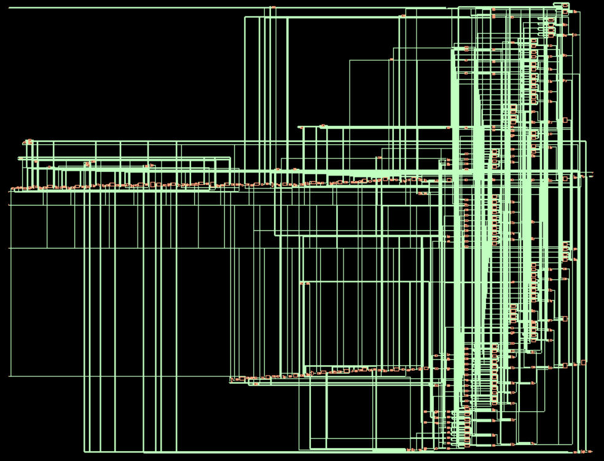

В данном случае DFT не применялся

## ```Cadence Innovus```

**Кольцо питания, Stripes и via**

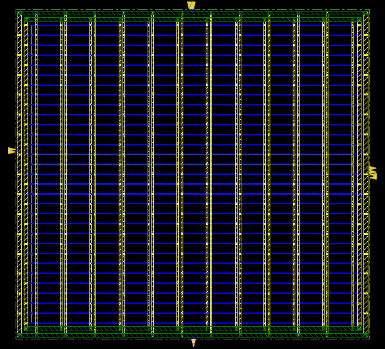


**FIFO после ```place_design``` и ```route_design```**

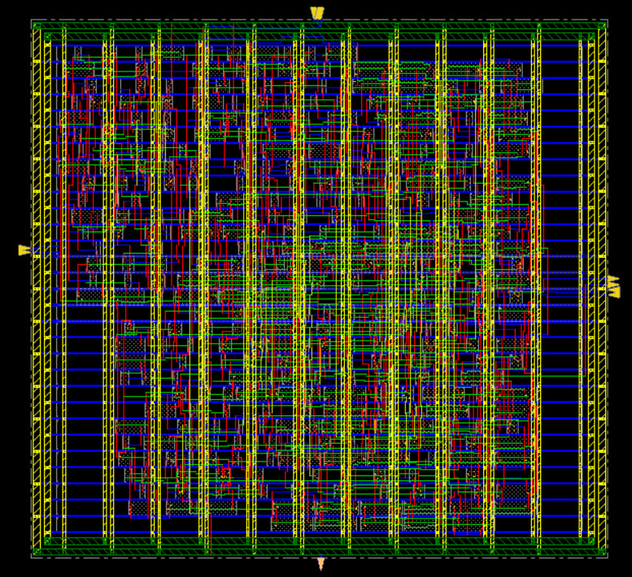

**Добавление ```Filler-Cell```**

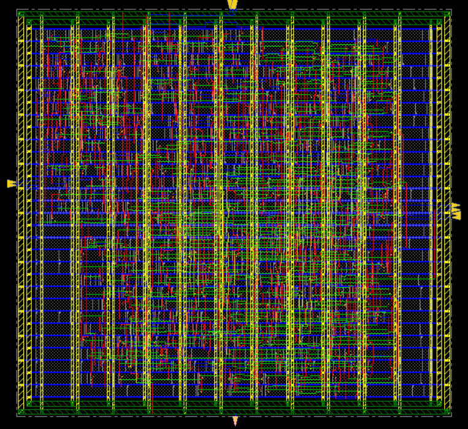
