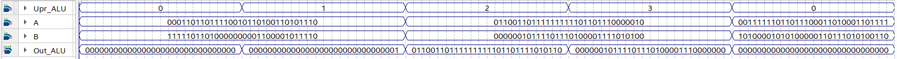
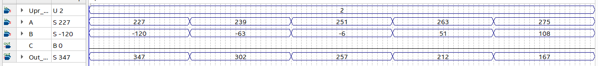
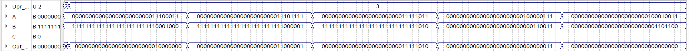
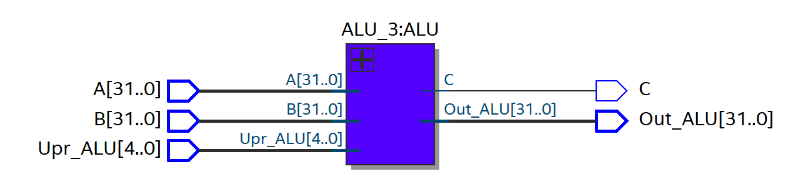
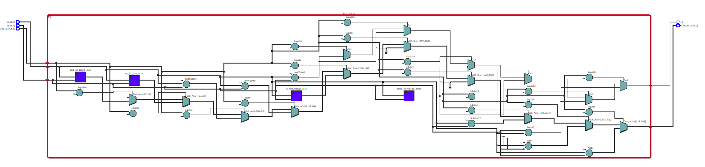
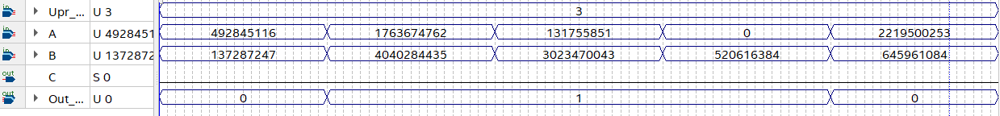
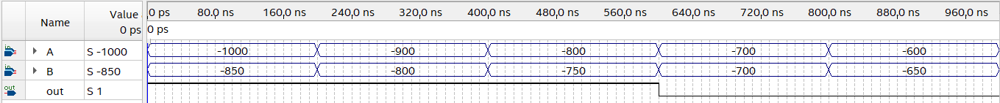

# Лекция 1. АЛУ.

**Некое вступление**

В данной небольшой статье мы рассмотри АЛУ и приведем тривиальные примеры (а потом уже читатель сам под нужную ему архитектуру сделает). На самом деле АЛУ и другие компоненты процессора это весьма очевидная штуковина.

**Что такое АЛУ?**

АЛУ – арифметико-логическое устройство, а если чуток более развернуто, то это штуковина, на которую приходит управляющий сигнал и некий входной сигнал, а она по управляющему сигналу (шине) выбирает операцию и исполняет ее над входными данными (еще, правда, есть такие штуковины как флаги, но про них будет в примерах на Verilog).

То есть, по данному описанию вырисовывается примерная схема АЛУ:

(Данный АЛУ умеет выполнять 4 функции над N-битным числом (элементами шины) и выдавать 1 из 4 функций по управляющему воздействию)

Как мы видим, это просто мультиплексор с некой комбинационной логикой на входах.

**Небольшой пример.**

Найти значение на выходе (в десятичной форме), если upr = 2, а D = 13

Так-как числа A и B это биты числа D в двоичной форме, то переведем D в этот вид (двоичный)

*D* = 13= 11012

Тогда мы находим A и B:

*A* = 012 = 1

*B* = 112 = 3

*u**p**r* = 2= 102, то у нас над числами A и B будет выполняться умножение

ТЕ, на выходе будет:

*o**u**t* = (*A* \* *B*) = 3= 00112

Теперь, познакомившись более-менее с концепцией данного устройства, давайте реализовывать его на Verilog.

**АЛУ номер 1. Переключатор между 4 операциями.**

Данный пример будет вообще в отрыве от различных архитектур и систем, просто сделаем нечто, у которого можно выбрать операцию над входами. Числа пускай будут 32-битными (входы A, B и выход Out_ALU).

**Таблица операций на АЛУ**

<table>
<colgroup>
<col style="width: 49%" />
<col style="width: 50%" />
</colgroup>
<thead>
<tr>
<th style="text-align: center;">Upr_ALU</th>
<th style="text-align: center;">Out_ALU</th>
</tr>
</thead>
<tbody>
<tr>
<td style="text-align: center;">0</td>
<td style="text-align: center;">0</td>
</tr>
<tr>
<td style="text-align: center;">1</td>
<td style="text-align: center;">1</td>
</tr>
<tr>
<td style="text-align: center;">2</td>
<td style="text-align: center;">A | B</td>
</tr>
<tr>
<td style="text-align: center;">3</td>
<td style="text-align: center;">A &amp; B</td>
</tr>
</tbody>
</table>

**Описание на Verilog (но RTL схема выходит некрасивая).**

**Описание на Verilog с красивой RTL схемой (загнал операции ИЛИ, И в модули).**

**Тестирование первого АЛУ**

Тесты ниже не доказывают абсолютную работоспособность схемы, они лишь могут показать некие очевидные ошибки, если они есть, а для полной проверки схемы надо писать полный тестбенч (а тема данной статьи все-таки не совсем про Verilog и реализацию в нем тестбенчей). Ниже я привел быстрый тест схемы “ на глазок”.

**Тест операции 0**

Операция работает (выводит всегда 0).

**Тест операции 1**

Операция работает (выводит всегда 1).

**Тест операции 2**

Операция работает (делает A ИЛИ B)

**Тест операции 3**

Операция работает (делает A И B)

Да, в тесте 2 последних операций есть числа раскрытые не полностью (места не хватило), но автор их проверил, и на них АЛУ тоже работает верно

**Тест всех операций разом**

Как читатель может видеть, вроде бы все работает верно.

**RTL схема**

**АЛУ номер 2. Переключатор между 8 операциями + бит сравнения C.**

Если рассматривать АЛУ в отрыве от какой-либо (даже самой простой) архитектуры, то может быть непонятен смысл бита сравнения. Однако, если читатель поверит мне на слово, то концептуально простейший процессор/программируемое устройство должно уметь аппаратно реализовывать циклы и условные конструкции, бит C отвечает за верность выполнения условия (если C = 1 и должна выполняться проверка некоего условия (это зашито в командах, которыми мы прошиваем устройство), то выполняется нетрадиционный переход с одной строки памяти команд на другую (то есть, в обычном режиме у нас идет чтение 1 строчки кода, затем 2 строчки кода, затем 3 строчки кода и тд, но при выполнении неких условий (условная команда и C = 1) считыватель с памяти команд может перепрыгнуть на 7 строчек наверх по программе, или на 12 строчек вниз, что по сути своей и есть аппаратно реализованные условные конструкции и циклы).

Отходя от большого и красивого обоснования наличия данного бита (ограничимся пока что им) накидаем относительно разумный список команд:

<table>
<colgroup>
<col style="width: 33%" />
<col style="width: 33%" />
<col style="width: 33%" />
</colgroup>
<thead>
<tr>
<th style="text-align: center;">Upr_ALU</th>
<th style="text-align: center;">C</th>
<th style="text-align: center;">Операции на АЛУ</th>
</tr>
</thead>
<tbody>
<tr>
<td style="text-align: center;">0</td>
<td style="text-align: center;">Все равно, но пускай 0</td>
<td style="text-align: center;">0</td>
</tr>
<tr>
<td style="text-align: center;">1</td>
<td style="text-align: center;">Все равно, но пускай 0</td>
<td style="text-align: center;">A+B</td>
</tr>
<tr>
<td style="text-align: center;">2</td>
<td style="text-align: center;">Все равно, но пускай 0</td>
<td style="text-align: center;">A-B</td>
</tr>
<tr>
<td style="text-align: center;">3</td>
<td style="text-align: center;">Все равно, но пускай 0</td>
<td style="text-align: center;">A &amp; B</td>
</tr>
<tr>
<td style="text-align: center;">4</td>
<td style="text-align: center;">Все равно, но пускай 0</td>
<td style="text-align: center;">A | B</td>
</tr>
<tr>
<td style="text-align: center;">5</td>
<td style="text-align: center;">1, если верно, иначе 0</td>
<td style="text-align: center;">A &gt; B</td>
</tr>
<tr>
<td style="text-align: center;">6</td>
<td style="text-align: center;">1, если верно, иначе 0</td>
<td style="text-align: center;">A == B</td>
</tr>
<tr>
<td style="text-align: center;">7</td>
<td style="text-align: center;">Все равно, но пускай 0</td>
<td style="text-align: center;">A &lt;&lt; 1 – сдвиг A на 1 налево</td>
</tr>
</tbody>
</table>

В арифметических операциях нам все равно на C, в условных операциях нам все равно на Out_ALU (а если нам на что-то все равно, то значение на выходе будет 0).

**Описание на Verilog.**

**RTL схема АЛУ.**

Как читатель видит, устройство весьма нехило в размере выросло.

**Тестирование второго АЛУ**

Ну что-ж, давайте начнем сие увлекательное действие, состоящее из тестов выхода АЛУ и C для каждой операции. Также, так-как возможно переполнение, но данный флаг (бит переполнения при операции) нами при данном АЛУ не предусмотрен, то будем давать тесты, при которых переполнения не будет.

**Тест операции 0 (выдает 0)**

**  
**

**Тест операции 1 (выдает A + B)**

**Тест операции 2 (выдает A – B)**

**Тест операции 3 (Логическое И)**

**Тест операции 4 (логическое ИЛИ)**

**Тест операции 5 ( A \> B, работает только для беззнаковых десятичных, желательно свой компаратор писать)**

**Тест операции 6 (A = B)**

**Тест операции 7 (сдвиг на 1 разряд числа A налево (для положительных чисел это примерно умножение на 2)**

Как читатель видит, АЛУ реализовано примерно так, как нам надо (только компаратор можно свой поставить, чтобы он знаковые числа обрабатывал (или встроенный модифицировать))

**АЛУ номер 3. Весьма близко к реальному RISC-V.**

Для выхода АЛУ (у нас вместо result_0 выход Out_ALU

Для некоего характерного бита (флага), у нас, как и в прошлом АЛУ это будет бит C (результат логической операции)

В общем-то, 2 примера АЛУ выше должны были подвести нас к данной штуковине и, в общем-то, показать ее очевидность. Как и в прошлом АЛУ, ставим 0 на выходы, которые мы не используем.

Из новых моментов по сравнению с предыдущим АЛУ скорее большее внимание биту C и оформление кода (теперь, например, вместо кода операции сложения 5’d0 будем использовать ADD с помощью конструкции parameter, которая будет сама вместо ADD подставлять 5’d0). Автор не будет управляющий вход АЛУ разделять на 3 части, просто сделав его 5-битным.

**RTL схема АЛУ.**

**Описание АЛУ на Verilog (главный модуль).**

**Описание АЛУ на Verilog (модули).**

**Тест АЛУ.**

В силу того, что операций весьма много, будем тестировать сразу несколько штук за тест (такой метод позволит найти, увы, только очевиднейшие ошибки).

**Операции ADD, SUB, SLTS (сложение, вычитание, знаковое сравнивание (выход на АЛУ)).**

**Операции XOR, OR, AND (сложение по модулю 2 , ИЛИ, И (везде побитовое, выход на АЛУ)).**

**Операции SLL, SRL, SRA (сдвиг налево, сдвиг направо, арифметический сдвиг направо на B позиций).**

**Операция SLTS (беззнаковое сравнение A \< B).**

Беззнаковое оно, так-как не работает на отрицательных числах (ниже будет пример).

**Тест флага C для АЛУ.**

**Операции EQ, NE (A == B, A!= B, в, если выражение верно, то выводить 1)**

**Операции LTS, GES (знаковое сравнение “меньше”, “больше или равно”).**

**Операции LTU, GEU.**

**Про реализацию знакового компаратора (необязательное дополнение).**

Пускай у нас есть сравниватель (операция “меньше”) для беззнаковых десятичных чисел, необходимо реализовать данную операцию для знаковых десятичных чисел (потому как встроенная операция для беззнаковых).

Реализуем данную операцию путем вычитания из A числа B, результат записав в S (S = A-B). Рассмотрим теперь ситуации, когда S \< 0 (то есть, A \< B).

**Когда A \< 0 (знаковый бит = 1), B \> 0 (знаковый бит = 0).**

$$Учтем\\данное\\условие\\выражением\\A\lbrack 31\rbrack\\\overline{B\lbrack 31\rbrack}$$

**Когда A \> 0 (знаковый бит = 0), B \> 0 (знаковый бит = 0), S \< 0 (знаковый бит = 1)**

$$Учтем\\данное\\условие\\выражением\\\overline{A\lbrack 31\rbrack}\\\overline{B\lbrack 31\rbrack}\\ S\lbrack 31\rbrack$$

**Когда A \< 0 (знаковый бит = 1), B \< 0 (знаковый бит = 1), S \> 0 (знаковый бит = 0)**

$$Учтем\\данное\\условие\\выражением\\A\lbrack 31\rbrack\\ B\lbrack 31\rbrack\\\overline{S\lbrack 31\rbrack\rbrack}$$

В итоге, получим выражение для знакового сравнения:

\[comp_{zn\ A &lt; B} = A\lbrack
31\rbrack\&amp;\overline{B\lbrack 31\rbrack}\ \left| \
\overline{A\lbrack 31\rbrack}\&amp;\overline{B\lbrack 31\rbrack}\&amp;
S\lbrack 31\rbrack\  \right|\ A\lbrack 31\rbrack\&amp; B\lbrack
31\rbrack\&amp; S\lbrack 31\rbrack\ \]

**Код на Verilog, описывающий компаратор знакового сравнения “меньше”.**

**RTL схема знакового компаратора “A меньше B”**

**Тест знакового компаратора.**

Таким образом, у нас есть встроенный компаратор в Verilog, который реализует беззнаковое “меньше” и сейчас мы описали компаратор на Verilog, который выполняет такую же операцию “меньше”, но уже с знаковыми числами. Операцию “равно” будем использовать встроенную в Verilog, а операцию “больше” реализуем как “меньше”, но с другими входными данными (A \> B это же B \< A).

