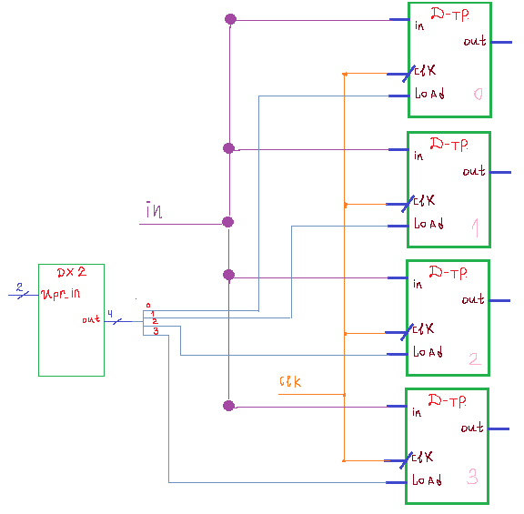

# Лекция 2. Регистровый файл.

**Вступление**

В Харис-Харисе мне больше всего не нравится его резкий переход от средней цифры (триггеров, мультиплексоров, дешифраторов) к высшей цифре (регистровый файл, АЛУ, расширитель знака и тд). В данной небольшой статье поговорим мы про регистровый файл (по факту, встроенная быстрая память процессора) и его устройство.

**Концепция регистрового файла**

Итак, нам надо сделать вот такую штуковину (упрощенный регистровый файл):

**Как она должна работать:**

По управляющей шине мы выбираем номер ячейки памяти, значение с которой мы хотим вывести на выход (соответственно, вход upr_1 управляет out_1, а вход upr_2 управляет out_2)

Вход upr_in задает нам ячейку памяти, в которую надо записывать информацию из data.

Запись в ячейку памяти и ее считывание будет по фронту clk из 0 в 1

**Пример регистрового файла и его работы:**

Давайте сделаем регистровый файл на 32 однобитные ячейки. Тогда, в 3 управляющих шинах (upr_1,upr_2,upr_in) будет по 5 проводов. Так-как ячейки однобитные, то data и out_1, out_2 будут содержать в себе 1 провод.

**Запись информации**

Как мы видим, идет запись “1” по clk в 3 ячейку памяти, “0” по clk в 11 ячейку памяти и “1” по clk в 30 ячейку памяти.

**Считывание информации с ячеек памяти**

Давайте найдем значение на выходах после 3 event (3 переходов clk с 0 в 1)

$$**event_{1}:**

out_{1} = память_{3} = \text{"1"}, out_{2} = память_{11} = "0"
$$

$$event\_{2};\\\\\\out\_{1} = память\_{6} = \text{"0"},\\out\_{2} = память\_{3} = "1"$$

$$event\_{3};\\\\\\out\_{1} = память\_{30} = \text{"1"},\\out\_{2} = память\_{13} = "0"$$

**Пример работы регистрового файла (WE = 1 – запись с data в ячейку номером upr_in разрешена)**

Ну что, работать с ним мы научились более-менее (точнее, поняли очевидность работы с ним), давайте теперь его соберем из триггеров (4 ячейки памяти, каждая ячейка содержит 1 бит).

**Построение 4-битного регистрового файла на D-триггерах.**

Хоть тут и будет построен только 4-битный регистровый ф+айл c 1 выходом, у которого 1-битная ячейка памяти, но принцип построения 32-битного регистра, у которого 32-битная ячейка памяти будет таким же.

Ну что, давайте строить схему

**Основа – 4 D-триггера с общим clk и in**

**Выбор ячейки для записи будет осуществляться дешифратором на сигналы Load. Также, пронумеруем ячейки памяти**

Ну что, вот мы реализовали запись в наш регистровый файл (по управляющей шине приходит 1 на выбранный триггер, и он записывает это состояние), давайте реализуем считывание.

Для считывания будем применять описанные выше буферы с 3 состояниями, которыми управлять будем с помощью дешифратора (позднее я узнал, что для выхода RF предпочтительнее мультиплексор вместо буферов).

**Реализация считывания:**

Таким образом, нами был реализован вот такой вот упрощенный регистровый файл:

**Описание на Verilog регистрового файла вручную (не через встроенную ячейку памяти).**

Способ описания на Verilog, представленный ниже, является несколько избыточным (потому как регистровый файл можно строчек на 20 кода реализовать с помощью встроенной синхронной ячейки памяти, но методически верный (если я уж наговорил красивой абстрактной теории про реализацию RF через триггеры, которыми управляют дешифраторы, то хотелось бы данную теорию увидеть в практической реализации и протестировать). Сделаем, для простоты и компактности RF всего-то на 4 бита.

План реализации регистрового файла:

1)  D триггер с сигналом Load

2)  буферы с 3 состояниями для выходов регистрового файла

3)  Дешифратор DX2

4)  Все соединяем и делаем Write Enable (WE)

5)  Тестируем

**D-триггер с сигналом Load**

По смыслу, если Load = 1, то запись в триггер разрешена (out = data), если Load = 0, то запись в триггер запрещена (out = out). Тогда, мы можем записать логическое выражение для out через data и Load:

$$out = data\\ Load\\|\\out\\\overline{Load}$$

Опишем данное устройство на Verilog:

**Код на Verilog**

**Схема**

**  
**

**Буфер с 3 состояниями**

Вместо буферов с 3 состоянием можно было бы воспользоваться просто мультиплексором, но я решил использовать их.

**Код на Verilog.**

**RTL схема.**

**Дешифратор DX2 (c enable и без enable).**

Раз уж решил описывать каждый модуль, то и DX2 оставлю тут.

**Код на Verilog**

**Схема регистрового файла без WE**

Для реализации сигнала Write-Enable просто поставим вместо обычного входного дешифратора дешифратор с enable (тогда при WE = 0 он выдает все 0 на выходе и ячейки памяти не будут активными для записи)

**Код на Verilog.**

**  
**

**Схема регистрового файла с WE.**

**Тестирование регистрового файла.**

**Регистровый файл через встроенную ячейку памяти на Verilog (32 ячейки, 32 бита каждая, в нулевой ячейке всегда 0).**

Данный способ куда более быстрый и генерирует просто готовый регистровый файл, именно данным способом обычно быстро описывают Register File как отдельный блок при проектировании процессора

**Заключение**

В данной статье была разобрана тривиальность как применения регистрового файла, так и его устройства (Д-триггеры и 2 дешифратора), чего, увы, нет в том же Харис-Харисе, из-за чего я сильно тупил над данной темой.
