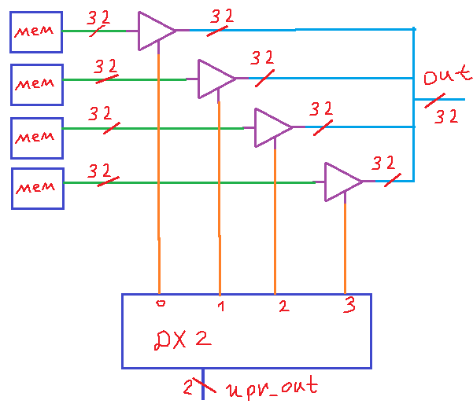
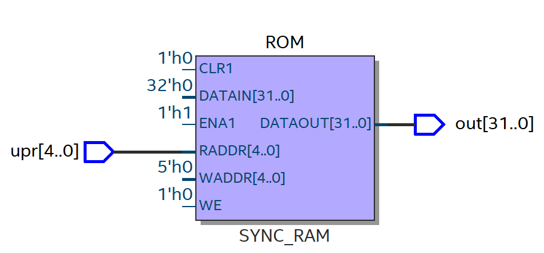
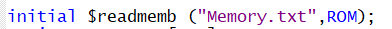
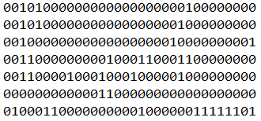
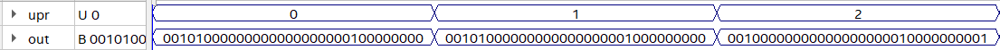
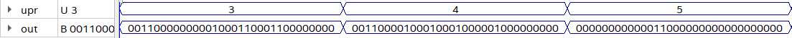
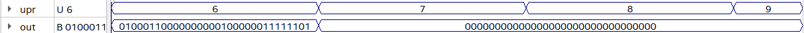
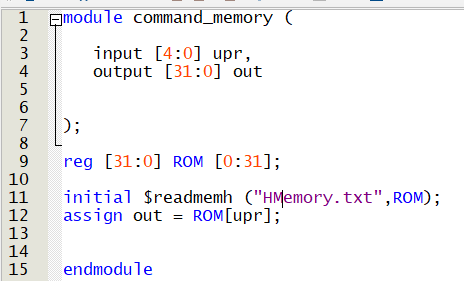
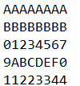
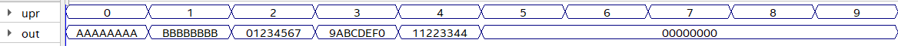

# Лекция 3. Немного про память команд.

**Вступление**

В данной небольшой заметке хотел бы затронуть такой примитив высшей цифровой схемотехники как память команд (играет роль хранителя прошивки для процессора). По сути, это просто постоянная память (ROM), которая по управляющему входу задает выход (это не всегда так, но в довольно простых процессорах данное утверждение верно (а в более сложных структурах иногда эту память заменяют на аналог регистрового файла с некоторыми нюансами).

**Про схему памяти команд**

Как мы поняли ранее в вступлении, память команд – постоянная память (ТЕ ROM, например, Flash-память), так что реализовывать будем ее с “волшебными” ячейками памяти и рассмотрим, собственно, саму организацию ROM.

**ROM с 4 32-битными ячейками памяти**

Разумеется, на выход можно было бы поставить MUX, но в микросхемах памяти предпочитают использовать буферы с 3 состоянием (опять-таки, позднее автор узнал, что для малых элементов памяти мультиплексор предпочтительнее. Про то, как реализуются сами ячейки памяти, мы не думаем — это не наш уровень абстракции.



Ну что, абстрактными красивыми словами поговорили, давайте теперь напишем код на Verilog и посмотрим, во что он синтезируется.

**Код на Verilog (построчная адресация)**

``` Verilog
module command_memory (

	input [4:0] upr,
	output [31:0] out
	

);

reg [31:0] ROM [0:31];

initial $readmemb ("Memory.txt",ROM);
assign out = ROM[upr];


endmodule
```

**Код на Verilog (побайтовая адресация, для RISC-V)**
```Verilog
module command_memory (

	input [31:0] upr,
	output [31:0] out
	

);

reg [31:0] ROM [0:31];

initial $readmemb ("Memory.txt",ROM);
assign out = ROM[upr[31:2]];


endmodule
```


**Схема**



Данная строчка просто задает значения для памяти (которые лежат в текстовике)



**Содержимое текстовика (памяти команд)**



**Тестирование памяти команд.**







Разумеется, можно вбивать числа и в 16-ричной системе в текстовик, в коде же вместо буковки b (binary) надо будет поставить буковку h (hexadecimal).

Как мы видим, ничего особо не поменялось.



**Содержимое текстовика (памяти команд).**



**Тестирование памяти команд**


