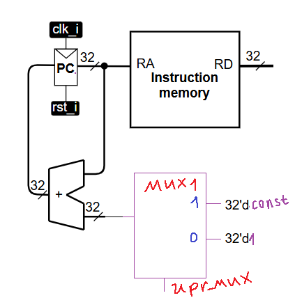
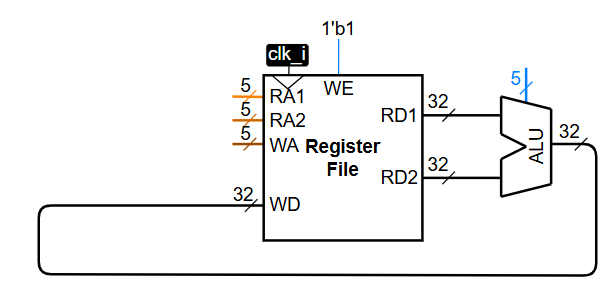
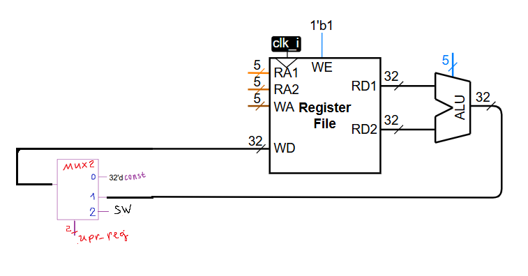
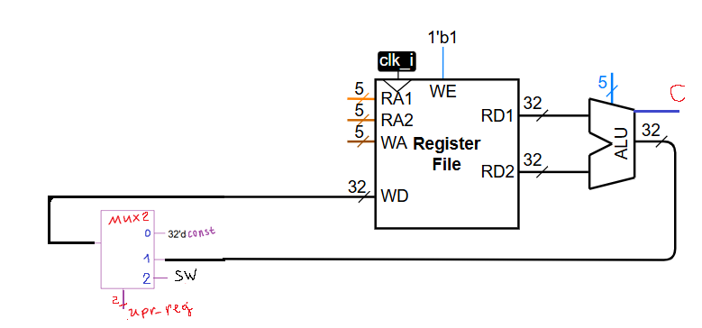
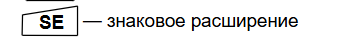
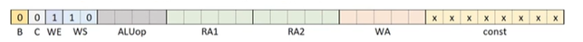
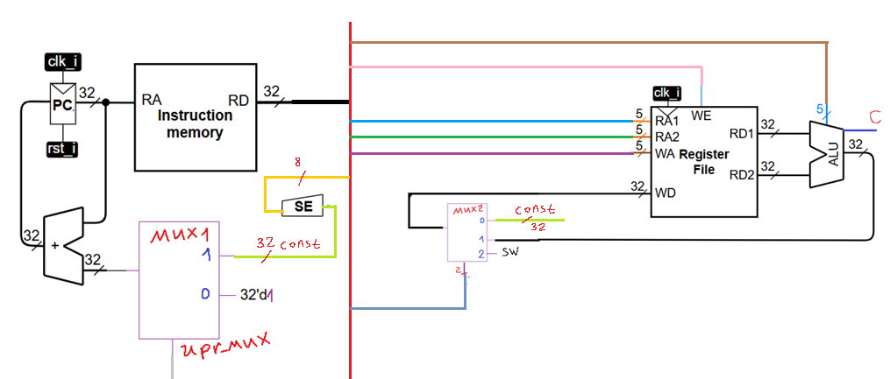
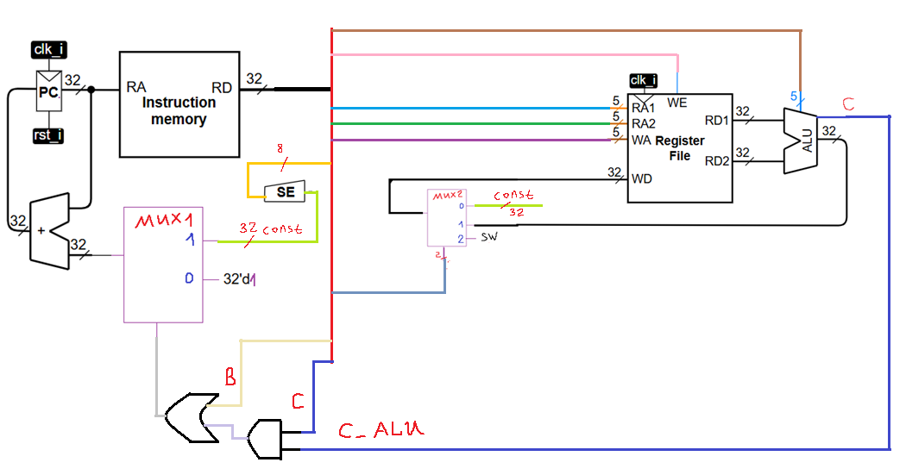
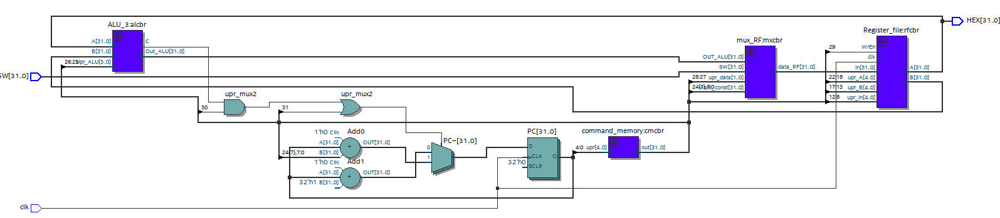

# Лекция 4. Простейший процессор.

**Введение**

Автор в данной статье расскажет про весьма сильно упрощенный процессор “Кобра”, архитектура которого что-то около RISC-V, а методически он весьма неплохо показывает устройство процессора и принцип его работы (мне понравилось, потому как сразу в лицо кидать декодер инструкций, конвейеры, параллелизм и тд такое себе). Если же добавить немного спойлеров из следующих лекций, то данный процессор функционально – это RISC-V, реализующий I_1, B, R.

**Про микроархитектуру процессора.**

При рассказе про различные микроархитектуры есть 2 разных подхода: нарисовать картинку красивую и потом объяснять, что она делает, или же поставить создание процессора/блока процессора в качестве задачи и вместе с читателем решать ее. Я пойду этим путем, и построю архитектуру процессора из того, что он должен делать.

При таком подходе реализуются сначала куски архитектуры, которые потом будут соединяться между собой (но это потом, а сейчас давайте не сильно задумываться про то, откуда мы берем различные управляющие сигналы и константы)

1)Он должен уметь перескакивать с 1 строчки программы (содержания памяти команд) на произвольную другую по некоему условию, а если нет, то просто идти сверху вниз (аппаратно реализованные циклы и if-else)

Реализуем сначала аппаратно возможность перескакивать на разные инструкции с помощью мультиплексора.



Также, отложим у себя в голове, что надо где-то завести провод, который будет отвечать за переключение мультиплексора (назовем данный провод условным, так-как он будет отвечать за то, работает ли чтение программы в типичном режиме, или же мы перескакиваем куда-то вверх или вниз по выполнению условия).

2)Он должен делать какие-то вычисления и куда-то результаты вычислений складывать, то есть надо АЛУ и память (в качестве которой будет выступать регистровый файл).



На рисунке выше изображена условная ситуация, хотелось бы записывать данные в регистровый файл не только с АЛУ, но также константу и с внешних проводов (это вход SW)

Так что более-менее адекватно будет выглядеть такая конфигурация:



Разумеется, сюда можно добавить еще как минимум 1 вход (например, константный 0), но это уже на усмотрение читателя.

3)Не будем также забывать о том, что нам нужен некий индикатор в АЛУ, например, сравнения 2 чисел, который я назову C (да, тот самый флаг сравнения).



4)Надо откуда-то брать константу, предлагается первые 8 бит команды отдать под константу, но, так-как мы использовали 32-битное представление константы выше, то нам надо расширить константу с 8 бит до 32 (и сохранить знак, так-как константа может быть отрицательным числом).

Решается это весьма просто: мы просто припаиваем 24 провода к 7 (считаем с 0 провода), возможно поставив буфер для более быстрой перезарядки 25 проводов 1 выходом. Таким образом и получается 32-битная константа с сохранением знака.

Данное действие выполняет блок SE – знаковое расширение



5)Также, надо какие-то биты в команде отдать и под управление переходами в программе (если равен единице бит безусловного перехода, то у нас независимо от результата на АЛУ счетчик должен измениться на константу), а если равен единице бит условного перехода, то уже скачок на константу будет только если на АЛУ индикатор C = 1

Таким образом, получаем некое разбиение 32-битной команды:



**Что нового относительно прошлых лекций:**

Разумеется, можно было бы разбить и по-другому, но так будет более-менее близко к реальному процессору.

B – бит безусловного перехода (если он 1, то, например, на 3 инструкции наверх (если константа равна -3)

C – бит условного перехода (если он 1 и C на АЛУ 1, то у нас, опять-таки, на 3 инструкции наверх (const = -3)

WE – записываем/не записываем результат АЛУ в регистровый файл

WS – управление входом в регистровый файл (что записываем: константу, выход АЛУ, с внешних источников?)

Остальные биты инструкции отвечают за выбором операции на АЛУ, за тем, какую ячейку памяти вывести на каждый из 2 выходов регистрового файла, в какую ячейку регистрового файла записываем, 8 первых бит - константа.

**Соединяем блоки**

Далее мы просто берем и различные провода из прошивки (памяти команд) присоединяем к регистровому файлу, АЛУ, мультиплексорам и тд:



Читатель сам, при желании, может расставить по разбиению команды номера проводов, которые идут от памяти инструкций к логике.

Мы же сейчас займемся последним штришком: будем реализовывать условный и безусловный перенос. Достигается это весьма просто : ставим И между C и C_ALU, а на вход upr_mux подаем B ИЛИ (C и C_ALU) (что полностью удовлетворяет требованиям условного и безусловного перехода.



Вот и все, программируемое устройство, весьма сильно напоминающее процессор готово!

Далее пойдет уже мой код на Verilog в котором я его описываю:

**Мультиплексор на входе в регистровый файл:**
``` Verilog
module mux_RF (
	input [1:0] upr_data,
	input [31:0] SW,
	input [31:0] work_const,
	input [31:0] OUT_ALU,
	output reg [31:0] data_RF
);
always @(*) begin
	case (upr_data[1:0])
		2'd0: data_RF = work_const;
		2'd1: data_RF = SW;
		2'd2: data_RF = OUT_ALU;
		default: begin
			data_RF = 0;
		end
	endcase;
end

endmodule
```

**Регистровый файл:**
``` Verilog
module Register_file(
	input [4:0] upr_A,
	input [4:0] upr_B,
	input [4:0] upr_in,
	input [31:0] in,
	output [31:0] A,
	output [31:0] B,
	input clk,
	input WrEn

);

reg  [31:0] RAM [0:31];

assign A = (upr_A == 5'd0) ? 32'd0: RAM [upr_A];
assign B = (upr_B == 5'd0) ? 32'd0: RAM [upr_B];

always @(posedge clk) begin
	if (WrEn) begin
		RAM[upr_in] <= in;
	end

end


endmodule 
```

**Модули АЛУ**

``` Verilog
module and_32_b (
	input [31:0] A,
	input [31:0] B,
	output [31:0] out_and
);
assign out_and = A & B;

endmodule
```

``` Verilog
module comp_menshe (
	input [31:0] A,
	input [31:0] B,
	output out
);

wire [31:0] S;
assign S = A-B;
assign out = (A[31] & ~B[31]) | (~A[31] & ~B[31] & S[31]) | (A[31] & B[31] & S[31]);

endmodule
```

``` Verilog
module or_32_b (
	input [31:0] A,
	input [31:0] B,
	output [31:0] out_or

);

assign out_or = A | B;
endmodule
```

``` Verilog
module sl_mod2 (
	input [31:0] A,
	input [31:0] B,
	output [31:0] out
);

assign out = A ^ B;

endmodule
```

**АЛУ (заметьте, оно больше процессора)**
```Verilog
module ALU_3 (
	input [3:0] Upr_ALU,
	input [31:0] A,
	input [31:0] B,
	output C,
	output [31:0] Out_ALU
);

parameter ADD = 4'd0;
parameter SUB = 4'd1;
parameter SLL = 4'd2;
parameter SLTS = 4'd3;
parameter SLTU = 4'd4;
parameter XOR = 4'd5;
parameter SRL = 4'd6;
parameter SRA = 4'd7;
parameter OR = 4'd8;
parameter AND = 4'd9;
parameter EQ = 4'd10;
parameter NE = 4'd11;
parameter LTS = 4'd12;
parameter GES = 4'd13;
parameter LTU = 4'd14;
parameter GEU = 4'd15;

wire [31:0] out_or;
wire [31:0] out_and;
wire [31:0] out_add;
wire [31:0] out_sub;
wire [31:0] out_xor;
wire [31:0] out_sll;
wire [31:0] out_slts;
wire [31:0] out_sltu;
wire [31:0] out_srl;
wire [31:0] out_sra;
wire out_A_menshe_B_zn;
wire out_A_ne_menshe_B_zn;
wire out_A_menshe_B;
wire out_A_ne_menshe_B;
wire out_equal;
wire out_notequal;

assign out_A_ne_menshe_B_zn = ~out_A_menshe_B_zn;
assign out_A_ne_menshe_B = ~out_A_menshe_B;
assign out_equal = (A==B) ? 1'b1 : 1'b0;
assign out_A_menshe_B = (A<B) ? 1'b1 : 1'b0;
assign out_notequal = ~out_equal;

assign out_add = A+B;
assign out_sub = A-B;
assign out_sll = A << B;
assign out_slts = {{31{1'b0}},out_A_menshe_B_zn};
assign out_sltu = {{31{1'b0}},out_A_menshe_B};
assign out_srl = A >> B;
assign out_sra = A >>>B;


assign Out_ALU = (Upr_ALU == ADD) ? out_add:
					  (Upr_ALU == SUB) ? out_sub:
					  (Upr_ALU == SLL) ? out_sll:
					  (Upr_ALU == SLTS) ? out_slts:
					  (Upr_ALU == SLTU) ? out_sltu:
					  (Upr_ALU == XOR) ? out_xor:
					  (Upr_ALU == SRL) ? out_srl: 
					  (Upr_ALU == SRA) ? out_sra:
					  (Upr_ALU == OR) ? out_or:
					  (Upr_ALU == AND) ? out_and:32'b0;

assign C = (Upr_ALU == EQ) ? out_equal:
			  (Upr_ALU == NE) ? out_notequal:
			  (Upr_ALU == LTS) ? out_A_menshe_B_zn:
			  (Upr_ALU == GES) ? out_A_ne_menshe_B_zn:
			  (Upr_ALU == LTU) ? out_A_menshe_B:
			  (Upr_ALU == GEU) ? out_A_ne_menshe_B:1'b0;
					  
									  
or_32_b or_ALU (
	.A(A),
	.B(B),
	.out_or(out_or)

);

and_32_b and_ALU (
	.A(A),
	.B(B),
	.out_and(out_and)
);

sl_mod2 mod2_ALU (
	.A(A),
	.B(B),
	.out(out_xor)
);

comp_menshe zn_comp (
	.A(A),
	.B(B),
	.out(out_A_menshe_B_zn)
);			
endmodule
```

**Кобра, описание на Verilog:**

``` Verilog
module cobra (
	input clk,
	input [31:0] SW,
	output [31:0] HEX

);

wire [4:0] upr_in;
wire [4:0] upr_1;
wire [4:0] upr_2;
wire [31:0] A;
wire [31:0] B;
wire WrEn;
reg [31:0]data_RF;
wire [31:0] pr_data_RF;
wire [31:0] instr;
wire [3:0] UPR_ALU;
wire [31:0] OUT_ALU;
reg [31:0] PC = 32'b0;
wire c;
wire [31:0] work_const;
wire upr_mux2;
wire [1:0] upr_data;


assign upr_in = instr[12:8];
assign upr_1 = instr[22:18];
assign upr_2 = instr[17:13];
assign UPR_ALU = instr[26:23];
assign WrEn = instr[29];
assign upr_mux2 = c&instr[30]|instr[31];
assign work_const = {{24{instr[7]}}, instr[7:0] };
assign upr_data = instr[28:27];
assign pr_data_RF = data_RF;
assign HEX = A;

Register_file rfcbr (
	.upr_A(upr_1),
	.upr_B(upr_2),
	.upr_in(upr_in),
	.in(data_RF),
	.A(A),
	.B(B),
	.clk(clk),
	.WrEn(WrEn)
); 

always @(posedge clk) begin
	if (upr_mux2==1) begin
		PC <= PC + work_const;
	end
	
	else  begin
		PC <= PC + 1;
	end
end

mux_RF mxcbr (
	.upr_data(upr_data),
	.SW(SW),
	.work_const(work_const),
	.OUT_ALU(OUT_ALU),
	.data_RF(pr_data_RF)
);

ALU_3 alcbr (
	.Upr_ALU(UPR_ALU),
	.A(A),
	.B(B),
	.C(c),
	.Out_ALU(OUT_ALU)
);

command_memory cmcbr (
	.upr(PC),
	.out(instr)
);


endmodule
```

**RTL схема Cobra:**



**Вывод**

Мы теоретически разобрали простейший недопроцессор и даже описали его на Verilog и посмотрели, во что он синтезируется (а еще поняли, что процессор = очевидная штуковина). Да, для реального процессора это примерно скелет, нету даже элементарного декодера инструкций, но как ступенька для развития вполне себе подходит.

