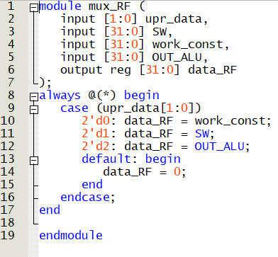
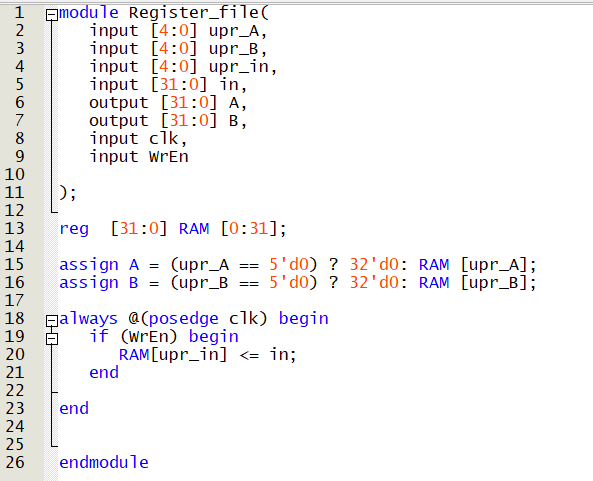
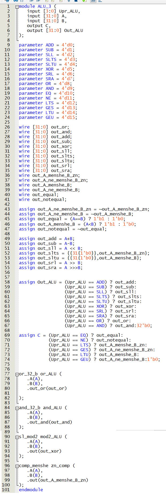

# Лекция 4. Простейший процессор.

**Введение**

Автор в данной статье расскажет про весьма сильно упрощенный процессор “Кобра”, архитектура которого что-то около RISC-V, а методически он весьма неплохо показывает устройство процессора и принцип его работы (мне понравилось, потому как сразу в лицо кидать декодер инструкций, конвейеры, параллелизм и тд такое себе). Если же добавить немного спойлеров из следующих лекций, то данный процессор функционально – это RISC-V, реализующий I_1, B, R.

**Про микроархитектуру процессора.**

При рассказе про различные микроархитектуры есть 2 разных подхода: нарисовать картинку красивую и потом объяснять, что она делает, или же поставить создание процессора/блока процессора в качестве задачи и вместе с читателем решать ее. Я пойду этим путем, и построю архитектуру процессора из того, что он должен делать.

При таком подходе реализуются сначала куски архитектуры, которые потом будут соединяться между собой (но это потом, а сейчас давайте не сильно задумываться про то, откуда мы берем различные управляющие сигналы и константы)

1)Он должен уметь перескакивать с 1 строчки программы (содержания памяти команд) на произвольную другую по некоему условию, а если нет, то просто идти сверху вниз (аппаратно реализованные циклы и if-else)

Реализуем сначала аппаратно возможность перескакивать на разные инструкции с помощью мультиплексора.

Также, отложим у себя в голове, что надо где-то завести провод, который будет отвечать за переключение мультиплексора (назовем данный провод условным, так-как он будет отвечать за то, работает ли чтение программы в типичном режиме, или же мы перескакиваем куда-то вверх или вниз по выполнению условия).

2)Он должен делать какие-то вычисления и куда-то результаты вычислений складывать, то есть надо АЛУ и память (в качестве которой будет выступать регистровый файл).

На рисунке выше изображена условная ситуация, хотелось бы записывать данные в регистровый файл не только с АЛУ, но также константу и с внешних проводов (это вход SW)

Так что более-менее адекватно будет выглядеть такая конфигурация:

Разумеется, сюда можно добавить еще как минимум 1 вход (например, константный 0), но это уже на усмотрение читателя.

3)Не будем также забывать о том, что нам нужен некий индикатор в АЛУ, например, сравнения 2 чисел, который я назову C (да, тот самый флаг сравнения).

4)Надо откуда-то брать константу, предлагается первые 8 бит команды отдать под константу, но, так-как мы использовали 32-битное представление константы выше, то нам надо расширить константу с 8 бит до 32 (и сохранить знак, так-как константа может быть отрицательным числом).

Решается это весьма просто: мы просто припаиваем 24 провода к 7 (считаем с 0 провода), возможно поставив буфер для более быстрой перезарядки 25 проводов 1 выходом. Таким образом и получается 32-битная константа с сохранением знака.

Данное действие выполняет блок SE – знаковое расширение

5)Также, надо какие-то биты в команде отдать и под управление переходами в программе (если равен единице бит безусловного перехода, то у нас независимо от результата на АЛУ счетчик должен измениться на константу), а если равен единице бит условного перехода, то уже скачок на константу будет только если на АЛУ индикатор C = 1

Таким образом, получаем некое разбиение 32-битной команды:

**Что нового относительно прошлых лекций:**

Разумеется, можно было бы разбить и по-другому, но так будет более-менее близко к реальному процессору.

B – бит безусловного перехода (если он 1, то, например, на 3 инструкции наверх (если константа равна -3)

C – бит условного перехода (если он 1 и C на АЛУ 1, то у нас, опять-таки, на 3 инструкции наверх (const = -3)

WE – записываем/не записываем результат АЛУ в регистровый файл

WS – управление входом в регистровый файл (что записываем: константу, выход АЛУ, с внешних источников?)

Остальные биты инструкции отвечают за выбором операции на АЛУ, за тем, какую ячейку памяти вывести на каждый из 2 выходов регистрового файла, в какую ячейку регистрового файла записываем, 8 первых бит - константа.

**Соединяем блоки**

Далее мы просто берем и различные провода из прошивки (памяти команд) присоединяем к регистровому файлу, АЛУ, мультиплексорам и тд:

Читатель сам, при желании, может расставить по разбиению команды номера проводов, которые идут от памяти инструкций к логике.

Мы же сейчас займемся последним штришком: будем реализовывать условный и безусловный перенос. Достигается это весьма просто : ставим И между C и C_ALU, а на вход upr_mux подаем B ИЛИ (C и C_ALU) (что полностью удовлетворяет требованиям условного и безусловного перехода.

Вот и все, программируемое устройство, весьма сильно напоминающее процессор готово!

Далее пойдет уже мой код на Verilog в котором я его описываю:

**Мультиплексор на входе в регистровый файл:**

**Регистровый файл:**

**Модули АЛУ (кроме знакового компаратора, но он в конце статьи есть)**

**  
**

**АЛУ (заметьте, оно больше процессора)**

**Кобра, описание на Verilog:**

**RTL схема Cobra:**

**Вывод**

Мы теоретически разобрали простейший недопроцессор и даже описали его на Verilog и посмотрели, во что он синтезируется (а еще поняли, что процессор = очевидная штуковина). Да, для реального процессора это примерно скелет, нету даже элементарного декодера инструкций, но как ступенька для развития вполне себе подходит.

**Дополнение: компаратор знакового сравнения “меньше” (к АЛУ).**

**RTL схема знакового компаратора “A меньше B”**

