#  Лекция 5. Прошивка “Cobra”

**Введение**

В данной статье мы немного поиграемся с написанным ранее процессором, прошивая его разными способами.

**Операция на АЛУ над регистрами RA1 и RA2, результат записывается в WA**

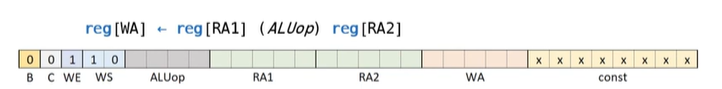

**Загрузка константы в регистр WA**

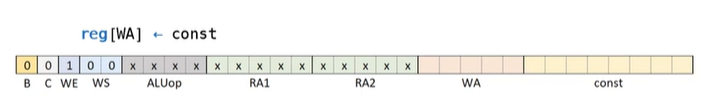

**Пример 1. Найдем сумму 7 и 8. Номер операции ADD (ALU_OP = 0)**

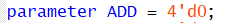

**Код на Verilog, который отвечает за то, что будет загружено в регистровый файл (upr_data = WS).**

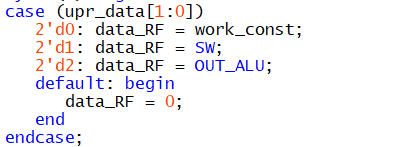

**Строчка 1. Загрузка 7 в регистр 1**

00 1 00 0000 00000 00000 00001 00000111

> 
> 000001112 = 7 = Константа, которую мы загружаем
> 
> 000012 = 1 − *р**е**г**и**с**т**р*, *в* *к**о**т**о**р**ы**й* *м**ы* *з**а**п**и**с**ы**в**а**е**м* *к**о**н**с**т**а**н**т**у*
>
> 1 − *р**а**з**р**е**ш**а**е**м* *з**а**п**и**с**ь* *в* *р**е**г**и**с**т**р**о**в**ы**й* *ф**а**й**л*

**Строчка 2. Загрузка 8 в регистр 2**

00 1 00 0000 00000 00000 00010 00001000

> 
> 000010002 = 8 = *к**о**н**с**т**а**н**т**а*, *к**о**т**о**р**у**ю* *м**ы* *з**а**г**р**у**ж**а**е**м*
>
> 000102 = 2 − *р**е**г**и**с**т**р*, *в* *к**о**т**о**р**ы**й* *м**ы* *з**а**п**и**с**ы**в**а**е**м* *к**о**н**с**т**а**н**т**у*
>
> 1 − *р**а**з**р**е**ш**а**е**м* *з**а**п**и**с**ь* *в* *р**е**г**и**с**т**р**о**в**ы**й* *ф**а**й**л*

*  
*

**Строчка 3. Загрузка в 3 регистр суммы чисел из 1 и 2 регистра.**

00 1 10 0000 00010 00001 00011 00000000

> 
> 102 = 2 − *н**а* *в**х**о**д* *р**е**г**и**с**т**р**о**в**о**г**о* *ф**а**й**л**а* *п**о**д**а**е**т**с**я* *о**п**е**р**а**ц**и**я* *с* *А**Л**У*
>
> 00002 = 0 − *н**о**м**е**р* *о**п**е**р**а**ц**и**и* *н**а* *А**Л**У*
>
> 000012 = 1 − *с* *э**т**о**й* *я**ч**е**й**к**и* *п**а**м**я**т**и* *б**е**р**е**м* *R**A*2
>
> 000102 = 2 − *с* *э**т**о**й* *я**ч**е**й**к**и* *п**а**м**я**т**и* *б**е**р**е**м* *R**A*1
>
> 000112 = 3 − *р**е**г**и**с**т**р*, *в* *к**о**т**о**р**ы**й* *м**ы* *з**а**п**и**с**ы**в**а**е**м* *р**е**з**у**л**ь**т**а**т* *о**п**е**р**а**ц**и**и* *н**а* *А**Л**У*
>
> 1 − *р**а**з**р**е**ш**а**е**м* *з**а**п**и**с**ь* *в* *р**е**г**и**с**т**р**о**в**ы**й* *ф**а**й**л*

**Строчка 4. Выводим значение с 3 ячейки регистрового файла (получаем результат)**

00 0 00 0000 00011 00000 00000 00000000

000112 = 3 − *в**ы**в**о**д**и**м* *з**н**а**ч**е**н**и**е* *с* 3 *я**ч**е**й**к**и* , *т**к* *с**н**и**м**а**е**м* *д**а**н**н**ы**е*  *с* *в**ы**х**о**д**а* 1 *R**F* 

**Итоговая прошивка:**

00100000000000000000000100000111

00100000000000000000001000001000

00110000000010000010001100000000

00000000000011000000000000000000

**То, что должно быть по clk:**

1)  Загрузка 7 в регистр 1, на выходе RF (RA1) будет 0 ячейка, соответственно, покажет 0.

2)  Загрузка 8 в регистр 2, на выходе RF (RA1) будет 0 ячейка, соответственно, покажет 0.

3)  Загрузка суммы из 1 и 2 регистра в 3 регистр, (RA1 = 1), на выходе RF будет значение в 1 ячейке (то есть 8)

4)  Вывод результата суммы, что записана в 3 ячейке (RA1 = 3), на выходе RF будет результат суммы 7 и 8 = 15

Далее же PC идет +1 и в IM есть только 32’b0 строчки, поэтому регистровый файл выводит значение с 0 ячейки (то есть 0)

**Результат симуляции cobra с нашей прошивкой.**

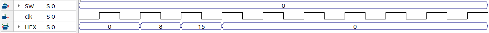

Как читатель видит, вышло ровно так, как и предполагалось.

**Пример 2. Найдем 32-64**

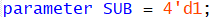

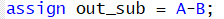

**  
**

**Строчка 1. Загрузка 32 в регистр 1**

00 1 00 0000 00000 00000 00001 00100000

> 
> 001000002 = 32 = *к**о**н**с**т**а**н**т**а*, *к**о**т**о**р**у**ю* *м**ы* *з**а**г**р**у**ж**а**е**м*
>
> 000012 = 1 − *р**е**г**и**с**т**р*, *в* *к**о**т**о**р**ы**й* *м**ы* *з**а**п**и**с**ы**в**а**е**м* *к**о**н**с**т**а**н**т**у*
>
> 1 − *р**а**з**р**е**ш**а**е**м* *з**а**п**и**с**ь* *в* *р**е**г**и**с**т**р**о**в**ы**й* *ф**а**й**л*

**Строчка 2. Загрузка 64 в регистр 2**

00 1 00 0000 00000 00000 00010 01000000

> 
> 010000002 = 64 = *к**о**н**с**т**а**н**т**а*, *к**о**т**о**р**у**ю* *м**ы* *з**а**г**р**у**ж**а**е**м*
>
> 000102 = 2 − *р**е**г**и**с**т**р*, *в* *к**о**т**о**р**ы**й* *м**ы* *з**а**п**и**с**ы**в**а**е**м* *к**о**н**с**т**а**н**т**у*
>
> 1 − *р**а**з**р**е**ш**а**е**м* *з**а**п**и**с**ь* *в* *р**е**г**и**с**т**р**о**в**ы**й* *ф**а**й**л*

**Строчка 3. Загрузка в 3 регистр разницы чисел из 1 и 2 регистра.**

00 1 10 0001 00001 00010 00011 00000000

> 
> 102 = 2 − *н**а* *в**х**о**д* *р**е**г**и**с**т**р**о**в**о**г**о* *ф**а**й**л**а* *п**о**д**а**е**т**с**я* *о**п**е**р**а**ц**и**я* *с* *А**Л**У*
>
> 00012 = 1 − *н**о**м**е**р* *о**п**е**р**а**ц**и**и* *н**а* *А**Л**У*
>
> 000012 = 1 − *с* *э**т**о**й* *я**ч**е**й**к**и* *п**а**м**я**т**и* *б**е**р**е**м* *R**A*2
>
> 000102 = 2 − *с* *э**т**о**й* *я**ч**е**й**к**и* *п**а**м**я**т**и* *б**е**р**е**м* *R**A*1
>
> 000112 = 3 − *р**е**г**и**с**т**р*, *в* *к**о**т**о**р**ы**й* *м**ы* *з**а**п**и**с**ы**в**а**е**м* *р**е**з**у**л**ь**т**а**т* *о**п**е**р**а**ц**и**и* *н**а* *А**Л**У*
>
> 1 − *р**а**з**р**е**ш**а**е**м* *з**а**п**и**с**ь* *в* *р**е**г**и**с**т**р**о**в**ы**й* *ф**а**й**л*

**Строчка 4. Выводим значение с 3 ячейки регистрового файла (получаем результат)**

00 0 00 0000 00011 00000 00000 00000000

000112 = 3 − *в**ы**в**о**д**и**м* *з**н**а**ч**е**н**и**е* *с* 3 *я**ч**е**й**к**и* , *т**к* *с**н**и**м**а**е**м* *д**а**н**н**ы**е*  *с* *в**ы**х**о**д**а* 1 *R**F* 

**Итоговая прошивка:**

00100000000000000000000100100000

00100000000000000000001001000000

00110000100001000100001100000000

00000000000011000000000000000000

**То, что должно быть по clk:**

1)  Загрузка 32 в регистр 1, на выходе RF (RA1) будет 0 ячейка, соответственно, покажет 0.

2)  Загрузка 64 в регистр 2, на выходе RF (RA1) будет 0 ячейка, соответственно, покажет 0.

3)  Загрузка разницы (RA1-RA2) в 3 регистр, (RA1 = 1), на выходе RF будет значение в 1 ячейке (то есть 32)

4)  Вывод результата разницы, что записана в 3 ячейке (RA1 = 3), на выходе RF будет результат 32-64= -32

Далее же PC идет +1 и в IM есть только 32’b0 строчки, поэтому регистровый файл выводит значение с 0 ячейки (то есть 0)

**Результат симуляции cobra с нашей прошивкой.**

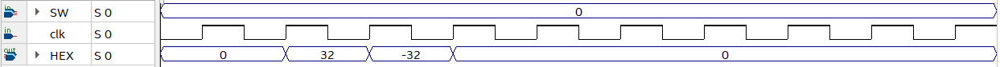

**Поиграемся теперь с условным переносом (бит C).**

В общем-то, условный перенос просто заставляет счетчик, который идеи по программе прибавлять не 1, а значение, заданное в константе, таким образом можно как идти наверх по программе, так и вниз, реализуя при этом циклы и операции if/else.

**Код на Verilog, описывающий PC (c – флаг сравнения АЛУ).**

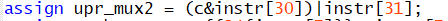

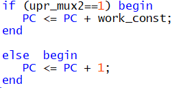

**Пример 3. Умножение 7 на 3 через константы.**

**Строчка 1. Загрузка 7 в регистр 1**

00 1 00 0000 00000 00000 00001 00000111

> 
> 000001112 = 7 = *к**о**н**с**т**а**н**т**а*, *к**о**т**о**р**у**ю* *м**ы* *з**а**г**р**у**ж**а**е**м*
>
> 000012 = 1 − *р**е**г**и**с**т**р*, *в* *к**о**т**о**р**ы**й* *м**ы* *з**а**п**и**с**ы**в**а**е**м* *к**о**н**с**т**а**н**т**у*
>
> 1 − *р**а**з**р**е**ш**а**е**м* *з**а**п**и**с**ь* *в* *р**е**г**и**с**т**р**о**в**ы**й* *ф**а**й**л*

**Строчка 2. Загрузка 3 в регистр 2**

00 1 00 0000 00000 00000 00010 00000011

> 
> 000000112 = 3 = *к**о**н**с**т**а**н**т**а*, *к**о**т**о**р**у**ю* *м**ы* *з**а**г**р**у**ж**а**е**м*
>
> 000102 = 2 − *р**е**г**и**с**т**р*, *в* *к**о**т**о**р**ы**й* *м**ы* *з**а**п**и**с**ы**в**а**е**м* *к**о**н**с**т**а**н**т**у*
>
> 1 − *р**а**з**р**е**ш**а**е**м* *з**а**п**и**с**ь* *в* *р**е**г**и**с**т**р**о**в**ы**й* *ф**а**й**л*

**Строчка 3. Загрузка 1 в регистр 4**

00 1 00 0000 00000 00000 00100 00000001

> 
> 000000012 = 1 = *к**о**н**с**т**а**н**т**а*, *к**о**т**о**р**у**ю* *м**ы* *з**а**г**р**у**ж**а**е**м*
>
> 001002 = 4 − *р**е**г**и**с**т**р*, *в* *к**о**т**о**р**ы**й* *м**ы* *з**а**п**и**с**ы**в**а**е**м* *к**о**н**с**т**а**н**т**у*
>
> 1 − *р**а**з**р**е**ш**а**е**м* *з**а**п**и**с**ь* *в* *р**е**г**и**с**т**р**о**в**ы**й* *ф**а**й**л*

*  
*

**Строчка 4. Сложение значения из 1 регистра (число 7) c 3 ячейкой и запись в 3 ячейку.**

00 1 10 0000 00001 00011 00011 00000000

> 
> 102 = 2 − *н**а* *в**х**о**д* *р**е**г**и**с**т**р**о**в**о**г**о* *ф**а**й**л**а* *п**о**д**а**е**т**с**я* *о**п**е**р**а**ц**и**я* *с* *А**Л**У*
>
> 00002 = 0 − *н**о**м**е**р* *о**п**е**р**а**ц**и**и* *н**а* *А**Л**У*
>
> 000112 = 3 − *с* *э**т**о**й* *я**ч**е**й**к**и* *п**а**м**я**т**и* *б**е**р**е**м* *R**A*2
>
> 000012 = 1 − *с* *э**т**о**й* *я**ч**е**й**к**и* *п**а**м**я**т**и* *б**е**р**е**м* *R**A*1
>
> 000112 = 3 − *р**е**г**и**с**т**р*, *в* *к**о**т**о**р**ы**й* *м**ы* *з**а**п**и**с**ы**в**а**е**м* *р**е**з**у**л**ь**т**а**т* *о**п**е**р**а**ц**и**и* *н**а* *А**Л**У*
>
> 1 − *р**а**з**р**е**ш**а**е**м* *з**а**п**и**с**ь* *в* *р**е**г**и**с**т**р**о**в**ы**й* *ф**а**й**л*

**Строчка 5. Вычитание из числа в 2 ячейке (играет роль счетчика) значение из 4 ячейки (число 1) и записываем в 2 ячейку.**

00 1 10 0001 00010 00100 00010 00000000

> 
> 102 = 2 − *н**а* *в**х**о**д* *р**е**г**и**с**т**р**о**в**о**г**о* *ф**а**й**л**а* *п**о**д**а**е**т**с**я* *о**п**е**р**а**ц**и**я* *с* *А**Л**У*
>
> 00012 = 1 − *н**о**м**е**р* *о**п**е**р**а**ц**и**и* *н**а* *А**Л**У*
>
> 001002 = 4 − *с* *э**т**о**й* *я**ч**е**й**к**и* *п**а**м**я**т**и* *б**е**р**е**м* *R**A*2
>
> 000102 = 2 − *с* *э**т**о**й* *я**ч**е**й**к**и* *п**а**м**я**т**и* *б**е**р**е**м* *R**A*1
>
> 000102 = 2 − *р**е**г**и**с**т**р*, *в* *к**о**т**о**р**ы**й* *м**ы* *з**а**п**и**с**ы**в**а**е**м* *р**е**з**у**л**ь**т**а**т* *о**п**е**р**а**ц**и**и* *н**а* *А**Л**У*
>
> 1 − *р**а**з**р**е**ш**а**е**м* *з**а**п**и**с**ь* *в* *р**е**г**и**с**т**р**о**в**ы**й* *ф**а**й**л*

**Строчка 6. Выводим значение с 3 ячейки регистрового файла (получаем результат)**

00 0 00 0000 00011 00000 00000 00000000

000112 = 3 − *в**ы**в**о**д**и**м* *з**н**а**ч**е**н**и**е* *с* 3 *я**ч**е**й**к**и* (*ч**т**о**б**ы* *м**ы* *н**а* *д**и**а**г**р**а**м**м**е* *у**в**и**д**е**л**и*) 

**Строчка 7. Если значение на больше 0, то идти наверх на 3 шага (PC = PC + (-3));**

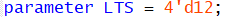

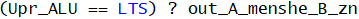

**Идея: счетчик больше 0 это тоже самое, что и 0 меньше счетчика.**

01 0 00 1100 00000 00010 00000 11111101

> 
> 111111012=  − 3 − *ч**и**с**л**о*, *к**о**т**о**р**о**е* *п**р**и**б**а**в**и**т**с**я* *к* *P**C*, *е**с**л**и* *у**с**л**о**в**и**е* *б**у**д**е**т* *в**е**р**н**о*.
>
> 11002 = 12 − *н**о**м**е**р* *о**п**е**р**а**ц**и**и* *н**а* *А**Л**У*
>
> 000002 = 0 − *с* *э**т**о**й* *я**ч**е**к**и* *б**е**р**е**м* A = 32′*b*0
>
> 000102 = 2 − *с* *э**т**о**й* *я**ч**е**й**к**и* *б**е**р**е**м* *з**н**а**ч**е**н**и**е* *с**ч**е**т**ч**и**к**а* = *B*
>
> 1 − *и**д**е**т* *у**с**л**о**в**н**ы**й* *п**е**р**е**х**о**д* (*е**с**л**и* *у**с**л**о**в**и**е* *в**е**р**н**о*, *т**о* *P**C* = *P**C* + *c**o**n**s**t* = *P**C* − 3)

*  
*

**Итоговая прошивка:**

00100000000000000000000100000111

00100000000000000000001000000011

00100000000000000000010000000001

00110000000001000110001100000000

00110000100010001000001000000000

00000000000011000000000000000000

01000110000000000100000011111101

**То, что должно быть по clk:**

1)  0, 1, 2 clk – на выходе 0 (так-как идет запись в память)

2)  На 3 clk выдаст 7, так-как оно лежит в регистре 1, к которому обращаются в команде 4.

3)  На 4 clk выдаст значения счетчика (сколько раз надо сложить).

4)  На 5 clk идет вывод значения суммы

5)  Далее, пока счетчик больше 0, переходим к пункту 3 (но сначала выдаем 0, так-как A = 0)

6)  После всего процесса выдаем 0.

**Результат симуляции cobra с нашей прошивкой.**

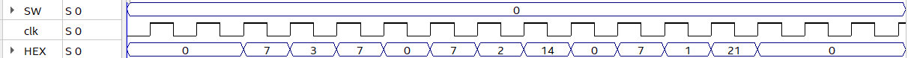

Также, мы можем увеличить значение первой константы, например, до 31 (меняем константу в первой строке).

**Итоговая прошивка:**

00100000000000000000000100011111

00100000000000000000001000000011

00100000000000000000010000000001

00110000000001000110001100000000

00110000100010001000001000000000

00000000000011000000000000000000

01000110000000000100000011111101

**Результат симуляции cobra с нашей прошивкой.**

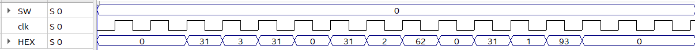

Разумеется, обычно вместо const берут запись значения с внешних выводов SW (switches), но отличаются эти способы лишь тем, откуда в итоге числа попадут в память (регистровый файл) (то есть, отличаться от приведенных будут только первые 2-3 операции).

Для примера давайте рассмотрим теперь программу умножения 7 на 3, но 7 и 3 загружаются с входа SW. На самом деле, отличаться будет только управляющий сигнал на MUX у входа в регистровый файл (из рисунка видно, что надо туда поставить 2 (upr_data = WS = 1)

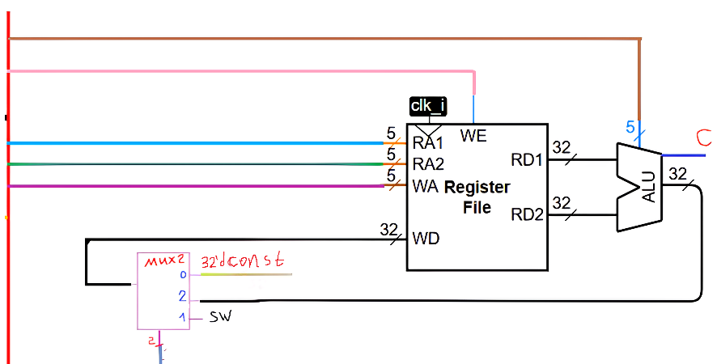

**Описание этого элемента на Verilog в cobra.**

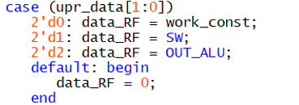

В итоге, команда для записи значения с внешних выводов выглядит так:

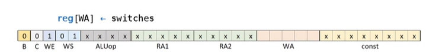

**Строчка 1. Загрузка числа 1 (в SW выставим 7) в регистр 1**

00 1 01 0000 00000 00000 00001 00000000

> 
> 000012 = 1 − *р**е**г**и**с**т**р*, *в* *к**о**т**о**р**ы**й* *м**ы* *з**а**п**и**с**ы**в**а**е**м* *к**о**н**с**т**а**н**т**у*
>
> 012 = 1 − *п**о**к**а**з**ы**в**а**е**т*, *ч**т**о* *з**а**п**и**с**ь* *д**а**н**н**ы**х* *б**у**д**е**т* *с* *S**W*
>
> 1 − *р**а**з**р**е**ш**а**е**м* *з**а**п**и**с**ь* *в* *р**е**г**и**с**т**р**о**в**ы**й* *ф**а**й**л*

**Строчка 2. Загрузка числа 2 (в SW выставим 3) в регистр 2**

00 1 01 0000 00000 00000 00010 00000000

> 
> 000102 = 2 − *р**е**г**и**с**т**р*, *в* *к**о**т**о**р**ы**й* *м**ы* *з**а**п**и**с**ы**в**а**е**м* *к**о**н**с**т**а**н**т**у*
>
> 012 = 1 − *п**о**к**а**з**ы**в**а**е**т*, *ч**т**о* *з**а**п**и**с**ь* *д**а**н**н**ы**х* *б**у**д**е**т* *с* *S**W*
>
> 1 − *р**а**з**р**е**ш**а**е**м* *з**а**п**и**с**ь* *в* *р**е**г**и**с**т**р**о**в**ы**й* *ф**а**й**л*

Далее же код будет полностью аналогичен коду с примера 3.

**Итоговая прошивка:**

00101000000000000000000100000000

00101000000000000000001000000000

00100000000000000000010000000001

00110000000001000110001100000000

00110000100010001000001000000000

00000000000011000000000000000000

01000110000000000100000011111101

Результат симуляции данного кода должен быть полностью аналогичен примеру 3.

**Результаты симуляции на cobra с нашей прошивкой.**

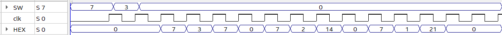

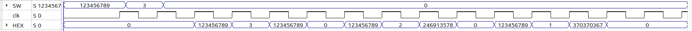

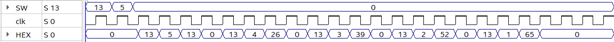

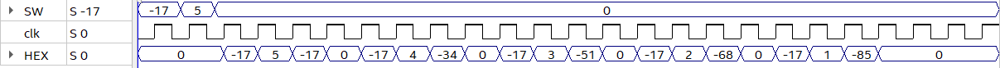

Но, так-как алгоритм только складывает число (-17) 5 раз, то умножение двух отрицательных чисел он выполнить уже не в состоянии (тут уже алгоритм менять надо)

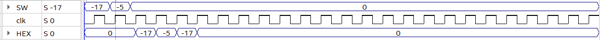

Если же переводить реализованный нами алгоритм в псевдокод, то выйдет:

A = input()

B = input()

C = 1

S = 0 (его не записывал, так-как все ячейки регистрового файла изначально 0)

While (0 \< B):

S = S+A

B = B – C

Print (S)
