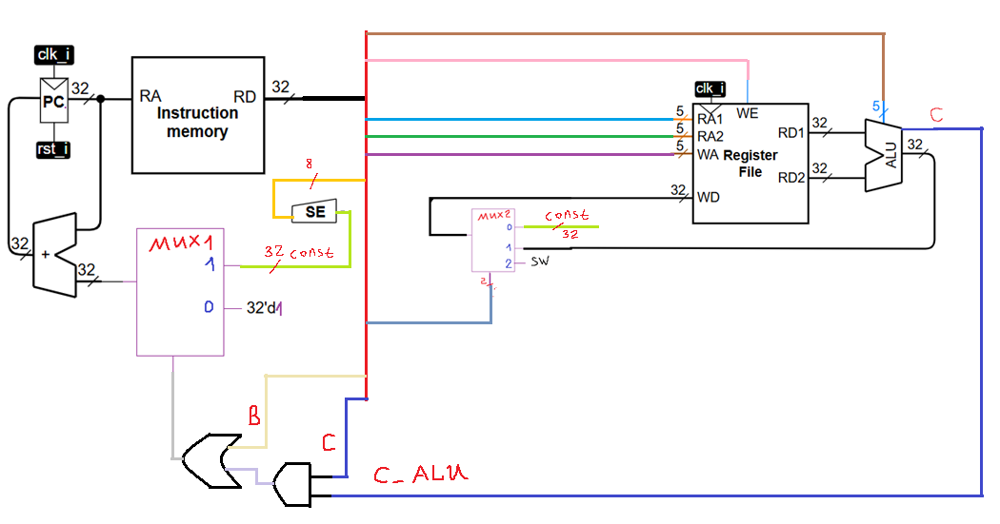
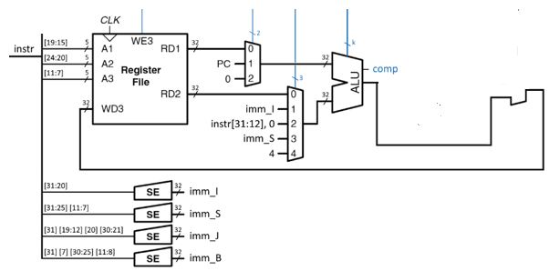

# Лекция 6. Простейший RISC-V.

**Введение(+GaSoline)**

В данной статье будем считать, что у нас есть Cobra. Жить с коброй под боком довольно некомфортно, поэтому нужно переходить на какой-то более адекватный процессор. Для начала это будет простейший однотактный RISC-V. Попробуем перейти к нему логически от Cobra.

Рисунок. 1. Схема кодирования инструкций в кобре \[гитхабМПСУ\]

Вот наша команда для Cobra. В ней всегда есть место для операции на АЛУ, адресов регистров чтения и записи, фиксированный размер константы. Как сделать её лучше? Наша цель – увеличить быстродействие схемы. Значит, нужно:

1.  увеличить ёмкость одной операции;

2.  увеличить количество операций, выполняющихся параллельно;

3.  сократить время на одну операцию.

**Часть 1. Инструкции, кодирование, декодирование (+GaSoline)**

Данный раздел статьи будет весьма сильно пересекаться с разделом про декодер, так-как декодер инструкций и есть принципиально основная штуковина, которая отличает простейший RISC-V от Cobra. (by KeK)

Первый недостаток, который можно заметить, — это малая информативность инструкции. Допустим, мы хотим прибавить константу к какому-то регистру. У нас будет 5 неиспользуемых бит поля RA2, поскольку регистр один. Естественно, при этом отдать их под поле константы. Или другой пример – перемещение значения в регистр из памяти. Здесь нам тоже нужен только один регистр. Таким образом, можно увеличить количество инструкций и их ёмкость, если неиспользуемые биты переназначить.

Сразу с этим возникает проблема: как мы будем отличать, что лежит в выделенных битах? Этим занимается отдельный блок, которого в кобре не было, – декодер. Естественно, чем сложнее закодирована инструкция и чем больше их количество, тем больше и сложнее декодер.

Для RISC-V и подобных архитектур написать его довольно несложно, хотя потребуются время и силы, а для x86 его описание может затянуться на месяцы даже при большом желании.

Итак, разделим инструкции на типы. Тип инструкции зашьём в её последние 7 бит и назовём это дело опкодом (opcode), т.е. кодом операции. Далее, выделим первые 7 бит на конкретизацию операции. То есть, здесь мы можем сказать, какую именно инструкцию данного типа мы хотим выполнить. Это поле func7. Аналогично поступим ещё с 3 битами, и их назовём func3. risc-v модульный, а мы делаем пока самую простую его версию, поэтому func7 использоваться в этом смысле практически не будет, а вот func3 есть почти во всех инструкциях. Добавим к этому набору адреса регистров чтения и записи (15 бит), получим суммарно 7+7+3+15=32. После текстового описания давайте ознакомимся с картинкой из мануала к risc-v.

табл. 1. команды RISC-V \[rvdoc\]

Первая табличка – деление инструкций на типы по опкоду. Видно, что неиспользуемые поля, вроде func7 и rs2 (то же, что RA2), заменены более нужной информацией – битами константы imm. Далее перечисляются базовые инструкции из набора RV32I и дополнения Ziscr, их назначение можно рассмотреть позже. Имеет смысл сразу добавить табличку, в которой описано назначение всех этих инструкций.

табл. 2. описание инструкций и их запись в ассемблере \[гитхабМПСУ\]

**Часть 2. Получение RISC-V из Cobra (+GaSoline)**

Выше нарисована схема Cobra, которую мы собрали в прошлых статьях. По сути, если в АЛУ есть все операции из таблички (и они закодированы так как надо), то RISV-V можно построить, просто приделав декодер инструкций и мультиплексоры на каждый из выходов регистрового файла и чуток модифицировав PC, чем мы и займемся в данном разделе.

**Модификации PC**

Из-за того, что у нас константа закодирована по-разному в разных типах команд (это неудобство, которым мы платим за большую эффективность процессора), то у нас на PC необходимо поставить возможность перехода по константам разных типов (в зависимости от типа инструкции), то есть, появится несколько лишних мультиплексоров. Задачей определения типов команд и расстановкой всех управляющих сигналов у нас займется декодер, так что будем забивать голову этим уже в следующей статье.

**Структурная схема счетчика после добавления нескольких видов констант**

Более важными отличиями являются смена типа адресации и схемная реализация команды jalr (PC присваивается значение из регистра RD1 + const_I). Решение проблемы с jalr весьма простое: просто добавим мультиплексор на счетчик и при управляющем сигнале = 0 будем подавать типичное значение, а при управляющем сигнале = 1 подадим значение из регистра1+const_I

**Структурная схема счетчика с поддержкой jalr**

**Побайтовая адресация в памяти команд**

Также скажем пару слов про побайтовую адресацию в памяти команд. На самом деле, конкретно для памяти команд в вакууме это не имеет какого-то особого смысла именно концептуально, побайтовая адресация важна для памяти данных для работы с отдельными байтами, а на память команд ее налепили просто ради единообразия и стыковки с внешними элементами (тем же программатором) и для поддержки сжатых инструкций (например, 16-битных), где не надо заново переписывать память команд, а просто прибавить не 4 (ниже поясню, почему 4), а 2 (для 16-битных). Если же делать процессор for fun, то заморачиваться с этим пунктом особо не стоит (но все же желательно, если не хотите писать прошивку вручную, а использовать компиляторы, которые уже есть) и можно просто прибавлять 1 (описание памяти команд на Verilog будет другим и 4 на 1 в остальных mux поменять придется)

Откуда же я взял волшебные числа 4 и 2? Все просто: 32-битная команда – это 4 байта, а 16-битная команда – это 2 байта, поэтому для перехода между командами 32-битными надо перескакивать через 4 байта, а 16-битными – через 2 байта.

**Итоговая реализация счетчика (1 заменили на 4).**

**Память команд с побитовой адресацией:**

**Модификация системы регистровый файл + АЛУ + память**

**Шаг 1. Переставим мультиплексоры**

В Cobra система АЛУ/Регистровый файл была реализована просто и прямолинейно: выходы регистрового файла подаются сразу на АЛУ, а вход мультиплексируется, у нас же будет чуток по-другому: входы АЛУ мультиплексируются, а выход АЛУ идет на регистровый файл (по сути своей это примерно одно и тоже)

**Было:**

**Стало (просто переставили мультиплексоры и чуток расширили входы):**

Из относительно нового у нас несколько разных констант, также есть возможность на АЛУ работать с PC (это надо для работы с всякими jal, jalr и подобными командами, где нужно сохранить куда-то значение PC или же PC +4 (адрес возврата на строчку памяти команд)).

**Шаг 2. Добавляем Data Memory**

Если внимательно посмотреть на рисунок выше и подумать, то относительно очевидным будет решение просто поставить data memory между регистровым файлом и АЛУ и просто мультиплексировать выход (если надо, то данные идут на data memory, иначе данные идут в регистровый файл). Очевидным же решение я назвал потому, что у нас регистровый файл и память команд играют примерно одинаковую роль.

**Шаг 3. Добавляем управлятор к мультиплексорам.**

Выше мы уже собрали вот такой вот процессор, в котором невооружённым взглядом видны торчащие провода управления от мультиплексоров и всякие enable:

Теперь нужно реализовать управлятор (декодер инструкций), который по opcode, funct3, funct7 будет выдавать необходимые значения на управляющие входы АЛУ, Data Memory, WE и тд. В данной статье будем считать его волшебной коробочкой, которую подробно (и долго) будем собирать в следующей лекции (то есть, воспользуемся проектирование сверху вниз, когда мы сначала говорим, то волшебная штуковина у нас есть, а потом долго и мучительно ее реализуем).

Ну что, все, RISC-V готов, осталось собрать декодер (следующая статья), соединить все блоки между собой (8 лекция, где будет преимущественно описание на Verilog процессора) и можно тестировать будет (код на C перегоняем в ассемблер RISC-V, а его в машинный код).
