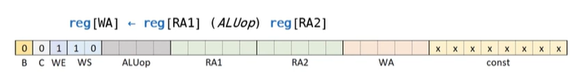
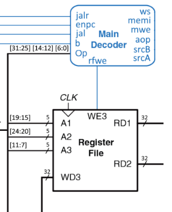

# Лекция 7. Декодер инструкций RISC-V.

**Большое вступление (на всю страничку).**

Как читатель мог заметить на примере упрощенного процессора Cobra, у нас в инструкции всегда очень много “лишних” проводов, и с их более разумным использованием можно было бы расширить возможности самого процессора.

**Пример операции на АЛУ Cobra, когда 8 бит никак полезно не используются**



**Загрузка константы. Не используется 14 бит.**


То-есть, подводя итог примерам выше, у нас есть неиспользуемые биты в каждом конкретном типе операций, так что весьма разумно сделать так, чтобы инструкции обладали большим полезным содержанием. Авторы RISC-V, скорее всего подумали также и несколько модифицировали команды, сделав не как в Cobra их прямое исполнение (то есть, конкретный бит команды идет напрямую на АЛУ или управляющий мультиплексор регистрового файла), а через посредника, биты команды же играют роль управляющих сигналов мультиплексора, которые с помощью декодера инструкций (нашего посредника) уже “собираются” в новую команду, которая поступит на устройства.

Таким образом, возрастает эффективность команд устройства (например, мы теперь имеем возможность расширить список операций на АЛУ из-за такого варианта кодирования)

**Про кодировку команд, схожесть и отличия с Cobra.**

Главным отличием команд RISC-V от своей упрощенной версии (Cobra) являются поля funct3, funct7, opcode и непостоянство принадлежности битов к своему полю (для некоторых типов команд биты с 7 по 11играют роль rd (upr_in в кодировкеCobra для регистрового файла), а для других являются частью imm (константы). Кстати, в J-типе константа выглядит как монстр Франкенштейна из-за того, что процессор должен поддерживать 8 битные инструкции (поэтому пришлось так нашинковать изначальную команду и собрать из нее константу).


Разберем теперь каждое поле по отдельности

**Funct3, funct7.**

Называются так они из-за их размеров (funct3 – 3 бита, funct7 – 7бит). Используются данные поля для выбора команды на АЛУ (практически всегда только func3, func7 уже выступает в роли дополнительных битов).

**Opcode – распределятор ролей.**

Данная штуковина кодирует тип инструкции (а тип инструкции отвечает за то, как именно декодер распределит управляющие биты на все блоки процессора по их видам и за наличие, собственно, самих типов команд).

**Type R (Register/Register), opcode = 7’d51.**

В данном типе операций данные берутся с регистров, производится операция на АЛУ и результат записывается в регистр. Использует регистры для управления регистровым файлом: RS1 (у меня это upr_1), RS2 (у меня это upr_2), rd (у меня это upr_in). Пример команд: ADD (сложение), SUB (вычитание), OR (логическое ИЛИ).

**Type I (Immediate), opcode = 7’d19, 7’d3, 7’d103**

Данный тип инструкций можно назвать регистр-константа (есть регистр, с которого берем данные, есть регистр, в который данные записываем, есть константа, с которой выполняем операции на АЛУ). Пример команд: ADDI (сложение регистра с константой), загрузка данных из памяти, условные переходы. Из нового относительно прошлого типа – константа Imm.

На самом деле, тип Immediate имеет целых 3 opcode, так-как это объединенный тип операции (когда есть 3 типа операций, но выполняют они все примерно одинаковые вещи). Ниже как раз-таки представлено это разделение**.**


**Type S (Store), opcode = 7’d35**

Данный тип инструкции – запись в память (именно в data memory, а не в регистровый файл). Данный тип инструкций не возвращает результат в регистр (это отличие его от Immediate). Пример команд: SW (запись 32 бит (слова)), SH (запись 16 бит (полуслова)), SB (запись 8 бит (байта))

**Type B (Branch), opcode = 7’d99**

Данный тип инструкций реализует условные переходы (if/else), но в отличие от типа Immediate никуда не записывает данные. По разбивке команды весьма сильно похож на Store, хотя и имеет разный с ним функционал. Примеры команд: BEQ (перейти, если равно), BNE (перейти, если не равно), но imm интерпретируется как шаг перехода (сколько прибавить к счетчику, если команда верна).

**Type U (Upper Immediate), opcode = 7’d23, 7’d55**

В данном типе инструкций 2 opcode по очень простой причине: в команде нет поля funct3, а значит роль мультиплексора выполняет только opcode

Данный тип инструкций работает с старшими битами константы (с 31 по 12), которые мы используем как хотим (используется для формирования 32-битных адресов (LUI) и для прибавления к PC константы, в которой мы задаем только старшие биты (а с 11 по 0 бит записываются 0)).

**Type J (Jump), opcode = 7’d111**

Данный тип инструкций отвечает за переход с сохранением адреса возврата, используется при вызове функций и возврате из них. Константа определяет относительный адрес перехода (сколько надо прибавить к PC, чтобы перейти на нужную нам строчку кода).

**Декодер инструкций как функциональный блок.**

Итак, мы более-менее разобрались с кодировкой инструкции по типам, присвоили им opcode, но ничего не сказали про декодер инструкций (точнее, что в него выходит, а что выходит). Хотелось бы сказать, что в данное устройство входит вся команда, но оказывается можно обойтись лишь “дополнительными битами” по отношению к Cobra (opcode, funct3, funct7), а с остальным разберутся мультиплексоры и выходы декодера.

**Декодер инструкций. Черный провод – вход (funct3, funct7, opcode), синие провода – выходы декодера**


**Декодер инструкций в RISC-V (однотактном)**


**Реализация декодера инструкций.**

На самом деле, декодер сложен скорее не концептуально, а объемно (150+ строк кода на Verilog), поэтому в данной статье читатель должен набраться терпения и мужества ради чтения страниц так 10 практически однообразных действий.

**Инструкция типа R (Register/Register)**


Опишем комбинационную схему, которая при opcode = 51 реализует функционал, для типа R, описанный выше.

**Биты srcA и srcB для инструкции типа R**


Так-как в данном типе инструкций мы берем данные с регистрового файла и в него же их записываем после результата операции на АЛУ, то <span class="mark">srcA = 2’d0, srcB = 3’d0</span> (смотри картинку выше).

**Биты ws, memi, mwe для инструкции типа R**


Так-как данные должны записаться в регистровый файл, то <span class="mark">ws = 0</span> (без записи в память Data Memory), <span class="mark">mwe = 0</span> (еще вырубим Data Memory, чтобы данные не записывала). Выход декодера memi можно сделать произвольным (так-как Data Memory не работает, а memi отвечает за тип операции с памятью (запись числа знакового, запись числа беззнакового, чтение и тд, у нас memi будет 5-битным), поэтому выставим <span class="mark">memi = 5’d0</span>

**Таблица про то, что делает memi в Data Memory**


**Бит aop (операция на АЛУ) для инструкции типа R.**

Из-за нашей специальной кодировки АЛУ (смотри 3 АЛУ из статьи про АЛУ) мы получаем весьма простое выражение для его управляющих битов:

*a**o**p* = {*f**u**n**c**t*7\[6 : 5\], *f**u**n**c**t*3} − *ш**и**н**а* *и**з* 2 *п**о**с**л**е**д**н**и**х* *п**р**о**в**о**д**о**в* *f**u**n**c**t*7 *и*  *в**с**е**г**о* *f**u**n**c**t*3 

**Бит rfwe**


В операции типа R мы будем записывать данные в регистровый файл, поэтому ставим <span class="mark">rfwe = 1’d1</span>.

**Биты enpc, jal, jalr, b.**


Далее весь анализ делается на основе картинки выше.

Бит jal отвечает за безусловный перенос, в операции типа R данного переноса нет, поэтому <span class="mark">jal = 1’d0</span>

Бит enpc отвечает за работу счетчика (счетчик работать должен как обычно), поэтому <span class="mark">enpc = 1’d1</span>

Бит jalr отвечает за работу счетчика в обычном режиме, или же резкий переход на какой-то адрес, в инструкции типа R, как нетрудно догадаться, <span class="mark">jalr = 1’d0</span>

Бит b отвечает за условные переходы, в инструкции типа R такого не происходит, поэтому <span class="mark">b = 1’d0</span>

**Инструкции типа I (Immediate) (opcode =7’d19)**.


Опишем комбинационную схему, которая при opcode = 19 реализует функционал, для типа I, описанный выше.


**  
**

**Биты srcA и srcB для инструкции типа I**


Так-как в данном типе инструкций мы берем данные с регистрового файла, с константы и в регистровый файл их записываем после результата операции на АЛУ, то <span class="mark">srcA = 2’d0, srcB = 3’d1</span> (смотри картинку выше).

**Биты ws, memi, mwe для инструкции типа I (opcode – 19)**


Так-как данные должны записаться в регистровый файл, то <span class="mark">ws = 0, mwe = 0, memi = 5’d0</span>

**Бит aop (операция на АЛУ) для инструкции типа R.**

Из-за нашей специальной кодировки АЛУ мы получаем:

*a**o**p* = {2<sup>′</sup>*d*0, *f**u**n**c**t*3} 

**Бит rfwe**



В операции типа I мы будем записывать данные в регистровый файл, поэтому ставим <span class="mark">rfwe = 1’d1</span>.

**Биты enpc, jal, jalr, b.**


Далее весь анализ делается на основе картинки выше.

Бит jal отвечает за безусловный перенос, в операции типа I данного переноса нет, поэтому <span class="mark">jal = 1’d0</span>

Бит enpc отвечает за работу счетчика (счетчик работать должен как обычно), поэтому <span class="mark">enpc = 1’d1</span>

Бит jalr отвечает за работу счетчика в обычном режиме, или же резкий переход на какой-то адрес, в инструкции типа I, как нетрудно догадаться, <span class="mark">jalr = 1’d0</span>

Бит b отвечает за условные переходы, в инструкции типа I такого не происходит, поэтому <span class="mark">b = 1’d0</span>

<span class="mark">  
</span>

**Инструкции типа I (Immediate) (opcode =7’d3)**.

Отличием данного типа инструкций от I с opcode = 19 является работа с памятью


То-есть, все выходы декодера будут такими же, как и у opcode = 19 кроме битов, отвечающих за работу с памятью.

**Биты ws, memi, mwe для инструкции типа I (opcode =3)**


Так-как данные должны считаться из памяти и записаться в регистровый файл, то из картинки выше следует, что надо поставить <span class="mark">ws = 1, mwe = 1, Memi\[0\] = 1, Memi\[1\] = 0, Memi\[4:2\] = funct3</span>.

**Инструкции типа I (Immediate) (opcode =7’d103)**.


**Биты aop, ws, memi, mwe, rwe, srcA, srcB для инструкции типа I (opcode – 103)**


<span class="mark">Mwe = 1’d0, Memi = 5’d0, ws = 1’d0, rfwe = 1’d1, (работаем с регистровым файлом, а не с памятью)</span>

<span class="mark">srcA = 2’d1, srcB = 3’d4, aop = 5’d0 (берем значение с PC и 4, делаем сложение (0 операция на АЛУ) и записываем в RF)</span>

<span class="mark">Jalr = 1’d1 (так-как надо перейти на значение в регистре 1 + константа)</span>

Остальные биты такие же, как и при других opcode инструкции типа I

<span class="mark">  
</span>

**Описание на Verilog декодера, реализующего декодирование инструкций типа R, I**
``` Verilog
module Decoder_R (
	input [6:0] opcode,
	input [2:0] func3,
	input [6:0] func7,
	output jalr,
	output enpc,
	output jal,
	output b,
	output ws,
	output [4:0] memi,
	output mwe,
	output rfwe,
	output [4:0] aop,
	output [2:0] srcB,
	output [1:0] srcA
);

parameter opcode_R = 7'd51;
parameter opcode_I_1 = 7'd19;
parameter opcode_I_2 = 7'd3;
parameter opcode_I_3 = 7'd103;

wire [31:0] ZAT;	//Затычка в декодере
assign ZAT = 32'd0;

assign srcA = (opcode == opcode_R) ? 2'd0 :
				  (opcode == opcode_I_1) ? 2'd0 :
				  (opcode == opcode_I_2) ? 2'd0 : 
				  (opcode == opcode_I_3) ? 2'd1 : ZAT[1:0];

assign srcB = (opcode == opcode_R) ? 3'd0 :
				  (opcode == opcode_I_1) ? 3'd1 : 
				  (opcode == opcode_I_2) ? 3'd1 :
				  (opcode == opcode_I_3) ? 3'd4 : ZAT[2:0];

assign memi = (opcode == opcode_R) ? 5'd0 :
				  (opcode == opcode_I_1) ? 5'd0 :
				  (opcode == opcode_I_2) ? {1'b1, 1'b0, func3} :
				  (opcode == opcode_I_3) ? 5'd0 : ZAT[4:0];
				  
				  
assign aop = (opcode == opcode_R) ? {func7[6:5], func3} :
				 (opcode == opcode_I_1) ? {2'd0, func3} :
				 (opcode == opcode_I_2) ? {2'd0, func3} :
				 (opcode == opcode_I_3) ? 5'd0 : ZAT[4:0];

assign enpc = (opcode == opcode_R) ? 1'd1 :
				  (opcode == opcode_I_1) ? 1'd1 :
				  (opcode == opcode_I_2) ? 1'd1 :
				  (opcode == opcode_I_3) ? 1'd1 : ZAT[1];

assign ws = (opcode == opcode_R) ? 1'd0 : 
				(opcode == opcode_I_1) ? 1'd0 :
				(opcode == opcode_I_2) ? 1'd1 :
				(opcode == opcode_I_3) ? 1'd0 : ZAT[0];

assign mwe = (opcode == opcode_R) ? 1'd0 :
				 (opcode == opcode_I_1) ? 1'd0 :
				 (opcode == opcode_I_2) ? 1'd1 :
				 (opcode == opcode_I_3) ? 1'd0 : ZAT[0];

assign rfwe = (opcode == opcode_R) ? 1'd1 :
				  (opcode == opcode_I_1) ? 1'd1 :
				  (opcode == opcode_I_2) ? 1'd1 :
				  (opcode == opcode_I_3) ? 1'd1 : ZAT[0];

assign jalr = (opcode == opcode_R) ? 1'd0 :
				  (opcode == opcode_I_1) ? 1'd0 :
				  (opcode == opcode_I_2) ? 1'd0 :
				  (opcode == opcode_I_3) ? 1'd1 : ZAT[0];

assign jal = (opcode == opcode_R) ? 1'd0 :
				 (opcode == opcode_I_1) ? 1'd0 :
				 (opcode == opcode_I_2) ? 1'd0 :
				 (opcode == opcode_I_3) ? 1'd0 : ZAT[0];

assign b = (opcode == opcode_R) ? 1'd0 :
			  (opcode == opcode_I_1) ? 1'd0 :
			  (opcode == opcode_I_2) ? 1'd0 :
			  (opcode == opcode_I_3) ? 1'd0 : ZAT[0];
endmodule
```

**Реализация инструкций типа S (opcode = 7’d35}.**

Что-ж, самый объемный кусок декодера мы написали, осталось только добить мелочь по типу инструкций S, J, U, B. Так-как читателю (надеюсь) уже относительно понятен алгоритм расставления значений на выходах декодера, то обойдусь минимальными пояснениями.


**Очередная табличка про кодировку памяти**


<span class="mark">Mwe = 1’d1, Memi = {1’d0,1’d1, 3’df}, ws = 1’d1, rfwe = 1’d0, srcA = 2’d0, srcB = 3’d3, aop = 5’d0 (берем значение с RD1, складываем с константой и получаем адрес, по которому мы записываем значение с RD2 записываем в память, в RF ничего не записываем)</span>

<span class="mark">Jalr = 1’d0, Jal = 1’d0, b = 1’d0, enpc = 1’d1 – ничего экстраординарного с счетчиком не делаем</span>

<span class="mark">  
</span>

**Схема декодера (R, S, I), как видно читателю, данная схема на самом деле является продвинутым мультиплексором.**


**Реализация инструкций типа B (opcode = 7’d99).**


**Про АЛУ (aop) и все “правые” биты декодера.**


Из-за нашей нумерации команд на АЛУ <span class="mark">aop = {1,1,func3}</span> (две единицы обозначают то, что на выходе АЛУ нам нужен только флаг сравнения, на OUT_ALU же будет просто 0). Также, так-как АЛУ проводит операцию с RD1 и RD2 и никуда результат не записывает, то: <span class="mark">rfwe = 1’d0, SrcA = 2’d0, SrcB = 1’d0, mwe = 1’d0, memi = 5’d0, ws = 1’d0</span>

**Про счетчик.**

Данный тип инструкций отличается от остальных тем, что мы работаем только с счетчиком и результатом сравнения на АЛУ, поэтому акцентируем внимание на левой части архитектуры RISC-V.


<span class="mark">B = 1’d1 (переход при C = 1 на константу Imm_B), jal = 1’d0, enpc = 1’d1, jalr = 1’d0</span>

**Реализация инструкции типа J (opcode = 7’d111)**

Да, для одной инструкции выделили целый opcode ( в типе U на 2 инструкции также будет 2 opcode)


Отличием от jalr является переход на какую-то константную величину относительно текущего значения счетчика (относительный переход), а не переход на строчку “RA1+const”, которая уже задается абсолютно.


<span class="mark">Mwe = 1’d0, Memi = 5’d0, ws = 1’d0, rfwe = 1’d1, (работаем с регистровым файлом, а не с памятью)</span>

<span class="mark">srcA = 2’d1, srcB = 3’d4, aop = 5’d0 (берем значение с PC и 4, делаем сложение (0 операция на АЛУ) и записываем в RF)</span>


<span class="mark">Jal = 1’d1 (так-как надо перейти на значение в регистре 1 + константа Imm_J)</span>

<span class="mark">Enpc = 1’d1, jalr = 1’d0, b = 1’d0 (типичные значения на выходах декодера)</span>

**Реализация инструкции типа U (opcode = 7’d23, 7’d25)**


Я объединил 2 opcode в одно описание, так-как для типа инструкций U opcode играет роль мультиплексора, а сами инструкции выполняют примерно одно и тоже, поэтому я сначала рассмотрю одинаковые параметры декодера для них, а потом уже про различия поговорим.


**Одинаково для всех инструкций типа U**

<span class="mark">Mwe = 1’d0, Memi = 5’d0, ws = 1’d0, rfwe = 1’d1, (работаем с регистровым файлом, а не с памятью)</span>

<span class="mark">srcB = 3’d2,enpc = 1’d1, b = 1’d0, jal = 1’d0, jalr = 1’d0, aop = 5’d0</span>

**Для lui (opcode = 7’d55)**

<span class="mark">srcA = 2’d2</span>

**Для auipc (opcode = 7’d23)**

<span class="mark">srcA = 2’d1</span>

**Декодер к простейшему RISC-V на Verilog (полностью).**
``` Verilog
module Decoder_R (
	input [6:0] opcode,
	input [2:0] func3,
	input [6:0] func7,
	output jalr,
	output enpc,
	output jal,
	output b,
	output ws,
	output [4:0] memi,
	output mwe,
	output rfwe,
	output [4:0] aop,
	output [2:0] srcB,
	output [1:0] srcA
);

parameter opcode_R = 7'd51;
parameter opcode_I_1 = 7'd19;
parameter opcode_I_2 = 7'd3;
parameter opcode_I_3 = 7'd103;
parameter opcode_S = 7'd35;
parameter opcode_B= 7'd99;
parameter opcode_J = 7'd111;
parameter opcode_U_lui = 7'd55;
parameter opcode_U_auipc = 7'd23;

wire [31:0] ZAT;	//Затычка в декодере
assign ZAT = 32'd0;

assign srcA = (opcode == opcode_R) ? 2'd0 :
				  (opcode == opcode_I_1) ? 2'd0 :
				  (opcode == opcode_I_2) ? 2'd0 : 
				  (opcode == opcode_I_3) ? 2'd1 :
				  (opcode == opcode_S) ? 2'd3 :
				  (opcode == opcode_B) ? 2'd0 :
				  (opcode == opcode_J) ? 2'd1 :
				  (opcode == opcode_U_lui) ? 2'd2 :
				  (opcode == opcode_U_auipc) ? 2'd1 : ZAT[1:0];
				  


assign srcB = (opcode == opcode_R) ? 3'd0 :
				  (opcode == opcode_I_1) ? 3'd1 : 
				  (opcode == opcode_I_2) ? 3'd1 :
				  (opcode == opcode_I_3) ? 3'd4 :
				  (opcode == opcode_S) ? 3'd3 :
				  (opcode == opcode_B) ? 3'd0 :
				  (opcode == opcode_J) ? 3'd4 :
				  ((opcode == opcode_U_lui) |(opcode == opcode_U_auipc))  ? 3'd2 : ZAT[2:0];

assign memi = (opcode == opcode_R) ? 5'd0 :
				  (opcode == opcode_I_1) ? 5'd0 :
				  (opcode == opcode_I_2) ? {1'b1, 1'b0, func3} :
				  (opcode == opcode_I_3) ? 5'd0 :
				  (opcode == opcode_S) ? {1'b0, 1'b1, func3} : 
				  (opcode == opcode_B) ? 5'd0 :
				  (opcode == opcode_J) ? 5'd0 : 
				  ((opcode == opcode_U_lui) |(opcode == opcode_U_auipc))  ? 5'd0 : ZAT[4:0];
				  
				  
assign aop = (opcode == opcode_R) ? {func7[6:5], func3} :
				 (opcode == opcode_I_1) ? {2'd0, func3} :
				 (opcode == opcode_I_2) ? {2'd0, func3} :
				 (opcode == opcode_I_3) ? 5'd0 :
				 (opcode == opcode_S) ? 5'd0 :
				 (opcode == opcode_B) ? {2'd3, func3} : 
				 (opcode == opcode_J) ? 5'd0 :
				 ((opcode == opcode_U_lui) |(opcode == opcode_U_auipc))  ? 5'd0 : ZAT[4:0];

assign enpc = (opcode == opcode_R) ? 1'd1 :
				  (opcode == opcode_I_1) ? 1'd1 :
				  (opcode == opcode_I_2) ? 1'd1 :
				  (opcode == opcode_I_3) ? 1'd1 :
				  (opcode == opcode_S) ? 1'd1 :
				  (opcode == opcode_B) ? 1'd1 :
				  (opcode == opcode_J) ? 1'd1 :
				  ((opcode == opcode_U_lui) |(opcode == opcode_U_auipc))  ? 1'd1 : ZAT[0];

assign ws = (opcode == opcode_R) ? 1'd0 : 
				(opcode == opcode_I_1) ? 1'd0 :
				(opcode == opcode_I_2) ? 1'd1 :
				(opcode == opcode_I_3) ? 1'd0 :
				(opcode == opcode_S) ? 1'd1 : 
				(opcode == opcode_B) ? 1'd0 : 
				(opcode == opcode_J) ? 1'd0 :
				((opcode == opcode_U_lui) |(opcode == opcode_U_auipc))  ? 1'd0 : ZAT[0];

assign mwe = (opcode == opcode_R) ? 1'd0 :
				 (opcode == opcode_I_1) ? 1'd0 :
				 (opcode == opcode_I_2) ? 1'd1 :
				 (opcode == opcode_I_3) ? 1'd0 :
				 (opcode == opcode_S) ? 1'd1 :
				 (opcode == opcode_B) ? 1'd0 :
				 (opcode == opcode_J) ? 1'd0 :
				 ((opcode == opcode_U_lui) |(opcode == opcode_U_auipc))  ? 1'd0 : ZAT[0];

assign rfwe = (opcode == opcode_R) ? 1'd1 :
				  (opcode == opcode_I_1) ? 1'd1 :
				  (opcode == opcode_I_2) ? 1'd1 :
				  (opcode == opcode_I_3) ? 1'd1 :
				  (opcode == opcode_S) ? 1'd0 :
				  (opcode == opcode_B) ? 1'd0 :
				  (opcode == opcode_J) ? 1'd1 : 
				  ((opcode == opcode_U_lui) |(opcode == opcode_U_auipc))  ? 1'd1 : ZAT[0];

assign jalr = (opcode == opcode_R) ? 1'd0 :
				  (opcode == opcode_I_1) ? 1'd0 :
				  (opcode == opcode_I_2) ? 1'd0 :
				  (opcode == opcode_I_3) ? 1'd1 :
				  (opcode == opcode_S) ? 1'd0 :
				  (opcode == opcode_B) ? 1'd0 :
				  (opcode == opcode_J) ? 1'd0 :
				  ((opcode == opcode_U_lui) |(opcode == opcode_U_auipc))  ? 1'd0 : ZAT[0];


assign jal = (opcode == opcode_R) ? 1'd0 :
				 (opcode == opcode_I_1) ? 1'd0 :
				 (opcode == opcode_I_2) ? 1'd0 :
				 (opcode == opcode_I_3) ? 1'd0 :
				 (opcode == opcode_S) ? 1'd0 :
				 (opcode == opcode_B) ? 1'd0 :
				 (opcode == opcode_J) ? 1'd1 :
				 ((opcode == opcode_U_lui) |(opcode == opcode_U_auipc))  ? 1'd0 : ZAT[0];

assign b = (opcode == opcode_R) ? 1'd0 :
			  (opcode == opcode_I_1) ? 1'd0 :
			  (opcode == opcode_I_2) ? 1'd0 :
			  (opcode == opcode_I_3) ? 1'd0 :
			  (opcode == opcode_S) ? 1'd0 :
			  (opcode == opcode_B) ? 1'd1 : 
			  (opcode == opcode_J) ? 1'd0 :
			  ((opcode == opcode_U_lui) |(opcode == opcode_U_auipc))  ? 1'd0 : ZAT[0];
endmodule
```
