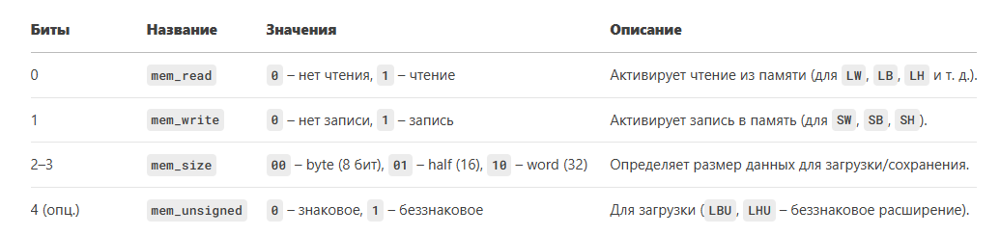
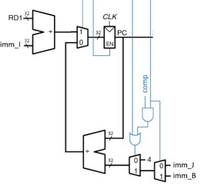

# Лекция 8. RISC-V на Verilog

**Введение**

На самом деле, изначально не планировалось разбивать статью про RISC-V на 3(4, если считать декодер) лекции, но после того, как автор увидел примерное число страниц, которое выходит на описание данной темы (порядка 20-30), то было принято решение разделить лекция на несколько частей: архитектурную, декодер , реализацию архитектурной части на Verilog (то есть, в данной статье большая часть содержания – скрины кода и тесты получившегося устройства с некоторыми пояснениями) и прошивка (которая выполняет роль тестирования операций регистр/регистр, регистр/константа и условных переходов) (следующая статья) устройства

**АЛУ к RISC-V.**

АЛУ к данному процессору было реализовано в статье 1 про АЛУ (АЛУ под номером 3), но я напомню некоторые моменты оттуда.


Для выхода АЛУ (у нас вместо result_0 выход Out_ALU


Роль флага сравнения у нас будет играть бит C


**Описание АЛУ(модули те же, что и в статье про АЛУ).**

``` Verilog
module ALU_3 (
	input [4:0] Upr_ALU,
	input [31:0] A,
	input [31:0] B,
	output C,
	output [31:0] Out_ALU
);
parameter ADD = 5'b00000;
parameter SUB = 5'b01000;
parameter SLL = 5'b00001;
parameter SLTS = 5'b00010;
parameter SLTU = 5'b00011;
parameter XOR = 5'b00100;
parameter SRL = 5'b00101;
parameter SRA = 5'b01101;
parameter OR = 5'b00110;
parameter AND = 5'b00111;
parameter EQ = 5'b11000;
parameter NE = 5'b11001;
parameter LTS = 5'b11100;
parameter GES = 5'b11101;
parameter LTU = 5'b11110;
parameter GEU = 5'b11111;

wire [31:0] out_or;
wire [31:0] out_and;
wire [31:0] out_add;
wire [31:0] out_sub;
wire [31:0] out_xor;
wire [31:0] out_sll;
wire [31:0] out_slts;
wire [31:0] out_sltu;
wire [31:0] out_srl;
wire [31:0] out_sra;
wire out_A_menshe_B_zn;
wire out_A_ne_menshe_B_zn;
wire out_A_menshe_B;
wire out_A_ne_menshe_B;
wire out_equal;
wire out_notequal;

assign out_A_ne_menshe_B_zn = ~out_A_menshe_B_zn;
assign out_A_ne_menshe_B = ~out_A_menshe_B;
assign out_equal = (A==B) ? 32'b1 : 32'b0;
assign out_A_menshe_B = (A<B) ? 32'b1 : 32'b0;
assign out_notequal = ~out_equal;
assign out_add = A+B;
assign out_sub = A-B;
assign out_sll = A << B;
assign out_slts = out_A_menshe_B_zn;
assign out_sltu = out_A_menshe_B;
assign out_srl = A >> B;
assign out_sra = A >>>B;

assign A_shift_1 = {A[30:0], 1'b0};

assign Out_ALU = (Upr_ALU == ADD) ? out_add:
					  (Upr_ALU == SUB) ? out_sub:
					  (Upr_ALU == SLL) ? out_sll:
					  (Upr_ALU == SLTS) ? out_slts:
					  (Upr_ALU == SLTU) ? out_sltu:
					  (Upr_ALU == XOR) ? out_xor:
					  (Upr_ALU == SRL) ? out_srl: 
					  (Upr_ALU == SRA) ? out_sra:
					  (Upr_ALU == OR) ? out_or:
					  (Upr_ALU == AND) ? out_and:32'b0;

assign C = (Upr_ALU == EQ) ? out_equal:
			  (Upr_ALU == NE) ? out_notequal:
			  (Upr_ALU == LTS) ? out_A_menshe_B_zn:
			  (Upr_ALU == GES) ? out_A_ne_menshe_B_zn:
			  (Upr_ALU == LTU) ? out_A_menshe_B:
			  (Upr_ALU == GEU) ? out_A_ne_menshe_B:1'b0;
					  
									  
or_32_b or_ALU (
	.A(A),
	.B(B),
	.out_or(out_or)

);

and_32_b and_ALU (
	.A(A),
	.B(B),
	.out_and(out_and)
);

sl_mod2 mod2_ALU (
	.A(A),
	.B(B),
	.out(out_xor)
);

comp_menshe zn_comp (
	.A(A),
	.B(B),
	.out(out_A_menshe_B_zn)
);			
endmodule
```


**Data Memory**


Данная штуковина практически полностью аналогична регистровому файлу кроме управляющих битов.



То есть, залезаем в код для регистрового файла, ставим там пару-тройку мультиплексоров для реализации memi и получаем в итоге Data Memory.

**RTL схема Data Memory**


**Описание Data Memory на Verilog.**
``` Verilog
module data_mem(
	input [4:0] memi,
	input [31:0] data,
	input [31:0] upr_in, 
	output reg [31:0] out,
	input clk,
	input WrEn

);

reg  [31:0] RAM [0:255];
wire [31:0] mem_in;
wire [31:0] one_bite_mem_zn;
wire [31:0] two_bite_mem_zn;
wire [31:0] one_bite_mem_bez;
wire [31:0] two_bite_mem_bez;
wire [31:0] one_bite_mem;
wire [31:0] two_bite_mem;
wire [31:0] full_bite_mem;

assign one_bite_mem = (memi[4]) ? one_bite_mem_bez : one_bite_mem_zn;
assign two_bite_mem = (memi[4]) ? two_bite_mem_bez : two_bite_mem_zn;

assign one_bite_mem_bez = {24'd0, data[7:0]};
assign one_bite_mem_zn = {{24 {data[7]}}, data[7:0]};
assign two_bite_mem_bez = {16'd0, data[15:0]};
assign two_bite_mem_zn = {{16{data[15]}}, data[15:0]};
assign full_bite_mem = data;

assign mem_in = (memi[3:2] == 2'd0) ? one_bite_mem:
					  (memi[3:2] == 2'd1) ? two_bite_mem:
					  (memi[3:2] == 2'd2) ? full_bite_mem: 32'd0;


always @(posedge clk) begin
	if (WrEn) begin
		if (memi[1]) RAM[upr_in] <= mem_in;
		if (memi[0]) out <= RAM[upr_in];
	end
	
	
end

endmodule
```

**Небольшое тестирование Data Memory**


**Декодер инструкций. Затычку надо поставить 32’d0 (иначе будет веселая константа)**


**Счетчик**

Я решил вывести его в отдельный модуль, так-как счетчик практически не связан с остальным процессором (не считая выходы декодера) и занимает довольно много места в коде, что делает его не очень хорошо читаемым.

**Схема счетчика, которую будем описывать на Verilog.**



**Описание на Verilog**


**Схема, которая синтезировалась**


Итак, мы реализовали декодер, счетчик, регистровый файл (уж его я не стал дублировать тут), АЛУ, Data Memory и память команд, осталось просто соединить все проводами (и добавить пару-тройку знаковых расширителей и мультиплексоров).

**Схема RISC-V концептуальная**


**RTL схема RISC-V (что по описанию на Verilog синтезировалось).**


Как читатель может видеть, out_proc ни к чему не подключен, но так и должно быть, так-как данный выход я планирую использовать для тестирования прошивки RISC-V.

В общем-то и все, процессор готов, осталось его протестировать (описание на Verilog будет на следующей страничке). Однако, как писалось выше, автор будет придерживаться “тестированием прошивкой”, где мы будем прошивать RISC-V, и если он на наших примерах работает, то и хорошо (такой поиск тривиальных ошибок), чем мы и займемся в следующей статье.

Как читатель может видеть, простейший однотактный RISC-V весьма прост (да, тавтология) и занимает порядка 135(ядро)+100(АЛУ)+15(command_memory)+45(data memory)+135(декодер)+26(регистровый файл)+38(модули к АЛУ) = 464 строчек кода (порядка 500), что весьма подъемно для реализации за недельки так 2 с чашечкой чая (гикам можно меньше, разрешаю).**  
**

**Описание на Verilog RISC-V (код есть на гитхабе).**


