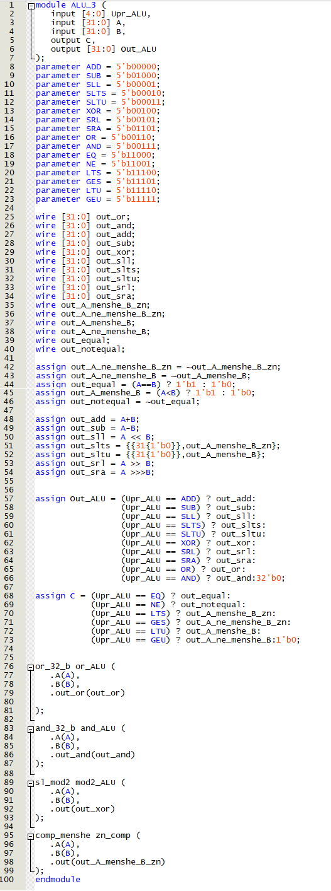
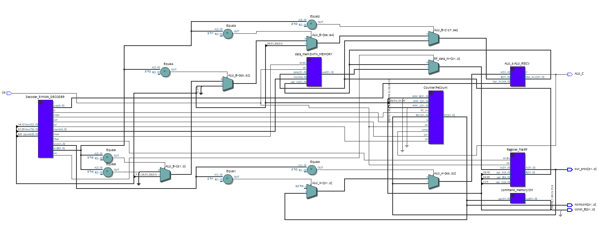

# Лекция 8. RISC-V на Verilog

**Введение**

На самом деле, изначально не планировалось разбивать статью про RISC-V на 3(4, если считать декодер) лекции, но после того, как автор увидел примерное число страниц, которое выходит на описание данной темы (порядка 20-30), то было принято решение разделить лекция на несколько частей: архитектурную, декодер , реализацию архитектурной части на Verilog (то есть, в данной статье большая часть содержания – скрины кода и тесты получившегося устройства с некоторыми пояснениями) и прошивка (которая выполняет роль тестирования операций регистр/регистр, регистр/константа и условных переходов) (следующая статья) устройства

**АЛУ к RISC-V.**

АЛУ к данному процессору было реализовано в статье 1 про АЛУ (АЛУ под номером 3), но я напомню некоторые моменты оттуда.

Для выхода АЛУ (у нас вместо result_0 выход Out_ALU

Роль флага сравнения у нас будет играть бит C

**Описание АЛУ(есть недочеты небольшие, исправленное АЛУ на гитхабе).**

**Data Memory**

Данная штуковина практически полностью аналогична регистровому файлу кроме управляющих битов.

То есть, залезаем в код для регистрового файла, ставим там пару-тройку мультиплексоров для реализации memi и получаем в итоге Data Memory.

**RTL схема Data Memory**

**Описание Data Memory на Verilog.**

**Небольшое тестирование Data Memory**

**Декодер инструкций. Затычку надо поставить 32’d0 (иначе будет веселая константа)**

**Счетчик**

Я решил вывести его в отдельный модуль, так-как счетчик практически не связан с остальным процессором (не считая выходы декодера) и занимает довольно много места в коде, что делает его не очень хорошо читаемым.

**Схема счетчика, которую будем описывать на Verilog.**

**Описание на Verilog**

**Схема, которая синтезировалась**

Итак, мы реализовали декодер, счетчик, регистровый файл (уж его я не стал дублировать тут), АЛУ, Data Memory и память команд, осталось просто соединить все проводами (и добавить пару-тройку знаковых расширителей и мультиплексоров).

**Схема RISC-V концептуальная**

**RTL схема RISC-V (что по описанию на Verilog синтезировалось).**

Как читатель может видеть, out_proc ни к чему не подключен, но так и должно быть, так-как данный выход я планирую использовать для тестирования прошивки RISC-V.

В общем-то и все, процессор готов, осталось его протестировать (описание на Verilog будет на следующей страничке). Однако, как писалось выше, автор будет придерживаться “тестированием прошивкой”, где мы будем прошивать RISC-V, и если он на наших примерах работает, то и хорошо (такой поиск тривиальных ошибок), чем мы и займемся в следующей статье.

Как читатель может видеть, простейший однотактный RISC-V весьма прост (да, тавтология) и занимает порядка 135(ядро)+100(АЛУ)+15(command_memory)+45(data memory)+135(декодер)+26(регистровый файл)+38(модули к АЛУ) = 464 строчек кода (порядка 500), что весьма подъемно для реализации за недельки так 2 с чашечкой чая (гикам можно меньше, разрешаю).**  
**

**Описание на Verilog RISC-V (код есть на гитхабе).**

