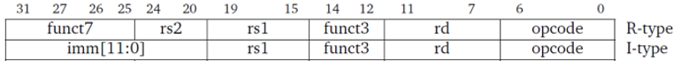
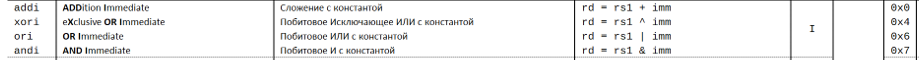
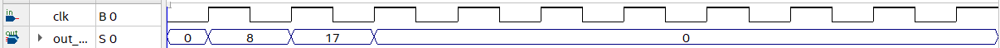
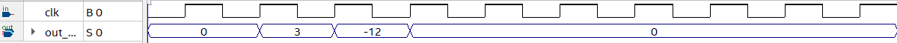
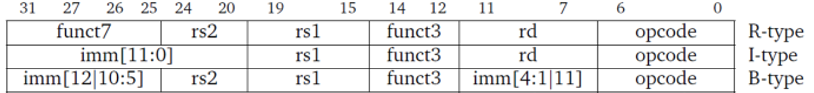
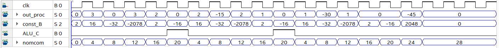

# Лекция 9. Прошивка RISC-V.

**Введение**

В данной статье мы будем сначала писать прошивку вручную (аналогично такой же статье про Cobra), а далее уже для более интересных программ пользоваться ассемблером, который получается из C (а затем переводить его в машинный код).

**Ручное программирование RISC-V.**

Как мы выяснили в статье про архитектуру, команды в RISC-V имеют такую кодировку:


Для написания чего-то очень простого (например, сложить 8 и 9) нам хватит операции типа регистр/регистр(R) и регистр/константа(I)



**Пример 1. Найти 8+9, данные снимаем с выхода регистрового файла (RA1)**



Для решения данной простейшей задачи воспользуемся только типом I (opcode = 7’d19).

**Строчка 1. Загрузка 8 в регистр 1 (прибавление 8 к 0, что лежит в регистре 1)**

000000001000 00001 000 00001 0010011

> 
> 0010011<sub>2</sub> = 19 − opcode данного типа команды
>
> 00001<sub>2</sub> = 1 − регистр, в который мы записываем константу
>
> 000<sub>2</sub> − func3, показывает номер операции на АЛУ
>
> 00001<sub>2</sub>− *р**е**г**и**с**т**р*, *с* *к**о**т**о**р**ы**м* *с**к**л**а**д**ы**в**а**е**м* *к**о**н**с**т**а**н**т**у*
>
> 000000001000<sub>2</sub> = 8 − *с* *ч**е**м* *с**к**л**а**д**ы**в**а**е**м* *з**н**а**ч**е**н**и**е* *в* *р**е**г**и**с**т**р**е* (*к**о**н**с**т**а**н**т**а*)

*  
*

**Строчка 2. Прибавление 9 к 8, что лежит в регистре 1)**

000000001001 00001 000 00001 0010011

> 
> 0010011<sub>2</sub> = 19 − opcode данного типа команды
>
> 00001<sub>2</sub> = 1 − регистр, в который мы записываем результат сложения
>
> 000<sub>2</sub> − func3, показывает номер операции на АЛУ
> 
> 00001<sub>2</sub>− *р**е**г**и**с**т**р*, *с* *к**о**т**о**р**ы**м* *с**к**л**а**д**ы**в**а**е**м* *к**о**н**с**т**а**н**т**у*
>
> 000000001001<sub>2</sub> = 9 − *с* *ч**е**м* *с**к**л**а**д**ы**в**а**е**м* *з**н**а**ч**е**н**и**е* *в* *р**е**г**и**с**т**р**е* (*к**о**н**с**т**а**н**т**а*)

**Строчка 3. Вывод результата операции в RA1 (выводим RA1+0)**

000000000000 00001 000 00001 0010011

> 
> 0010011<sub>2</sub> = 19 − opcode данного типа команды
>
> 00001<sub>2</sub> = 1 − регистр, в который мы записываем результат сложения
>
> 000<sub>2</sub> − func3, показывает номер операции на АЛУ
>
> 00001<sub>2</sub>− *р**е**г**и**с**т**р*, *с* *к**о**т**о**р**ы**м* *с**к**л**а**д**ы**в**а**е**м* *к**о**н**с**т**а**н**т**у*
>
> 000000000000<sub>2</sub> = 0 − *с* *ч**е**м* *с**к**л**а**д**ы**в**а**е**м* *з**н**а**ч**е**н**и**е* *в* *р**е**г**и**с**т**р**е* (*к**о**н**с**т**а**н**т**а*)

**Итоговая прошивка:**
```
00000000100000001000000010010011
00000000100100001000000010010011
00000000000000001000000010010011
```
Что будет на выходе RA1 (out_proc) по event (clk из 0 в 1)

1)  На выходе 0 (8 еще не запасалось)

2)  На выходе 8 (результат операции на АЛУ (8+9) еще не записался)

3)  На выходе 17 (Выводим значение в RA1+0)

Далее же на выходах будут 0

**Результат симуляции RISC-V с такой прошивкой.**



Как читатель видит, работает процессор (инструкции с opcode = 19 (I_1) так, как нам нужно

**Пример 2. Реализация (-15+3) с помощью инcтрукций типа R и типа I.**

На самом деле, данную операцию опять-таки можно элементарно реализовать с помощью типа I_1 (opcode = 19), но мы не только прошиваем RISC-V, мы его еще и немного тестируем, поэтому совершаем относительно неоптимальные действия (как сейчас).

**Табличка кодировки инструкций (opcode_R = 7’d51, opcode_I_1 = 7’d19)**


**Строчка 1. Загрузка (-15) в регистр 1 (прибавление (-15) к 0, что лежит в регистре 1)**

111111110001 00001 000 00001 0010011

> 
> 0010011<sub>2</sub> = 19 − opcode данного типа команды
> 
> 00001<sub>2</sub> = 1 − регистр, в который мы записываем константу
>
> 000<sub>2</sub> − func3, показывает номер операции на АЛУ
>
> 00001<sub>2</sub>− *р**е**г**и**с**т**р*, *с* *к**о**т**о**р**ы**м* *с**к**л**а**д**ы**в**а**е**м* *к**о**н**с**т**а**н**т**у*
>
> 111111110001<sub>2</sub> = −15 − *с* *ч**е**м* *с**к**л**а**д**ы**в**а**е**м* *з**н**а**ч**е**н**и**е* *в* *р**е**г**и**с**т**р**е* (*к**о**н**с**т**а**н**т**а*)

**Строчка 2. Загрузка 3 в регистр 2 (прибавление 3 к 0, что лежит в регистре 0)**

000000000011 00000 000 00010 0010011

> 
> 0010011<sub>2</sub> = 19 − opcode данного типа команды
>
> 00010<sub>2</sub> = 2 − регистр, в который мы записываем константу
>
> 000<sub>2</sub> − func3, показывает номер операции на АЛУ
>
> 00000<sub>2</sub>− *р**е**г**и**с**т**р*, *с* *к**о**т**о**р**ы**м* *с**к**л**а**д**ы**в**а**е**м* *к**о**н**с**т**а**н**т**у*
>
> 000000000011<sub>2</sub> = 3 − *с* *ч**е**м* *с**к**л**а**д**ы**в**а**е**м* *з**н**а**ч**е**н**и**е* *в* *р**е**г**и**с**т**р**е* (*к**о**н**с**т**а**н**т**а*)

**Строчка 3. Складываем 2 регистр(3) и 1 регистр(-15) и записываем это в 1 регистр**

0000000 00001 00010 000 00001 0110011

> 
> 0110011<sub>2</sub> = 51 − opcode данного типа команды
>
> 00001<sub>2</sub> = 1 − *р**е**г**и**с**т**р*, *в* *к**о**т**о**р**ы**й* *м**ы* *з**а**п**и**с**ы**в**а**е**м* *р**е**з**у**л**ь**т**а**т* *о**п**е**р**а**ц**и**и* *н**а* *А**Л**У*
>
> 000<sub>2</sub> − func3, показывает номер операции на АЛУ
>
> 00010<sub>2</sub>− *р**е**г**и**с**т**р*, *с* *к**о**т**о**р**ы**м* *м**ы* *п**р**о**в**о**ж**и**м* *о**п**е**р**а**ц**и**ю* *н**а* *А**Л**У* (*R**A*1)
>
> 00001<sub>2</sub> = 1 − *р**е**г**и**с**т**р*, *с* *к**о**т**о**р**ы**м* *м**ы* *п**р**о**в**о**д**и**м* *о**п**е**р**а**ц**и**ю* *н**а* *А**Л**У* (*R**A*2)
>
> 0000000<sub>2</sub> = 0 − *f**u**n**c**t*7

*  
*

**Строчка 4. Вывод результата операции в RA1 (выводим RA1+0)**

000000000000 00001 000 00001 0010011

> 
> 0010011<sub>2</sub> = 19 − opcode данного типа команды
>
> 00001<sub>2</sub> = 1 − *р**е**г**и**с**т**р*, *в* *к**о**т**о**р**ы**й* *м**ы* *з**а**п**и**с**ы**в**а**е**м* *р**е**з**у**л**ь**т**а**т* *с**л**о**ж**е**н**и**я*
>
> 000<sub>2</sub> − func3, показывает номер операции на АЛУ
>
> 00001<sub>2</sub>− *р**е**г**и**с**т**р*, *с* *к**о**т**о**р**ы**м* *с**к**л**а**д**ы**в**а**е**м* *к**о**н**с**т**а**н**т**у*
>
> 000000000000<sub>2</sub> = 0 − *с* *ч**е**м* *с**к**л**а**д**ы**в**а**е**м* *з**н**а**ч**е**н**и**е* *в* *р**е**г**и**с**т**р**е* (*к**о**н**с**т**а**н**т**а*)

**Итоговая прошивка:**
```
11111111000100001000000010010011
00000000001100000000000100010011
00000000000100010000000010110011
00000000000000001000000010010011
```
Что будет на выходе RA1 (out_proc) по event (clk из 0 в 1)

1)  На выходе 0 (-15 еще не запасалось)

2)  На выходе 0 (3 еще не записалось)

3)  На выходе 3 (Выводит значение RA1 при операции на АЛУ)

4)  На выходе -12 (результат операции на АЛУ, записанный в регистр 1).

Далее же на выходах будут 0

**Результат симуляции RISC-V с такой прошивкой.**



Как читатель видит, инструкции типа R работают как надо.

**  
**

**Пример 3. Инструкции типа Branch (умножение -15 на 3 путем сложения).**



**Опкоды, которые нас понадобятся**

Opcode_B = 7’d99, Opcode_I_1 = 7’d19, Opcode_R = 7’d51

**Строчка 1. Загрузка 3 в регистр 2 (прибавление 3 к 0, что лежит в регистре 0)**

000000000011 00000 000 00010 0010011

> 
> 0010011<sub>2</sub> = 19 − opcode данного типа команды
>
> 00010<sub>2</sub> = 2 − регистр, в который мы записываем константу
>
> 000<sub>2</sub> − func3, показывает номер операции на АЛУ
>
> 00000<sub>2</sub>− *р**е**г**и**с**т**р*, *с* *к**о**т**о**р**ы**м* *с**к**л**а**д**ы**в**а**е**м* *к**о**н**с**т**а**н**т**у*
>
> 000000000011<sub>2</sub> = 3 − *с* *ч**е**м* *с**к**л**а**д**ы**в**а**е**м* *з**н**а**ч**е**н**и**е* *в* *р**е**г**и**с**т**р**е* (*к**о**н**с**т**а**н**т**а*)

**Строчка 2. Переход на 4 строчки вниз (если счетчик равен 0)**

0000000 00000 00010 000 10000 1100011

> 
> 1100011<sub>2</sub> = 99 − opcode данного типа команды (B)
>
> 00000 = *н**о**м**е**р* *р**е**г**и**с**т**р**а* 2 (*н**о**л**ь*)
>
> 000<sub>2</sub> − func3, показывает номер операции на АЛУ
>
> 00010<sub>2</sub>− *н**о**м**е**р* *R**A*1 (*с**ч**е**т**ч**и**к*)
>
> 0000000010000<sub>2</sub> = {*I**m**m*<sub>*I*</sub>, 1<sup>′</sup>*d*0}= 16 = 4 \* (4)

**Строчка 3. (прибавление (-15) к значению, что лежит в регистре 1)**

111111110001 00001 000 00001 0010011

> 
> 0010011<sub>2</sub> = 19 − opcode данного типа команды
>
> 00001<sub>2</sub> = 1 − регистр, в который мы записываем константу
>
> 000<sub>2</sub> − func3, показывает номер операции на АЛУ
>
> 00001<sub>2</sub>− *р**е**г**и**с**т**р*, *с* *к**о**т**о**р**ы**м* *с**к**л**а**д**ы**в**а**е**м* *к**о**н**с**т**а**н**т**у*
>
> 111111110001<sub>2</sub> = −15 − *с* *ч**е**м* *с**к**л**а**д**ы**в**а**е**м* *з**н**а**ч**е**н**и**е* *в* *р**е**г**и**с**т**р**е* (*к**о**н**с**т**а**н**т**а*)

*  
*

**Строчка 4. (прибавление (-1) к значению, что лежит в регистре 2)**

111111111111 00010 000 00010 0010011

> 
> 0010011<sub>2</sub> = 19 − opcode данного типа команды
>
> 00010 = 2 − регистр, в который мы записываем результат операции с константой
>
> 000<sub>2</sub> − func3, показывает номер операции на АЛУ
>
> 00010− *р**е**г**и**с**т**р*, *с* *к**о**т**о**р**ы**м* *с**к**л**а**д**ы**в**а**е**м* *к**о**н**с**т**а**н**т**у*
>
> 111111111111<sub>2</sub> = −1 − *с* *ч**е**м* *с**к**л**а**д**ы**в**а**е**м* *з**н**а**ч**е**н**и**е* *в* *р**е**г**и**с**т**р**е* (*к**о**н**с**т**а**н**т**а*)

**Строчка 5. Вывод значения счетчика в RA1 (выводим RA1+0)**

000000000000 00010 000 00010 0010011

> 
> 0010011<sub>2</sub> = 19 − opcode данного типа команды
>
> 00010 = 2 − *р**е**г**и**с**т**р*, *в* *к**о**т**о**р**ы**й* *м**ы* *з**а**п**и**с**ы**в**а**е**м* *р**е**з**у**л**ь**т**а**т* *с**л**о**ж**е**н**и**я*
>
> 000<sub>2</sub> − func3, показывает номер операции на АЛУ
>
> 00010<sub>2</sub>− *р**е**г**и**с**т**р*, *с* *к**о**т**о**р**ы**м* *с**к**л**а**д**ы**в**а**е**м* *к**о**н**с**т**а**н**т**у*
>
> 000000000000<sub>2</sub> = 0 − *с* *ч**е**м* *с**к**л**а**д**ы**в**а**е**м* *з**н**а**ч**е**н**и**е* *в* *р**е**г**и**с**т**р**е* (*к**о**н**с**т**а**н**т**а*)

**Строчка 6. Переход на 4 строчки наверх (если счетчик больше 0)**

1111111 00010 00000 100 10001 1100011

> 
> 1100011<sub>2</sub> = 99 − opcode данного типа команды (B)
>
> 00010 = *н**о**м**е**р* *р**е**г**и**с**т**р**а* 2 (*с**ч**е**т**ч**и**к*)
>
> 100<sub>2</sub> − func3, показывает номер операции на АЛУ
>
> 00000<sub>2</sub>− *н**о**м**е**р* *р**е**г**и**с**т**р**а* *R**A*1
>
> 11111111110000<sub>2</sub> = {*I**m**m*<sub>*I*</sub>, 1<sup>′</sup>*d*0}=  − 16 = 4 \* (−4)

**Строчка 7. Вывод значения (-15\*3) в RA1 (выводим RA1+0)**

000000000000 00001 000 00001 0010011

> 
> 0010011<sub>2</sub> = 19 − opcode данного типа команды
>
> 00001 = 1 − *р**е**г**и**с**т**р*, *в* *к**о**т**о**р**ы**й* *м**ы* *з**а**п**и**с**ы**в**а**е**м* *р**е**з**у**л**ь**т**а**т* *с**л**о**ж**е**н**и**я*
>
> 000<sub>2</sub> − func3, показывает номер операции на АЛУ
>
> 00001<sub>2</sub>− *р**е**г**и**с**т**р*, *с* *к**о**т**о**р**ы**м* *с**к**л**а**д**ы**в**а**е**м* *к**о**н**с**т**а**н**т**у*
>
> 000000000000<sub>2</sub> = 0 − *с* *ч**е**м* *с**к**л**а**д**ы**в**а**е**м* *з**н**а**ч**е**н**и**е* *в* *р**е**г**и**с**т**р**е* (*к**о**н**с**т**а**н**т**а*)

*  
*

**Итоговая прошивка.**
```
00000000001100000000000100010011
00000000000000010000100001100011
11111111000100001000000010010011
11111111111100010000000100010011
00000000000000010000000100010011
11111110001000000100100011100011
00000000000000001000000010010011
```

**Результат симуляции RISC-V с такой прошивкой**



Как читатель может увидеть, на симуляции у меня большее число выходных сигналов, это связано с тем, что я допустил ошибку в PC и искал ее, симулируя процессор с разными прошивками (думал, в декодере ошибся, но там все, как оказалось, было верно).
