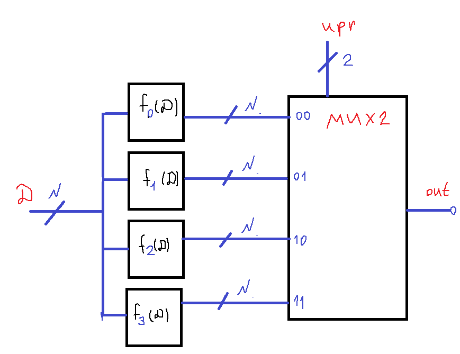

# Лекция 1. АЛУ.
**Некое вступление**
В данной небольшой статье мы рассмотри АЛУ и приведем тривиальные примеры (а потом уже читатель сам под нужную ему архитектуру сделает). На самом деле АЛУ и другие компоненты процессора это весьма очевидная штуковина.

**Что такое АЛУ?**
АЛУ – арифметико-логическое устройство, а если чуток более развернуто, то это штуковина, на которую приходит управляющий сигнал и некий входной сигнал, а она по управляющему сигналу (шине) выбирает операцию и исполняет ее над входными данными (еще, правда, есть такие штуковины как флаги, но про них будет в примерах на Verilog).

То есть, по данному описанию вырисовывается примерная схема АЛУ:

(Данное АЛУ умеет выполнять 4 функции над N-битным числом (элементами шины) и выдавать 1 из 4 функций по управляющему воздействию)
Как мы видим, это просто мультиплексор с некой комбинационной логикой на входах.

